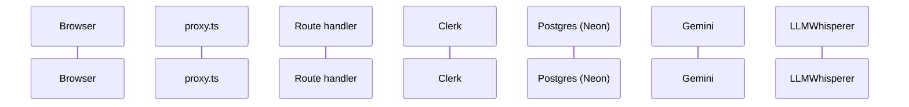

# Conventions

_How every workflow file in this set is structured, so you can skim one the same way you skim any other._

Verified against `main` @ `bf4d660`.

---

## The per-workflow template

Every workflow is one `## <id> — <name>` section with a fixed set of numbered sub-sections. Not every sub-section appears in every workflow (read-only flows omit **6 End state**; flows with no LLM call omit **5 External calls**), but the order never changes.

| § | Name | What it holds |
|---|------|---------------|
| **0** | **TL;DR** | One bold sentence: trigger → what happens → what changes. This is the scannable layer. |
| **1** | **Entry point** | The route/URL, the component, and the exact handler or `onClick` that starts the flow, with `file:line`. |
| **2** | **Preconditions** | Signed in? Owns the resource? Is `contractId` in the URL? Env var required? Seed script run? |
| **3** | **Trace** | Numbered steps. Each step: `path/file.ts:NN` — what runs — what it reads/writes. At each network hop, an inline HTTP block (see below). |
| **4** | **Database effects** | Table → columns read / written, each with the SQL's `file:line`. Explicit "no transaction" note where that is true. |
| **5** | **External calls** | Provider, model pin, `maxTokens`, input truncation cap, retry policy — linking to [H5](h5-llm-layer.md) / [H4](h4-rag-pipeline.md) rather than restating the numbers. |
| **6** | **End state** | Rows now present, redirect performed, in-memory store set, UI state. Omitted for read-only flows. |
| **7** | **Failure modes** | A table: trigger → HTTP/behaviour → what the user sees → **what survives** (the partial-write question). |
| **8** | **Sequence diagram** | One mermaid block. Rules below. |
| **9** | **Observability notes** | Fixed three-part shape (see below). Every gap gets a stable id. |
| **10** | **See also** | Links to H-chapters and sibling workflows. |

### The inline HTTP block (inside §3)

At every network hop, instead of a separate table, the trace carries a one-line block:

```
POST /api/refine · auth: proxy-gated · limit: refine 40/h · 150/d
  req  { passage, currentSuggestion, userNote, contractText }
  res  { refined }
```

`auth:` is one of `proxy-gated` (in [`GATED_COMPUTE_PATHS`](h1-auth-and-ownership.md#gate)), `currentUserId` (handler checks the session), `owns*` (handler checks resource ownership), or `none`. `limit:` names the [rate-limit tier](h2-rate-limiting.md#tiers) or says `none`.

---

## Mermaid conventions

### Participants — exactly these seven aliases, everywhere



- **`pgvector` is not a participant.** It is a query shape against `PG`; put it in the arrow label: `API->>PG: SELECT … ORDER BY embedding <=> $1::vector`.
- **`MW` appears only when the path is in [`GATED_COMPUTE_PATHS`](h1-auth-and-ownership.md#gate).** A middleware box on every diagram is noise.
- **`CK` appears** when `auth()` / `currentUser()` runs server-side, or a Clerk modal renders. Draw `API->>CK: auth()` once per diagram, not per `currentUserId()` call.
- **Arrow labels carry the SQL verb + table, or the HTTP method + path. No prose.** `API->>PG: UPDATE risk_clauses SET status='replaced'`.
- **Fire-and-forget writes use `-)`; awaited calls use `->>`.** This single convention makes the review screen's optimistic-UI behaviour visible at a glance.
- **Failure paths go in `alt`/`else`, never a second diagram.** Cap at two `alt` blocks; deeper branching belongs in §7's table.
- **`Note over X,Y:` for caps and pins only** — `Note over API,GM: gemini-3.6-flash · maxTokens 8192 · text.slice(0, 200_000)`.
- Cap at **7 participants and ~14 messages**. Labels under ~48 characters. No `%%{init}%%` theme directives (they fight the Artifact theme and look wrong in GitHub dark mode). No custom colours.

### `sequenceDiagram` vs `flowchart`

- **`sequenceDiagram`** for anything crossing a process boundary (all of B, C, D3, E5, F5, G).
- **`flowchart TD`** only for pure client-side decision logic with no network — A2 (the landing demo's two analysers), E3 (render-vs-generate), C17 (`findPassage`'s exact→normalised fallback).
- Never both for one workflow.
- The one exception to the `flowchart` rule is the **README "system at a glance"** diagram — it is a topology map of the whole app, not a per-workflow trace, so a `flowchart TD` is the right form there.

---

## Observability notes (§9) — fixed shape

> **What you can see today.** Bulleted, each with `file:line`. Only actual emissions — a `console.error` string, a row written, a status code. If the answer is "nothing", write "Nothing." and move on.
>
> **What you can't.** Bulleted. The questions an operator would ask and cannot answer.
>
> **Gaps.** A table, one row per gap: `#` · Blind spot · Class · Cheapest fix. Every `#` is a stable id like `C4-O1`, referenced verbatim by [H8](h8-observability.md).

### The classification rubric — six classes

| Class | Definition |
|-------|------------|
| **NO-LOG** | The code path emits nothing on either the success or the interesting-failure branch. |
| **THIN-LOG** | Something is logged, but without the identifiers needed to act on it — no user id, contract id, route, or duration. |
| **SILENT-CATCH** | An error is caught and discarded, or swallowed into a fallback that looks like success. |
| **NO-TRACE-CORRELATION** | Multiple hops in one user action share no id, so the sequence can't be reconstructed. |
| **NO-METRIC** | The quantity exists conceptually but nothing counts it. |
| **LEAK** | The system over-emits — raw internals reach the client. |

### The fix tiers (H8 orders proposals by these)

- **Tier 0** — one-line `console.info` with a stable event name. No dependencies.
- **Tier 1** — a `src/lib/log.ts` shim emitting single-line JSON + an `x-lexora-op-id` request/op id.
- **Tier 2** — durable counters in Postgres (the `rate_limit_blocks` pattern, extended).
- **Tier 3** — OpenTelemetry / an external APM. Named and deferred.

---

## Reading order

1. This file.
2. [H6 — Database schema](h6-database-schema.md) — every workflow's §4 links into it.
3. [H1](h1-auth-and-ownership.md) / [H2](h2-rate-limiting.md) — every route's preconditions come from these two files.
4. [B — Getting a contract in](b-getting-a-contract-in.md) — the spine; exercises every H-chapter.
5. Anything else, in any order. The [README master table](README.md) is the index.

## A note on names in the code

Comments and identifiers throughout the codebase say **"Claude"** (it's Gemini now — see [H5](h5-llm-layer.md)) and **"Supabase"** (it's Neon Postgres — see [H6](h6-database-schema.md)). The product was ported from an Anthropic + Supabase stack; the names are debris, not the current architecture. The root `README.md` is stale for the same reason — **this set supersedes it.**
