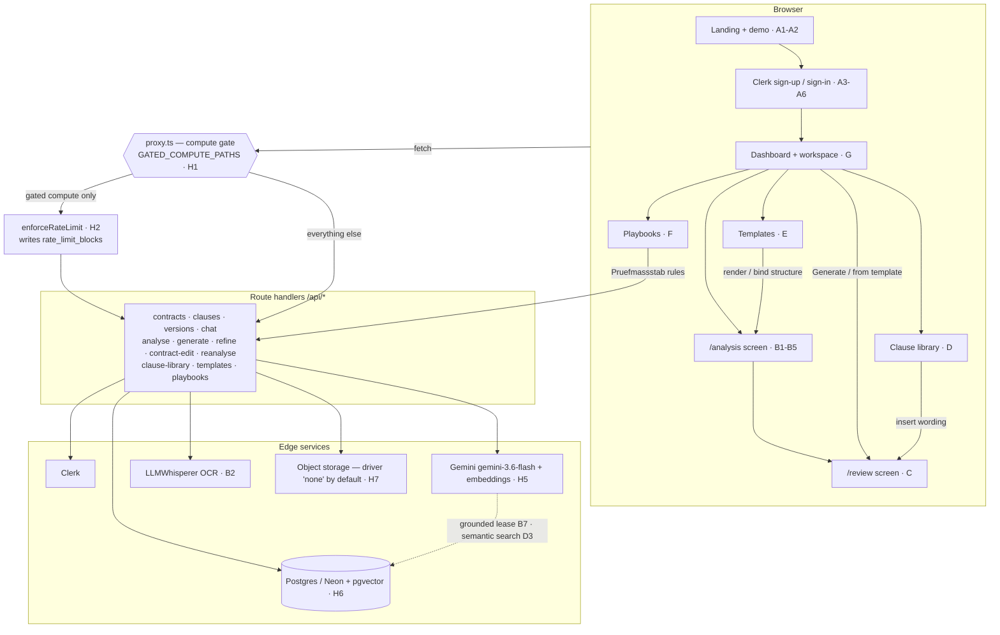

# Lexora workflows

The index for this doc set. Every user-visible action in Lexora is one numbered **workflow** (`B5`, `C4`, `D3`, …); the **H-chapters** are the shared machinery every workflow leans on. Read [00-conventions](00-conventions.md) first — it defines the per-workflow template, the mermaid rules, and the observability rubric.

Verified against `main` @ `bf4d660`. The root [`README.md`](../../README.md) is a marketing description and is **stale** on architecture (it predates the Supabase→Neon and Claude→Gemini ports); **this set supersedes it** as the map of what-does-what.

---

## System at a glance

Two rules explain most of the topology:

- **`proxy.ts` gates a POST to one of nine compute paths** — the eight in `GATED_COMPUTE_PATHS` (`/api/extract`, `/api/analyse`, `/api/generate`, `/api/refine`, `/api/chat`, `/api/contract-edit`, `/api/clause-library/search`, `/api/templates/suggest-variables`) plus `/api/contracts/*/reanalyse` via `GATED_COMPUTE_PATTERN`. The gate only fires on `POST`; a guest hitting one gets a 401 at the middleware. Everything else — all the CRUD — is guarded inside the handler by `currentUserId()` + an `owns*` check ([H1](h1-auth-and-ownership.md)).
- **Compute routes call `enforceRateLimit` first**, per-tier hour/day buckets plus a global `compute` tier ([H2](h2-rate-limiting.md)). A 429 writes the one durable runtime row the system produces.

---

## Master workflow table

`compute?` = calls Gemini, embeddings, or LLMWhisperer. `writes` = tables the workflow's own path mutates (downstream saves via another workflow are noted as `→ Bn`).

### A — Identity & entry ([a-identity-and-entry.md](a-identity-and-entry.md))

| id | Workflow | Entry point | Auth | Compute? | Writes |
|----|----------|-------------|------|:--------:|--------|
| A1 | Landing page render | `/` (`page.tsx`) | none | N | — |
| A2 | Landing demo — zero network | `#demo` (`clause-demo.tsx`) | none | N | — |
| A3 | Sign-up → `/welcome` → `/dashboard` | `<SignUpButton>` / `/sign-up` | Clerk | N | — |
| A4 | Sign-in — modal vs hosted | `<SignInButton>` / `/sign-in` | Clerk | N | — |
| A5 | `/welcome` — auth smoke test | `/welcome` (`page.tsx`) | signed-in | N | — |
| A6 | Sign-out | `<UserButton>` / `<SignOutButton>` | signed-in | N | — |
| A7 | Guest browsing — what a signed-out user gets | any public route | none | N | — |
| A8 | The compute gate | `src/proxy.ts` | — | N | — |
| A9 | Theme toggle + pre-paint bootstrap | `<ThemeToggle>` + inline script | none | N | — |

### B — Getting a contract in ([b-getting-a-contract-in.md](b-getting-a-contract-in.md))

| id | Workflow | Entry point | Auth | Compute? | Writes |
|----|----------|-------------|------|:--------:|--------|
| B1 | Upload modal → `fileStore` → `/analysis` | dashboard **Upload** (`UploadModal`) | none | N | — |
| B2 | `POST /api/extract` — LLMWhisperer | `/analysis` `run()` step 1 | proxy-gated | **Y** | — (storage side-effect only) |
| B3 | `POST /api/analyse` — plain | `/analysis` `run()` step 2 | proxy-gated | **Y** | — (stateless) |
| B4 | `POST /api/analyse` — playbook-aware | same, playbook branch | proxy-gated | **Y** | — (`coverage` not stored) |
| B5 | Save analysis → `POST /api/contracts` → `/review` | `/analysis` `run()` step 3 | currentUserId | N | `contracts`, `risk_clauses` |
| B6 | Generate a non-lease contract (plain LLM) | dashboard **Generate** (`CreateContractModal`) | proxy-gated | **Y** | `contracts` (+ `→ B5` save) |
| B7 | Generate a German residential lease (grounded RAG) | same, `contractType = "Lease Agreement"` | proxy-gated | **Y** | `contracts` |
| B8 | Generate from a template, with AI | same, `templateId` + key terms | proxy-gated | **Y** | `contracts` |
| B9 | Render from a template — no AI | same, `templateId`, no key terms | currentUserId | N | `contracts` |
| B10 | Seed test data | dashboard **Seed test data** | currentUserId | N | `contracts`, `risk_clauses` |

### C — The review screen ([c1](c1-review-document.md) · [c2](c2-review-findings.md) · [c3](c3-review-ai-and-output.md))

| id | Workflow | Entry point | Auth | Compute? | Writes |
|----|----------|-------------|------|:--------:|--------|
| C1 | Open a saved contract (`?contractId=`), DB path | `/review` mount, `contractId` set | currentUserId (+ owns\* for chat) | N | — |
| C2 | Open straight from a fresh analysis, in-memory path | `/review` mount, no `contractId` | none (in-memory) | N | — |
| C3 | Quill init + debounced 2 s autosave | editor keystrokes | currentUserId | N | `contracts.quill_delta` |
| C4 | Apply fix (`handleReplace`) | finding card **Apply fix** | currentUserId + owns\* | N | `contracts`, `risk_clauses`, `contract_versions` |
| C5 | Refine a clause with a note | finding card **Refine** | proxy-gated + owns\* | **Y** | `clause_refinements`, `risk_clauses`, `contracts` |
| C6 | Insert wording from the clause library | finding card **Library** | owns\* | N | `risk_clauses` |
| C7 | Save a suggestion to the personal library | finding card **Save to library** | owns\* | N | `clause_library` |
| C8 | Dismiss ("not an issue") + restore | finding card **Dismiss** / **Restore** | owns\* | N | `risk_clauses`, `contracts` |
| C9 | Add a clause the AI missed | **Add clause** form | owns\* | N | `risk_clauses`, `contracts` |
| C10 | Contract chat (Q&A) + history | chat panel send | proxy-gated + owns\* | **Y** | `chat_messages` |
| C11 | Create-mode AI edit (whole-document rewrite) | `mode=create` editor **Ask AI to edit** | proxy-gated + owns\* | **Y** | `contracts`, `contract_versions`, `chat_messages` |
| C12 | Selection toolbar → refine selected text | text selection → **Refine** | proxy-gated | **Y** | `contracts.quill_delta` |
| C13 | Version snapshot, history list, restore | **Save version** / History / **Restore** | client (+ owns\* on `/versions`) | N | `contract_versions` (+ `contracts` on restore) |
| C14 | Re-analyse (± playbook) | **Re-analyse** button | proxy-gated + owns\* | **Y** | `risk_clauses`, `contracts` |
| C15 | Playbook tab: coverage, verdicts, insert preferred clause | **Playbook** tab | currentUserId (+ owns\* on `/versions`) | N | `contracts`, `contract_versions` (on insert) |
| C16 | Export DOCX / PDF (client-side, lazy) | **Export** menu | none (client) | N | — |
| C17 | Clause highlight + centre-scroll (`findPassage`) | click a finding card | none | N | — |

### D — Clause library ([d-clause-library.md](d-clause-library.md))

| id | Workflow | Entry point | Auth | Compute? | Writes |
|----|----------|-------------|------|:--------:|--------|
| D1 | Browse + filter (topic / posture / scope) | `/clauses` | currentUserId | N | — |
| D2 | Lexical search (German FTS + ILIKE) | `/clauses` search, Semantic off | currentUserId | N | — |
| D3 | Semantic search + lexical fallback | `/clauses` search, Semantic on | proxy-gated | **Y** (embeds; falls back to lexical) | — |
| D4 | Create / edit / soft-delete | `ClauseDialog` | currentUserId / ownsLibraryClause | N | `clause_library` |
| D5 | Lawyer-reviewed (RDG) toggle | `ClauseDialog` checkbox | ownsLibraryClause | N | `clause_library` |
| D6 | Curated seeding (operator) | `npm run seed:library` | operator (DB creds) | N (`--embed`: **Y**) | `clause_library` (curated) |

### E — Templates ([e-templates.md](e-templates.md))

| id | Workflow | Entry point | Auth | Compute? | Writes |
|----|----------|-------------|------|:--------:|--------|
| E1 | Gallery browse / filter / search | `/templates` | currentUserId | N | — |
| E2 | Preview | template card **Preview** | none (in-memory) | N | — |
| E3 | Use a template — render-vs-generate decision | create modal, "From template" | none (client decision) | N | — (→ B8 / B9) |
| E4 | Create / edit / delete a template | `TemplateEditor` | currentUserId / ownsTemplate | N | `contract_templates` |
| E5 | ⚠ Save-as-template + AI suggest-variables (routes live, dialog unmounted) | none (direct HTTP only) | proxy-gated + ownsContract (suggest) / ownsContract (from-contract) | **Y** (suggest-variables) | `contract_templates` (from-contract) |
| E6 | Curated seeding (operator) | `npm run seed:templates` | operator (DB creds) | N | `contract_templates` (curated) |

### F — Playbooks ([f-playbooks.md](f-playbooks.md))

| id | Workflow | Entry point | Auth | Compute? | Writes |
|----|----------|-------------|------|:--------:|--------|
| F1 | Browse + select + view rules | `/playbooks` | currentUserId | N | — |
| F2 | Clone a curated playbook to edit | **Clone to edit** / **New playbook** | currentUserId | N | `playbooks`, `playbook_rules` |
| F3 | Rule editor — add / patch / delete a rule | rule editor rows | ownsPlaybook | N | `playbook_rules` |
| F4 | Set default / mark approved (RDG) | playbook header toggles | ownsPlaybook | N | `playbooks` |
| F5 | How a playbook reaches the model | (the `/api/analyse` + reanalyse path) | proxy-gated | **Y** | — (caller persists `risk_clauses.*`) |
| F6 | Curated seeding (operator) | `npm run seed:playbooks` | operator (DB creds) | N | `playbooks`, `playbook_rules` (curated) |

### G — Dashboard & workspace ([g-dashboard-and-workspace.md](g-dashboard-and-workspace.md))

| id | Workflow | Entry point | Auth | Compute? | Writes |
|----|----------|-------------|------|:--------:|--------|
| G1 | Workspace shell — sidebar + top bar | any `(workspace)` route | signed-in | N | — |
| G2 | Contract list + client-side filter | `/dashboard` | currentUserId | N | — |
| G3 | Stat tiles + charts | `/dashboard` | signed-in (client) | N | — (trend series are placeholder constants) |
| G4 | Rename a contract | list row pencil | currentUserId (ownership: SQL `WHERE` only) | N | `contracts.name` |
| G5 | Delete a contract (hard delete, no confirm) | list row trash | currentUserId (ownership: SQL `WHERE` only) | N | `contracts` + **cascade** |
| G6 | New-menu deep-links | sidebar **New ▸** | none | N | — (→ B1 / B6–B9) |

---

## The H-chapters

| # | Chapter | One-liner |
|---|---------|-----------|
| [H1](h1-auth-and-ownership.md) | Auth & ownership | The compute gate (`GATED_COMPUTE_PATHS` in `proxy.ts`), `currentUserId()` from Clerk, the `ownsContract` / `ownsClause` / `ownsLibraryClause` / `ownsTemplate` / `ownsPlaybook` helpers — and the handful of routes guarded only by a SQL `WHERE user_id = $n` with no pre-check. |
| [H2](h2-rate-limiting.md) | Rate limiting | `enforceRateLimit(req, tier)` — per-tier hour/day buckets **and** a global `compute` tier; fail-open if the backend is unreachable; every 429 inserts a `rate_limit_blocks` row (the only durable runtime signal in the system). |
| [H3](h3-error-taxonomy.md) | Error taxonomy | `AppError` (HTTP status + machine `code` + user-safe `message`) vs `errorResponse(err, context)` — used by 8 compute routes; the other 23 route files instead return the raw Postgres message and log nothing. |
| [H4](h4-rag-pipeline.md) | RAG pipeline | 24-doc German tenancy-law corpus → `buildIndex()` → `rag_chunks` (pgvector, 768-dim, L2-normalised, cosine `<=>`); retrieval + round-robin merge; grounded lease drafting ([B7](b-getting-a-contract-in.md#b7)) and the semantic clause-search reuse ([D3](d-clause-library.md#d3)). |
| [H5](h5-llm-layer.md) | LLM layer | `askLLM({ prompt, maxTokens, responseSchema? })` — Gemini `gemini-3.6-flash`, input `slice` caps, 3 transport retries, `AppError` on config/busy/blocked/no-output, JSON coercion that silently drops malformed entries. |
| [H6](h6-database-schema.md) | Database schema | Every table, column, index, trigger and FK in `db/schema.sql`; every workflow's **§4 Database effects** links here. |
| [H7](h7-storage.md) | Storage | `putOriginal` / `getOriginal` behind a driver (`none` by default → a no-op that returns `null`); only `/api/extract` ever writes, and it swallows failures to `console.error`. |
| [H8](h8-observability.md) | Observability | The register of all 178 **§9** gaps by tier and class; what the running system emits today (26 `console.*`, zero `console.info`, no timing, no analytics); the tier-0 "first hour" of ~12 `console.info` lines. |

Also: **[z-dead-and-unwired.md](z-dead-and-unwired.md)** — code that ships but no live path reaches (the whole `/onboarding` wizard, `SaveAsTemplateDialog`, the guest `pendingSave` flow, `was_applied`, dead dashboard affordances), and bugs that are shipped and known.

---

## Maintenance & verification

- **Every file states the commit it was checked against** — the `Verified against \`main\` @ \`<sha>\`` line under the title. This whole set is currently at `bf4d660`.
- **To re-verify a file after a code change:** open every `file:line` it cites, at that line, and confirm the claim still holds; correct drift; bump the SHA line. The mandated source-of-truth for a chapter is the lib module(s) and route handler(s) it documents, not the UI components (those cites are best-effort).
- **To add a workflow:** give it a stable lowercase `<id>` (`h3`, `c18`, …), follow the [00-conventions](00-conventions.md#the-per-workflow-template) template section-for-section, add a row to the master table above, and — in its **§9** block — give each gap a stable id `<ID>-On`. [H8](h8-observability.md)'s register is regenerated from those blocks, so a new gap id appears there once the §9 table carries it.
- **This set supersedes the root `README.md` on architecture, and any hand-maintained "what-does-what" / verification checklist (e.g. an older `check.md`).** [`docs/product-audit.md`](../product-audit.md) is a separate, still-current artifact (the Wave A/B/C fix log) — it is not superseded. If you find a stale architecture reference elsewhere, point it here.
