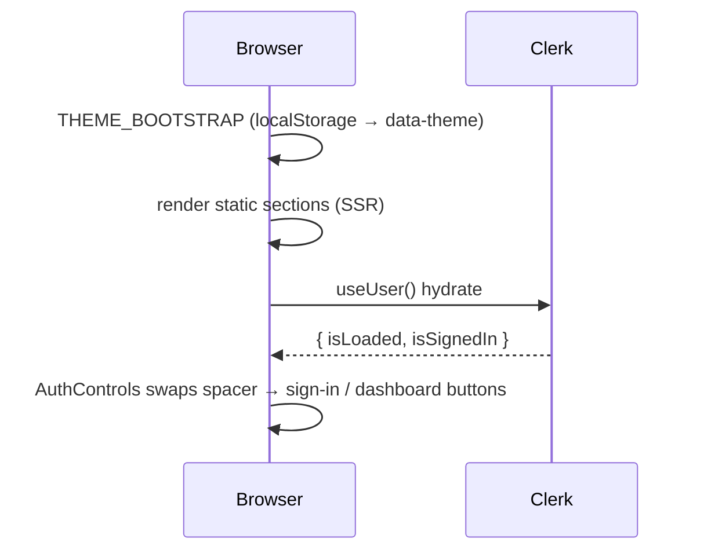
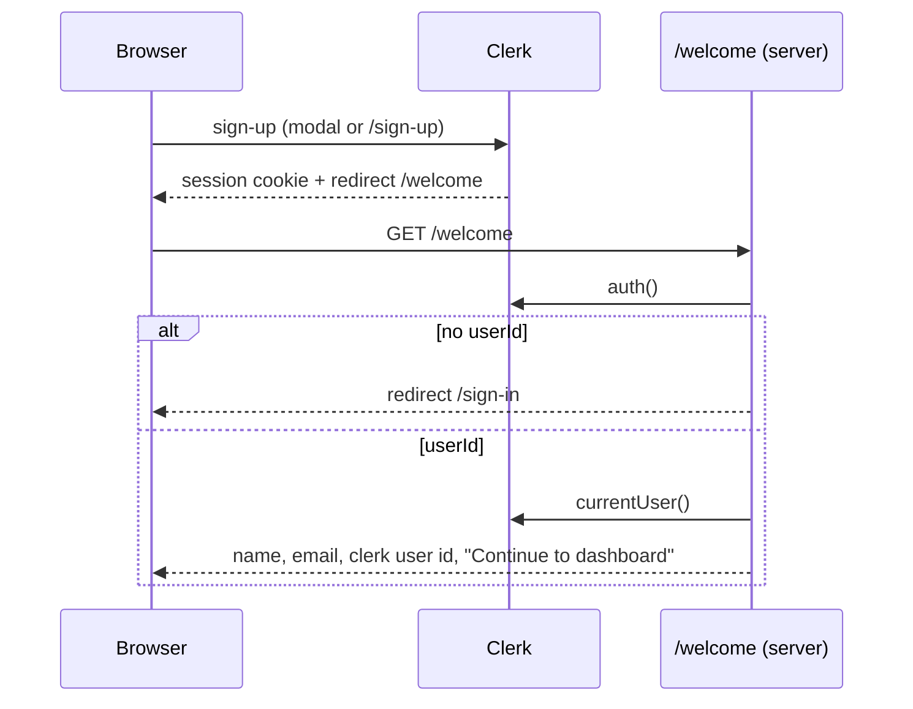
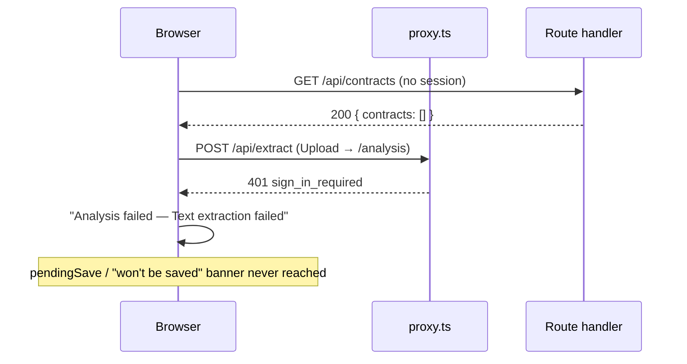
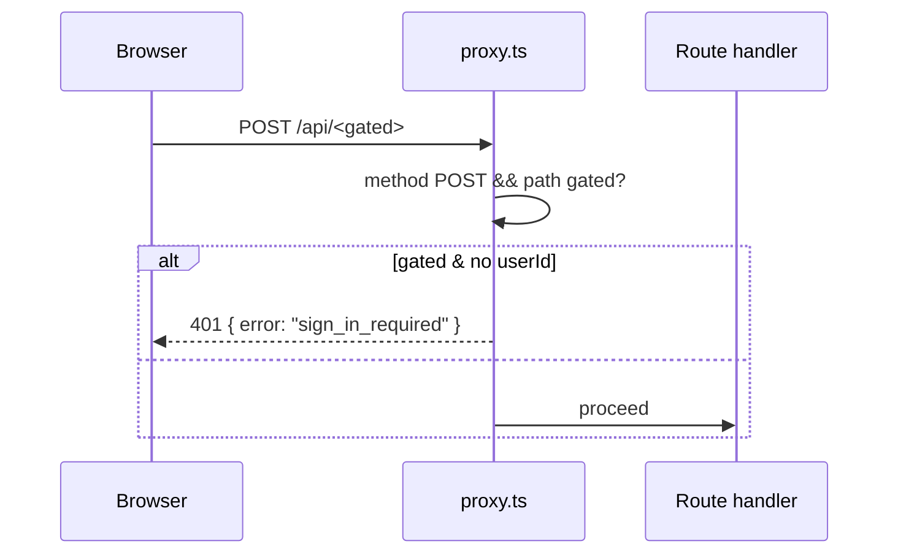
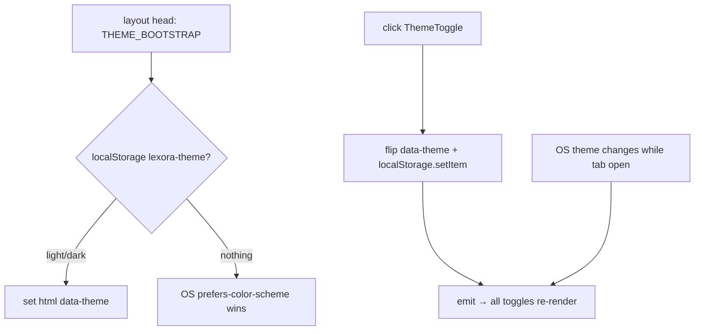

# A — Identity & entry

_The landing page, the auth flow, guest browsing, the compute gate, and the theme toggle. Read [00-conventions](00-conventions.md) first._

Verified against `main` @ `bf4d660`.

| id | Workflow |
|----|----------|
| [A1](#a1) | Landing page render |
| [A2](#a2) | The landing demo — zero network |
| [A3](#a3) | Sign-up → `/welcome` → `/dashboard` |
| [A4](#a4) | Sign-in — modal vs hosted page |
| [A5](#a5) | `/welcome` — the auth smoke test |
| [A6](#a6) | Sign-out |
| [A7](#a7) | Guest browsing — what a signed-out user actually gets |
| [A8](#a8) | The compute gate |
| [A9](#a9) | Theme toggle + pre-paint bootstrap |

`/onboarding` is orphaned — see [z-dead-and-unwired](z-dead-and-unwired.md).

---

## <a id="a1"></a>A1 — Landing page render

**0 · TL;DR** — `/` is a static marketing page (hero, demo, features, steps, pricing, RDG notices) with a `<Navbar variant="bare">` whose only dynamic part is the Clerk auth controls.

**1 · Entry point** — `src/app/page.tsx:93` (`LandingPage`, a server component). Wrapped by `src/app/layout.tsx` (`<ClerkProvider>` + fonts + the theme bootstrap script).

**2 · Preconditions** — None.

**3 · Trace**
1. `src/app/layout.tsx:67` — inline `THEME_BOOTSTRAP` script runs pre-paint (see [A9](#a9)); `src/app/layout.tsx:70-73` — loads Quill's `snow.css` from `cdn.quilljs.com` (used later on `/review`).
2. `src/app/page.tsx:95` — `<Navbar />` with no `variant` → resolves to `"bare"` because `pathname` is in `BARE_PAGES = ["/"]` (`src/components/navbar.tsx:11, 78`). Renders the brand lockup, anchor links (`#demo`, `#features`, `#pricing`, `#steps`), `<ThemeToggle />`, and `<AuthControls bare />`.
3. `src/components/navbar.tsx:22-53` — `AuthControls` calls `useUser()`: while `!isLoaded` it renders a `size-8` spacer (no reflow); signed in → "Go to dashboard" + `<UserButton />`; signed out → "Sign in" (`<SignInButton mode="modal">`) + "Get started" (`<SignUpButton mode="modal">`).
4. `src/app/page.tsx:100-336` — static sections: hero (`<HeroPreview />` — an animated but data-less preview), `#demo` ([A2](#a2)), features (`FEATURES` array), steps (`STEPS`), `<StatBand />`, `#pricing` (`<Pricing />`), CTA, `<RdgDisclaimerBox />` + `<RdgFooterNotice />` (`src/components/rdg-notice.tsx` — the RDG wording, kept verbatim, reused not restated).

`hero-preview.tsx`, `stat-band.tsx`, `pricing.tsx`, `reveal.tsx` are presentational with no data flow.

**4 · Database effects** — None.

**5 · External calls** — Clerk (`useUser()` hydration) and the Quill CSS CDN. No Gemini, no DB.

**7 · Failure modes** — Clerk fails to load → the auth controls stay as a spacer indefinitely; the rest of the page is fine. CDN CSS fails → no effect on `/` (only matters on `/review`).

**8 · Sequence diagram**



**9 · Observability notes**
> **What you can see today.** Nothing — no analytics, no page-view logging anywhere in the app.
> **What you can't.** Landing traffic, bounce, which CTA is clicked, demo engagement, sign-up funnel entry.
>
> | # | Blind spot | Class | Cheapest fix |
> |---|-----------|-------|--------------|
> | A1-O1 | Zero web analytics | NO-METRIC | a privacy-light pageview beacon (Plausible/self-hosted) — tier 3; or `console.info` events for a log-scrape — tier 0 |

**10 · See also** — [A2](#a2), [A9](#a9), [H1](h1-auth-and-ownership.md).

---

## <a id="a2"></a>A2 — The landing demo — zero network

**0 · TL;DR** — The `#demo` widget is a fully scripted client component: three canned contract samples plus an "own text" tab, a local pattern-matcher, and a 700 ms fake "scanning" pause. It never calls any API.

**1 · Entry point** — `src/components/landing/clause-demo.tsx` (`<ClauseDemo />`, rendered at `src/app/page.tsx` `#demo`). Its own header comment: *"zero network, two analysers"*.

**2 · Preconditions** — None. Auto-runs the first sample when the section scrolls into view (`inView`, `:249`, `:311-317`).

**3 · Trace** — pure client:
1. `SAMPLES` (`:30-93`) — three hard-coded contract snippets; `PATTERNS`/`computeFindings` (`:95+`) — a local rules table mapping regex → `{ risk, note, replacement }`.
2. `analyse(source, forTab)` (`:264`) — `computeFindings(forTab, clause)` → `findings[]`; sets `status` to a summary string.
3. `:296-305` — if `reduce`d motion: light up immediately. Else `busy = true`, then `setTimeout(700)` → `busy = false`, `lit = true`. **The pause is the whole effect** — it reads as scanning.
4. `loadSample(next)` (`:319`) — switch tabs; the "own" tab starts empty and does **not** auto-analyse; clicking Analyse runs the same local matcher on the user's paste.
5. `buildSegments` + `visibleCards` — render the marked-up text and the finding cards; "Apply" / "Dismiss" mutate local `applied` state only.

**4 · Database effects** — None. **5 · External calls** — None.

**7 · Failure modes** — None reach a server. Empty "own" text → `status = "Nothing to analyse"`.

**8 · Sequence diagram**

```mermaid
flowchart TD
  A[section scrolls into view] --> B[analyse SAMPLES[0]]
  T{tab} -->|canned sample| B
  T -->|own text| C[user pastes → clicks Analyse]
  C --> B
  B --> D[computeFindings: local regex table]
  D --> E{reduced motion?}
  E -->|yes| F[light up now]
  E -->|no| G[busy 700ms] --> F
  F --> H[render marked text + finding cards]
  H --> I[Apply / Dismiss → local state only]
```

**9 · Observability notes**
> **What you can see today.** Nothing.
> **What you can't.** Whether visitors try the demo, paste their own text, or apply fixes — the strongest pre-signup intent signal in the product, entirely dark.
>
> | # | Blind spot | Class | Cheapest fix |
> |---|-----------|-------|--------------|
> | A2-O1 | Demo engagement unmeasured | NO-METRIC | `console.info("[demo]", { event: "analyse" | "own_text" | "apply" })` — tier 0 |

**10 · See also** — [A1](#a1), [B3](b-getting-a-contract-in.md#b3) (the real analysis this imitates).

---

## <a id="a3"></a>A3 — Sign-up → `/welcome` → `/dashboard`

**0 · TL;DR** — Clerk handles registration (modal or hosted `/sign-up`); on success the fallback-redirect env var sends the user to `/welcome`, a server-rendered auth smoke test that links on to `/dashboard`.

**1 · Entry point** — `<SignUpButton mode="modal">` in the navbar ("Get started", `src/components/navbar.tsx:47-49`), or the hosted page `src/app/sign-up/[[...sign-up]]/page.tsx` (renders Clerk's `<SignUp appearance={CLERK_FLUSH_APPEARANCE}>` inside `AuthSplit` — `src/components/auth-shell.tsx`).

**2 · Preconditions** — `NEXT_PUBLIC_CLERK_PUBLISHABLE_KEY` + `CLERK_SECRET_KEY`. Redirect env: `NEXT_PUBLIC_CLERK_SIGN_UP_URL=/sign-up`, `NEXT_PUBLIC_CLERK_SIGN_UP_FALLBACK_REDIRECT_URL=/welcome`.

**3 · Trace**
1. User completes Clerk's flow (email + verification, or a social provider). All of this is Clerk-hosted UI + Clerk's backend — the app has no handler in the loop.
2. Clerk sets its session cookie and redirects to `/welcome` (the fallback-redirect URL).
3. `src/app/welcome/page.tsx:8-11` — server component: `const { userId } = await auth()`; `if (!userId) redirect("/sign-in")`.
4. `:13-14` — `currentUser()` → renders name + email + **the raw Clerk user id** + a "Continue to dashboard" `<Link href="/dashboard">`.

**4 · Database effects** — **None.** There is no local user row, no `users` table, no webhook creating a profile. The first DB write for a new user is their first `POST /api/contracts`.

**6 · End state** — Clerk session cookie set; user on `/welcome`, one click from `/dashboard`.

**7 · Failure modes**

| Trigger | Behaviour | User sees |
|---------|-----------|-----------|
| Clerk misconfigured (bad keys) | `auth()` yields no `userId` | `/welcome` immediately `redirect("/sign-in")` |
| User closes the tab on `/welcome` | nothing persisted, session still valid | next visit to any `(workspace)` page works |

**8 · Sequence diagram**



**9 · Observability notes**
> **What you can see today.** Nothing — sign-up happens entirely inside Clerk; the app sees a new user only when they first write.
> **What you can't.** Sign-up count, activation (sign-up → first contract), time-to-first-value.
>
> | # | Blind spot | Class | Cheapest fix |
> |---|-----------|-------|--------------|
> | A3-O1 | No activation funnel | NO-METRIC | a Clerk webhook → log `user.created`; log the first `POST /api/contracts` per new `user_id` — tier 1 |
> | A3-O2 | `/welcome` prints the raw Clerk user id to the user | LEAK (minor) | drop it or gate behind a debug flag — tier 0 |

**10 · See also** — [A5](#a5), [A4](#a4), [H1](h1-auth-and-ownership.md).

---

## <a id="a4"></a>A4 — Sign-in — modal vs hosted page

**0 · TL;DR** — Two surfaces for the same Clerk flow: an in-place modal (`<SignInButton mode="modal">`, used from the navbar and from "sign in to save" CTAs) and the hosted `/sign-in` page. Both land on `/welcome`.

**1 · Entry point** — Modal: `src/components/navbar.tsx:43-45`; `src/app/(workspace)/dashboard/page.tsx:359`; `src/app/analysis/page.tsx` (the "Sign in to save" prompt). Hosted: `src/app/sign-in/[[...sign-in]]/page.tsx:11` — `<SignIn appearance={CLERK_FLUSH_APPEARANCE}>` in the split-panel `AuthSplit` shell, plus an `<RdgMicro variant="signin">` one-liner.

**2 · Preconditions** — Clerk keys; `NEXT_PUBLIC_CLERK_SIGN_IN_URL=/sign-in`, `..._FALLBACK_REDIRECT_URL=/welcome`.

**3 · Trace**
1. **Modal path** — `<SignInButton mode="modal">` opens Clerk's overlay without navigating. On success Clerk fires a session update; the surrounding `useUser()` re-renders (e.g. the dashboard guest banner disappears). The `analysis/page.tsx` flow additionally has an effect (`:120-126`) meant to flush a `pendingSave` after sign-in — dead, see [A7](#a7).
2. **Hosted path** — full navigation to `/sign-in`; on success Clerk redirects to `/welcome` ([A5](#a5)).

**4 · Database effects** — None.

**7 · Failure modes** — Clerk down → the modal shows Clerk's own error UI; the hosted page shows Clerk's error state. No app-level handling.

**9 · Observability notes**
> **What you can see today.** Nothing app-side.
> **What you can't.** Sign-in rate, modal vs hosted split, failed-attempt rate.
>
> | # | Blind spot | Class | Cheapest fix |
> |---|-----------|-------|--------------|
> | A4-O1 | Sign-in events invisible | NO-METRIC | Clerk webhook `session.created` → log — tier 1 |

**10 · See also** — [A3](#a3), [A7](#a7).

---

## <a id="a5"></a>A5 — `/welcome` — the auth smoke test

**0 · TL;DR** — `/welcome` is a server component that proves Clerk is wired: it reads the session, shows the user's name / email / Clerk id, and links to `/dashboard`. It is the live post-sign-in / post-sign-up destination.

**1 · Entry point** — `src/app/welcome/page.tsx:8`. Reached via the Clerk fallback-redirect URLs (both sign-in and sign-up point here).

**2 · Preconditions** — A Clerk session (else `redirect("/sign-in")`, `:10`).

**3 · Trace** — `auth()` → `userId` (or redirect); `currentUser()` → `primaryEmailAddress`, `fullName`; render a `panel` card with a green check, the three fields, and `<Link href="/dashboard">Continue</Link>`.

**4 · Database effects** — None. **5 · External calls** — Clerk only.

**7 · Failure modes** — No session → redirect. That's the only branch.

**9 · Observability notes**
> **What you can see today.** Nothing.
> **What you can't.** How many users pass through vs. bookmark `/dashboard` directly.
>
> | # | Blind spot | Class | Cheapest fix |
> |---|-----------|-------|--------------|
> | A5-O1 | It's a self-described "smoke test" on the critical post-auth path | — (design debt, not observability) | replace with a real first-run screen, or redirect straight to `/dashboard` — product call |

**10 · See also** — [A3](#a3), [z-dead-and-unwired](z-dead-and-unwired.md) (`/onboarding`, the wizard `/welcome` bypasses).

---

## <a id="a6"></a>A6 — Sign-out

**0 · TL;DR** — Clerk's `<UserButton />` (navbar top-right, and the sidebar footer) provides the sign-out menu item; it clears the session and Clerk redirects to `/`.

**1 · Entry point** — `<UserButton />` in `src/components/navbar.tsx:36` (app + bare bars) and `src/components/sidebar.tsx` footer.

**2 · Preconditions** — Signed in.

**3 · Trace** — entirely Clerk. Session cookie cleared; default redirect to `/`. No app handler.

**4 · Database effects** — None. Any unsaved review-screen edit (the debounced autosave, [C3](c1-review-document.md)) that hasn't flushed is lost.

**9 · Observability notes**
> **What you can see today.** Nothing.
>
> | # | Blind spot | Class | Cheapest fix |
> |---|-----------|-------|--------------|
> | A6-O1 | Sign-out unlogged | NO-METRIC | Clerk webhook `session.ended` — tier 1 |

**10 · See also** — [A4](#a4).

---

## <a id="a7"></a>A7 — Guest browsing — what a signed-out user actually gets

**0 · TL;DR** — A signed-out visitor can view the landing page and the demo, and can load `/dashboard` / `/clauses` / `/templates` / `/playbooks` as **empty lists**. Every compute action and every save is blocked. The "analyse as a guest, save later" flow the UI still advertises is **dead**.

**1 · Entry point** — Any `(workspace)` route while signed out. There is no route guard on the pages themselves — they render, and their data fetches come back empty.

**2 · Preconditions** — No Clerk session.

**3 · Trace**
1. `GET /api/contracts` / `/api/clause-library` / `/api/templates` / `/api/playbooks` — all return `{ <collection>: [] }` for a guest ([H1](h1-auth-and-ownership.md)). The list pages render their empty states; `/clauses`, `/templates` show a "Sign in to use …" card.
2. `/dashboard` shows a guest banner: *"You're browsing as a guest. You can analyse a contract, but saving requires an account."* (`src/app/(workspace)/dashboard/page.tsx:353-363`). ⚠ **The first sentence is false.**
3. Any **Upload** → `/analysis` → `POST /api/extract`: the [compute gate](h1-auth-and-ownership.md#gate) 401s it at the middleware. `src/app/analysis/page.tsx:155` (`assertOk`) throws `"Text extraction failed"`; the page shows "Analysis failed". The guest never reaches step 2.
4. The **dead path**: `src/app/analysis/page.tsx:89` (`pendingSave` state), `:97-117` (`persist` returning false on 401), `:120-126` (an effect to flush `pendingSave` after sign-in), `:364-380` (a "This analysis won't be saved. Sign in to keep it" banner). All of it predates the gate and is now unreachable — a guest can't produce an analysis to stash.

**4 · Database effects** — None possible.

**7 · Failure modes** — the *expected* path (analyse as guest) is itself the failure: dies at extract with a generic error, no "sign in to continue" affordance at that point.

**8 · Sequence diagram**



**9 · Observability notes**
> **What you can see today.** A `401` in the access log (no route detail, no "was this a guest hitting the wall" flag).
> **What you can't.** How many guests try to analyse and bounce off the gate. Whether the dead guest-save code ever executes (it can't, but nothing asserts that).
>
> | # | Blind spot | Class | Cheapest fix |
> |---|-----------|-------|--------------|
> | A7-O1 | Guest → compute → 401 bounce uncounted | NO-METRIC | `console.info("[gate] guest_reject", { path })` in `src/proxy.ts` — tier 0 (also H1-O1) |
> | A7-O2 | Dead guest-save code still shipped | — (code debt) | delete `pendingSave` + the banner, or re-open the flow — product call |

**10 · See also** — [A8](#a8), [H1](h1-auth-and-ownership.md), [B2](b-getting-a-contract-in.md#b2).

---

## <a id="a8"></a>A8 — The compute gate

**0 · TL;DR** — `src/proxy.ts` (`clerkMiddleware`) 401s a signed-out **POST** to any of 8 listed API paths + the `reanalyse` regex, before the handler runs. Everything else passes through.

**1 · Entry point** — `src/proxy.ts:32` — the exported `clerkMiddleware` callback. Runs on the matcher at `:41-47`.

**2 · Preconditions** — Applies only to `POST` (`src/proxy.ts:28`).

**3 · Trace**
1. `isGatedCompute(req)` (`src/proxy.ts:26-30`): `method === "POST"` **and** (`path ∈ GATED_COMPUTE_PATHS` **or** `GATED_COMPUTE_PATTERN.test(path)`).
2. `GATED_COMPUTE_PATHS` (`:12-21`): `/api/analyse`, `/api/generate`, `/api/extract`, `/api/refine`, `/api/chat`, `/api/contract-edit`, `/api/clause-library/search`, `/api/templates/suggest-variables`.
3. `GATED_COMPUTE_PATTERN` (`:24`): `/^\/api\/contracts\/[^/]+\/reanalyse$/`.
4. If gated: `const { userId } = await auth()`; `if (!userId) return NextResponse.json({ error: "sign_in_required" }, { status: 401 })` (`:33-38`).
5. Otherwise (and for all non-POST / non-gated traffic) the middleware falls through and the request proceeds.

**4 · Database effects** — None.

**7 · Failure modes** — none of its own; it's a guard. ⚠ `tests/auth-gate.test.mjs:64-72` (`COMPUTE_POSTS`) omits `/api/clause-library/search` and `/api/templates/suggest-variables` — those two are unverified by the gate test.

**8 · Sequence diagram**



**9 · Observability notes** — see [H1 §Observability](h1-auth-and-ownership.md#observability-notes) (H1-O1). The gate emits nothing.

**10 · See also** — [H1](h1-auth-and-ownership.md#gate), [H2](h2-rate-limiting.md) (the second precondition), [A7](#a7).

---

## <a id="a9"></a>A9 — Theme toggle + pre-paint bootstrap

**0 · TL;DR** — The theme lives in `<html data-theme>` + `localStorage["lexora-theme"]` — the **only** `localStorage` use in the product. An inline script in `<head>` applies a stored choice before first paint; the toggle button writes both places and re-renders via `useSyncExternalStore`.

**1 · Entry point** — `src/app/layout.tsx:67` (the `THEME_BOOTSTRAP` `<script>`); `src/components/theme-toggle.tsx` (`<ThemeToggle />` — in the bare navbar, and `floating` bottom-right on `(workspace)` and `/review` / `/analysis` screens).

**2 · Preconditions** — None. Degrades cleanly if `localStorage` throws (private mode) — the toggle still works for the current page view.

**3 · Trace**
1. `THEME_BOOTSTRAP` (`src/app/layout.tsx:57`): `try { const t = localStorage.getItem("lexora-theme"); if (t === "light" || t === "dark") document.documentElement.setAttribute("data-theme", t) } catch {}`. With nothing stored, no attribute is set and the OS `prefers-color-scheme` wins.
2. `theme-toggle.tsx` — `useSyncExternalStore(subscribe, getSnapshot, getServerSnapshot)`. `getSnapshot` reads `data-theme` or falls back to `matchMedia("(prefers-color-scheme: dark)")`. `getServerSnapshot` returns `"dark"` (dark-first — the bare `:root` palette is dark). `subscribe` also listens for OS-level `prefers-color-scheme` changes while the tab is open.
3. `toggle()` — flips `data-theme`, `localStorage.setItem("lexora-theme", next)` (try/catch), `emit()` to re-render every mounted toggle.

**4 · Database effects** — None. Never leaves the browser.

**7 · Failure modes** — `localStorage` unavailable → the choice doesn't persist across reloads but works within the page. SSR renders dark; a stored `light` choice causes a one-frame flash only if the bootstrap script is stripped (it isn't).

**8 · Sequence diagram**



**9 · Observability notes**
> **What you can see today.** Nothing.
> **What you can't.** Light/dark split (irrelevant to ops, mild product interest).
>
> | # | Blind spot | Class | Cheapest fix |
> |---|-----------|-------|--------------|
> | A9-O1 | Theme preference unknown | NO-METRIC | not worth instrumenting server-side; skip |

**10 · See also** — [A1](#a1) (where the bootstrap runs).

---

## Cross-A observations

- **No analytics of any kind.** Not on the landing page, not the demo, not the sign-up funnel. Every A-workflow's biggest gap is the same: the product cannot see its own top of funnel.
- **Clerk is a black box to the app.** Sign-up / sign-in / sign-out produce no app-side event. A Clerk webhook (`user.created`, `session.created`, `session.ended`) is the single tier-1 change that would light up the whole identity layer.
- **The post-auth path is a placeholder.** `/welcome` self-describes as a smoke test and leaks the raw Clerk id; `/onboarding` is built but wired to nothing ([z-dead-and-unwired](z-dead-and-unwired.md)).
