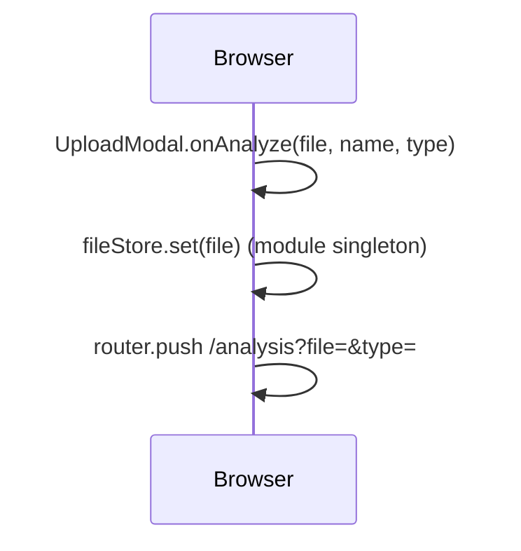
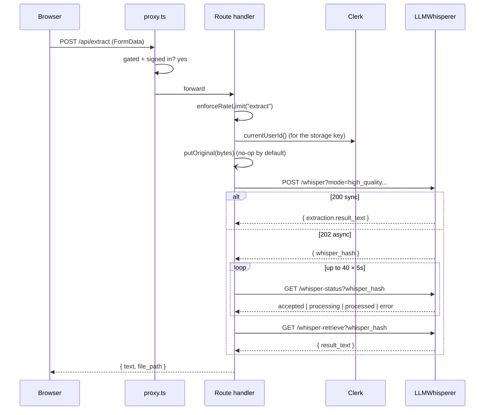
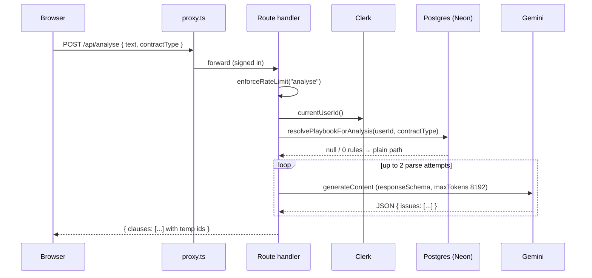
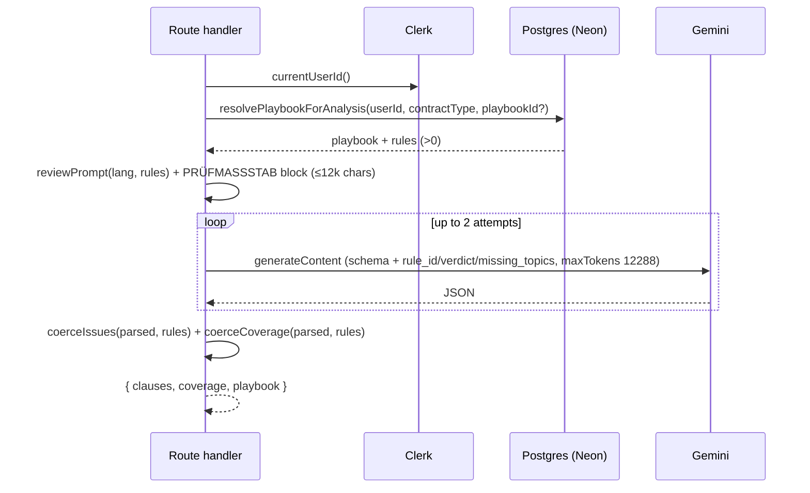
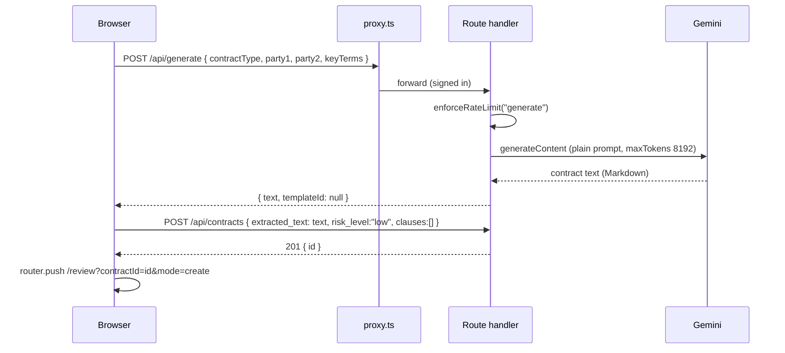
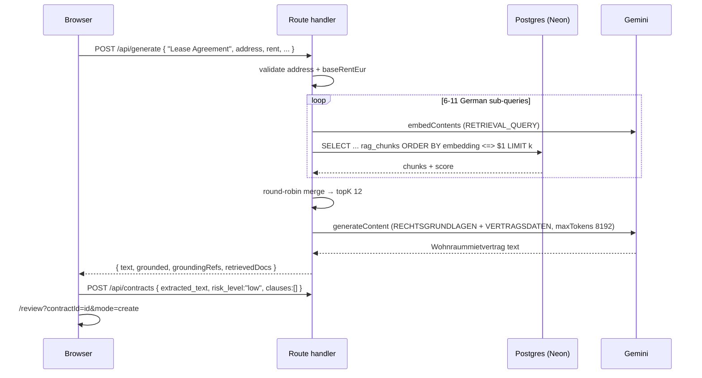
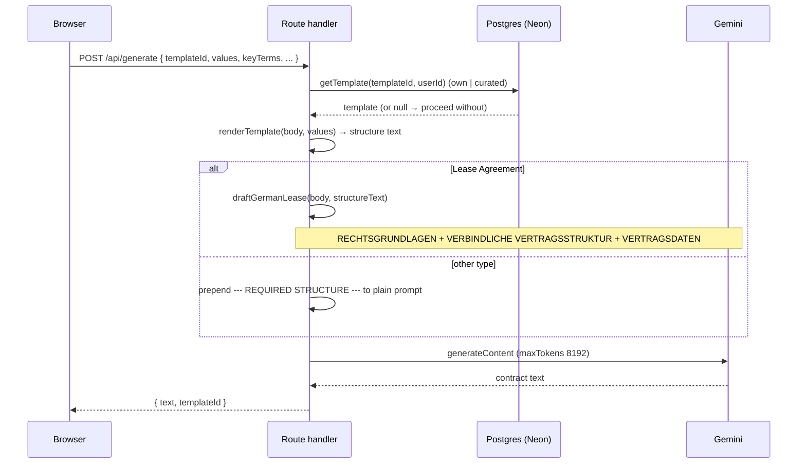

# B — Getting a contract in

_Every path that produces a `contracts` row and lands the user on `/review`. Read [00-conventions](00-conventions.md) first; this file assumes the template._

Verified against `main` @ `bf4d660`.

**Two shapes.** Uploads go through the dedicated `/analysis` screen (B1–B5). Everything generated (B6–B10) is orchestrated inline by the dashboard's `onGenerate` handler and jumps straight to `/review?…&mode=create` — no `/analysis` screen, no risk clauses at save time.

| id | Workflow |
|----|----------|
| [B1](#b1) | Upload modal → `fileStore` → `/analysis` |
| [B2](#b2) | `POST /api/extract` — LLMWhisperer |
| [B3](#b3) | `POST /api/analyse` — plain (no playbook) |
| [B4](#b4) | `POST /api/analyse` — playbook-aware |
| [B5](#b5) | Save the analysis → `POST /api/contracts` → `/review` |
| [B6](#b6) | Generate a non-lease contract (plain LLM) |
| [B7](#b7) | Generate a German residential lease (grounded RAG) |
| [B8](#b8) | Generate **from a template** with AI |
| [B9](#b9) | **Render** from a template — no AI |
| [B10](#b10) | Seed test data |

---

## <a id="b1"></a>B1 — Upload modal → `fileStore` → `/analysis`

**0 · TL;DR** — Picking a file and a contract type in the Upload modal stashes the `File` in a module singleton and navigates to `/analysis?file=<name>&type=<code>`; nothing is uploaded yet.

**1 · Entry point** — `/dashboard`, the **Upload** button (`src/app/(workspace)/dashboard/page.tsx:388`) or the sidebar New ▸ "Upload contract" deep-link (`?upload=1`, [G6](g-dashboard-and-workspace.md)). Renders `<UploadModal>` (`src/components/upload-modal.tsx:39`).

**2 · Preconditions** — None. The modal works signed out (the wall comes later, at [B2](#b2)).

**3 · Trace**
1. `src/components/upload-modal.tsx:44-52` — drag/drop or file-picker → `addFiles` → `files[]` state (each `{ id, name, size, file }`).
2. `:158-172` — a `<Select>` sets `contractType` to a **lowercase code** (`nda`, `msa`, `employment`, `vendor`, `saas`, `lease`, `partnership`, `other`). ⚠ These do **not** match `src/lib/contract-types.ts` display names (`"Lease Agreement"`) — see §7.
3. On submit, `onAnalyze(file, name, contractType)` fires the dashboard callback (`dashboard/page.tsx:394-402`):
   - `fileStore.set(file)` (`src/lib/file-store.ts:6`) — a **module-level singleton**, survives client navigation, dies on hard refresh.
   - `router.push('/analysis?file=' + encodeURIComponent(name) + '&type=' + encodeURIComponent(contractType))`.

**4 · Database effects** — None.

**6 · End state** — `fileStore` holds the `File`; the browser is on `/analysis?file=…&type=…`. On a hard refresh of `/analysis` before extraction runs, `fileStore.get()` is `null` and the page shows *"No file found. Please go back and upload a document."* (`src/app/analysis/page.tsx:132-135`).

**7 · Failure modes**

| Trigger | Behaviour | User sees | Survives |
|---------|-----------|-----------|----------|
| Hard-refresh `/analysis` | `fileStore` empty | "No file found" + back button | nothing |
| `type` code mismatch | carried as-is into `/api/analyse` `contractType` | — | playbook default never resolves for uploads (see [B4](#b4) §7) |

**8 · Sequence diagram**



**9 · Observability notes**
> **What you can see today.** Nothing — pure client state.
> **What you can't.** Upload attempts, file sizes/types chosen, drop-offs before `/analysis`.
>
> | # | Blind spot | Class | Cheapest fix |
> |---|-----------|-------|--------------|
> | B1-O1 | No funnel signal for "started an upload" | NO-METRIC | `console.info("[upload] start", { type, sizeKB })` in `onAnalyze` — tier 0 |

**10 · See also** — [B2](#b2) (what happens next), [G1](g-dashboard-and-workspace.md) (the modal's host).

---

## <a id="b2"></a>B2 — `POST /api/extract` — LLMWhisperer

**0 · TL;DR** — `/analysis` posts the stashed file to `/api/extract`, which optionally stores the original, submits it to LLMWhisperer, polls up to ~3½ minutes, and returns `layout_preserving` text.

**1 · Entry point** — `src/app/analysis/page.tsx:140-152` — inside the page's `run()` effect, step 1. `fetch("/api/extract", { method: "POST", body: FormData(file) })`. Handler: `src/app/api/extract/route.ts:50`.

**2 · Preconditions** — **Signed in** — `/api/extract` is in [`GATED_COMPUTE_PATHS`](h1-auth-and-ownership.md#gate); a guest POST 401s at the middleware and the page throws `"Text extraction failed"` at `assertOk` (`src/app/analysis/page.tsx:155`). `LLMWHISPERER_BASE_URL` + `LLMWHISPERER_API_KEY` env vars. `export const maxDuration = 120` (`route.ts:9`).

**3 · Trace**
```
POST /api/extract · auth: proxy-gated · limit: extract 15/h · 40/d
  req  multipart/form-data { file }
  res  { text, file_path }   |   4xx/5xx { error, message }
```
1. `route.ts:52` — `enforceRateLimit(req, "extract")`.
2. `:55-57` — read the `File` from `formData`; `400 "No file provided"` if absent.
3. `:59-75` — **storage side-effect** ([H7](h7-storage.md)): `putOriginal(bytes, { userId: currentUserId() ?? "anon", filename, contentType })`. Wrapped in try/catch — a storage failure is swallowed to `console.error` and `filePath` stays `null`. With the default driver (`none`) this always returns `null`.
4. `:78-89` — `POST {BASE_URL}/whisper?mode=high_quality&output_mode=layout_preserving&page_seperator=<<<&filename=…` with the raw bytes as an `application/octet-stream` body.
5. Branch on the submit status:
   - `200` (`:91-97`) — synchronous. `data.extraction.result_text`. `422 { error: "no_text" }` if empty.
   - `202` (`:99-110`) — async. `data.whisper_hash` → `pollUntilProcessed` (`:29-48`): 40 iterations × 5 s sleep, `GET /whisper-status?whisper_hash=…`; on `"processed"` → `retrieveResult` (`GET /whisper-retrieve?…` → `result_text`); on `"error*"` → throw; times out after ~200 s.
   - anything else (`:112-114`) — `console.error` + `502 { error: "upstream_error" }`.
6. `:96, :108` — success returns `{ text, file_path }`.

**4 · Database effects** — None directly. `file_path` is only *carried* to [B5](#b5); nothing writes it here.

**5 · External calls** — LLMWhisperer only (not Gemini). No retry on the *submit*; the poll loop is the resilience. `maxDuration = 120` on the route vs. a ~200 s worst-case poll — a long OCR can exceed the platform function timeout before `pollUntilProcessed` gives up.

**6 · End state** — Response `{ text, file_path }` held in the page's `run()` closure; `steps[0]` marked complete; progress → 33 %.

**7 · Failure modes**

| Trigger | Behaviour | User sees | Survives |
|---------|-----------|-----------|----------|
| Guest | 401 at middleware | "Analysis failed — Text extraction failed" | nothing |
| Rate-limited | 429 | "usage limit … try again in ~N min" + (if guest) sign-in CTA | nothing |
| LLMWhisperer submit non-200/202 | `console.error` + 502 | generic "couldn't read text" | nothing |
| Poll returns `error` | throw → 500 via `errorResponse` | generic message | nothing; original may be stored (driver permitting) but no `contracts` row is made |
| Poll times out (~3½ min) | throw "timed out after 3+ minutes" → 500 | generic message | nothing |
| Function timeout < poll | platform kills the request | request hangs then fails | nothing |
| Empty text | `422 { error: "no_text" }` | "We couldn't read text from that file" | nothing |

**8 · Sequence diagram**



**9 · Observability notes**
> **What you can see today.** `console.error` on: `putOriginal` throw (`route.ts:73`), missing `whisper_hash` in a 202 (`:104`), non-200/202 submit (`:113`). That's it — no log of poll count, elapsed OCR time, page count, or text length.
> **What you can't.** How long OCR actually takes (p50/p99). How often it times out vs. the function killing the request first. LLMWhisperer error-rate. Whether the storage side-effect succeeded.
>
> | # | Blind spot | Class | Cheapest fix |
> |---|-----------|-------|--------------|
> | B2-O1 | OCR latency + poll count unknown | NO-METRIC | log `{ event:"extract_done", ms, polls, chars }` before returning — tier 0 |
> | B2-O2 | Function-timeout vs. poll-timeout indistinguishable | NO-LOG | log a heartbeat each poll iteration — tier 0 |
> | B2-O3 | Storage side-effect result invisible on success | NO-LOG | log `{ event:"original_stored", key }` when `filePath` is non-null — tier 0 |

**10 · See also** — [H7](h7-storage.md) (the `putOriginal` call), [B3](#b3) (next step), [H2](h2-rate-limiting.md#tiers) (the `extract` tier).

---

## <a id="b3"></a>B3 — `POST /api/analyse` — plain (no playbook)

**0 · TL;DR** — `/analysis` posts the extracted text to `/api/analyse`, which runs one Gemini structured-output call under German law and returns 5–8 risk clauses; **nothing is persisted here**.

**1 · Entry point** — `src/app/analysis/page.tsx:159-166` — step 2 of `run()`. Handler: `src/app/api/analyse/route.ts:9`.

**2 · Preconditions** — Signed in ([gated](h1-auth-and-ownership.md#gate)). This section is the path taken when **no playbook resolves** — a signed-out caller (can't, it's gated), or a signed-in user with no workspace default for this `contractType` (which, for uploads, is [always](#b4) — the type-code mismatch).

**3 · Trace**
```
POST /api/analyse · auth: proxy-gated · limit: analyse 20/h · 60/d
  req  { text, contractType, language?, playbookId? }
  res  { clauses: [{ id, type, clause, passage, issue, suggestion, reference? }] }
```
1. `route.ts:11` — `enforceRateLimit(req, "analyse")`.
2. `:14-20` — parse; `400 "No text provided"` if `text` is blank.
3. `:26-31` — `currentUserId()`; `resolvePlaybookForAnalysis(userId, contractType ?? "", playbookId ?? null)` ([F5](f-playbooks.md#f5)). For this section it returns `null` or a playbook with 0 rules.
4. `:48` — `analyseContract(text, lang)` (`src/lib/analysis.ts:318`):
   - `reviewPrompt(lang)` (`:120`) — German Fachanwalt persona; assess every clause against §§ 305–310 BGB (AGB-Kontrolle) + the mietrechtliche Spezialnormen; return 5–8 issues, most severe first, each `issue` citing the norm inline, optional `reference` field.
   - prompt + `text.slice(0, 200_000)` (`MAX_CHARS`, `:304`).
   - `askLLM({ maxTokens: 8192, prompt, responseSchema: RESPONSE_SCHEMA })` ([H5](h5-llm-layer.md)).
   - `coerceIssues(extractJson(responseText))` — drop malformed entries. **Up to 2 attempts**; each attempt is itself a full `askLLM` call (with `askLLM`'s own 3 retries → up to 6 Gemini calls). Both empty → `AppError(422, "analysis_failed")`.
5. `:49` — map issues to `{ ...issue, id: "clause-<i>-<Date.now()>" }` — **temp ids**, replaced by real DB ids in [B5](#b5).
6. `:50` — `NextResponse.json({ clauses })`.

**4 · Database effects** — **None.** `/api/analyse` is stateless.

**5 · External calls** — Gemini via `askLLM`. Model `gemini-3.6-flash`, `maxTokens 8192`, input `slice(0, 200_000)`, structured output. See [H5](h5-llm-layer.md#token-caps).

**6 · End state** — `{ clauses }` in the page's `run()` closure; `steps[1]` complete; progress → 75 %.

**7 · Failure modes**

| Trigger | Behaviour | User sees | Survives |
|---------|-----------|-----------|----------|
| Blank text | 400 | generic | nothing |
| Gemini busy/blocked/no-output | `AppError` 503/422/502 via `errorResponse` | its `message` | nothing |
| Both parse attempts empty | `AppError(422, "analysis_failed")` | "didn't produce a usable result" | nothing |
| Contract > 200k chars | silently truncated | normal result on a partial doc | the tail is never reviewed |

**8 · Sequence diagram**



**9 · Observability notes**
> **What you can see today.** Only `console.error` from `errorResponse("analyse", …)` on an unexpected throw — no request id, no user, no input size, no clause count, no attempt count. A clean run logs nothing.
> **What you can't.** How often the 2-attempt retry fires. Analysis latency. How many issues a typical contract yields, by type. Truncation rate. Whether `analysis_failed` is a model problem or a schema/parse problem.
>
> | # | Blind spot | Class | Cheapest fix |
> |---|-----------|-------|--------------|
> | B3-O1 | No log of a successful analysis (count, ms, chars, truncated?) | NO-LOG | `console.info("[analyse] ok", { chars, truncated, issues, ms })` — tier 0 |
> | B3-O2 | Retry / `analysis_failed` rate unknown | NO-METRIC | log each attempt outcome in `analyseContract` — tier 0 |
> | B3-O3 | Truncation silent | NO-LOG | log when `text.length > MAX_CHARS` — tier 0 |

**10 · See also** — [B4](#b4) (the playbook variant), [H5](h5-llm-layer.md), [C14](c3-review-ai-and-output.md) (re-analyse runs the same functions).

---

## <a id="b4"></a>B4 — `POST /api/analyse` — playbook-aware

**0 · TL;DR** — When a playbook resolves, `/api/analyse` runs `analyseContractWithPlaybook` instead: the prompt gets a `PRÜFMASSSTAB` rule block, each finding carries a `rule_id` + `verdict`, and the response adds a `coverage` array and a `playbook` stub — none of which is persisted by this route.

**1 · Entry point** — same as [B3](#b3); the branch at `src/app/api/analyse/route.ts:34`.

**2 · Preconditions** — Signed in. **A playbook must resolve** — either an explicit `playbookId` in the body, or `resolvePlaybookForAnalysis` finds the user's `is_default` playbook for `contractType` (`src/lib/playbooks.ts:147-163`). The resolved playbook must have `rules.length > 0`.

> ⚠ **For uploads this branch never fires by default.** The upload path sends `contractType` as a lowercase code (`lease`), `resolvePlaybookForAnalysis` matches `contract_type = $2` against the display name (`"Lease Agreement"`), and no row matches (`src/lib/playbooks.ts:155-160`). Combined with the fact that a **curated** playbook can't be a resolved default (`user_id = $1` required, `:156`), the only way to reach this branch from an upload today is an explicit `playbookId`, which the `/analysis` page never sends. It *does* fire from [C14](c3-review-ai-and-output.md) (re-analyse), where the review screen passes both `playbookId` and the display-name `contractType`.

**3 · Trace**
```
POST /api/analyse · auth: proxy-gated · limit: analyse 20/h · 60/d
  req  { text, contractType, language?, playbookId }
  res  { clauses:[{…, playbook_rule_id?, verdict?, reference?}], coverage:[…], playbook:{id,name,is_approved} }
```
1. `route.ts:34` — `pb && pb.rules.length > 0` → the playbook branch.
2. `:35-38` — `analyseContractWithPlaybook(text, { language, rules: pb.rules.map(toPromptRule) })` (`src/lib/analysis.ts:366`):
   - `reviewPrompt(lang, rules)` (`:120`) — inserts `renderPlaybookBlock(rules)` (`:58`, ≤ `MAX_RULE_CHARS = 12_000` chars, drop highest `sort_order` first + truncation note) between the standard rules and the `Document:` marker; the "return 5–8 issues" line becomes "one issue per breached rule … also flag mandatory-law violations".
   - `text.slice(0, 200_000 - 12_000)` (`:374`).
   - `askLLM({ maxTokens: 12288, responseSchema })` — schema now has per-issue `rule_id` + `verdict` and top-level `missing_topics`.
   - `coerceIssues(parsed, rules)` (drop `rule_id`s not in the set) + `coerceCoverage(parsed, rules)` (`:254` — every `is_required` rule with no matching finding → `verdict: "missing"`).
3. `:39` — temp-id the clauses.
4. `:40-44` — return `{ clauses, coverage, playbook: { id, name, is_approved } }`.

**4 · Database effects** — **None.** `coverage` is returned to the client and **never stored** — there is no coverage table ([H6](h6-database-schema.md)). The review screen keeps it in memory until reload.

**5 · External calls** — Gemini, `maxTokens 12288`, input `slice(0, 188_000)`. See [H5](h5-llm-layer.md).

**6 · End state** — `{ clauses, coverage, playbook }` in the caller. On the [B5](#b5) save, `playbook_id`, and per-clause `reference` / `playbook_rule_id` / `verdict`, are persisted; `coverage` is not.

**7 · Failure modes** — as [B3](#b3), plus: a `rule_id` the model invents that isn't in the set is silently dropped by `coerceIssues`; a rule block that overflows 12 000 chars silently drops its lowest-priority rules.

**8 · Sequence diagram**



**9 · Observability notes**
> **What you can see today.** Nothing playbook-specific. No log of which playbook resolved, how many rules, how many redlines/fallbacks/missing.
> **What you can't.** Whether a playbook was actually applied to a given analysis (only visible via the persisted `playbook_id`, and only on the re-analyse/save paths). Coverage outcomes over time. The silent rule-block truncation.
>
> | # | Blind spot | Class | Cheapest fix |
> |---|-----------|-------|--------------|
> | B4-O1 | Playbook resolution result unlogged | NO-LOG | `console.info("[analyse] playbook", { id, rules, resolvedFrom: playbookId ? "explicit" : "default" })` — tier 0 |
> | B4-O2 | Coverage never persisted → no history | NO-METRIC | descriptive; a `contract_playbook_coverage` table would make it queryable — tier 2 |
> | B4-O3 | Rule-block truncation silent | NO-LOG | log in `renderPlaybookBlock` when it drops rules — tier 0 |

**10 · See also** — [F5](f-playbooks.md#f5) (the full prompt-injection mechanism), [C14](c3-review-ai-and-output.md), [C15](c3-review-ai-and-output.md) (the Playbook tab that consumes `coverage`).

---

## <a id="b5"></a>B5 — Save the analysis → `POST /api/contracts` → `/review`

**0 · TL;DR** — After analysis, `/analysis` rolls the clauses into a risk level, POSTs one payload that inserts the contract and its clauses (non-transactionally), remaps temp clause ids to real ones, and enables the "Open the review" button.

**1 · Entry point** — `src/app/analysis/page.tsx:186-223` (`run()` step 3 + `persist`). Handler: `src/app/api/contracts/route.ts:25`.

**2 · Preconditions** — **Signed in** — `POST /api/contracts` is not compute-gated but calls `signInRequired()` (`route.ts:27`). ⚠ The page still has a "signed out → stash in `pendingSave`, flush after sign-in" path (`:97-117`, `:120-126`), but a guest can't get past [B2](#b2), so it's dead.

**3 · Trace**
```
POST /api/contracts · auth: currentUserId · limit: none
  req  { name, contract_type, extracted_text, file_path?, risk_level,
         playbook_id?, template_id?,
         clauses:[{ type, clause, passage, issue, suggestion, sort_order,
                    source, reference?, playbook_rule_id?, verdict? }] }
  res  201 { id, clauses:[{ id, sort_order }] }
```
1. `analysis/page.tsx:191-217` — build the payload: `risk_level` = `high` if any clause `type==="high"`, else `medium`, else `low`; `playbook_id` from the analyse response's `playbook?.id`; each clause `source: "ai"`, `reference`/`playbook_rule_id`/`verdict` carried through.
2. `route.ts:27` — `signInRequired()` if no user.
3. `:54-70` — `insert into contracts (user_id, name, contract_type, extracted_text, file_path, risk_level, total_issues, issues_fixed, playbook_id, template_id) values (…, $7 = clauses.length, 0, …) returning id`.
4. `:74` — **separate statement**, no transaction: bulk `insert into risk_clauses (contract_id, type, clause, passage, issue, suggestion, sort_order, status='pending', source, reference, playbook_rule_id, verdict) values …` (11 value columns), `returning id, sort_order`.
5. `:97-99` — sort the returned rows by `sort_order`, respond `201 { id, clauses }`.
6. `analysis/page.tsx:104-116` — `setContractId(id)`; remap the in-memory clauses' temp ids to `dbClauses[i].id` (positional); `analysisStore.set({ extractedText, clauses: resolved })`.
7. `:222-223` — if `persist` returned false (401 or non-ok), stash `pendingSave` (dead for guests; a non-ok here is a real error). Set `done = true`.
8. The footer button becomes **"Open the review"** → `router.push('/review?file=<name>&type=<type>&contractId=<id>')` (`:400-405`). Without `contractId` it still opens `/review` but in the in-memory-only mode ([C2](c1-review-document.md)).

**4 · Database effects** — 1 `contracts` row (`route.ts:56`); N `risk_clauses` rows (`:94`). **No transaction** — a failure between the two leaves a contract with `total_issues = N` and zero clauses. `total_issues` = clause count at insert; `issues_fixed = 0`. See [H6](h6-database-schema.md#tables).

**6 · End state** — Contract + clauses persisted; `analysisStore` holds the resolved clauses; `contractId` set; on `/review` the DB fetch ([C1](c1-review-document.md)) is authoritative.

**7 · Failure modes**

| Trigger | Behaviour | User sees | Survives |
|---------|-----------|-----------|----------|
| 401 | `persist` returns false → `pendingSave` set (dead path) | "won't be saved" banner (unreachable) | analysis viewable in memory only until refresh |
| contract insert fails | `catch` → `{ error: <raw DB msg> }` 500 ([H3](h3-error-taxonomy.md) LEAK) | `persist` returns false; analysis stays viewable | nothing |
| clause insert fails after contract insert | same 500 | same | **an orphan `contracts` row with `total_issues=N`, 0 clauses** |
| positional remap mismatch (`dbClauses.length !== clauses.length`) | keeps the temp ids (`analysis/page.tsx:108-113`) | works, but Apply-fix later 404s the clause | temp-id clauses can't be PATCHed |

**8 · Sequence diagram**

```mermaid
sequenceDiagram
  participant B as Browser
  participant API as Route handler
  participant CK as Clerk
  participant PG as Postgres (Neon)
  B->>API: POST /api/contracts { name, ..., clauses[] }
  API->>CK: currentUserId()  (401 → signInRequired)
  API->>PG: INSERT contracts (...) RETURNING id
  PG-->>API: id
  API->>PG: INSERT risk_clauses (bulk, status='pending') RETURNING id, sort_order
  PG-->>API: rows
  Note over API,PG: two statements, no transaction
  API-->>B: 201 { id, clauses }
  B->>B: remap temp ids → real ids; analysisStore.set
  B->>B: "Open the review" → /review?contractId=id
```

**9 · Observability notes**
> **What you can see today.** `console.error("[generate]", err)` only on the generate branch; the analysis-page save logs nothing on failure beyond `persist` returning false. The route's `catch` returns the raw message and does **not** `console.error` (`route.ts:107`).
> **What you can't.** How often the non-transactional save half-completes (orphan contracts). The positional-remap mismatch. Save latency. The signed-out drop-off (unreachable path, but if the gate changed it'd be silent).
>
> | # | Blind spot | Class | Cheapest fix |
> |---|-----------|-------|--------------|
> | B5-O1 | Orphan `contracts` rows from a mid-save failure invisible | NO-LOG | wrap the two inserts in a transaction; log rollback — tier 1 (fix + log) |
> | B5-O2 | Raw DB error leaked, not logged | LEAK + NO-LOG | `errorResponse(err, "contracts.create")` — tier 0 |
> | B5-O3 | Temp-id remap mismatch silent | NO-LOG | `console.warn` when `dbClauses.length !== clauses.length` — tier 0 |

**10 · See also** — [H6](h6-database-schema.md#tables), [C1](c1-review-document.md) (the review screen loads what this wrote), [C4](c2-review-findings.md) (needs real clause ids).

---

## <a id="b6"></a>B6 — Generate a non-lease contract (plain LLM)

**0 · TL;DR** — The Generate modal collects parties + key terms, `/api/generate` runs one ungrounded Gemini call under German law, the dashboard saves a bare contract (no clauses), and jumps to `/review?…&mode=create`.

**1 · Entry point** — `/dashboard`, the **Generate** button or New ▸ "Generate with AI" (`?generate=1`). `<CreateContractModal>` (`src/components/create-contract-modal.tsx`); on submit → `dashboard/page.tsx` `onGenerate` (`:406-480`). Handler: `src/app/api/generate/route.ts:104`.

**2 · Preconditions** — Signed in ([gated](h1-auth-and-ownership.md#gate)); saving also needs a session. `contractType` is a **display name** here (`"NDA"`, `"MSA"`, …, `src/lib/contract-types.ts`), not the upload codes. `isGermanResidentialLease` is false (anything but `"Lease Agreement"`).

**3 · Trace**
```
POST /api/generate · auth: proxy-gated · limit: generate 15/h · 40/d
  req  { contractType, party1, party2, language?, keyTerms?, templateId?, values? }
  res  { text, templateId }
```
1. `generate/route.ts:106` — `enforceRateLimit("generate")`.
2. `:112` — `renderTemplateBody(body, language)` — `null` here (no `templateId`).
3. `:116` — not a lease → the ungrounded branch (`:131-159`).
4. `:132-138` — `structureBlock` empty (no template).
5. `:139-158` — build the prompt: "senior German commercial contracts attorney … draft a complete `${contractType}` between `${party1}` and `${party2}` … respect AGB-Kontrolle §§ 305–310 BGB … no `[INSERT]` … return ONLY the contract text". English variant keeps German citations verbatim.
6. `:160` — `askLLM({ prompt, maxTokens: 8192 })` — **no `responseSchema`**, plain text out.
7. `:162` — `{ text, templateId: null }`.
8. `dashboard/page.tsx:441-447` — if `!genRes.ok || !genData.text` → error toast, close modal, stop.
9. `:450-461` — `POST /api/contracts { name, contract_type: contractType, extracted_text: genData.text, risk_level: "low", clauses: [] }` — **no analysis, no clauses, hardcoded `low`**. ⚠ `templateId` from the response is **not** forwarded.
10. `:470-473` — `loadContracts()`, then `router.push('/review?contractId=<id>&file=<name>&type=<type>&mode=create')`.

**4 · Database effects** — 1 `contracts` row with `total_issues = 0`, `issues_fixed = 0`, `risk_level = 'low'`, `quill_delta = null`, `extracted_text` = the draft. **Zero `risk_clauses`.** The review screen's clause panel is empty until the user runs [C14](c3-review-ai-and-output.md) (re-analyse).

**5 · External calls** — Gemini via `askLLM`, `gemini-3.6-flash`, `maxTokens 8192`, **no input cap** (the prompt is party names + key terms, small), no structured output.

**6 · End state** — Contract saved; `/review?…&mode=create` — `mode=create` enables the in-editor AI-edit affordance ([C11](c3-review-ai-and-output.md)). The draft arrives as Markdown; `setDocText` detects it and converts to Quill rich text ([C3](c1-review-document.md)).

**7 · Failure modes**

| Trigger | Behaviour | User sees | Survives |
|---------|-----------|-----------|----------|
| Guest | 401 at middleware | "Couldn't generate" toast | nothing |
| Rate-limited | 429 | "Generation limit reached … try in ~N min" | nothing |
| Gemini busy/blocked | `AppError` via `errorResponse` | its message | nothing |
| Generate ok, save 401 | "Sign in to save a generated contract" | draft lost | nothing |
| Generate ok, save non-ok | raw-message toast | draft lost | nothing (⚠ the draft was never held anywhere recoverable) |

**8 · Sequence diagram**



**9 · Observability notes**
> **What you can see today.** `console.error("[generate]", err)` on any thrown error in `onGenerate` (`dashboard/page.tsx:475`). Nothing on the happy path.
> **What you can't.** Generation volume by contract type. Draft length. Latency. How often a generate succeeds but the follow-up save fails (draft silently lost). The dropped `templateId`.
>
> | # | Blind spot | Class | Cheapest fix |
> |---|-----------|-------|--------------|
> | B6-O1 | No generation funnel (started / generated / saved) | NO-METRIC | 3 `console.info` calls in `onGenerate` — tier 0 |
> | B6-O2 | Generate-ok-save-fail loses the draft with no trace | NO-LOG + SILENT-CATCH | log the draft length + save error; consider stashing `extracted_text` in `analysisStore` before the save — tier 0/1 |
> | B6-O3 | `templateId` dropped between generate and save | NO-LOG | forward it into the `/api/contracts` body — tier 1 (fix) |

**10 · See also** — [B7](#b7) (the lease branch of the same route), [C11](c3-review-ai-and-output.md) (`mode=create` AI editing), [C14](c3-review-ai-and-output.md) (getting clauses onto a generated contract).

---

## <a id="b7"></a>B7 — Generate a German residential lease (grounded RAG)

**0 · TL;DR** — When `contractType === "Lease Agreement"`, `/api/generate` routes through the RAG pipeline: retrieve German tenancy-law context, draft a §1–§11 Wohnraummietvertrag grounded strictly in it, cite the statutes it used.

**1 · Entry point** — same modal/handler as [B6](#b6); `isGermanResidentialLease(body)` true (`src/app/api/generate/route.ts:38-40, 118`). The modal shows extra fields (address, Nettokaltmiete, Betriebskosten, Kaution) when `contractType === "Lease Agreement"`.

**2 · Preconditions** — Signed in. `propertyAddress` non-blank **and** `baseRentEur` finite `> 0` — else `AppError(400, "generate_missing_fields")` (`route.ts:69-75`). Requires the `rag_chunks` index to be loaded (`db/005` + `npm run rag:ingest` — [H4](h4-rag-pipeline.md); pending on prod per `MEMORY.md`).

**3 · Trace**
```
POST /api/generate · auth: proxy-gated · limit: generate 15/h · 40/d
  req  { contractType:"Lease Agreement", party1, party2, language?,
         propertyAddress, baseRentEur, operatingCostsEur?, depositEur?, keyTerms? }
  res  { text, grounded, groundingRefs, retrievedDocs, templateId }
```
1. `route.ts:106` — rate limit; `:112` — `renderTemplateBody` → `null` (no template).
2. `:118` → `draftGermanLease(body, null)` (`:63-102`):
   - `:65-71` — validate address + rent.
   - `:75-92` — `generateGermanRentalContract({ landlord, tenant, propertyAddress, baseRentEur, operatingCostsEur?, depositEur?, keyTerms?, language }, { complete: askLLM })` ([H4](h4-rag-pipeline.md)):
     - `buildQueries` → 6 fixed German sub-queries + conditional ones from `keyTerms`.
     - `retrieveMany(queries, { topK: 12 })` — per-query `embedOne(RETRIEVAL_QUERY)` + cosine `ORDER BY` against `rag_chunks`, round-robin merge.
     - prompt: `RECHTSGRUNDLAGEN` (chunks) → `VERTRAGSDATEN` (the client's values).
     - `complete({ system: composeSystem(language), prompt, maxTokens: 8192 })` — Fachanwalt persona, "cite only the supplied Rechtsgrundlagen", §1–§11 structure, mandatory limits (Kaution ≤ 3 NKM, 12-month Betriebskosten deadline, § 573c notice periods).
   - `:94-100` — `topScore = context[0].score ?? 0`; `grounded = topScore >= 0.35`; return `{ text, grounded, groundingRefs, retrievedDocs }`.
3. `:120-123` — respond `{ ...result, templateId: null }`. `QuotaExhaustedError` from the RAG client → `AppError(503, "llm_busy")` (`:126-133`).
4. Save + redirect: identical to [B6](#b6) steps 8–10 (`risk_level: "low"`, `clauses: []`).

**4 · Database effects** — Read-only against `rag_chunks` / `rag_index_meta` during generation. Then 1 `contracts` row (as [B6](#b6)), 0 `risk_clauses`.

**5 · External calls** — Gemini embeddings (one `embedOne` per sub-query, batched) + one grounded `complete` (`maxTokens 8192`). `assertIndexFresh` throws if the store is stale/empty. See [H4](h4-rag-pipeline.md), [H5](h5-llm-layer.md).

**6 · End state** — Contract saved. `groundingRefs` / `retrievedDocs` / `grounded` are in the response but the save flow **discards them** — nothing persists which statutes grounded the draft.

**7 · Failure modes**

| Trigger | Behaviour | User sees | Survives |
|---------|-----------|-----------|----------|
| Missing address/rent | `AppError(400, "generate_missing_fields")` | "needs the property address and the net cold rent" | nothing |
| Index empty / stale | `assertIndexFresh` throws → `errorResponse` 500 | generic message | nothing |
| Top score < 0.35 | `grounded: false`; **still drafts** via the ungrounded path inside `generateGermanRentalContract` | a contract, unmarked | nothing signals it was ungrounded |
| Gemini quota exhausted | `QuotaExhaustedError` → `AppError(503)` | "AI service is busy" | nothing |
| Save fails | as [B6](#b6) | draft lost | nothing |

**8 · Sequence diagram**



**9 · Observability notes**
> **What you can see today.** Nothing on the RAG path — no log of the sub-queries, retrieval scores, `grounded` outcome, or how many `retrievedDocs` were used.
> **What you can't.** How often lease generation falls back to ungrounded (score < 0.35). Retrieval quality in prod. Whether the prod index is loaded at all. Embedding-call volume.
>
> | # | Blind spot | Class | Cheapest fix |
> |---|-----------|-------|--------------|
> | B7-O1 | `grounded: false` fallback invisible | NO-LOG | `console.info("[generate] lease", { grounded, topScore, docs })` — tier 0 (also H4-O1) |
> | B7-O2 | No persisted grounding provenance | NO-METRIC | store `groundingRefs` on the contract, or a `contract_grounding` row — tier 2 |
> | B7-O3 | Stale/empty index only shows as a generic 500 | THIN-LOG | catch `assertIndexFresh`, log `{ event:"rag_index_stale" }` — tier 0 (also H4-O4) |

**10 · See also** — [H4](h4-rag-pipeline.md) (the full pipeline), [B8](#b8) (adding a template constraint on top), [B6](#b6) (the non-lease branch).

---

## <a id="b8"></a>B8 — Generate from a template, with AI

**0 · TL;DR** — With a `templateId` **and** free-text key terms, `/api/generate` renders the template body against `values` and injects it as a *binding structure* into the generation prompt (RAG for a lease, plain otherwise); the model adapts it only where the key terms demand.

**1 · Entry point** — Create modal, "From template" step (`src/components/create-contract-modal.tsx` — `mode === "template"`), with `keyTerms` non-empty so `useRender` is **false** (`:124`). `onGenerate` posts to `/api/generate` with `templateId` + `values` (`dashboard/page.tsx:416-427`).

**2 · Preconditions** — Signed in. The template must be **visible** to the user — `getTemplate(templateId, userId)` returns own or curated rows only (`src/app/api/generate/route.ts:53-55`).

**3 · Trace**
```
POST /api/generate · auth: proxy-gated · limit: generate 15/h · 40/d
  req  { contractType, party1, party2, language?, keyTerms, templateId, values }
  res  { text, templateId }
```
1. `route.ts:112` → `renderTemplateBody(body, language)` (`:49-61`):
   - `getTemplate(templateId, currentUserId())` — `null` (→ ignored) if absent/invisible.
   - pick `body_en` when `language === "en"` and it exists, else `body`.
   - `renderTemplate(source, values, { variables: tpl.variables, sections: tpl.sections.map(s => ({ key: s.key, enabled: true })) })` ([B9](#b9) has the engine detail) → `text`.
   - returns `text.trim() || null`.
2. **Lease branch** (`:118`) — `draftGermanLease(body, templateBody)` → `generateGermanRentalContract({ …, templateBody })`. The RAG prompt gets a `VERBINDLICHE VERTRAGSSTRUKTUR` block between `RECHTSGRUNDLAGEN` and `VERTRAGSDATEN`, instructing the model to keep the structure/wording unless the key terms require a change. Grounding is unchanged — the template is an *additional* constraint, never a replacement.
3. **Non-lease branch** (`:132-138`) — `structureBlock` wraps `templateBody` in `--- REQUIRED STRUCTURE --- … --- END ---` and prepends it to the plain prompt.
4. `askLLM` (RAG `complete` or plain), then respond `{ text, templateId }`.
5. Save + redirect: as [B6](#b6). ⚠ `templateId` is again dropped by the save.

**4 · External calls** — as [B6](#b6)/[B7](#b7) depending on branch, plus the (local, no-AI) `renderTemplate` call.

**6 · End state** — Contract saved with `template_id = null` (⚠ not wired). The draft reflects the template structure. `mode=create`.

**7 · Failure modes** — union of [B6](#b6)/[B7](#b7), plus: template invisible/deleted → `renderTemplateBody` returns `null` and generation proceeds **as if no template were given**, silently. `renderTemplate` reports unfilled `{{vars}}` in `missing[]`, which `onGenerate` surfaces as a `setSeedError` warning (`dashboard/page.tsx:428-430`) but does **not** block.

**8 · Sequence diagram**



**9 · Observability notes**
> **What you can see today.** Nothing template-specific. A `renderTemplate` `missing[]` becomes a UI warning but isn't logged.
> **What you can't.** Which templates are actually used, and how often. Whether a template was silently ignored (invisible/deleted). How much the model diverged from the injected structure.
>
> | # | Blind spot | Class | Cheapest fix |
> |---|-----------|-------|--------------|
> | B8-O1 | Silent "template not found → proceed anyway" | SILENT-CATCH | log `{ event:"template_missing", templateId }` in `renderTemplateBody` — tier 0 |
> | B8-O2 | Template usage uncounted | NO-METRIC | `console.info("[generate] template", { templateId, missing })` — tier 0 |
> | B8-O3 | `template_id` never persisted on the contract | NO-LOG | forward it (also B6-O3) — tier 1 |

**10 · See also** — [B9](#b9) (the no-AI variant + the render engine), [E3](e-templates.md) (choosing render vs. generate in the modal), [H4](h4-rag-pipeline.md).

---

## <a id="b9"></a>B9 — Render from a template — no AI

**0 · TL;DR** — With a `templateId` and **no** key terms, the dashboard calls `/api/templates/[id]/render` instead of `/api/generate` — pure `{{placeholder}}` substitution, no Gemini, instant, deterministic — then saves and opens `/review`.

**1 · Entry point** — Create modal "From template" step with `keyTerms` empty → `useRender = true` (`src/components/create-contract-modal.tsx:124`). `onGenerate` branches on `useRender && templateId` (`dashboard/page.tsx:414-421`). Handler: `src/app/api/templates/[id]/render/route.ts`.

**2 · Preconditions** — Signed in (`signInRequired()` in the handler). Template visible (own or curated). **Not compute-gated, not rate-limited** — there's no external cost.

**3 · Trace**
```
POST /api/templates/{id}/render · auth: currentUserId · limit: none
  req  { values, language? }
  res  { text, missing: string[] }
```
1. handler — `getTemplate(id, userId)`; `404` if absent/invisible.
2. pick `body_en` (if `language==="en"` and present) else `body`.
3. `renderTemplate(source, values, { variables, sections })` (`src/lib/templates/render.ts`):
   - `{{key}}` / `{{ key }}` substitution; an **unknown** `{{key}}` is left verbatim (a vanished placeholder is a silent legal hole); a required-but-absent value goes in `missing[]`.
   - `{{section:key}}` markers: dropped when the section is disabled/absent, else the marker is stripped and the surrounding body kept.
   - derived variables (`{ key, type:"derived", expr }`) — `computeDerived` → `evalExpr`, a **hand-written whitelist** evaluator over `+ - * /` and numeric variable refs (no `eval`, no `Function`).
   - `formatEur(n)` → `1.200,00 EUR` de-DE style.
4. respond `{ text, missing }`.
5. `dashboard/page.tsx:422-430` — if `missing.length > 0`, a non-blocking `setSeedError` warning. Then save (`POST /api/contracts { extracted_text: text, risk_level:"low", clauses:[] }`) + `router.push('/review?contractId=<id>&mode=create')`, exactly as [B6](#b6).

**4 · Database effects** — None in the render route. Then 1 `contracts` row (as [B6](#b6)).

**5 · External calls** — **None.**

**6 · End state** — Contract saved from a fully deterministic draft. `missing[]` fields, if any, are still `{{placeholders}}` in the document for the user to fill in the editor.

**7 · Failure modes**

| Trigger | Behaviour | User sees | Survives |
|---------|-----------|-----------|----------|
| Template invisible/deleted | `404` | render fails; modal error | nothing |
| Required `values` missing | `200` with `missing[]` populated | non-blocking "rendered with unfilled fields" warning | contract saved with literal `{{vars}}` in it |
| `expr` references an unknown key or a non-arithmetic op | `evalExpr` throws → route 500 | modal error | nothing |
| Save fails | as [B6](#b6) | draft lost | nothing |

**8 · Sequence diagram**

```mermaid
flowchart TD
  A[modal: mode=template, keyTerms empty] --> B{useRender && templateId?}
  B -- yes --> C[POST /api/templates/:id/render]
  C --> D[getTemplate own|curated]
  D --> E[renderTemplate: {{sub}}, sections, derived, formatEur]
  E --> F[{ text, missing[] }]
  F --> G[POST /api/contracts extracted_text=text clauses=[]]
  G --> H[/review?contractId&mode=create/]
  B -- no --> I[POST /api/generate  see B8]
```

**9 · Observability notes**
> **What you can see today.** Nothing. A `missing[]` warning is shown, not logged.
> **What you can't.** Render usage. How often a rendered contract ships with unfilled `{{placeholders}}`. `evalExpr` failures.
>
> | # | Blind spot | Class | Cheapest fix |
> |---|-----------|-------|--------------|
> | B9-O1 | Contracts saved with literal `{{vars}}` still in them | NO-METRIC | log `{ event:"render", templateId, missingCount }` — tier 0 |
> | B9-O2 | `evalExpr` throw shape | THIN-LOG | `errorResponse(err, "templates.render")` + log the `expr` — tier 0 |

**10 · See also** — [E3](e-templates.md) (render-vs-generate decision), [B8](#b8) (the AI variant), [E6](e-templates.md) (the curated template this renders).

---

## <a id="b10"></a>B10 — Seed test data

**0 · TL;DR** — A dashboard button POSTs one hardcoded MSA (2 clauses) straight to `/api/contracts`. It ships in production.

**1 · Entry point** — `/dashboard`, the **"Seed test data"** button (`src/app/(workspace)/dashboard/page.tsx:376-379`, `FlaskConical` icon). `seedTestData()` (`:232-253`).

**2 · Preconditions** — Signed in (the POST needs a session — `401 "Sign in to save contracts."` otherwise, `:238`). No env flag, no `NODE_ENV` guard — **available in prod.**

**3 · Trace**
1. `dashboard/page.tsx:188-211` — `DUMMY_CONTRACT`: a "Master Service Agreement — Test Corp", `contract_type: "MSA"`, `risk_level: "high"`, a $1 liability cap clause + an IP-assignment clause, both `sort_order` 0/1, `source` omitted (defaults `ai`).
2. `:234-237` — `POST /api/contracts` with that object.
3. `:239-243` — `401` → error text; non-ok → `"<status> — <error>"`; ok → `loadContracts()`.

**4 · Database effects** — 1 `contracts` row + 2 `risk_clauses` rows, owned by the caller. Same non-transactional insert as [B5](#b5).

**6 · End state** — A fake contract in the user's list, fully interactive in `/review`. Per `MEMORY.md`, test contracts should be deleted from the DB after testing.

**7 · Failure modes** — as [B5](#b5). No confirm, no undo (deletion is [G5](g-dashboard-and-workspace.md), also no confirm).

**9 · Observability notes**
> **What you can see today.** `seedError` shown in the UI on failure; nothing logged.
> **What you can't.** How often this is used in production (it's a dev affordance on a live surface).
>
> | # | Blind spot | Class | Cheapest fix |
> |---|-----------|-------|--------------|
> | B10-O1 | Prod usage of a test button unknown | NO-METRIC | `console.info("[seed] test contract", { userId })` — tier 0; better: gate behind `NODE_ENV !== "production"` — tier 1 |

**10 · See also** — [B5](#b5) (same insert path), [G5](g-dashboard-and-workspace.md) (deleting it).

---

## Cross-B observations

- **`extracted_text` is the seed for everything downstream** — Quill hydration, re-analyse, chat, refine all read `contracts.extracted_text` (or the live Quill text), never re-run OCR.
- **The generate paths never produce clauses.** A generated contract reaches `/review` with an empty clause panel; the user must re-analyse ([C14](c3-review-ai-and-output.md)) to get findings.
- **`risk_level` is set once and never recomputed** on the generate paths (hardcoded `'low'`); on the upload path it's the roll-up at save time and re-analyse does not update it.
- **No B workflow is transactional.** Every save is `insert contracts` then `insert risk_clauses` as separate statements.
