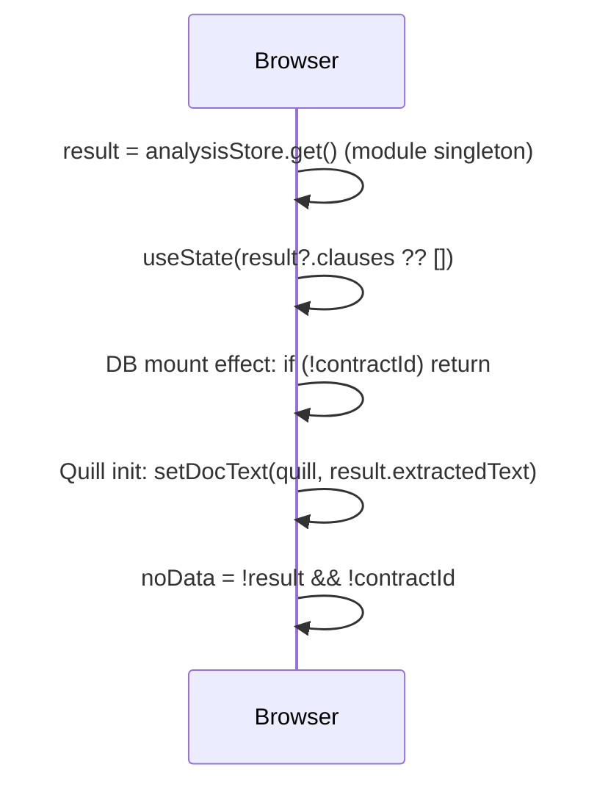
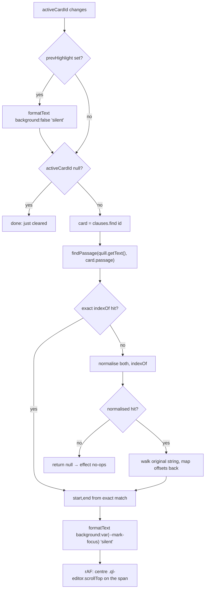

# C1 — The review screen: loading the document

_How `/review` gets its two halves — the clause list and the rich-text editor — onto the screen and keeps the editor persisted. Read [00-conventions](00-conventions.md) first; this file assumes the template._

Verified against `main` @ `bf4d660`.

**One screen, one component.** `src/app/review/page.tsx` (~1809 lines) is the whole surface: chrome bar, left rail, the Quill document pane, and the AI review panel. It runs in one of two data modes decided on mount — a DB re-open keyed by `?contractId=` (C1), or a one-shot in-memory hand-off from a just-finished analysis (C2). Everything in [C2-findings](c2-review-findings.md) and [C3-ai-and-output](c3-review-ai-and-output.md) operates on the state these three workflows set up.

| id | Workflow |
|----|----------|
| [C1](#c1) | Open a saved contract (`?contractId=`) — the DB path |
| [C2](#c2) | Open straight from a fresh analysis — the in-memory path |
| [C3](#c3) | Quill init + the debounced 2 s autosave |
| [C17](#c17) | Clause highlight + centre-scroll (`findPassage`) |

---

## <a id="c1"></a>C1 — Open a saved contract (`?contractId=`), the DB path

**0 · TL;DR** — With `?contractId=` in the URL, a mount effect fetches `GET /api/contracts/{id}` (contract + all its clauses) then `GET /api/contracts/{id}/chat`, splits the clauses by `status` (only `pending` and `dismissed` survive), sets `fixedCount` from `issues_fixed`, and hands the `quill_delta` (or `extracted_text`) to the editor — directly if Quill is mounted, otherwise via a ref the init effect drains.

**1 · Entry point** — `/review?contractId=<uuid>&file=<name>&type=<type>` (built by [B5](b-getting-a-contract-in.md#b5) / [B6](b-getting-a-contract-in.md#b6), or the dashboard "Open" link, [G-dashboard](g-dashboard-and-workspace.md)). The mount effect: `src/app/review/page.tsx:235-303`, gated on `if (!contractId) return;` (`:236`).

**2 · Preconditions** — Signed in: `GET /api/contracts/[id]` is **not** in [`GATED_COMPUTE_PATHS`](h1-auth-and-ownership.md#gate) (`src/proxy.ts:12-21`); the handler enforces auth itself — `currentUserId()` → `signInRequired()` (401) at `src/app/api/contracts/[id]/route.ts:10-11`, and the SELECT is scoped `where id = $1 and user_id = $2 and deleted_at is null` (`:18`). A `contractId` the user doesn't own → `404 { error: "Not found" }` (`:22`), which the client treats as "no contract" and silently leaves the screen empty (`page.tsx:241` `if (!contract) return;`).

**3 · Trace**

```
GET /api/contracts/{id} · auth: currentUserId · limit: none
  res  { contract: { id, name, contract_type, extracted_text, quill_delta,
                     risk_level, total_issues, issues_fixed, created_at,
                     risk_clauses: [ … ] } }
    ⚠ issues_dismissed is NOT in the SELECT list (route.ts:15-16)

GET /api/contracts/{id}/chat · auth: owns* · limit: none
  res  { messages: [{ id, role, content, created_at }] }
```

1. `page.tsx:238` — `fetch(\`/api/contracts/${contractId}\`)`, `.then(r => r.json())`, `.then(({ contract }) => …)`.
2. `contracts/[id]/route.ts:14-20` — `queryOne` SELECT on `contracts` (owner-scoped). The column list omits `issues_dismissed` (`:15-16`) — the review screen never sees a dismissed tally.
3. `contracts/[id]/route.ts:24-32` — a **second** `query` SELECTs every `risk_clauses` row for the contract (`id, type, clause, passage, issue, suggestion, refined_suggestion, status, source, sort_order, dismissed_reason, dismissed_at, replaced_at`), `order by sort_order` — **no `status` filter**; the client does the filtering.
4. `page.tsx:249-257` — `toClause` maps a DB row to the in-memory `RiskClause`; `suggestion` is taken as `c.refined_suggestion ?? c.suggestion` (`:255`), `source` defaults to `"ai"` (`:256`).
5. `page.tsx:262-267` — split by status: `all.filter(c => c.status === "pending")` → `setClauses` (`:265`); `.filter(c => c.status === "dismissed")` → `setDismissedClauses` (`:266`); **`replaced` rows are dropped entirely.** `setFixedCount(contract.issues_fixed ?? 0)` (`:267`).
6. `page.tsx:270-280` — nested `fetch(\`/api/contracts/${contractId}/chat\`)`; if `messages` is a non-empty array → `setChatHistory` (history restore, C10). Any failure is swallowed (`:280` `.catch(() => {})`).
7. `page.tsx:284-298` — build `dbContent = { delta: contract.quill_delta ?? undefined, text: contract.extracted_text ?? undefined }`. If `quillRef.current` exists: `quill.setContents(delta)` else `setDocText(quill, text)`, then `quill.history.clear()`. If Quill is **not** mounted yet: `pendingDbContent.current = dbContent` (`:297`) — the init effect drains it at `page.tsx:336-345` (see [C3](#c3)).
8. `page.tsx:301` — `.finally(() => setDbLoading(false))` clears the "Loading contract…" overlay (`:1224-1231`). `dbLoading` started `true` because `!!contractId && !result` (`:125`).

**4 · Database effects** — **Read-only.** Two SELECTs on the contract fetch (`contracts`, then `risk_clauses` — `contracts/[id]/route.ts:14,24`), one on the chat fetch (`chat_messages` — `contracts/[id]/chat/route.ts:17-22`). No transaction (none needed).

**6 · End state** — `clauses` = pending rows sorted by `sort_order`; `dismissedClauses` = dismissed rows; `fixedCount` = `contracts.issues_fixed`; `chatHistory` = saved turns; the editor holds `quill_delta` (the version with green fix highlights) or, if none was ever saved, the plain `extracted_text`. `dbLoading` false. The in-memory `analysisStore` is ignored on this path (`result` is null for a cold re-open).

**7 · Failure modes**

| Trigger | Behaviour | User sees | Survives |
|---------|-----------|-----------|----------|
| Guest / expired session | 401 from the handler; `contract` undefined | blank editor, empty panel, no error toast | nothing lost (read-only) |
| `contractId` not owned / deleted | 404; `page.tsx:241` `if (!contract) return;` | same silent-blank screen; `dbLoading` still cleared at `:301` | — |
| Contract fetch throws (network / 500) | `.catch` logs `"[review] fetch contract failed:"` (`:300`); `dbLoading` cleared | blank editor; stale in-memory state (if any) stays | — |
| Chat fetch fails | swallowed (`:280`); `chatHistory` stays `[]` | chat panel looks empty even though rows exist | rows still in DB, reappear next load |
| `quill_delta` present but corrupt JSON | `quill.setContents` throws inside the `.then`; caught by `:300` | editor shows placeholder text | DB row intact |
| Quill mounts *after* the fetch resolves | handled — `pendingDbContent.current` set at `:297`, drained at `:336-345` | brief flash of the Quill placeholder, then content | — |

**8 · Sequence diagram**

```mermaid
sequenceDiagram
  participant B as Browser
  participant API as Route handler
  participant CK as Clerk
  participant PG as Postgres (Neon)
  B->>API: GET /api/contracts/{id}
  API->>CK: auth()
  API->>PG: SELECT contracts WHERE id=$1 AND user_id=$2
  API->>PG: SELECT risk_clauses WHERE contract_id=$1 ORDER BY sort_order
  API-->>B: { contract, risk_clauses[] }
  B->>API: GET /api/contracts/{id}/chat
  API->>PG: SELECT chat_messages ORDER BY created_at
  API-->>B: { messages[] }
  B->>B: split clauses by status; setFixedCount(issues_fixed)
  B->>B: setContents(quill_delta) OR stash in pendingDbContent
```

**9 · Observability notes**
> **What you can see today.** `console.error("[review] fetch contract failed:", err)` on a contract-fetch throw (`page.tsx:300`). Nothing else — a clean load logs nothing, and the chat-fetch failure path is a bare `.catch(() => {})` (`:280`). Server-side, the handler's own `catch` returns `{ error: err.message }` 500 without logging (`contracts/[id]/route.ts:36`, an [H3](h3-error-taxonomy.md) LEAK).
> **What you can't.** How often a re-open lands on the silent-blank screen (404 / not-owned). Load latency (contract + clauses + chat is three serial round-trips). How many clauses / dismissed / chat turns a typical re-open carries. Whether `quill_delta` or the `extracted_text` fallback was used.
>
> | # | Blind spot | Class | Cheapest fix |
> |---|-----------|-------|--------------|
> | C1-O1 | Silent-blank re-open (404 / not-owned) indistinguishable from an empty contract | SILENT-CATCH | `console.warn("[review] no contract", { contractId })` at `page.tsx:241` — tier 0 |
> | C1-O2 | Review-load latency + payload shape unknown | NO-METRIC | one `console.info("[review] loaded", { clauses, dismissed, chat, usedDelta, ms })` before `setDbLoading(false)` — tier 0 |
> | C1-O3 | Chat-history restore failure swallowed | SILENT-CATCH | log in the `.catch` at `page.tsx:280` — tier 0 |
> | C1-O4 | Handler `catch` leaks the raw DB message, unlogged | LEAK + NO-LOG | `errorResponse(err, "contracts.get")` — tier 0 |

**10 · See also** — [B5](b-getting-a-contract-in.md#b5) (what wrote this row), [C2](#c2) (the sibling in-memory path), [C3](#c3) (the Quill hand-off), [H1](h1-auth-and-ownership.md#gate), [H6](h6-database-schema.md#tables).

---

## <a id="c2"></a>C2 — Open straight from a fresh analysis, the in-memory path

**0 · TL;DR** — Navigating to `/review` **without** `?contractId=` (or with one, but with a live `analysisStore` result) skips every fetch: the screen reads the module-singleton `analysisStore`, seeds `clauses` and the editor from it, and runs entirely client-side. A hard refresh wipes the singleton and the screen shows "No analysis data found."

**1 · Entry point** — `src/app/review/page.tsx:118-119` — `const memResult = analysisStore.get(); const result = memResult;`, read synchronously during render. `analysisStore` is `src/lib/analysis-store.ts:23-29` — a module-level `let _result` with `set` / `get` / `clear`. It is written by the `/analysis` save flow ([B5](b-getting-a-contract-in.md#b5), `analysis/page.tsx` after `POST /api/contracts` remaps the temp clause ids).

**2 · Preconditions** — `analysisStore` must hold a result — i.e. the user reached `/review` by client-side navigation from `/analysis` in the same tab, without a hard reload. No auth check on this path itself (the data is already in memory); any subsequent write still needs `contractId` + a session.

**3 · Trace**
1. `page.tsx:118-119` — `result = analysisStore.get()` (`{ extractedText, clauses }` or `null`).
2. `page.tsx:121` — `useState<RiskClause[]>(result?.clauses ?? [])` — the clause list is seeded from memory, not a fetch.
3. `page.tsx:125` — `dbLoading` initialises to `!!contractId && !result` — **false** on the pure in-memory path, so no loading overlay.
4. `page.tsx:235-236` — the DB mount effect still runs, but `if (!contractId) return;` bails immediately. (If both `contractId` **and** a fresh `result` are present, the effect *does* fetch and the DB response overwrites the in-memory clauses — the DB is authoritative when it is consulted at all.)
5. `page.tsx:343-345` — inside the Quill init effect, after `pendingDbContent` is found empty, `else if (result?.extractedText) setDocText(quill, result.extractedText)` seeds the editor from memory.
6. `page.tsx:649-651` — `liveText()` falls back to `result?.extractedText` if Quill isn't ready, so re-analyse / chat / refine have text even before the editor mounts.
7. `page.tsx:916` — `const noData = !result && !contractId;` — the "No analysis data found." empty state (`:1064-1072`) renders only when there is neither a memory result nor an id to fetch.

**4 · Database effects** — **None.** No fetch fires. Writes only begin once the user does something that needs `contractId` (Apply fix, Refine, chat-save…) — and on this path `contractId` is usually absent, so those writes are skipped too (`if (contractId)` guards throughout, e.g. `:188`, `:480`, `:565`, `:606`, `:675`, `:706`).

**6 · End state** — `clauses` and the editor are populated from `analysisStore`; `fixedCount` starts at 0; `chatHistory` starts `[]`. Nothing is persisted. A hard refresh re-imports the module → `_result` is `null` → `noData` true → empty state.

**7 · Failure modes**

| Trigger | Behaviour | User sees | Survives |
|---------|-----------|-----------|----------|
| Hard refresh of `/review` (no `contractId`) | `analysisStore.get()` → `null` | "No analysis data found." + "Back to dashboard" (`:1064-1072`) | nothing — the analysis is gone unless it was saved to a `contracts` row |
| Opened in a new tab (fresh module) | same as hard refresh | empty state | — |
| `contractId` present *and* stale `analysisStore` | DB fetch runs (C1) and replaces the in-memory clauses | correct DB state | — |
| Apply fix / Refine / Dismiss on this path | local state mutates; every `if (contractId)` write is skipped | UI updates, nothing saved | nothing — lost on navigation |

**8 · Sequence diagram**



**9 · Observability notes**
> **What you can see today.** Nothing — pure client state, no logs, no network.
> **What you can't.** How often users land on the empty state after a refresh (i.e. how often a just-finished analysis is lost because it was never saved). Whether the in-memory path or the DB path served a given `/review` open.
>
> | # | Blind spot | Class | Cheapest fix |
> |---|-----------|-------|--------------|
> | C2-O1 | "Analysis lost to refresh" is invisible | NO-METRIC | `console.info("[review] no-data empty state")` when `noData` renders — tier 0 |
> | C2-O2 | Can't tell in-memory vs DB open apart in any signal | NO-TRACE-CORRELATION | log `{ mode: contractId ? "db" : "memory" }` once on mount — tier 0 |

**10 · See also** — [B5](b-getting-a-contract-in.md#b5) (writes `analysisStore`), [C1](#c1) (the DB path that supersedes it), [C3](#c3) (the editor seed).

---

## <a id="c3"></a>C3 — Quill init + the debounced 2 s autosave

**0 · TL;DR** — A mount-once effect dynamic-`import()`s Quill, builds one editor with a fixed toolbar, seeds it (DB delta → in-memory text, in that order), and wires a `text-change` listener that — for user edits only — debounces 2 s and `PATCH`es the whole `quill_delta` to `/api/contracts/{id}`. This is the app's highest-frequency write.

**1 · Entry point** — `src/app/review/page.tsx:314-403` — `useEffect(() => { … }, [])` (empty deps; the `eslint-disable react-hooks/exhaustive-deps` at `:402` is deliberate). Mounts into `containerRef` (`<div ref={containerRef} className="quill-host …" />`, `:1223`).

**2 · Preconditions** — `containerRef.current` present (`:316`). For the autosave to fire: `searchParams.get("contractId")` non-null, re-read *inside* the debounce callback (`:357`) — so an in-memory-only session ([C2](#c2)) mounts the editor but never autosaves. The `PATCH` handler needs a session (`currentUserId()` → `signInRequired()`, `contracts/[id]/route.ts:43-44`) and is owner-scoped in SQL (`where … and user_id = $N`, `:70`). Not compute-gated, not rate-limited.

**3 · Trace**
1. `page.tsx:321` — `el.innerHTML = ""` — wipe any DOM left by a prior run (React StrictMode double-invokes effects in dev).
2. `page.tsx:323` — `import("quill").then(({ default: Quill }) => …)` — Quill is code-split, loaded on first review open.
3. `page.tsx:326` — `if (cancelled || !containerRef.current) return;` — the StrictMode guard: if cleanup (`:396-401`) already ran, the late-resolving promise bails instead of building a second toolbar.
4. `page.tsx:328-332` — `new Quill(containerRef.current, { theme: "snow", modules: { toolbar: QUILL_TOOLBAR }, placeholder: … })`. `QUILL_TOOLBAR` (`:59-65`): bold/italic/underline/strike, H1–H3, ordered/bullet list, link, clean.
5. `page.tsx:336-345` — seed, in priority order: `pendingDbContent.current.delta` → `setContents` (`:337-339`); else `pendingDbContent.current.text` → `setDocText` (`:340-342`); else `result?.extractedText` → `setDocText` (`:343-345`). Then `quill.history.clear()` (`:346`) so the seed isn't undoable.
6. `page.tsx:348` — `quillRef.current = quill`.
7. `page.tsx:352-366` — the autosave: `quill.on("text-change", (_delta, _old, source) => { … })`. `if (source !== "user") return;` (`:354`) — programmatic edits (Apply fix, restore, AI edit) do **not** trigger it. Otherwise `clearTimeout` + `setTimeout(…, 2000)` (`:355-356`); the callback re-reads `contractId` (`:357`), takes `quill.getContents()` (`:359`), and fires the network write.

```
PATCH /api/contracts/{cid} · auth: currentUserId · limit: none
  req  { quill_delta: <Delta> }
  res  { ok: true }
```

8. `contracts/[id]/route.ts:46-72` — the handler accepts only `name` / `quill_delta` / `issues_fixed`; `quill_delta` is stored `JSON.stringify`'d (`:60`); one `update contracts set quill_delta = $1 where id = $2 and user_id = $3` (`:68-72`). Fire-and-forget on the client — `.catch(err => console.error("[quill text-change] save delta failed:", err))` (`:364`), no response handling, no retry.
9. `page.tsx:369-393` — the same effect also wires `selection-change` → the floating selection toolbar (see [C12](c3-review-ai-and-output.md#c12)).
10. `page.tsx:396-401` — cleanup sets `cancelled = true`, nulls `quillRef` / `prevHighlight`, and clears the container DOM.

**`setDocText`** (`page.tsx:28-34`) picks the insertion strategy: `looksLikeMarkdown(text)` (`src/lib/markdown.ts:24-32` — ATX headings, `**bold**`, fenced code, or `-`/`*` bullet lists) → `quill.setContents(quill.clipboard.convert({ html: markdownToHtml(text) }))` (`markdown.ts:45-51`, `marked` with `gfm` + `breaks`); otherwise `quill.setText(stripPageSeparators(text))` (`markdown.ts:35-37` — strips LLMWhisperer's `<<<` page markers, collapses 3+ newlines). Generated / AI-edited drafts come in as Markdown; uploads come in as plain layout-preserving text.

**4 · Database effects** — `contracts.quill_delta` overwritten on each debounced save (`contracts/[id]/route.ts:68`), plus `updated_at` via the `contracts_updated_at` trigger ([H6](h6-database-schema.md#tables)). No `contract_versions` row — autosave is **not** snapshotted (only Apply-fix / AI-edit / manual save / restore snapshot; see [C13](c3-review-ai-and-output.md#c13)). No transaction. Last write wins — two tabs on the same contract silently clobber each other.

**6 · End state** — One live Quill instance in `quillRef.current`; `contracts.quill_delta` trails the editor by ≤ 2 s of idle time. On the next re-open, [C1](#c1) loads exactly this delta.

**7 · Failure modes**

| Trigger | Behaviour | User sees | Survives |
|---------|-----------|-----------|----------|
| `PATCH` fails (network / 500 / 401) | `console.error("[quill text-change] save delta failed:")` (`:364`); no toast, no retry | nothing — the editor looks saved | the DB keeps the *previous* delta; the last ≤ 2 s + everything since is lost on reload |
| User closes the tab within the 2 s debounce | timer never fires | — | edits since the last successful save are lost |
| Two tabs editing one contract | each debounce overwrites the whole delta | no conflict indicator | last writer wins; the other tab's edits vanish on its next reload |
| StrictMode double-mount (dev) | `cancelled` + `el.innerHTML=""` guards (`:321`, `:326`, `:396-401`) | single clean editor | — |
| `quill_delta` is huge (long contract, many highlights) | full jsonb blob sent every 2 s of typing | slight lag on very large docs | — |
| In-memory session (no `contractId`) | `:357` returns early | editor works, nothing persists | nothing ([C2](#c2)) |

**8 · Sequence diagram**

```mermaid
sequenceDiagram
  participant B as Browser
  participant API as Route handler
  participant CK as Clerk
  participant PG as Postgres (Neon)
  B->>B: import("quill") → new Quill(container)
  B->>B: seed: pendingDbContent.delta / .text / result.extractedText
  B->>B: quill.history.clear()
  B->>B: on text-change (source==="user") → debounce 2s
  B->>API: PATCH /api/contracts/{cid} { quill_delta }
  API->>CK: auth()
  API->>PG: UPDATE contracts SET quill_delta=$1 WHERE id=$2 AND user_id=$3
  API-->>B: { ok: true }   (response ignored; .catch only)
```

**9 · Observability notes**
> **What you can see today.** `console.error("[quill text-change] save delta failed:", err)` on a rejected `PATCH` (`page.tsx:364`). Nothing on success. The handler does not log; its `catch` returns the raw DB message 500 (`contracts/[id]/route.ts:75`).
> **What you can't.** Autosave frequency / volume / payload size. Save-failure rate (the `.catch` only `console.error`s, never counts). How often two-tab clobbering happens. Time-since-last-successful-save, so no "unsaved changes" signal is possible today. Whether a save 401'd (session expired mid-session) vs 500'd.
>
> | # | Blind spot | Class | Cheapest fix |
> |---|-----------|-------|--------------|
> | C3-O1 | Autosave failures only `console.error`, never surfaced or counted | THIN-LOG + NO-METRIC | on `.catch`, `setComputeError("Couldn't save — check your connection")` + `console.warn("[autosave] fail", { contractId, status })` — tier 0 |
> | C3-O2 | No success signal → can't measure save latency or "delta size over time" | NO-METRIC | `console.info("[autosave] ok", { bytes, ms })` in the `.then` — tier 0 |
> | C3-O3 | Concurrent-tab last-write-wins is silent and lossy | NO-METRIC | add an `updated_at` precondition to the `PATCH` and log a 409 — tier 2 |
> | C3-O4 | 401 (expired session) mid-edit looks identical to a network blip | THIN-LOG | branch on `res.status` in the `.catch` — tier 0 |

**10 · See also** — [C1](#c1) (loads the delta this writes), [C4](c2-review-findings.md#c4) (a programmatic edit that saves the delta *and* snapshots), [C13](c3-review-ai-and-output.md#c13) (version snapshots — autosave makes none), [H6](h6-database-schema.md#tables).

---

## <a id="c17"></a>C17 — Clause highlight + centre-scroll (`findPassage`)

**0 · TL;DR** — When `activeCardId` changes, an effect clears the previous highlight, locates the active clause's `passage` in the live editor text via `findPassage` (exact `indexOf`, then a whitespace-normalised re-scan), paints it yellow (`--mark-focus`), and scrolls the `.ql-editor` so the span sits vertically centred. Pure client — no network, no DB.

**1 · Entry point** — `src/app/review/page.tsx:406-449` — `useEffect(… , [activeCardId, clauses])`. `activeCardId` is set by clicking a card header (`:1455`), an action button (`:1631-1652`), or `openFindingForRule` from the Playbook tab ([C15](c3-review-ai-and-output.md#c15), `:830`).

**2 · Preconditions** — `quillRef.current` present (`:408`). `activeCardId` non-null and matching a card in `clauses` (`:421-424`). The clause's `passage` must be findable in the current editor text — if the AI paraphrased it, or the user has since edited that span, `findPassage` returns `null` and the effect no-ops (no highlight, no scroll, no error).

**3 · Trace** — pure client, no numbered network hops:
1. `page.tsx:411-419` — if `prevHighlight.current` is set, `quill.formatText(start, length, { background: false }, "silent")` clears it (`"silent"` = no `text-change` event, so no autosave).
2. `page.tsx:421` — `if (!activeCardId) return;` (a deselect just clears).
3. `page.tsx:423-424` — `clauses.find(c => c.id === activeCardId)`; bail if gone.
4. `page.tsx:426-427` — `text = quill.getText()`; `match = findPassage(text, card.passage)`.
5. `page.tsx:428` — `if (!match) return;` — the silent no-op.
6. `page.tsx:433-434` — `quill.formatText(match.start, match.end - match.start, { background: "var(--mark-focus)" }, "silent")`; remember it in `prevHighlight.current`.
7. `page.tsx:438-448` — in a `requestAnimationFrame`: find `.ql-editor` (the real `overflow:auto` scroll container — `scrollIntoView` would scroll the page instead), find the `[style*='background-color']` span, compute `spanOffsetTop = spanRect.top - editorRect.top + editorEl.scrollTop`, set `editorEl.scrollTop = spanOffsetTop - editorEl.clientHeight / 2 + spanRect.height / 2`.

**`findPassage(text, needle)`** (`page.tsx:71-105`):
- `text.indexOf(needle)` — exact hit → `{ start, end }` immediately (`:72-73`).
- else `normalise` both (`:67-69` — `replace(/\s+/g, " ").trim().toLowerCase()`), `indexOf` on the normalised strings (`:77`); `-1` → `return null` (`:78`).
- else walk the original string counting normalised characters to map the normalised start/end offsets back to raw offsets (`:80-104`), collapsing runs of whitespace to one position as it goes.

**4 · Database effects** — None.
**5 · External calls** — None.

**6 · End state** — At most one span in the editor carries `background: var(--mark-focus)`; `prevHighlight.current` points at it; the editor is scrolled so it's centred. A banner appears above the editor while `activeClause` is set (`:1210-1219`). The highlight is applied `"silent"` so it never autosaves and never lands in a version snapshot (contrast the green `--mark-applied` highlight from [C4](c2-review-findings.md#c4), which *is* a real user-visible edit that persists).

**7 · Failure modes**

| Trigger | Behaviour | User sees | Survives |
|---------|-----------|-----------|----------|
| `passage` not in the document (paraphrased / edited away) | `findPassage` → `null`; effect returns at `:428` | card opens, banner shows, but nothing highlights or scrolls | n/a (read-only) |
| `passage` occurs more than once | `indexOf` picks the **first** occurrence | highlights a possibly-wrong instance | n/a |
| Whitespace differs (OCR vs Quill) | the normalised re-scan recovers it; offsets may be ±1 char at word boundaries | highlight slightly over/under-reaches | n/a |
| Editor not yet scrollable (0-height during mount) | the `rAF` reads a zero rect; scroll is a no-op | highlight applied, no scroll | n/a |
| Rapid card switching | each run clears the prior highlight first (`:411-419`) | no highlight pile-up | n/a |

**8 · Sequence diagram** — pure client-side fallback logic, so `flowchart TD` (per [00-conventions](00-conventions.md), which names C17 explicitly):



**9 · Observability notes**
> **What you can see today.** Nothing. The no-match branch (`:428`) is a bare `return` — no log, no toast, no counter.
> **What you can't.** How often "open a finding" fails to highlight because the passage drifted out of the document — the single most useful signal for judging AI passage-copying accuracy and the impact of user edits. Whether a highlight landed on a duplicate occurrence.
>
> | # | Blind spot | Class | Cheapest fix |
> |---|-----------|-------|--------------|
> | C17-O1 | `findPassage` miss rate unknown (silent `return` at `:428`) | NO-METRIC | `console.info("[highlight] no match", { clauseId, passageLen })` before the return — tier 0 |
> | C17-O2 | Exact vs normalised-fallback hit ratio unknown — proxy for AI verbatim-copy quality | NO-METRIC | have `findPassage` return which branch matched; log it — tier 0 |
> | C17-O3 | Duplicate-occurrence highlights are invisible | NO-LOG | log when `text.indexOf(needle, exact + 1) !== -1` — tier 0 |

**10 · See also** — [C4](c2-review-findings.md#c4) (the *same* `findPassage`, used to place a real edit; its no-match path aborts loudly instead), [C15](c3-review-ai-and-output.md#c15) (`openFindingForRule` sets `activeCardId` from the Playbook tab).
