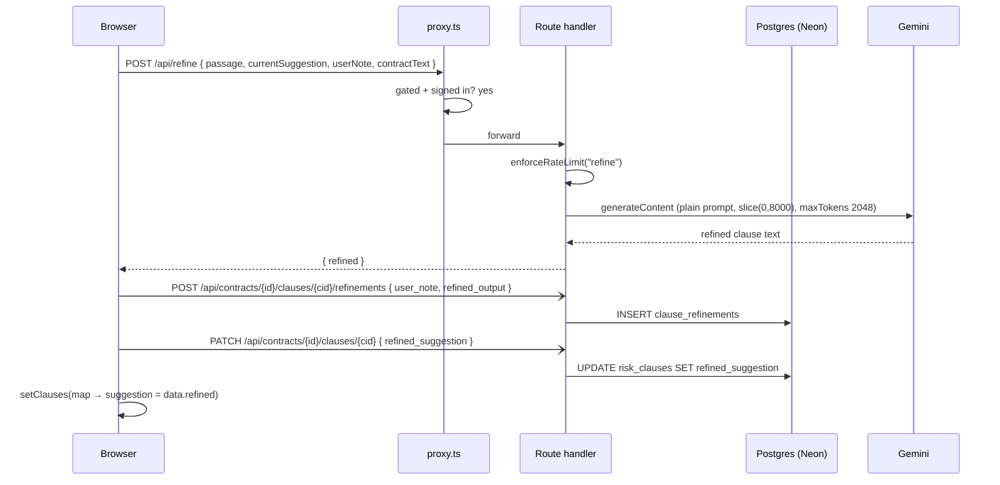
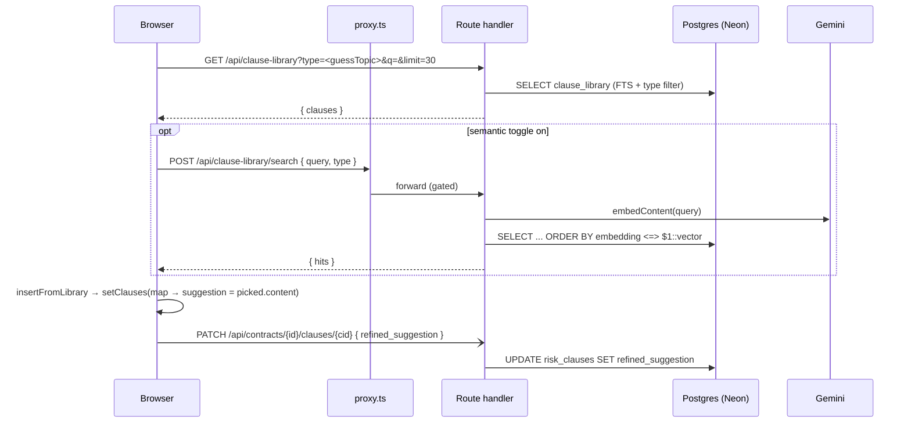
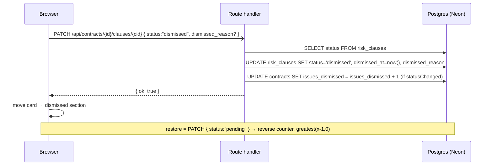
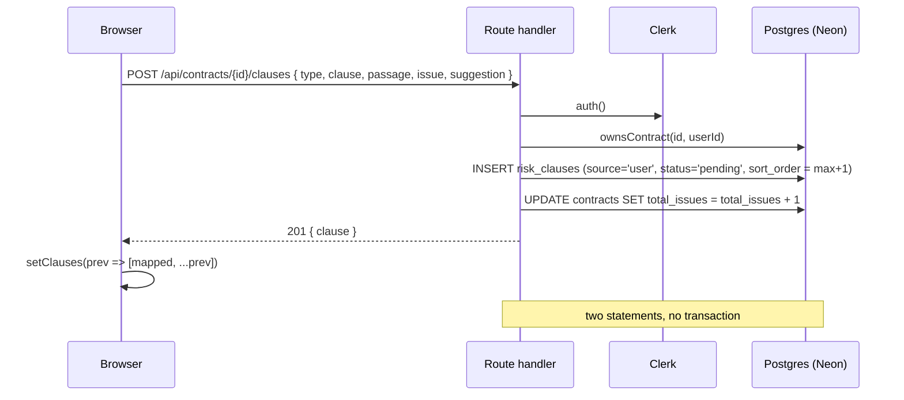

# C2 — The review screen: acting on a finding

_The clause-card actions in the AI review panel — apply, refine, swap in a library clause, bank to the library, dismiss, add a missed clause. Read [00-conventions](00-conventions.md) and [C1-review-document](c1-review-document.md) first._

Verified against `main` @ `bf4d660`.

**Every card action is optimistic and non-transactional.** The panel updates local React state first, then fires one or more `fetch`es — almost always fire-and-forget (`.catch(console.error)`, no response handling). When `contractId` is absent ([C2](c1-review-document.md#c2), in-memory mode) the network calls are skipped entirely and only local state moves. There is no transaction anywhere in this chapter — a card can leave the UI while its DB row is untouched, and it reappears on the next reload.

| id | Workflow |
|----|----------|
| [C4](#c4) | Apply fix (`handleReplace`) |
| [C5](#c5) | Refine a clause with a note |
| [C6](#c6) | Insert wording from the clause library |
| [C7](#c7) | Save a suggestion to the personal library |
| [C8](#c8) | Dismiss ("not an issue") + restore |
| [C9](#c9) | Add a clause the AI missed |

---

## <a id="c4"></a>C4 — Apply fix (`handleReplace`)

**0 · TL;DR** — "Apply fix" locates the flagged `passage` in the editor, replaces it with the suggested wording (green `--mark-applied` highlight), removes the card, bumps `fixedCount`, and fires three independent writes — the contract delta, the clause status, and a version snapshot. If the passage can't be found it aborts with a toast and marks **nothing** fixed.

**1 · Entry point** — `src/app/review/page.tsx:451` — `function handleReplace(card: RiskClause)`, wired to the always-visible "Apply fix" button on each card (`:1620-1627`).

**2 · Preconditions** — `quillRef.current` present (`:452-453`). Persistence needs `contractId` (`:480`) and a session (all three routes call `currentUserId()` → `signInRequired()`, and are `ownsContract`-gated except the contract `PATCH`, which is SQL-scoped `user_id = $N`). No rate limit, no compute gate. On the in-memory path the edit still happens in the editor; only the three `fetch`es are skipped.

**3 · Trace**
1. `page.tsx:455-456` — `text = quill.getText()`; `match = findPassage(text, card.passage)` (the same `findPassage` as [C17](c1-review-document.md#c17)).
2. `page.tsx:462-469` — **no-match abort** (the guarded fix for audit finding C1): if `!match`, `setComputeError("Couldn't locate this passage in the document to replace it automatically. Copy the suggested wording from the card and place it manually.")`, `setActiveCardId(card.id)` (so the wording is visible), and `return`. Nothing is marked fixed — the risky clause stays in the contract and the card stays in the list.
3. `page.tsx:472-473` — `quill.deleteText(match.start, length)` then `quill.insertText(match.start, card.suggestion, { background: "var(--mark-applied)" })`. `prevHighlight.current = null` (`:474`).
4. `page.tsx:476` — `delta = quill.getContents()`.
5. `page.tsx:481-485` — **fire-and-forget** `PATCH /api/contracts/{contractId}` with `{ quill_delta: delta }`. `.catch` only.

```
PATCH /api/contracts/{id} · auth: currentUserId · limit: none
  req  { quill_delta: <Delta> }            → UPDATE contracts SET quill_delta
```

6. `page.tsx:488-492` — **fire-and-forget** `PATCH /api/contracts/{contractId}/clauses/{card.id}` with `{ status: "replaced" }`. `.catch` only.

```
PATCH /api/contracts/{id}/clauses/{clauseId} · auth: owns* · limit: none
  req  { status: "replaced" }
  → SELECT current status; UPDATE risk_clauses SET status='replaced', replaced_at=now();
    if status actually changed → UPDATE contracts SET issues_fixed = issues_fixed + 1
```

7. `page.tsx:495-497` — optimistic local state: `setClauses(prev => prev.filter(c => c.id !== card.id))`, `setFixedCount(n => n + 1)`, `setActiveCardId(null)`.
8. `page.tsx:499` — `void snapshotVersion(\`Applied fix: ${card.clause}\`)` — **fire-and-forget** (unawaited `void`). `snapshotVersion` (`:504-517`) `await`s `POST /api/contracts/{contractId}/versions` with `{ quill_delta: quill.getContents(), snapshot_reason }`, then reloads the History tab if it's open.

```
POST /api/contracts/{id}/versions · auth: owns* · limit: none
  req  { quill_delta: <Delta>, snapshot_reason: "Applied fix: <clause>" }
  → INSERT contract_versions (contract_id, quill_delta, snapshot_reason, created_by)
```

**4 · Database effects** — three HTTP requests; on the server **four writes plus one read**, no transaction spanning any of them:

| Table | Column(s) | SQL `file:line` |
|-------|-----------|-----------------|
| `contracts` | `quill_delta` | `contracts/[id]/route.ts:68-72` |
| `risk_clauses` | `status='replaced'`, `replaced_at` | `contracts/[id]/clauses/[clauseId]/route.ts:44-46,63-67` |
| `contracts` | `issues_fixed = issues_fixed + 1` — **only when `statusChanged`** (`route.ts:41`, i.e. the row wasn't already `replaced`) | `contracts/[id]/clauses/[clauseId]/route.ts:69-74` |
| `contract_versions` | one new row | `contracts/[id]/versions/route.ts:46-50` |
| _(read)_ | `SELECT status FROM risk_clauses` — the change-detection read | `contracts/[id]/clauses/[clauseId]/route.ts:25-28` |

**No transaction.** Four round-trips (three fetches; the clause `PATCH` does two `UPDATE`s server-side). Any subset can fail independently.

**5 · External calls** — None. No LLM, no rate limit.

**6 · End state** — Editor: the passage is gone, the suggestion is in its place with a green highlight, saved to `contracts.quill_delta`. Panel: the card is gone, the "N applied" pill incremented. DB (if every write landed): `risk_clauses.status='replaced'`, `contracts.issues_fixed += 1`, one `contract_versions` row. On reload, [C1](c1-review-document.md#c1) drops `replaced` clauses, so the card stays gone and `fixedCount` comes from `issues_fixed`.

**7 · Failure modes**

| Trigger | HTTP / behaviour | User sees | Survives (the partial-write question) |
|---------|------------------|-----------|--------------------------------------|
| `passage` not in the document | no request; `:462-469` abort | toast: "Couldn't locate this passage…"; card stays, card opens | nothing changed — correct, this is the audit fix |
| Clause `PATCH` fails, delta `PATCH` succeeds | `console.error("[handleReplace] clause patch failed:")` (`:492`) | card gone, "N applied" incremented | clause still `pending` in DB, `issues_fixed` **not** bumped → card **reappears on reload**, `fixedCount` resets to the DB value |
| Delta `PATCH` fails, clause `PATCH` succeeds | `console.error("[handleReplace] contract patch failed:")` (`:485`) | card gone, edited text on screen | `quill_delta` in DB is stale (pre-edit) but `status='replaced'` → on reload the card is gone **and the fix is not in the document** |
| `snapshotVersion` fails | `console.error("[snapshotVersion] failed:")` (`:515`) | nothing | no `contract_versions` row → the History tab is missing this point; nothing else affected |
| Double-click "Apply fix" | second run: `findPassage` now misses (passage already replaced) → abort toast; but the first run already did `setFixedCount(n+1)` and server `statusChanged` is false on a re-`PATCH` | possibly a stray "+1" locally until reload | server `issues_fixed` bumped once (guarded by `statusChanged`); local `fixedCount` can over-count until reload |
| In-memory session (no `contractId`) | edit applied to Quill; all three fetches skipped | card gone, text edited | nothing persisted — lost on navigation |
| Session expired | contract `PATCH` 401 (SQL-scoped route), clause `PATCH` 401 | card gone locally | nothing persisted; silent |

**8 · Sequence diagram**

```mermaid
sequenceDiagram
  participant B as Browser
  participant API as Route handler
  participant CK as Clerk
  participant PG as Postgres (Neon)
  B->>B: findPassage(quill.getText(), card.passage)
  alt no match
    B->>B: setComputeError(...) ; setActiveCardId ; return
  else match
    B->>B: deleteText + insertText (background var(--mark-applied))
    B-)API: PATCH /api/contracts/{id} { quill_delta }
    API->>PG: UPDATE contracts SET quill_delta
    B-)API: PATCH /api/contracts/{id}/clauses/{cid} { status:"replaced" }
    API->>PG: SELECT status ; UPDATE risk_clauses ; UPDATE contracts issues_fixed+1
    B->>B: setClauses(filter) ; setFixedCount(n+1) ; setActiveCardId(null)
    B-)API: POST /api/contracts/{id}/versions { quill_delta, snapshot_reason }
    API->>PG: INSERT contract_versions
  end
```

**9 · Observability notes**
> **What you can see today.** Three client `console.error` strings on rejected fetches: `"[handleReplace] contract patch failed:"` (`:485`), `"[handleReplace] clause patch failed:"` (`:492`), `"[snapshotVersion] failed:"` (`:515`). None carry the contract id or clause id. Server handlers don't log; their `catch` returns the raw DB message 500. A fully successful Apply-fix logs nothing anywhere.
> **What you can't.** How often the three writes partially complete (the "card gone in UI, still `pending` in DB" state). The `findPassage` no-match abort rate for Apply-fix specifically — the strongest signal that the AI's `passage` field is unreliable. Apply-fix volume and the fixed:dismissed:added ratio. Whether a fix landed in `quill_delta` but not `status`, or vice-versa.
>
> | # | Blind spot | Class | Cheapest fix |
> |---|-----------|-------|--------------|
> | C4-O1 | Partial-write state (UI vs DB divergence) is invisible until the user reloads | NO-METRIC + SILENT-CATCH | `Promise.allSettled` the three writes; on any rejection `console.warn("[apply-fix] partial", { contractId, clauseId, which })` + a toast — tier 0/1 |
> | C4-O2 | Apply-fix no-match abort rate unknown | NO-METRIC | `console.info("[apply-fix] no-match", { clauseId })` at `:463` — tier 0 |
> | C4-O3 | No happy-path event → no Apply-fix volume, no fix/dismiss/add funnel | NO-LOG | `console.info("[apply-fix] ok", { contractId, clauseId })` after `:497` — tier 0 |
> | C4-O4 | The four writes share no correlation id | NO-TRACE-CORRELATION | send an `x-lexora-op-id` header on all three fetches — tier 1 |
> | C4-O5 | Client `console.error`s omit contract/clause id | THIN-LOG | interpolate ids into the three strings — tier 0 |

**10 · See also** — [C17](c1-review-document.md#c17) (`findPassage`), [C3](c1-review-document.md#c3) (the delta `PATCH` handler), [C13](c3-review-ai-and-output.md#c13) (`snapshotVersion` / History), [C8](#c8) (the counter logic in the clause `PATCH`), [H6](h6-database-schema.md#tables).

---

## <a id="c5"></a>C5 — Refine a clause with a note

**0 · TL;DR** — "Refine" opens a note box on the card; on submit the client `POST`s `/api/refine` with the passage, the current suggestion, the note, and the first 8 000 chars of the live document. On success it logs a `clause_refinements` row, `PATCH`es `refined_suggestion` onto the clause, and swaps the card's displayed `suggestion` for the refined text.

**1 · Entry point** — `src/app/review/page.tsx:653` — `async function handleRefine(card)`. Opened by the card's "Refine" button (`:1628-1638`, which sets `refiningId` + `activeCardId`); submitted from the inline textarea (Enter, `:1552-1556`) or its "Refine" button (`:1561-1569`). Guard: `if (!refineNote.trim()) return;` (`:654`).

**2 · Preconditions** — `POST /api/refine` is in [`GATED_COMPUTE_PATHS`](h1-auth-and-ownership.md#gate) (`src/proxy.ts:16`) — a signed-out POST 401s at the middleware. Rate-limited on the `refine` tier ([H2](h2-rate-limiting.md#tiers)). The handler itself does **no** ownership check (the passage/text are in the request body). The follow-up `clauses/[clauseId]` writes need `contractId` + `ownsContract`.

**3 · Trace**
1. `page.tsx:657-666` — `fetch("/api/refine", { POST, body: { passage: card.passage, currentSuggestion: card.suggestion, userNote: refineNote.trim(), contractText: liveText() } })`. `liveText()` (`:649-651`) = `quillRef.current.getText()` (fixes already applied are visible to the model).

```
POST /api/refine · auth: proxy-gated · limit: refine
  req  { passage, currentSuggestion, userNote, contractText }
  res  { refined }   |   4xx/5xx { error, message }   |   429 { retry_after, scope }
```

2. `refine/route.ts:8-9` — `enforceRateLimit(req, "refine")`.
3. `refine/route.ts:11-21` — parse; `400 "Missing required fields"` unless `passage && currentSuggestion && userNote`.
4. `refine/route.ts:23-39` — build the prompt: "senior commercial contracts attorney"; the passage, the current AI suggestion, the user's refinement request, and `CONTRACT CONTEXT (first 8000 chars): ${contractText.slice(0, 8000)}` (`:37`); "Return ONLY the replacement clause text".
5. `refine/route.ts:41` — `askLLM({ prompt, maxTokens: 2048 })` — **no `system`, no `messages`, no `responseSchema`** (plain-text completion). See [H5](h5-llm-layer.md#token-caps) / [H5](h5-llm-layer.md#max-chars).
6. `refine/route.ts:43` — `{ refined: refined.trim() }`. Errors → `errorResponse(err, "refine")` (`:45`, [H3](h3-error-taxonomy.md)).
7. `page.tsx:668` — `if (rateLimitNote(res, data)) return;` (429 → toast, `:224-230`).
8. `page.tsx:673-696` — on `data.refined`, and only `if (contractId)`:
   - `POST /api/contracts/{contractId}/clauses/{card.id}/refinements` with `{ user_note, refined_output: data.refined, was_applied: false }` — fire-and-forget (`:676-684`).
   - `PATCH /api/contracts/{contractId}/clauses/{card.id}` with `{ refined_suggestion: data.refined }` — fire-and-forget (`:687-691`).
   - `setClauses(prev => prev.map(c => c.id === card.id ? { ...c, suggestion: data.refined } : c))` (`:694-696`); clear `refiningId` / `refineNote`.

```
POST /api/contracts/{id}/clauses/{clauseId}/refinements · auth: owns* · limit: none
  req  { user_note, refined_output, was_applied: false }
  → INSERT clause_refinements (clause_id, user_note, refined_output, was_applied)

PATCH /api/contracts/{id}/clauses/{clauseId} · auth: owns* · limit: none
  req  { refined_suggestion }
  → UPDATE risk_clauses SET refined_suggestion = $1   (no status change, no counter move)
```

**4 · Database effects** — one `clause_refinements` INSERT (`.../refinements/route.ts:28-32`), one `risk_clauses.refined_suggestion` UPDATE (`.../clauses/[clauseId]/route.ts:39,63-67`). No `status` change → no counter movement (`statusChanged` is false, `route.ts:41`). No transaction; both are fire-and-forget. `/api/refine` itself writes nothing except the `rate_limits` upserts ([H2](h2-rate-limiting.md#tiers)).

**5 · External calls** — Gemini via `askLLM`, `maxTokens: 2048`, input context `contractText.slice(0, 8000)`, plain text (no schema). Model pin + retry policy: [H5](h5-llm-layer.md#pins). The refined text is **not** applied to the document — it only changes what the card *offers*; the user still has to hit "Apply fix" ([C4](#c4)).

**6 · End state** — The card now shows the refined wording (local `suggestion`), and `risk_clauses.refined_suggestion` holds it so [C1](c1-review-document.md#c1) will show `refined_suggestion ?? suggestion` on reload. A `clause_refinements` row records the note + output with `was_applied: false` (never updated to `true` anywhere — see the dead-note at the end of this file).

**7 · Failure modes**

| Trigger | HTTP / behaviour | User sees | Survives |
|---------|------------------|-----------|----------|
| Guest | 401 at middleware | `data.message` → "Couldn't refine that clause…" (`:670`) | nothing |
| Rate-limited | 429 | "Usage limit reached…try again in about N min" (`:224-230`) | nothing |
| Gemini busy / blocked / no output | `AppError` 503/422/502 via `errorResponse` | its `message` | nothing |
| `refined` returned, `refinements` POST fails | `console.error("[handleRefine] save refinement failed:")` (`:684`) | card shows refined wording | no audit row; `refined_suggestion` still saved if that `PATCH` landed |
| `refined` returned, `PATCH` fails | `console.error("[handleRefine] clause patch failed:")` (`:691`) | card shows refined wording | **not persisted** — reload reverts to the original `suggestion` |
| In-memory session (no `contractId`) | refine call runs; both follow-up writes skipped | card updates | lost on navigation |
| Contract > 8 000 chars | context silently truncated at `:37` | normal-looking refinement on partial context | the model never saw the tail |

**8 · Sequence diagram**



**9 · Observability notes**
> **What you can see today.** `console.error` from `errorResponse("refine", …)` on an unexpected throw; two client `console.error` strings on the follow-up writes (`:684`, `:691`). No log of a successful refine, the note text, context length, truncation, or how many attempts a user makes per clause.
> **What you can't.** Refine usage and its acceptance rate (how often a refined suggestion is then Applied — `was_applied` is written `false` and never updated, so even the DB can't answer). Latency. Truncation rate at 8 000 chars. Whether the audit row or the `refined_suggestion` write is the one that fails.
>
> | # | Blind spot | Class | Cheapest fix |
> |---|-----------|-------|--------------|
> | C5-O1 | No successful-refine event (count, ms, contextLen, truncated?) | NO-LOG | `console.info("[refine] ok", { chars, truncated, ms })` in the route — tier 0 |
> | C5-O2 | `was_applied` is dead → refine→apply acceptance is unmeasurable | NO-METRIC | set `was_applied: true` from `handleReplace` when the applied text equals a logged refinement, or drop the column — tier 1 |
> | C5-O3 | Which follow-up write failed is only in a generic client string | THIN-LOG | include `{ contractId, clauseId }` in `:684` / `:691` — tier 0 |
> | C5-O4 | 8 000-char truncation silent | NO-LOG | log when `contractText.length > 8000` — tier 0 |

**10 · See also** — [C12](c3-review-ai-and-output.md#c12) (selection-toolbar refine — same `/api/refine`, different call site), [C4](#c4) (applying the refined wording), [H5](h5-llm-layer.md), the dead-note below (the write-only refinement log).

---

## <a id="c6"></a>C6 — Insert wording from the clause library

**0 · TL;DR** — The card's "Library" button opens `<ClausePicker>`; picking a clause swaps that card's `suggestion` for the library clause's `content` locally, and — if the contract is saved — `PATCH`es it onto the clause as `refined_suggestion`. The user still has to hit "Apply fix" to put it in the document.

**1 · Entry point** — `src/app/review/page.tsx:1639-1646` — the "Library" button sets `activeCardId` + `pickerCardId`. One `<ClausePicker>` is mounted for the whole panel (`:1787-1797`), keyed by `pickerCardId`; on pick it calls `insertFromLibrary(card, picked)` (`:186-196`).

**2 · Preconditions** — Signed in for the picker's own fetches (`/api/clause-library` list is `currentUserId`-scoped; `/api/clause-library/search` is [gated](h1-auth-and-ownership.md#gate) + on the `clause-search` tier). The `refined_suggestion` `PATCH` only fires `if (contractId)` (`:188`) and is `ownsContract`-gated.

**3 · Trace**
1. `page.tsx:1793` — `<ClausePicker clauseTypeHint={card ? guessTopic(card.clause) : undefined} …>` — the topic hint is derived from the card's clause title by the regex table in `guessTopic` (`src/lib/clause-taxonomy.ts:93-99`).
2. `clause-picker.tsx:41-64` — `load()`, debounced 200 ms (`:66-71`):
   - **semantic toggle on + a query** → `POST /api/clause-library/search { query, type }` → `data.hits` (`:44-52`).
   - otherwise → `GET /api/clause-library?type=<hint>&q=<query>&limit=30` → `data.clauses` (`:54-60`).
3. `clause-picker.tsx:115-132` — the result list; clicking a row → `onPick(r)` + `onClose()`.
4. `page.tsx:186-196` — `insertFromLibrary(card, picked)`:
   - `setClauses(prev => prev.map(c => c.id === card.id ? { ...c, suggestion: picked.content } : c))` (`:187`).
   - `if (contractId)` → fire-and-forget `PATCH /api/contracts/{contractId}/clauses/{card.id}` with `{ refined_suggestion: picked.content }` (`:189-193`).
   - `setComputeError(\`Inserted "${picked.title}" — review it, then Apply fix.\`)` (`:195`).

```
PATCH /api/contracts/{id}/clauses/{clauseId} · auth: owns* · limit: none
  req  { refined_suggestion }
  → UPDATE risk_clauses SET refined_suggestion   (no status change)
```

**4 · Database effects** — at most one `risk_clauses.refined_suggestion` UPDATE (`.../clauses/[clauseId]/route.ts:39,63-67`). No counter movement. No `clause_refinements` row (unlike [C5](#c5)). The picker's own calls are reads (or, for semantic search, an embed + read — [H4](h4-rag-pipeline.md)).

**5 · External calls** — Only if the user flips the semantic toggle: `POST /api/clause-library/search` embeds the query with Gemini. Lexical search is plain Postgres FTS.

**6 · End state** — The card offers the library wording; `risk_clauses.refined_suggestion` holds it (so [C1](c1-review-document.md#c1) shows it on reload). The document is unchanged until "Apply fix".

**7 · Failure modes**

| Trigger | Behaviour | User sees | Survives |
|---------|-----------|-----------|----------|
| `PATCH` fails | `console.error("[insertFromLibrary] clause patch failed:")` (`:193`) | card shows the library wording | not persisted — reload reverts |
| In-memory session | swap happens locally; `PATCH` skipped | card updates | lost on navigation |
| Semantic search 401 / 429 | picker shows "No clauses found." (errors swallowed in `load`) | empty picker | n/a |
| `guessTopic` mis-classifies the title | picker pre-filters to the wrong topic | fewer / wrong results until the user clears the filter | n/a — `guessTopic` only pre-fills a filter |
| User's own library clauses | never embedded ([H6](h6-database-schema.md#tables)) → invisible to the semantic toggle | own clauses only appear under lexical search | n/a |

**8 · Sequence diagram**



**9 · Observability notes**
> **What you can see today.** `console.error("[insertFromLibrary] clause patch failed:")` (`page.tsx:193`). Nothing else — no log of which clause was picked, from which search mode, or whether it was then Applied.
> **What you can't.** Library-insert usage. Lexical vs semantic pick ratio. Whether an inserted clause is subsequently Applied (same `was_applied` gap as [C5](#c5), except here no `clause_refinements` row is even written).
>
> | # | Blind spot | Class | Cheapest fix |
> |---|-----------|-------|--------------|
> | C6-O1 | Library-insert usage + search-mode split unknown | NO-METRIC | `console.info("[library-insert]", { clauseId, pickedId, semantic })` in `insertFromLibrary` — tier 0 |
> | C6-O2 | No `clause_refinements` row → the insert leaves no audit trail at all | NO-LOG | write a `clause_refinements` row with a `user_note` of `"library: <title>"` — tier 1 |

**10 · See also** — [D3](d-clause-library.md#d3) (the clause library + its search), [C7](#c7) (the reverse direction), [C15](c3-review-ai-and-output.md#c15) (`insertPreferredClause` — a *different* library-to-document path that appends and applies immediately), [H4](h4-rag-pipeline.md).

---

## <a id="c7"></a>C7 — Save a suggestion to the personal library

**0 · TL;DR** — "Save to library" (next to Copy on an expanded card) `POST`s the card's clause title + current suggestion to `/api/clause-library/from-suggestion`, which creates an owned `clause_library` row with `source='imported'` and `clause_type = guessTopic(card.clause)`. The clause is stored but **never embedded**, so it won't show up in semantic search.

**1 · Entry point** — `src/app/review/page.tsx:1506-1513` — the "Save to library" button (`disabled` once `savedClauseIds.has(card.id)`), calling `saveToLibrary(card)` (`:199-222`).

**2 · Preconditions** — `contractId` set — otherwise `setComputeError("Save the contract first, then you can add its clauses to your library.")` and bail (`:200-203`). Signed in; the route calls `currentUserId()` → `signInRequired()` and `ownsContract(contractId, userId)` (`from-suggestion/route.ts:10-11,32`). Not compute-gated, not rate-limited — plain Postgres, no Gemini.

**3 · Trace**
1. `page.tsx:205-215` — `fetch("/api/clause-library/from-suggestion", { POST, body: { contractId, title: card.clause, content: card.suggestion, clause_type: guessTopic(card.clause), reference: card.reference ?? null } })`.

```
POST /api/clause-library/from-suggestion · auth: owns* · limit: none
  req  { contractId, title, content, clause_type, reference? }
  res  201 { clause }   |   4xx { error }
```

2. `from-suggestion/route.ts:20-31` — trim + validate; `400` unless `contractId && title && content`.
3. `from-suggestion/route.ts:32-34` — `ownsContract(contractId, userId)` → `404` if not.
4. `from-suggestion/route.ts:37-43` — `saveFromSuggestion(userId, { title, content, clause_type: isKnownTopic(clause_type) ? clause_type : "sonstiges", reference, summary: null })`.
5. `src/lib/clause-library.ts:308-321` — `saveFromSuggestion` → `createClause(userId, { …, source: "imported" })`. **No embedding step** — `embedding` / `embedded_at` stay null.
6. `page.tsx:216-218` — on `res.ok`: `setSavedClauseIds(prev => new Set(prev).add(card.id))`, `setComputeError("Saved to your clause library.")`. Non-ok → `setComputeError((await res.json()).error ?? "Save failed")` (`:216`, `:220`).

**4 · Database effects** — one `clause_library` INSERT, owned by the caller, `source='imported'`, `posture='preferred'` (the `createClause` default), `is_approved=false`, `embedding` null. No transaction (single statement).

**5 · External calls** — **None.**

**6 · End state** — A new owned library clause, visible under `/clauses` and in the lexical side of `<ClausePicker>` ([C6](#c6)). ⚠ Because it is never embedded, it is **absent from `/api/clause-library/search`** (the semantic toggle) — [H6](h6-database-schema.md#tables) notes user rows are never embedded. The button stays disabled for the session (`savedClauseIds`), but that set is not persisted — a reload re-enables it and a second save creates a duplicate row.

**7 · Failure modes**

| Trigger | Behaviour | User sees | Survives |
|---------|-----------|-----------|----------|
| No `contractId` | early return (`:200-203`) | "Save the contract first…" toast | nothing |
| Not owner / bad id | `404` | the route's `error` string in a toast | nothing |
| Missing title/content | `400 "contractId, title and content are required"` | that string | nothing |
| Save succeeds | `201` | "Saved to your clause library." | the row — but never embedded |
| Save again after reload | `savedClauseIds` reset → button live again → second row | no warning | **duplicate `clause_library` rows** |
| `saveFromSuggestion` throws | `500 { error: <raw DB msg> }` ([H3](h3-error-taxonomy.md) LEAK) | raw message toast | nothing |

**8 · Sequence diagram**

```mermaid
sequenceDiagram
  participant B as Browser
  participant API as Route handler
  participant CK as Clerk
  participant PG as Postgres (Neon)
  B->>API: POST /api/clause-library/from-suggestion { contractId, title, content, clause_type }
  API->>CK: auth()
  API->>PG: ownsContract(contractId, userId)
  API->>PG: INSERT clause_library (source='imported', embedding NULL)
  API-->>B: 201 { clause }
  B->>B: savedClauseIds.add(card.id) ; toast "Saved…"
```

**9 · Observability notes**
> **What you can see today.** Nothing on success. On failure, the route's `catch` returns the raw DB message; the client shows it in the toast. No log of a save.
> **What you can't.** How many suggestions get banked, and of what topic. The duplicate-on-reload rate. That imported clauses are silently missing from semantic search (no log flags the skipped embed).
>
> | # | Blind spot | Class | Cheapest fix |
> |---|-----------|-------|--------------|
> | C7-O1 | Bank-to-library usage uncounted | NO-METRIC | `console.info("[library-save]", { userId, clause_type })` in the route — tier 0 |
> | C7-O2 | Imported clauses never embedded, and nothing says so | SILENT-CATCH | log `{ event: "clause_saved_unembedded", id }` in `saveFromSuggestion`; or enqueue an embed — tier 0 / tier 2 |
> | C7-O3 | Duplicate rows from re-saving after reload | NO-METRIC | dedupe on `(user_id, title, content)` or persist `savedClauseIds` — tier 1 |
> | C7-O4 | Raw DB error leaked, unlogged | LEAK + NO-LOG | `errorResponse(err, "clause-library.from-suggestion")` — tier 0 |

**10 · See also** — [C6](#c6) (the reverse), [D5](d-clause-library.md#d5) (the library + why `is_approved` matters for RDG), [H6](h6-database-schema.md#tables).

---

## <a id="c8"></a>C8 — Dismiss ("not an issue") + restore

**0 · TL;DR** — "Dismiss" `PATCH`es the clause to `status='dismissed'` (with an optional reason), moves the card to the collapsed "dismissed" section, and — server-side — bumps `contracts.issues_dismissed`. "Restore" `PATCH`es it back to `pending` and reverses whichever counter the old status had bumped, floored at 0.

**1 · Entry point** — `src/app/review/page.tsx:564` `handleDismiss(card, reason)` (from the card's "Dismiss" button → inline reason input, `:1647-1658` / `:1581-1612`); `:580` `handleRestore(card)` (from the "Restore" button in the dismissed list, `:1700-1708`).

**2 · Preconditions** — `contractId` for the write (`:565`, `:581`); `ownsContract`-gated. Guests / in-memory sessions mutate local state only.

**3 · Trace — dismiss**
1. `page.tsx:566-570` — fire-and-forget `PATCH /api/contracts/{contractId}/clauses/{card.id}` with `{ status: "dismissed", dismissed_reason: reason || undefined }`.
2. `page.tsx:572-576` — local: `setClauses(filter out)`, `setDismissedClauses(prev => [card, ...])`, clear `dismissingId` / `dismissReason`, and `setActiveCardId(null)` if it was active.
3. `contracts/[id]/clauses/[clauseId]/route.ts:25-28` — `SELECT status` (change detection).
4. `route.ts:43-53` — `add("status", "dismissed")`, `addRaw("dismissed_at = now()")`, and `add("dismissed_reason", …)` when provided.
5. `route.ts:63-67` — one `UPDATE risk_clauses SET …`.
6. `route.ts:69,75-79` — `if (statusChanged && body.status === "dismissed")` → `UPDATE contracts SET issues_dismissed = issues_dismissed + 1`.

**Trace — restore (un-dismiss)**
1. `page.tsx:582-586` — fire-and-forget `PATCH … { status: "pending" }`.
2. `page.tsx:588-589` — local: `setDismissedClauses(filter out)`, `setClauses(prev => [...filtered, card])` (appended to the end).
3. `route.ts:50-53` — `add("status", "pending")`, `addRaw("dismissed_at = null")`, `addRaw("dismissed_reason = null")`.
4. `route.ts:80-93` — `if (statusChanged && body.status === "pending")`: if `current.status === "dismissed"` → `UPDATE contracts SET issues_dismissed = greatest(issues_dismissed - 1, 0)`; if `current.status === "replaced"` → `greatest(issues_fixed - 1, 0)`.

```
PATCH /api/contracts/{id}/clauses/{clauseId} · auth: owns* · limit: none
  req  { status: "dismissed", dismissed_reason? }   → issues_dismissed += 1
  req  { status: "pending" }                        → reverse the prior counter, floored at 0
```

**4 · Database effects** — `risk_clauses` (`status`, `dismissed_at`, `dismissed_reason`) + one `contracts` counter `UPDATE`, guarded by `statusChanged` (`route.ts:41`). No transaction between the two `UPDATE`s. ⚠ `issues_dismissed` is **not** in `GET /api/contracts/[id]`'s SELECT ([C1](c1-review-document.md#c1)), so the review screen's dismissed count comes purely from the number of `status='dismissed'` rows it received, never from the counter — the counter is effectively write-only for this screen.

**5 · External calls** — None.

**6 · End state** — The card is in the collapsed "N dismissed issues" section (`:1666-1714`); on reload [C1](c1-review-document.md#c1) puts it back there (dismissed rows *are* returned). Restore returns it to the active list. `contracts.issues_dismissed` tracks net dismissals (floored at 0), invisible on this screen but readable elsewhere.

**7 · Failure modes**

| Trigger | Behaviour | User sees | Survives |
|---------|-----------|-----------|----------|
| `PATCH` fails | `console.error("[handleDismiss]" / "[handleRestore] clause patch failed:")` (`:570` / `:586`) | card moves section | DB unchanged → on reload the card is back where it was; `issues_dismissed` not moved |
| Dismiss then restore, both writes fail | local ping-pong works | correct-looking UI | DB never changed — consistent, just not persisted |
| Restore a `replaced` clause (only reachable if it were somehow shown) | `route.ts:87-91` reverses `issues_fixed` instead | — | counter logic is symmetric |
| Double-dismiss (already `dismissed`) | `statusChanged` false → no counter bump | — | `issues_dismissed` correct (not double-counted) |
| In-memory session | local only | works | lost on navigation |

**8 · Sequence diagram**



**9 · Observability notes**
> **What you can see today.** Two client `console.error` strings on rejected `PATCH`es. Nothing server-side. `dismissed_reason` is stored but never read by any screen or query.
> **What you can't.** Dismissal rate — the primary false-positive signal for the analysis prompt. The reasons users give (the text is in the DB, unqueried). How often a dismiss doesn't persist. Whether `issues_dismissed` has drifted from the row count (the two are written by different statements with no transaction).
>
> | # | Blind spot | Class | Cheapest fix |
> |---|-----------|-------|--------------|
> | C8-O1 | Dismissal rate + reasons unsurfaced (the false-positive KPI) | NO-METRIC | `console.info("[dismiss]", { contractId, clauseId, hasReason })` in the route; a periodic reason digest — tier 0 / tier 2 |
> | C8-O2 | `issues_dismissed` counter vs `status='dismissed'` row count can silently diverge | NO-METRIC | a reconciliation query, or fold the counter update into a transaction with the row update — tier 2 |
> | C8-O3 | Non-persisting dismiss only `console.error`s | THIN-LOG | id-tag the strings; toast on failure — tier 0 |

**10 · See also** — [C4](#c4) (the same `PATCH` handler, `status='replaced'` branch), [C14](c3-review-ai-and-output.md#c14) (re-analyse deletes only `pending` rows — dismissed clauses survive it, but `issues_dismissed` is **not** reset), [H6](h6-database-schema.md#tables).

---

## <a id="c9"></a>C9 — Add a clause the AI missed

**0 · TL;DR** — "Add issue" opens a 5-field form; on submit the client `POST`s `/api/contracts/{id}/clauses`, which inserts a `source='user'`, `status='pending'` clause with `sort_order = max+1` and bumps `contracts.total_issues`. The new card is prepended to the list.

**1 · Entry point** — `src/app/review/page.tsx:593` `async function handleAddIssue()`. Form toggled by the "Add issue" button in the panel head (`:1347-1354`); fields at `:1362-1423` (passage, clause title, risk level, issue, suggestion). Submit guard: all four text fields non-empty (`:602`, mirrored by the button's `disabled`, `:1405-1409`).

**2 · Preconditions** — `contractId` → the DB branch (`:606`); otherwise a local-only clause with id `user-<Date.now()>` (`:631-639`). The route calls `currentUserId()` → `signInRequired()` and `ownsContract(id, userId)` (`clauses/route.ts:33-37`). Not compute-gated, not rate-limited.

**3 · Trace**
1. `page.tsx:595-601` — build `payload = { type, clause, passage, issue, suggestion }` (all `.trim()`ed).
2. `page.tsx:607-611` — `POST /api/contracts/{contractId}/clauses` with `payload`.

```
POST /api/contracts/{id}/clauses · auth: owns* · limit: none
  req  { type: "high"|"medium"|"low", clause, passage, issue, suggestion }
  res  201 { clause: { id, type, clause, passage, issue, suggestion, refined_suggestion, status, source, sort_order } }
```

3. `clauses/route.ts:47-58` — trim + validate; `400 "Missing required fields"` unless `type ∈ {high,medium,low}` and all four strings present.
4. `clauses/route.ts:66-75` — `INSERT INTO risk_clauses (contract_id, type, clause, passage, issue, suggestion, status, source, sort_order) VALUES ($1..$6, 'pending', 'user', (select coalesce(max(sort_order), -1) + 1 from risk_clauses where contract_id = $1))` — `sort_order` from a correlated sub-select so the new clause lands last (`:70`).
5. `clauses/route.ts:81-84` — `UPDATE contracts SET total_issues = total_issues + 1 WHERE id = $1`.
6. `clauses/route.ts:86` — `201 { clause: row }`.
7. `page.tsx:612-616` — `if (!res.ok || !data.clause)` → `setComputeError(data.message ?? "Couldn't add the issue…")` and bail.
8. `page.tsx:621-629` — `setClauses(prev => [{ …mapped, suggestion: c.refined_suggestion ?? c.suggestion, source: "user" }, ...prev])`; reset the form, close it (`:641-642`).

**4 · Database effects** — one `risk_clauses` INSERT (`source='user'`, `status='pending'`) + one `contracts.total_issues += 1` UPDATE. Two statements, **no transaction** — a failure between them would leave `total_issues` un-incremented (the row is what matters; the counter is cosmetic). See [H6](h6-database-schema.md#tables).

**5 · External calls** — **None** — no AI is involved in a user-added clause.

**6 · End state** — A new pending clause at the top of the panel, tagged "Added by you" (`:1464-1468`), last in `sort_order`. It behaves exactly like an AI clause for [C4](#c4)/[C5](#c5)/[C8](#c8). ⚠ `total_issues` grows but is never decremented on dismiss or reset except by re-analyse ([C14](c3-review-ai-and-output.md#c14)).

**7 · Failure modes**

| Trigger | Behaviour | User sees | Survives |
|---------|-----------|-----------|----------|
| Any required field blank | `handleAddIssue` returns at `:602`; button also `disabled` | form stays open | nothing |
| `POST` non-ok | `setComputeError(data.message ?? …)` (`:614`) | error toast, form stays | nothing |
| INSERT ok, `total_issues` UPDATE fails | route `catch` → `500 { error }` | error toast; but the row may already exist | ⚠ orphan-ish: a `pending` clause with `total_issues` not counting it |
| In-memory session | local clause with `user-<ts>` id (`:631-639`) | card appears | lost on navigation; can't be `PATCH`ed later (404) |
| Passage the user types isn't in the document | clause is created fine; later "Apply fix" hits the [C4](#c4) no-match abort | card works, Apply-fix toasts instead | row persists |

**8 · Sequence diagram**



**9 · Observability notes**
> **What you can see today.** Nothing on success. On failure the client shows `data.message`; the route's `catch` returns the raw DB message 500, unlogged.
> **What you can't.** How often reviewers add missed clauses (a direct signal that the analysis under-flags), and of what risk level / topic. The INSERT-ok-counter-fail split.
>
> | # | Blind spot | Class | Cheapest fix |
> |---|-----------|-------|--------------|
> | C9-O1 | "AI missed this" additions uncounted — the under-flagging KPI | NO-METRIC | `console.info("[clause-add]", { contractId, type, topic: guessTopic(clause) })` in the route — tier 0 |
> | C9-O2 | Non-transactional insert + counter can diverge | NO-METRIC | wrap both in a transaction — tier 1 |
> | C9-O3 | Raw DB error leaked, unlogged | LEAK + NO-LOG | `errorResponse(err, "contracts.clauses.create")` — tier 0 |

**10 · See also** — [B5](b-getting-a-contract-in.md#b5) (the original bulk clause insert this mirrors), [C4](#c4) (applying a user clause), [C14](c3-review-ai-and-output.md#c14) (re-analyse resets `total_issues` and deletes pending user clauses along with AI ones), [H6](h6-database-schema.md#tables).

---

## ⚠ Dead / write-only paths touched by this chapter

**The refinement log is write-only.** [C5](#c5) writes `clause_refinements` rows via `POST /api/contracts/[id]/clauses/[clauseId]/refinements` (`src/app/api/contracts/[id]/clauses/[clauseId]/refinements/route.ts` — POST only, no GET). A second route, `src/app/api/clauses/[clauseId]/refinements/route.ts`, *does* expose a `GET` (list all attempts) and a `POST`, but **nothing in `src/` calls either** — `grep -rn "refinements" src` returns only the review-screen `POST` at `page.tsx:676`. So every refinement attempt is recorded and never read back, and `was_applied` is always the literal `false` the client sends ([C5](#c5) §3). Deleting the dead route and the `was_applied` column, or wiring a "refinement history" panel, would resolve the ambiguity. ([H6](h6-database-schema.md#tables) also flags this table as read-by-nothing.)

**`issues_dismissed` is invisible to the review screen.** [C8](#c8) maintains the counter server-side, but `GET /api/contracts/[id]` never selects it (`.../[id]/route.ts:15-16`), so the screen's "N dismissed" is a row count, not the counter. The two are written by separate, un-transactioned statements and can drift.
