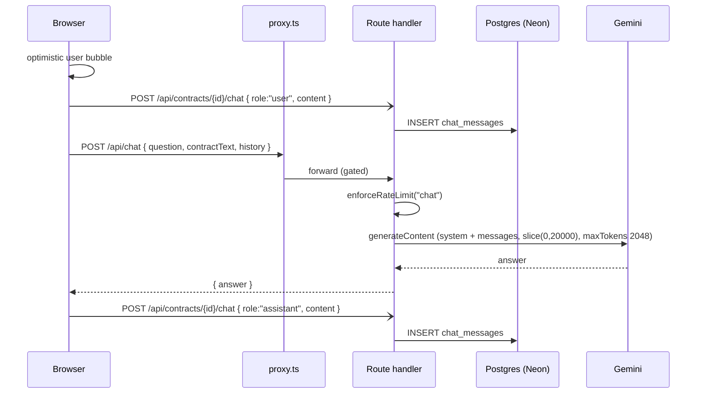
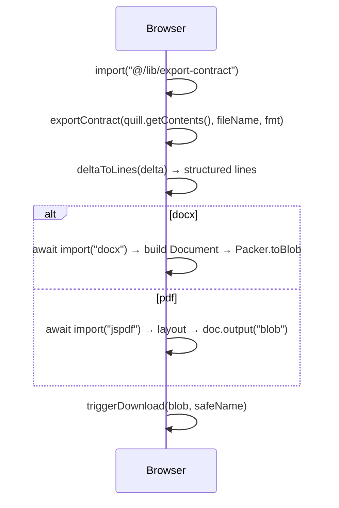

# C3 — The review screen: AI panel, playbook, history, export

_Contract chat, whole-document AI edits, the selection toolbar, version history, re-analyse, the Playbook tab, and client-side export. Read [00-conventions](00-conventions.md), [C1-review-document](c1-review-document.md) and [C2-review-findings](c2-review-findings.md) first._

Verified against `main` @ `bf4d660`.

**Two AI modes, decided by `?mode=create`.** `isCreateMode` (`src/app/review/page.tsx:113`) splits the composer: a generated contract (`&mode=create`) routes chat input to `/api/contract-edit` (rewrite the whole document); everything else routes to `/api/chat` (answer a question). The Playbook tab and re-analyse share `/api/contracts/[id]/reanalyse` with [B3](b-getting-a-contract-in.md#b3)/[B4](b-getting-a-contract-in.md#b4)'s analysis internals. Export is entirely client-side.

| id | Workflow |
|----|----------|
| [C10](#c10) | Contract chat (Q&A) + history persistence |
| [C11](#c11) | Create-mode AI edit (whole-document rewrite) |
| [C12](#c12) | Selection toolbar → refine selected text |
| [C13](#c13) | Version snapshot, history list, restore |
| [C14](#c14) | Re-analyse (± playbook) |
| [C15](#c15) | Playbook tab: coverage, verdict chips, open a finding, insert preferred clause |
| [C16](#c16) | Export DOCX / PDF (client-side, lazy) |

---

## <a id="c10"></a>C10 — Contract chat (Q&A) + history persistence

**0 · TL;DR** — In non-create mode the composer `POST`s `/api/chat` with the question, the first 20 000 chars of the live document, and the prior turns; the answer is appended to the panel, and **both** the user turn and the assistant turn are saved as separate `chat_messages` rows.

**1 · Entry point** — `src/app/review/page.tsx:714` `async function handleChat()`, reached via `sendFromComposer()` (`:929-933`, which flips the panel to "Ask AI" first so the answer is never written somewhere off-screen). Composer input + send button at `:1757-1779`. History is loaded on mount by [C1](c1-review-document.md#c1) (`:270-280`).

**2 · Preconditions** — `POST /api/chat` is [gated](h1-auth-and-ownership.md#gate) (`src/proxy.ts:17`) and on the `chat` rate-limit tier ([H2](h2-rate-limiting.md#tiers)); the handler does **no** ownership check (contract text is in the body). Saving turns needs `contractId` (`saveChatMessage` bails otherwise, `:706`) and is `ownsContract`-gated.

**3 · Trace**
1. `page.tsx:715-721` — guard `if (!q || chatLoading) return;`; optimistically `setChatHistory([...chatHistory, { role: "user", content: q }])`, clear the input, `saveChatMessage("user", q)`.
2. `page.tsx:754-762` — `fetch("/api/chat", { POST, body: { question: q, contractText: liveText(), history: chatHistory } })` (`history` is the pre-question array).

```
POST /api/chat · auth: proxy-gated · limit: chat
  req  { question, contractText, history: [{ role, content }] }
  res  { answer }   |   4xx/5xx { error, message }   |   429 { retry_after, scope }
```

3. `chat/route.ts:10` — `enforceRateLimit(req, "chat")`.
4. `chat/route.ts:16-18` — `400 "Missing required fields"` unless `question && contractText`.
5. `chat/route.ts:20-23` — `systemPrompt` = "senior commercial contracts attorney…" + `CONTRACT:\n${contractText.slice(0, 20000)}` (`:23`).
6. `chat/route.ts:25-29` — `askLLM({ system: systemPrompt, messages: [...(history ?? []), { role: "user", content: question }], maxTokens: 2048 })`. See [H5](h5-llm-layer.md#token-caps) / [H5](h5-llm-layer.md#max-chars).
7. `chat/route.ts:31` — `{ answer }`. Errors → `errorResponse(err, "chat")` (`:33`).
8. `page.tsx:764-770` — `answer = rateLimitNote(res, data) ?? (res.ok ? data.answer ?? "No response." : data.message ?? "The assistant hit an error…")`; `setChatHistory(prev => [...prev, { role: "assistant", content: answer }])`; `saveChatMessage("assistant", answer)`.
9. `page.tsx:705-712` — `saveChatMessage(role, content)` → fire-and-forget `POST /api/contracts/{contractId}/chat` with `{ role, content }`.

```
POST /api/contracts/{id}/chat · auth: owns* · limit: none
  req  { role: "user"|"assistant", content }
  → INSERT chat_messages (contract_id, role, content) RETURNING …   (one row per call)
```

**4 · Database effects** — Two `chat_messages` INSERTs per exchange (user turn at step 1, assistant turn at step 8), each its own request, `.../chat/route.ts:45-50`. Even a rate-limit or error "answer" is saved as an assistant turn. No transaction; `/api/chat` itself writes only the `rate_limits` upserts.

**5 · External calls** — Gemini via `askLLM`, `system` + `messages` (multi-turn), `maxTokens: 2048`, context `contractText.slice(0, 20000)`. Model pin + retries: [H5](h5-llm-layer.md#pins).

**6 · End state** — The panel shows the full thread; `chat_messages` holds every turn (including error/limit strings) in `created_at` order, replayed by [C1](c1-review-document.md#c1) on reload.

**7 · Failure modes**

| Trigger | HTTP / behaviour | User sees | Survives |
|---------|------------------|-----------|----------|
| Guest | 401 at middleware | "The assistant hit an error…" as the assistant bubble | that error string is **saved** as an assistant `chat_messages` row |
| Rate-limited | 429 | "Usage limit reached… N min" bubble | also saved as an assistant row |
| Gemini busy / blocked | `AppError` via `errorResponse` | its `message` as a bubble | saved |
| `saveChatMessage` fails | `console.error("[chat] save message failed:")` (`:711`) | thread looks fine | that turn missing on reload → thread has gaps / role desync |
| In-memory session (no `contractId`) | chat works; neither turn saved | thread visible now | lost on navigation |
| Contract > 20 000 chars | context truncated at `:23` | answer on partial context | model never saw the tail |

**8 · Sequence diagram**



**9 · Observability notes**
> **What you can see today.** `console.error("[chat] save message failed:")` (`page.tsx:711`); `errorResponse("chat", …)` on a route throw. No log of question count, latency, history depth, or truncation. Error/limit strings are silently persisted as if they were real answers.
> **What you can't.** Chat volume and turns-per-contract. Latency. Truncation rate at 20 000 chars. How often a saved "assistant" row is actually an error string (pollutes future `history` context on reload). Which of the two `chat_messages` INSERTs failed.
>
> | # | Blind spot | Class | Cheapest fix |
> |---|-----------|-------|--------------|
> | C10-O1 | No chat-usage metric (turns, ms, historyLen) | NO-LOG | `console.info("[chat] ok", { turns: history.length, ms, truncated })` — tier 0 |
> | C10-O2 | Error/limit strings saved as assistant turns, then fed back as context | SILENT-CATCH | don't `saveChatMessage` when `!res.ok`; mark the bubble transient — tier 1 |
> | C10-O3 | Turn-save failures leave gaps, only `console.error`d | THIN-LOG | id-tag the string; retry once — tier 0 |

**10 · See also** — [C1](c1-review-document.md#c1) (history restore), [C11](#c11) (the create-mode branch of the same composer), [H5](h5-llm-layer.md).

---

## <a id="c11"></a>C11 — Ask AI edit — targeted find/replace or full rewrite

**0 · TL;DR** — The **Ask AI** composer (Review tab *or* `?mode=create`) posts the instruction + the live document **as Markdown** + the chat history to `/api/contract-edit`. One endpoint answers questions **and** edits. For an edit the model returns EITHER a small JSON array of `{ find, replace }` **targeted edits** (the normal case) OR a **full rewrite**. Targeted edits are applied one at a time as visible green tracked changes, mis-matched ones skipped and reported; a full rewrite replaces the document via `applyDocMarkdown`. Either way: a **pre-edit** `contract_versions` snapshot is taken first, then `quill_delta` is autosaved.

> _Re-verify @ `f40b569`: this section is substantially rewritten. Since `bf4d660`: `/api/contract-edit` is dual-purpose (answer / edit) with a `---MODE--- / ---ANSWER--- / ---CHANGES--- / ---DOCUMENT---` reply parsed by `src/lib/contract-edit-reply.ts` (the old `---EXPLANATION---` split is now a legacy fallback); the input is `liveMarkdown()` not `liveText()` (issue #7); targeted find/replace is the default (issue: "AI edits apply as targeted find/replace, not full rewrites"); the Review-tab Ask AI panel now actually edits (previously inert); the snapshot is taken **before** the edit._

**1 · Entry point** — `src/app/review/page.tsx` — `handleChat()` (`:788`), reached from the shared composer (`sendFromComposer`, `:1006-1011` — sending from the Review tab calls `setSidePanel("chat")` first so the answer is never written off-screen). `isCreateMode` (`:141`) only decides which panel tab opens by default (`:183`); the edit path itself is identical in both modes.

**2 · Preconditions** — `POST /api/contract-edit` is [gated](h1-auth-and-ownership.md#gate) (`src/proxy.ts`), on the `contract-edit` tier ([H2](h2-rate-limiting.md#tiers)); **no ownership check** in the handler. Applying an edit needs `quillRef.current`; the pre-edit snapshot + the autosave need `contractId`.

**3 · Trace**
1. `page.tsx:793` — `saveChatMessage("user", q)` (the instruction is stored as a chat turn, same as [C10](#c10)).
2. `page.tsx:798-806` — `fetch("/api/contract-edit", { POST, body: { instruction: q, currentDocument: liveMarkdown(), history: chatHistory } })`. **`liveMarkdown()`** (`page.tsx:696-700`) = `deltaToMarkdown(quill.getContents())` — headings / bold / lists survive the round-trip (issue #7); the old `liveText()` sent `quill.getText()`, flattened.

```
POST /api/contract-edit · auth: proxy-gated · limit: contract-edit
  req  { instruction, currentDocument, history }        ⚠ currentDocument is NOT truncated
  res  { mode: "answer" | "edit", answer, changes?: [{find,replace,note}], updatedDocument? }
```

3. `contract-edit/route.ts:9` — `enforceRateLimit(req, "contract-edit")`. `:21-24` — `400 "Missing instruction"` if blank; `currentDocument` **may** be empty (create flow's first message).
4. `contract-edit/route.ts:26-70` — `systemPrompt`: the doc is Markdown; every message is a QUESTION (answer, don't edit) or an INSTRUCTION; for a change pick **TARGETED EDITS** (JSON array, each `find` copied verbatim, long enough to be unique, `replace` = `""` to delete) or **FULL REWRITE** (only for genuinely document-wide changes). Reply shape: `---MODE---` / `---ANSWER---` / `---CHANGES---` (or `---DOCUMENT---`). `Current contract:\n${doc}` inlined **verbatim, uncapped** (`:69-70`) — still the one LLM call with no input guard ([H5](h5-llm-layer.md#max-chars), [Z-B10](z-dead-and-unwired.md)).
5. `contract-edit/route.ts:72-78` — `askLLM({ system, messages: [...(history ?? []), { role: "user", content: instruction }], maxTokens: 8192 })`.
6. `contract-edit/route.ts:80` — `parseEditReply(text, doc.length)` (`src/lib/contract-edit-reply.ts:92`) — a **deliberately forgiving** parser: a reply that ignores the format → `{ mode: "answer" }`; unparseable `---CHANGES---` JSON → falls back to answer; a `---DOCUMENT---` shorter than `max(40, prevLength * 0.5)` is assumed truncated and **downgraded to an answer** — a malformed reply can never blank the contract. Legacy `<doc>---EXPLANATION---<expl>` still recognised.
7. `contract-edit/route.ts:82-87` — respond `{ mode, answer, changes? , updatedDocument? }`.
8. `page.tsx:809-816` — `answer` = rate-limit note ?? (`res.ok` ? `data.answer` : error msg); `changes = res.ok && Array.isArray(data.changes) ? data.changes : []`; `willEdit = res.ok && quillRef.current && (changes.length > 0 || !!data.updatedDocument)`.
9. `page.tsx:820` (only when `willEdit` **and** `contractId`) — `await snapshotVersion(\`Before AI edit: ${q.slice(0,72)}\`)` — **awaited**, so a bad edit is one click to undo from History ([C13](#c13)).
10. **Targeted edits** (`page.tsx:822-831`) — `applyChanges(quill, changes)` (`:772-788`): for each op, `findPassage(quill.getText(), ch.find)` — no match → push to `skipped`, continue; else `quill.deleteText(...)` + `quill.insertText(start, ch.replace, { background: "var(--mark-applied)" }, "user")` (the same green tracked-change highlight as Apply-fix, [C4](c2-review-findings.md#c4)). `answer` gets a suffix: "Applied N changes", or "Applied N of M … Couldn't locate: …", or "Couldn't locate any of the M passages — nothing was edited."
11. **Full rewrite** (`page.tsx:832-834`) — `applyDocMarkdown(quill, data.updatedDocument)` (`page.tsx:45-49`) — Markdown→HTML→delta, **never** the `setText` fallback ([C3](c1-review-document.md#c3), issue #7).
12. `page.tsx:835` — `quillRef.current.history.clear()`; `page.tsx:837-842` — `if (contractId)` fire-and-forget `PATCH /api/contracts/{id} { quill_delta }`, `.catch(() => {})` (**fully swallowed**).
13. `page.tsx:845-846` — `answer` appended as an assistant bubble + `saveChatMessage("assistant", answer)`.

**4 · Database effects** — When an edit lands: one **pre-edit** `contract_versions` INSERT (step 9, awaited) + one `contracts.quill_delta` UPDATE (step 12, fire-and-forget) + two `chat_messages` INSERTs (instruction + answer). A pure QUESTION writes only the two `chat_messages`. No transaction. `/api/contract-edit` itself writes only `rate_limits`.

**5 · External calls** — Gemini via `askLLM`, `maxTokens: 8192`, **no input cap** on `currentDocument`. A large generated draft plus history can approach the context limit; [H5](h5-llm-layer.md#max-chars) documents every other call site's cap and the absence here.

**6 · End state** — For a targeted edit: the changed spans carry the green `--mark-applied` background; untouched formatting is byte-preserved (nothing else was re-serialised). For a rewrite: the whole document is replaced. Quill history is cleared → the AI edit is **not editor-undoable**, only restorable from the pre-edit History snapshot ([C13](#c13)). The chat panel shows the instruction and the answer (with the applied/skipped summary).

**7 · Failure modes**

| Trigger | HTTP / behaviour | User sees | Survives |
|---------|------------------|-----------|----------|
| Guest / rate-limited | 401 / 429 | error or limit bubble | bubble saved as an assistant turn |
| Message is a question | `mode: "answer"`, no `changes`/`updatedDocument` → `willEdit` false | the answer only; document untouched | n/a |
| Model's `find` doesn't match the live text | that op is skipped, listed in the answer ("Couldn't locate: …"); others still apply | partial apply, named | the matched ops persist; a pre-edit snapshot exists regardless |
| No op matches | `applied === 0` → answer says "nothing was edited" | document untouched | the (no-op) pre-edit snapshot was still taken |
| `---CHANGES---` JSON unparseable / `---DOCUMENT---` too short | `parseEditReply` downgrades to `{ mode: "answer" }` | an answer, no edit | contract never blanked |
| `PATCH` fails (step 12) | `.catch(() => {})` — **fully swallowed** | editor shows the edit | `quill_delta` stale → reload loses it unless the pre-edit snapshot is restored (which reverts it too) |
| `snapshotVersion` fails | `console.error("[snapshotVersion] failed:", err)` (`page.tsx:557`); the `await` resolves, the edit still applies | nothing | edit applies with **no** undo point |
| In-memory session (no `contractId`) | steps 9 + 12 skipped; edit applied to Quill only | works now | lost on navigation |

**8 · Sequence diagram**

```mermaid
sequenceDiagram
  participant B as Browser
  participant MW as proxy.ts
  participant API as Route handler
  participant PG as Postgres (Neon)
  participant GM as Gemini
  B->>MW: POST /api/contract-edit { instruction, currentDocument = liveMarkdown() (uncapped), history }
  MW->>API: forward (gated)
  API->>API: enforceRateLimit("contract-edit")
  API->>GM: generateContent (system + messages, maxTokens 8192)
  GM-->>API: ---MODE--- / ---ANSWER--- / ---CHANGES--- | ---DOCUMENT---
  API->>API: parseEditReply(text, doc.length)  (forgiving; downgrades to answer)
  API-->>B: { mode, answer, changes? | updatedDocument? }
  alt willEdit
    B->>API: POST /api/contracts/{id}/versions { quill_delta, reason }  (awaited — pre-edit)
    API->>PG: INSERT contract_versions
    B->>B: applyChanges (per-op findPassage + green mark) OR applyDocMarkdown
    B->>B: history.clear()
    B-)API: PATCH /api/contracts/{id} { quill_delta }   (.catch(()=>{}))
    API->>PG: UPDATE contracts SET quill_delta
  end
  B->>B: append assistant bubble ; saveChatMessage
```

**9 · Observability notes**
> **What you can see today.** `errorResponse("contract-edit", …)` on a route throw. `console.error("[snapshotVersion] failed:", err)` (`page.tsx:557`) if the pre-edit snapshot POST rejects. The step-12 `PATCH` failure is `.catch(() => {})` — no log. No log of `mode`, `changes.length`, how many ops were skipped, `currentDocument` size, or whether `parseEditReply` had to downgrade.
> **What you can't.** How large the uncapped `currentDocument` payloads get. How often the model returns edits that don't match the live text (the `skipped` rate — a direct quality signal). Targeted-edit vs full-rewrite split. How often a persist silently drops an edit. AI-edit volume and latency.
>
> | # | Blind spot | Class | Cheapest fix |
> |---|-----------|-------|--------------|
> | C11-O1 | Uncapped input size unmeasured | NO-METRIC | `console.info("[contract-edit] in", { chars: doc.length })` — tier 0; then add a cap — tier 1 |
> | C11-O2 | `parseEditReply` downgrade (bad format / short doc) invisible | NO-LOG | log when the parser falls back to `answer` despite `wantsEdit` — tier 0 |
> | C11-O3 | Step-12 persist failure fully swallowed (`.catch(() => {})`) | SILENT-CATCH | `.catch(err => console.error("[ai-edit] persist", err))` + toast — tier 0 |
> | C11-O4 | No AI-edit event (mode, ms, inLen, applied, skipped) | NO-LOG | one `console.info` after step 12 — tier 0 |
> | C11-O5 | `skipped` op count (model gave a wrong `find`) not counted — key edit-quality metric | NO-METRIC | count `skipped.length` per call — tier 0/2 |

**10 · See also** — [B6](b-getting-a-contract-in.md#b6)–[B9](b-getting-a-contract-in.md#b9) (what sets `mode=create`), [C4](c2-review-findings.md#c4) (`findPassage` + the same green tracked-change highlight), [C10](#c10) (chat Q&A history — the same `chat_messages` + `saveChatMessage`), [C13](#c13) (`snapshotVersion`), [C3](c1-review-document.md#c3) (`applyDocMarkdown`, `liveMarkdown`), [H5](h5-llm-layer.md#max-chars), [Z-B10](z-dead-and-unwired.md).

---

## <a id="c12"></a>C12 — Selection toolbar → refine selected text

**0 · TL;DR** — Selecting text in the editor pops a floating toolbar (Ask AI / Refine). "Refine" opens a note box; on submit it `POST`s `/api/refine` with the selection as both `passage` and `currentSuggestion`, then does a plain `indexOf`-based `deleteText`/`insertText` swap (green `--mark-applied`) and autosaves the delta.

**1 · Entry point** — `src/app/review/page.tsx:369-393` — the `quill.on("selection-change")` handler (wired in the Quill init effect, [C3](c1-review-document.md#c3)) computes the toolbar position; JSX at `:1234-1305`; `handleSelectionRefine` at `:858-900`.

**2 · Preconditions** — a non-empty selection (`range.length > 0` and non-blank text, `:370-376`). `/api/refine` is [gated](h1-auth-and-ownership.md#gate) + `refine` tier ([H2](h2-rate-limiting.md#tiers)). The delta `PATCH` needs `contractId`.

**3 · Trace**
1. `page.tsx:370-374` — no / empty range → clear the toolbar and bail.
2. `page.tsx:375` — `selected = quill.getText(range.index, range.length).trim()`.
3. `page.tsx:379-392` — in a `requestAnimationFrame`, read the real DOM selection rect: `top = selRect.top - containerRect.top - 8` (`:387`), `left = selRect.left - containerRect.left + selRect.width / 2` (`:388`); `setSelectionToolbar({ top, left, text: selected })` (`:389`).
4. `page.tsx:1242-1252` — "Ask AI" → switch the panel to chat and pre-fill the composer with `"<selection>" — explain any legal risks in this passage.`; clears the toolbar. (No network here — the user still hits send, → [C10](#c10).)
5. `page.tsx:1254-1260` — "Refine" → `setSelectionRefineOpen(true)` (the note textarea, `:1268-1279`).
6. `page.tsx:858-871` — `handleSelectionRefine`: `fetch("/api/refine", { POST, body: { passage: selectionToolbar.text, currentSuggestion: selectionToolbar.text, userNote: selectionRefineNote.trim(), contractText: liveText() } })`.

```
POST /api/refine · auth: proxy-gated · limit: refine
  req  { passage, currentSuggestion, userNote, contractText }   ⚠ passage === currentSuggestion
  res  { refined }
```

7. `page.tsx:872-877` — `rateLimitNote` / `!res.ok` handling.
8. `page.tsx:878-892` — on `data.refined`: `idx = quill.getText().indexOf(selectionToolbar.text)` (plain `indexOf`, **not** `findPassage`); if found, `quill.deleteText(idx, len)` + `quill.insertText(idx, data.refined, { background: "var(--mark-applied)" })`; then fire-and-forget `PATCH /api/contracts/{contractId}` with `{ quill_delta: quill.getContents() }` (`:885-891`).
9. `page.tsx:893-895` — clear the toolbar / note state.

**4 · Database effects** — one `contracts.quill_delta` UPDATE (fire-and-forget). **No** `clause_refinements` row, **no** `risk_clauses` change, **no** version snapshot — a selection refine is not tied to a finding and is not snapshotted (only autosaved). `/api/refine` writes only `rate_limits`.

**5 · External calls** — Gemini via `askLLM`, `maxTokens: 2048`, context `contractText.slice(0, 8000)` (see [C5](c2-review-findings.md#c5) §5 — same route). Because `passage === currentSuggestion`, the prompt asks the model to "refine the current suggestion" where the "suggestion" is just the raw selection.

**6 · End state** — The selected span is replaced in the editor with the refined text (green highlight) and autosaved. Nothing else persists; on reload the change is in `quill_delta` but there is no History entry and no finding recorded it.

**7 · Failure modes**

| Trigger | Behaviour | User sees | Survives |
|---------|-----------|-----------|----------|
| Guest / rate-limited | 401 / 429 | toast (`:873-877`) | nothing |
| `data.refined` returned but selection text no longer in the doc (edited meanwhile) | `indexOf` → `-1`; swap skipped; toolbar still cleared at `:893` | nothing changes, no error | — |
| Selection occurs multiple times | `indexOf` picks the **first**; may swap the wrong instance | wrong span replaced | autosaved as-is |
| `PATCH` fails | `console.error("[selection refine] delta save failed:")` (`:890`) | edited text on screen | `quill_delta` stale → reload loses it |
| In-memory session | swap applied; `PATCH` skipped | works now | lost on navigation |

**8 · Sequence diagram**

```mermaid
sequenceDiagram
  participant B as Browser
  participant MW as proxy.ts
  participant API as Route handler
  participant GM as Gemini
  B->>B: selection-change → position toolbar (DOM rect)
  B->>MW: POST /api/refine { passage=selection, currentSuggestion=selection, userNote, contractText }
  MW->>API: forward (gated)
  API->>API: enforceRateLimit("refine")
  API->>GM: generateContent (slice(0,8000), maxTokens 2048)
  GM-->>API: refined text
  API-->>B: { refined }
  B->>B: idx = getText().indexOf(selection) ; deleteText + insertText (var(--mark-applied))
  B-)API: PATCH /api/contracts/{id} { quill_delta }
```

**9 · Observability notes**
> **What you can see today.** `console.error("[selection refine] delta save failed:")` (`page.tsx:890`); `errorResponse("refine", …)` on a route throw. No log distinguishing a selection refine from a card refine — both are `errorResponse(err, "refine")`.
> **What you can't.** Selection-refine usage vs card refine (same route tag). `indexOf` miss / wrong-instance rate. Whether the swap persisted.
>
> | # | Blind spot | Class | Cheapest fix |
> |---|-----------|-------|--------------|
> | C12-O1 | Selection-refine indistinguishable from card refine in logs | THIN-LOG | pass a `source: "selection"` field; log it — tier 0 |
> | C12-O2 | `indexOf` miss / duplicate-hit silent | NO-METRIC | log when `idx === -1` or a second occurrence exists — tier 0 |
> | C12-O3 | No snapshot for a selection refine → not recoverable from History | NO-METRIC (design) | call `snapshotVersion("Refined selection")` after the swap — tier 1 (behaviour change) |

**10 · See also** — [C5](c2-review-findings.md#c5) (the card refine — same route, uses `findPassage` and does snapshot via nothing… actually also doesn't snapshot), [C3](c1-review-document.md#c3) (the `selection-change` wiring), [C13](#c13).

---

## <a id="c13"></a>C13 — Version snapshot, history list, restore

**0 · TL;DR** — `snapshotVersion(reason)` `POST`s the full `quill_delta` + a reason to `contract_versions`. The History tab lists snapshots (newest first, no deltas). "Restore" fetches one snapshot's full delta, loads it into the editor, `PATCH`es it as the current contract state, and writes a fresh `"Restored version from …"` snapshot.

**1 · Entry point** — `src/app/review/page.tsx:504-561` — `snapshotVersion` (`:504`), `loadVersions` (`:519`), `restoreVersion` (`:534`). Callers of `snapshotVersion`: Apply-fix ([C4](c2-review-findings.md#c4), `:499`), AI edit ([C11](#c11), `:750`), insert-preferred-clause ([C15](#c15), `:852`), restore (`:552`), and the manual "Save version" chrome button (`:1003-1018`, reason `"Manual save"`). The History tab JSX is `:1073-1126`; it loads on open via `:910-913`.

**2 · Preconditions** — `contractId && quillRef.current` (all three functions bail otherwise, `:506`, `:520`, `:536`). All routes are `ownsContract`-gated. Not compute-gated, not rate-limited. ⚠ **Autosave ([C3](c1-review-document.md#c3)) never snapshots** — only the callers above do.

**3 · Trace — snapshot**
1. `page.tsx:508-512` — `await fetch(\`/api/contracts/${contractId}/versions\`, { POST, body: { quill_delta: quill.getContents(), snapshot_reason: reason } })`.
2. `versions/route.ts:45-50` — `INSERT contract_versions (contract_id, quill_delta, snapshot_reason, created_by) RETURNING id`.
3. `page.tsx:513` — `if (activeTab === "History") void loadVersions()`.

**Trace — list**
4. `page.tsx:523` — `GET /api/contracts/{contractId}/versions`.
5. `versions/route.ts:17-23` — `SELECT id, snapshot_reason, created_at FROM contract_versions WHERE contract_id = $1 ORDER BY created_at DESC` — **`quill_delta` omitted** to keep the list light.

**Trace — restore**
6. `page.tsx:539` — `GET /api/contracts/{contractId}/versions/{v.id}`.
7. `versions/[versionId]/route.ts:24-28` — `SELECT id, quill_delta, snapshot_reason, created_at … WHERE id = $1 AND contract_id = $2` — returns the **full delta**.
8. `page.tsx:541-544` — `if (!version?.quill_delta)` → `setComputeError("Couldn't load that version.")` and bail.
9. `page.tsx:545-546` — `quill.setContents(version.quill_delta)`; `quill.history.clear()`.
10. `page.tsx:547-551` — `await fetch(\`/api/contracts/${contractId}\`, { PATCH, body: { quill_delta: version.quill_delta } })`.
11. `page.tsx:552-554` — `await snapshotVersion(\`Restored version from ${new Date(v.created_at).toLocaleString()}\`)`.
12. `page.tsx:555` — `setActiveTab("Review")`.

```
POST /api/contracts/{id}/versions        · auth: owns* · limit: none   → INSERT contract_versions
GET  /api/contracts/{id}/versions        · auth: owns* · limit: none   → list, no quill_delta
GET  /api/contracts/{id}/versions/{vid}  · auth: owns* · limit: none   → one row WITH quill_delta
```

**4 · Database effects** — one `contract_versions` INSERT per snapshot; restore adds a contract `quill_delta` UPDATE **and** a second `contract_versions` INSERT. No transaction. ⚠ `contract_versions` is **unbounded** — one jsonb blob per snapshot, no pruning ([H6](h6-database-schema.md#tables)).

**5 · External calls** — None.

**6 · End state** — `contract_versions` accumulates one row per applied fix / AI edit / preferred-clause insert / manual save / restore. Restore makes the chosen delta current (in the editor and in `contracts.quill_delta`) and records the restore itself as a new snapshot, so history is append-only and a restore is reversible.

**7 · Failure modes**

| Trigger | Behaviour | User sees | Survives |
|---------|-----------|-----------|----------|
| Snapshot `POST` fails | `console.error("[snapshotVersion] failed:")` (`:515`) | nothing | that point is missing from History; the triggering action already happened |
| `loadVersions` fails | `catch` → `setVersions([])` (`:526-528`) | "No snapshots yet." even if rows exist | rows still in DB |
| Restore: version has no `quill_delta` | `:541-544` guard | "Couldn't load that version." | editor untouched |
| Restore: the `PATCH` (step 10) fails but `setContents` (step 9) succeeded | `restoreVersion` `catch` → "Restore failed. Please try again." (`:557`) | editor shows the restored text but DB unchanged | reload reverts to the pre-restore delta |
| Restore: the follow-up snapshot (step 11) fails | swallowed in `snapshotVersion`'s own `catch` | restore looks done | no "Restored version from…" entry, but the restore did persist |
| No `contractId` (in-memory) | all three bail; History tab shows "Save this contract first…" (`:1089-1090`) | — | — |

**8 · Sequence diagram**

```mermaid
sequenceDiagram
  participant B as Browser
  participant API as Route handler
  participant PG as Postgres (Neon)
  B->>API: POST /api/contracts/{id}/versions { quill_delta, snapshot_reason }
  API->>PG: INSERT contract_versions
  B->>API: GET /api/contracts/{id}/versions
  API->>PG: SELECT id, snapshot_reason, created_at ORDER BY created_at DESC
  API-->>B: { versions[] }   (no deltas)
  B->>API: GET /api/contracts/{id}/versions/{vid}
  API->>PG: SELECT ... quill_delta ... WHERE id=$1 AND contract_id=$2
  API-->>B: { version: { quill_delta, ... } }
  B->>B: quill.setContents(delta) ; history.clear()
  B->>API: PATCH /api/contracts/{id} { quill_delta }
  API->>PG: UPDATE contracts SET quill_delta
  B->>API: POST /api/contracts/{id}/versions { snapshot_reason: "Restored version from …" }
  API->>PG: INSERT contract_versions
```

**9 · Observability notes**
> **What you can see today.** `console.error("[snapshotVersion] failed:")` (`:515`); `setComputeError` toasts on restore failure. Server routes don't log. No count of snapshots, no size, no restore events.
> **What you can't.** `contract_versions` growth per contract (unbounded, no pruning). Snapshot-write failure rate (History quietly missing points). How often restore is used. Total jsonb bytes held.
>
> | # | Blind spot | Class | Cheapest fix |
> |---|-----------|-------|--------------|
> | C13-O1 | `contract_versions` unbounded, ungauged | NO-METRIC | log delta bytes per snapshot; a retention job (keep last N + all "Manual save") — tier 0 / tier 2 |
> | C13-O2 | Snapshot-write failures leave silent gaps in History | THIN-LOG | id-tag `:515`; count failures — tier 0 |
> | C13-O3 | Restore usage unmeasured | NO-LOG | `console.info("[restore]", { contractId, versionId })` in `restoreVersion` — tier 0 |

**10 · See also** — [C4](c2-review-findings.md#c4) / [C11](#c11) / [C15](#c15) (snapshot callers), [C3](c1-review-document.md#c3) (autosave — deliberately unsnapshotted), [H6](h6-database-schema.md#tables).

---

## <a id="c14"></a>C14 — Re-analyse (± playbook)

**0 · TL;DR** — "Re-analyse" `POST`s the **live editor text** and the selected `playbookId` to `/api/contracts/{id}/reanalyse`, which re-runs the analysis (plain or playbook-aware) **plus the deterministic [clause-guardrail](h9-guardrails.md) check**, **deletes only the `pending` clauses**, bulk-inserts the new findings (now with a `compliance`/`negotiation` `category` column), and sets `total_issues = N`, `issues_fixed = 0`, `playbook_id` — but does **not** reset `issues_dismissed` or `risk_level`. The response carries a `guardrails` report, which the review screen renders as a `GuardrailStrip` above the editor — **the one place in the app it is shown**.

> _Partial re-verify @ `f40b569`: the `guardrails` fold, the `category` column (bulk insert `COLS = 11 → 12`), and the `GuardrailStrip` render are current; the delete/insert/update mechanics and the no-transaction hazard are unchanged from `bf4d660`._

**1 · Entry point** — `src/app/review/page.tsx:777` `async function handleReanalyse()`. Buttons: the panel-head "Re-analyse" (`:1341-1346`, non-create only, requires `contractId`) and the Playbook tab's "Re-analyse with this playbook" ([C15](#c15)).

**2 · Preconditions** — `contractId && !reanalysing` (`:778`). `POST /api/contracts/[id]/reanalyse` matches `GATED_COMPUTE_PATTERN` (`src/proxy.ts:24`) → [gated](h1-auth-and-ownership.md#gate); also `ownsContract`-gated and on the `reanalyse` tier ([H2](h2-rate-limiting.md#tiers)).

**3 · Trace**
1. `page.tsx:781-787` — `fetch(\`/api/contracts/${contractId}/reanalyse\`, { POST, body: { text: liveText(), playbookId: playbookId || undefined, contractType } })`. ⚠ **No `language` field is sent** — the client omits it (contrast the plan text). `contractType` is `searchParams.get("type")` verbatim — a display name for a generated contract, a lowercase code for an upload (see [B1](b-getting-a-contract-in.md#b1) / [B4](b-getting-a-contract-in.md#b4)).

```
POST /api/contracts/{id}/reanalyse · auth: proxy-gated + owns* · limit: reanalyse
  req  { text, playbookId?, contractType? }              language defaults to "de" server-side
  res  { clauses, guardrails }  |  { clauses, coverage, guardrails, playbook: { id, name, is_approved } }
         clauses[].category = "compliance" | "negotiation"
```

2. `reanalyse/route.ts:14-21` — `currentUserId()` → `signInRequired()`; `ownsContract`; `enforceRateLimit(req, "reanalyse")`.
3. `reanalyse/route.ts:23-30` — parse; `400 "No text provided"` if blank; `lang = language === "en" ? "en" : "de"` → **always `"de"`** given the client never sends `language`.
4. `reanalyse/route.ts:33-34` — `resolvePlaybookForAnalysis(userId, contractType ?? "", playbookId ?? null)` ([F5](f-playbooks.md#f5)); `usePlaybook = !!pb && pb.rules.length > 0`.
5. `reanalyse/route.ts:41-52` — `analyseContractWithPlaybook(text, { language: lang, rules, contractType })` or `analyseContract(text, { language: lang, contractType })` — **both now return `{ issues, guardrails }`** (plus `coverage` for the playbook one). `contractType` is what enables the [clause-guardrail](h9-guardrails.md) fold: `issues` come back `category`-tagged, with a synthetic `compliance` issue appended for any missed hard guardrail failure. A throw → `500 { error }`.
6. `reanalyse/route.ts:66` — `DELETE FROM risk_clauses WHERE contract_id = $1 AND status = 'pending'` — **`replaced` and `dismissed` rows are kept.**
7. `reanalyse/route.ts:69-95` — if `issues.length > 0`, one bulk `INSERT INTO risk_clauses (contract_id, type, clause, passage, issue, suggestion, sort_order, status, reference, playbook_rule_id, verdict, category)` — **`COLS = 12` value columns per row** (was 11; `:70`), `status='pending'`, `sort_order = i`, `reference` / `rule_id` / `verdict` / `category` from the analysis.
8. `reanalyse/route.ts:~97` — `UPDATE contracts SET total_issues = $1, issues_fixed = 0, playbook_id = $2 WHERE id = $3` (`$2` = `pb.playbook.id` when a playbook was used, else `null`). ⚠ **`issues_dismissed` is not touched; `risk_level` is not recomputed.**
9. `reanalyse/route.ts:105-129` — build `clauses[]` from the inserted rows (id/type/clause/passage/issue/suggestion + optional reference/playbook_rule_id/verdict/**category** — **no `source` field**); respond `{ clauses, guardrails }` or `{ clauses, coverage, guardrails, playbook }`.
10. `page.tsx:864-877` — `rateLimitNote` / `!res.ok` handling; on success `setClauses(data.clauses)`, `setFixedCount(0)`, `setActiveCardId(null)`; `setCoverage(Array.isArray(data.coverage) ? data.coverage : [])`; **`setGuardrails(data.guardrails ?? null)`** (`:876`); `if (data.playbook?.id) setPlaybookId(data.playbook.id)`.
11. `page.tsx:1311-1314` — when `guardrails` is set, `<GuardrailStrip report={guardrails} />` renders in a bordered strip directly above the Quill host ([H9](h9-guardrails.md#ui)).

**4 · Database effects** — `DELETE` of pending `risk_clauses`, bulk `INSERT` of new ones (**incl. `category`**), one `contracts` UPDATE (`total_issues`, `issues_fixed→0`, `playbook_id`). Three statements, **no transaction** — a failure after the `DELETE` leaves the contract with **no pending clauses**. `coverage` and the `guardrails` report are **not persisted** (no coverage table, and `guardrails` has no column — [H6](h6-database-schema.md#tables), [H9](h9-guardrails.md#category)). ⚠ `db/009` must be applied to prod for the `category` column to exist — until then this INSERT fails there.

**5 · External calls** — Gemini via `analyseContract` / `analyseContractWithPlaybook` — model pin, `maxTokens`, and the `slice(0, 200_000)` (plain) / `slice(0, 188_000)` (playbook) input caps are in [H5](h5-llm-layer.md#token-caps) / [H5](h5-llm-layer.md#max-chars); the playbook rule-block mechanism is [F5](f-playbooks.md#f5). The guardrail check is **pure** — no model call ([H9](h9-guardrails.md)).

**6 · End state** — The panel shows a fresh set of pending findings, each with a `category`; `fixedCount` back to 0; the `GuardrailStrip` above the editor reflects `guardrails` (red/amber/green). Any previously `replaced` / `dismissed` clauses persist in the DB (and dismissed ones reappear in the collapsed section on reload). `contracts.playbook_id` records the playbook used (or null). `coverage`, `guardrails` and the strip live only in React state until reload — a reload has no `category` either, since `GET /api/contracts/[id]` doesn't select it ([C15](#c15), [H9](h9-guardrails.md#category)).

**7 · Failure modes**

| Trigger | HTTP / behaviour | User sees | Survives |
|---------|------------------|-----------|----------|
| Guest / rate-limited | 401 / 429 | "Couldn't re-run the analysis…" / limit toast (`:789-792`) | old clauses stay (nothing deleted yet) |
| Analysis throws | `500` before the `DELETE` | error toast | old clauses intact |
| `DELETE` ok, `INSERT` throws | `500` | error toast | ⚠ **all pending clauses gone, none re-inserted** — panel empties on next reload |
| `db/009` not applied on prod | `INSERT` references a non-existent `category` column → throws → the row above | error toast | ⚠ same — pending clauses wiped |
| Guardrail hard-fails | a `compliance` issue is injected into `clauses`; `GuardrailStrip` goes red | an extra high-severity finding + the red strip | persisted as a `risk_clauses` row (`category='compliance'`); the strip is in-memory |
| `contractType` is an upload code (`lease`) | `resolvePlaybookForAnalysis` can't match the display-name column → plain path; guardrails also see `contractType !== "Lease Agreement"` → **empty policy, `ok: true`** | plain re-analysis, no guardrail findings | — |
| Playbook resolves | `{ clauses, coverage, guardrails, playbook }` | verdict chips + coverage + strip | `playbook_id` + per-clause `category` persisted; `coverage` / `guardrails` not |
| Dismissed clauses + re-analyse | only `pending` deleted | dismissed clauses untouched | ⚠ `issues_dismissed` still counts them but new findings may duplicate the same topic |
| Long contract | input truncated per [H5](h5-llm-layer.md#max-chars) | findings on a partial doc | tail unreviewed |

**8 · Sequence diagram**

```mermaid
sequenceDiagram
  participant B as Browser
  participant MW as proxy.ts
  participant API as Route handler
  participant PG as Postgres (Neon)
  participant GM as Gemini
  B->>MW: POST /api/contracts/{id}/reanalyse { text, playbookId?, contractType? }
  MW->>API: forward (gated + signed in)
  API->>API: ownsContract ; enforceRateLimit("reanalyse")
  API->>PG: resolvePlaybookForAnalysis(userId, contractType, playbookId?)
  API->>GM: analyseContract[WithPlaybook] (see H5 / F5)
  GM-->>API: issues (+ coverage)
  API->>API: applyGuardrails — tag category, inject missed hard failures (pure, H9)
  API->>PG: DELETE risk_clauses WHERE contract_id=$1 AND status='pending'
  API->>PG: INSERT risk_clauses (bulk, 12 cols incl. category, status='pending')
  API->>PG: UPDATE contracts SET total_issues=$1, issues_fixed=0, playbook_id=$2
  Note over API,PG: three statements, no transaction
  API-->>B: { clauses, guardrails [, coverage, playbook] }
  B->>B: setClauses ; setFixedCount(0) ; setCoverage ; setGuardrails
```

**9 · Observability notes**
> **What you can see today.** Nothing beyond a generic `500 { error }` on a throw. No log of which path (plain / playbook) ran, how many clauses were deleted vs inserted, or that `language` silently defaulted to `de`.
> **What you can't.** Re-analyse volume and latency. The mid-operation failure that empties the pending set. How often an upload `contractType` code defeats playbook resolution. Whether `issues_dismissed` / `risk_level` drift after repeated re-analyses.
>
> | # | Blind spot | Class | Cheapest fix |
> |---|-----------|-------|--------------|
> | C14-O1 | `DELETE`-then-`INSERT` with no transaction can empty the pending set | NO-LOG | wrap steps 6–8 in a transaction; log rollback — tier 1 |
> | C14-O2 | Path (plain vs playbook), delete count, insert count all unlogged | NO-LOG | `console.info("[reanalyse]", { playbook: usePlaybook, deleted, inserted })` — tier 0 |
> | C14-O3 | `language` silently forced to `de` (client never sends it) | THIN-LOG | send `language` from the client, or log the default — tier 0 |
> | C14-O4 | `issues_dismissed` / `risk_level` never reconciled after re-analyse | NO-METRIC | recompute `risk_level` in step 8; decide dismissed-clause policy — tier 1 |
> | C14-O5 | Guardrail outcome (`ok`, hard-failure count, injected findings) not logged — the #8 signal | NO-LOG | see [H9-O1](h9-guardrails.md) / [H9-O2](h9-guardrails.md) — tier 0 |

**10 · See also** — [B3](b-getting-a-contract-in.md#b3) / [B4](b-getting-a-contract-in.md#b4) (the shared analysis functions), [H9](h9-guardrails.md) (the clause-guardrail fold + `category` + the `GuardrailStrip`), [F5](f-playbooks.md#f5) (playbook prompt injection), [C15](#c15) (the Playbook tab that consumes `coverage`), [H5](h5-llm-layer.md).

---

## <a id="c15"></a>C15 — Playbook tab: coverage, verdict chips, open a finding, insert preferred clause

**0 · TL;DR** — The Playbook tab picks a playbook, shows every rule graded against the last playbook-aware re-analysis (`coverage`), lets a `redline` row jump to its finding, and lets a `missing` row with a `preferred_clause_id` append that library clause to the document end (green highlight, autosave, snapshot). Coverage is **in-memory only** — the tab is un-graded on reload until re-analyse.

**1 · Entry point** — `src/app/review/page.tsx:1127-1153` — the `activeTab === "Playbook"` branch renders `<CoverageList>` (`src/components/playbooks/coverage-list.tsx`). Handlers: `openFindingForRule` (`:827-831`), `insertPreferredClause` (`:834-856`). Playbook state: `playbookId` / `coverage` / `playbookRules` (`:165-167`), `ruleMetaById` (`:168`).

**2 · Preconditions** — `contractId` (else "Save this contract first to run a playbook.", `:1138-1139`). A `playbookId` selected (`<PlaybookSelect>` → `GET /api/playbooks?contract_type=<contractType>`, `playbook-select.tsx:33-40`). `coverage` is non-empty only after a playbook-aware re-analyse this session ([C14](#c14)).

**3 · Trace**
1. `page.tsx:807-824` — effect on `playbookId`: `GET /api/playbooks/{playbookId}` → `setPlaybookRules(d.rules ?? [])` (feeds the clause-card "Playbook · topic · verdict" chips via `ruleMetaById`, `:1469-1480`).
2. `coverage-list.tsx:51-69` — `<CoverageList>` **independently** `GET`s `/api/playbooks/{playbookId}` again → `{ playbook, rules }`. `verdictByRule` maps `coverage[].rule_id → verdict` (`:75-79`).
3. `coverage-list.tsx:124-167` — one row per rule: topic, severity, `required`, and a verdict pill from `VERDICT_META` (`:11-19` — `meets`→"Covered", `fallback`→"Covered — fallback", `redline`→"Redline by your playbook", `missing`→"Not addressed"; no coverage row → "Not analysed").
4. `coverage-list.tsx:154-158` — `verdict === "redline"` → "View" → `onOpenFinding(r.id)` → `page.tsx:827-831` `openFindingForRule`: `clauses.find(c => c.playbook_rule_id === ruleId)`, `setActiveTab("Review")`, `if (hit) setActiveCardId(hit.id)` → the highlight effect ([C17](c1-review-document.md#c17)) runs.
5. `coverage-list.tsx:159-163` — `verdict === "missing" && r.preferred_clause_id` → "Insert preferred clause" → `onInsertPreferredClause(r)` → `page.tsx:834-856`:
   - `GET /api/clause-library/{rule.preferred_clause_id}` → `data?.clause?.content` (`:838-840`); bail if empty.
   - `quill.insertText(quill.getLength(), \`\n\n${text}\n\`, { background: "var(--mark-applied)" })` (`:843`) — appended at the **document end**.
   - `if (contractId)` → `await fetch(PATCH /api/contracts/{contractId} { quill_delta })` (`:846-850`).
   - `void snapshotVersion(\`Added from playbook: ${rule.topic}\`)` (`:852`).
6. `coverage-list.tsx:90-103` — "Re-analyse with this playbook" (`disabled={!playbookId || reanalysing}`) → `onReanalyse` → [C14](#c14)'s `handleReanalyse`.

```
GET /api/playbooks/{id}          · auth: currentUserId · limit: none   → { playbook, rules }
GET /api/clause-library/{id}     · auth: currentUserId · limit: none   → { clause: { content, ... } }
PATCH /api/contracts/{id}        · auth: currentUserId · limit: none   → UPDATE contracts SET quill_delta
POST /api/contracts/{id}/versions· auth: owns* · limit: none          → INSERT contract_versions
```

**4 · Database effects** — Reads only for grading (`playbooks`, `playbook_rules`, `clause_library`). "Insert preferred clause" writes `contracts.quill_delta` + one `contract_versions` row. ⚠ **`coverage` is never stored** — no coverage table ([H6](h6-database-schema.md#tables)); the tab shows "Not analysed" for every rule after a reload until the next playbook-aware re-analyse.

**5 · External calls** — None from the tab itself (re-analyse is [C14](#c14)).

**6 · End state** — A graded rule list (this session only); the clause cards carry playbook chips; a `missing`-rule clause may now sit appended at the end of the document, saved and snapshotted.

**7 · Failure modes**

| Trigger | Behaviour | User sees | Survives |
|---------|-----------|-----------|----------|
| Reload after grading | `coverage` state lost | every row "Not analysed" | must re-analyse to re-grade |
| `redline` row, no matching clause (`playbook_rule_id` mismatch) | `openFindingForRule` switches tab but `setActiveCardId` not called | tab flips to Review, nothing highlights | — |
| Preferred clause fetch empty / 404 | `insertPreferredClause` returns at `:841` | nothing happens, no error | — |
| Insert `PATCH` fails | `console.error("[insertPreferredClause] patch failed:")` (`:850`) | text appended on screen | `quill_delta` stale → reload loses the append (snapshot may still hold it) |
| Two `GET /api/playbooks/{id}` per selection (effect + `<CoverageList>`) | redundant network | slightly slower tab | — |
| No `contractType` on the URL | `<PlaybookSelect>` lists all playbooks unfiltered | more options than expected | — |

**8 · Sequence diagram**

```mermaid
sequenceDiagram
  participant B as Browser
  participant API as Route handler
  participant PG as Postgres (Neon)
  B->>API: GET /api/playbooks/{playbookId}
  API->>PG: SELECT playbook + rules
  API-->>B: { playbook, rules }
  B->>B: grade rows: verdictByRule from in-memory coverage
  alt rule verdict = redline → "View"
    B->>B: setActiveTab("Review") ; setActiveCardId(hit.id)
  else rule verdict = missing + preferred_clause_id → "Insert"
    B->>API: GET /api/clause-library/{preferred_clause_id}
    API-->>B: { clause: { content } }
    B->>B: quill.insertText(getLength(), text, var(--mark-applied))
    B-)API: PATCH /api/contracts/{id} { quill_delta }
    API->>PG: UPDATE contracts SET quill_delta
    B-)API: POST /api/contracts/{id}/versions { snapshot_reason: "Added from playbook: …" }
    API->>PG: INSERT contract_versions
  end
```

**9 · Observability notes**
> **What you can see today.** `console.error("[insertPreferredClause] failed:" / "patch failed:")` (`:854` / `:850`). Nothing else — no log of which playbook was viewed, the verdict distribution, or "insert preferred clause" usage.
> **What you can't.** How often the tab is opened un-graded (post-reload). Coverage-verdict distribution over time (nothing persists it). "Insert preferred clause" usage and whether the appended clause is later moved/edited. The duplicate `GET /api/playbooks/{id}`.
>
> | # | Blind spot | Class | Cheapest fix |
> |---|-----------|-------|--------------|
> | C15-O1 | Coverage never persisted → no verdict history, tab blank on reload | NO-METRIC | a `contract_playbook_coverage` table written by [C14](#c14) — tier 2 (also [B4-O2](b-getting-a-contract-in.md)) |
> | C15-O2 | "Insert preferred clause" usage uncounted | NO-METRIC | `console.info("[playbook-insert]", { ruleId, clauseId })` in `insertPreferredClause` — tier 0 |
> | C15-O3 | Redundant double `GET /api/playbooks/{id}` per selection | NO-METRIC (waste) | lift the fetch to one owner and pass `rules` down — tier 1 |
> | C15-O4 | `redline`-row "View" that finds no clause is silent | NO-LOG | log when `openFindingForRule` gets no `hit` — tier 0 |

**10 · See also** — [C14](#c14) (produces `coverage`), [F5](f-playbooks.md#f5) (rules → verdicts), [C6](c2-review-findings.md#c6) (`<ClausePicker>` — the other library-to-card path), [C17](c1-review-document.md#c17) (the highlight "View" triggers), [H6](h6-database-schema.md#tables).

---

## <a id="c16"></a>C16 — Export DOCX / PDF (client-side, lazy)

**0 · TL;DR** — The "Export" menu offers Word / PDF. Both dynamic-`import()` `@/lib/export-contract`, which flattens the current Quill Delta to structured lines and then lazily `import()`s `docx` or `jspdf` to build the file and trigger a browser download. Both formats now **honour the curated typographic controls** (issue #10) — font family, size, colour, alignment, indent, line-height, strike, super/subscript, blockquote and code block — not just headings/bold/italic/underline/lists. **No network, no server, no auth.**

> _Partial re-verify @ `f40b569`: `export-contract.ts` + `delta-text.ts` now carry the #10 formats through to DOCX/PDF (`pxToPt`, `hex6`, `DOCX_FONT` map); the lazy-load + `triggerDownload` mechanics are unchanged from `bf4d660`._

**1 · Entry point** — `src/app/review/page.tsx:1020-1058` — the Export button toggles `exportOpen`; the menu (`:1030-1057`) has two items. On click: `setExporting(true)`, `const { exportContract } = await import("@/lib/export-contract")` (`:1043`), `await exportContract(quill.getContents(), fileName, fmt)` (`:1044`).

**2 · Preconditions** — `quillRef.current` present (`:1040`). Nothing else — works signed out, works in an in-memory session, no rate limit.

**3 · Trace** — pure client:
1. `page.tsx:1043-1044` — lazy-import `export-contract`, call `exportContract(delta, fileName, fmt)`.
2. `export-contract.ts:102-108` — `exportContract`: `lines = deltaToLines(delta)`; `title = name || "Contract"`.
3. `delta-text.ts` — `deltaToLines` walks `delta.ops`, splitting on `\n`, carrying per **run** `bold`/`italic`/`underline`/`strike`/`script` (super/sub) + `size`/`color`/`background`/`font`, and per **line** `header` (1–3) / `list` (`bullet`/`ordered`) / `align` / `indent` / `lineheight` / `blockquote` / `code-block`, trimming leading/trailing blank lines. (Embeds are skipped — contracts are text.) `export-contract.ts` maps these: `pxToPt("18px")→pt`, `hex6` normalises Quill colours to `RRGGBB`, `DOCX_FONT = { serif: "Georgia", mono: "Courier New" }`.
4. `export-contract.ts:109-110` — branch: `format === "docx"` → `exportDocx(lines, title, safeName(name, "docx"))`; else `exportPdf(…, "pdf")`. `safeName` (`:20-23`) strips non-`\p{L}\p{N} _.-` chars, falls back to `"contract"`.
5a. `export-contract.ts:25-63` — `exportDocx`: `const { Document, Packer, Paragraph, TextRun, HeadingLevel } = await import("docx")`; map lines → `Paragraph`s (heading level, bullet/decimal numbering, bold/italic/underline runs); `Packer.toBlob(doc)` → `triggerDownload`.
5b. `export-contract.ts:65-99` — `exportPdf`: `const { jsPDF } = await import("jspdf")`; A4, 56 pt margin, Times; `splitTextToSize` wrapping, manual page breaks; headings and `•` bullets sized by line; `doc.output("blob")` → `triggerDownload`.
6. `export-contract.ts:9-18` — `triggerDownload(blob, filename)`: `URL.createObjectURL`, a synthetic `<a href download>`, `.click()`, remove, `revokeObjectURL` after 1 s.
7. `page.tsx:1045-1050` — `catch` → `console.error("[export] failed:", err)` + `setComputeError("Export failed. Please try again.")`; `finally` clears `exporting`.

**Build config.** `next.config.ts:4-13` — `turbopack.resolveAlias` maps `canvg`, `dompurify`, `html2canvas` (jspdf's optional HTML/SVG-rendering deps, unused here) to `./src/lib/noop-module.js` so Turbopack doesn't fail resolving them.

**4 · Database effects** — **None.**
**5 · External calls** — **None.** `docx` / `jspdf` are bundled and code-split, loaded on first export.

**6 · End state** — A `.docx` or `.pdf` file downloaded to the user's machine, reflecting the current editor content and the curated typographic formats (font / size / colour / alignment / indent / line-height / strike / super-sub / blockquote / code). The green `--mark-applied` tracked-change highlight is stored as the literal string `background: "var(--mark-applied)"`, which `hex6` can't parse → it's dropped; the highlighted *text* still exports. No trace anywhere.

**7 · Failure modes**

| Trigger | Behaviour | User sees | Survives |
|---------|-----------|-----------|----------|
| Quill not mounted | `:1040` guard → no-op | menu closes, nothing downloads | n/a |
| `docx` / `jspdf` chunk fails to load | `catch` (`:1045`) | "Export failed. Please try again." | n/a |
| Delta has embeds / unusual blots | `deltaToLines` skips embeds (`delta-text.ts:32-35`) | file omits non-text content | n/a |
| Browser blocks the synthetic download | `triggerDownload` runs but nothing saves | no file, no error | n/a |
| Very large document | synchronous PDF layout can briefly block the tab | short freeze | n/a |

**8 · Sequence diagram**



**9 · Observability notes**
> **What you can see today.** `console.error("[export] failed:", err)` (`page.tsx:1046`) on any throw. Nothing on success — no format, no size, no count.
> **What you can't.** Export usage at all (format split, frequency). Failure rate of the lazy chunk load. Document sizes being exported.
>
> | # | Blind spot | Class | Cheapest fix |
> |---|-----------|-------|--------------|
> | C16-O1 | Zero export telemetry (it's a pure client action) | NO-METRIC | `console.info("[export]", { fmt, lines })` after a successful `exportContract` — tier 0 |
> | C16-O2 | Lazy-chunk load failure looks the same as a render bug | THIN-LOG | branch the `catch` on `err instanceof ChunkLoadError` — tier 0 |

**10 · See also** — [B8](b-getting-a-contract-in.md#b8) / [B9](b-getting-a-contract-in.md#b9) (`renderTemplate` also uses `delta-text.ts`), [C3](c1-review-document.md#c3) (the Delta being exported), [E-templates](e-templates.md) (the shared `deltaToLines` walk).

---

## ⚠ Dead tabs and rails on the review screen

**`NAV_TABS` "Compare" and "Approval"** (`src/app/review/page.tsx:57`) have no real branch: any `activeTab` other than `Review` / `Playbook` / `History` falls through to the `activeTab !== "Review"` placeholder at `:1154-1170` — a centred `Sparkles` icon and "{activeTab} — coming soon … on the roadmap." with a "Back to Review" button. Approval maps to the unbuilt `approval_requests` / `approval_decisions` tables ([H6](h6-database-schema.md#tables), written by nothing).

**Left-rail "Risk dashboard" and the footer "Settings"** — the `RAIL` entry for "Risk dashboard" (`:50-55`) has no `href`, so it renders as a disabled `<span aria-disabled className="cursor-not-allowed opacity-60">` (`:1187-1196`); "Settings" is the same (`:1199-1205`). Only "Home" / "Contracts" (→ `/dashboard`) and "Clause library" (→ `/clauses`) navigate. These are intentional "shape of the workspace" placeholders, not regressions.
