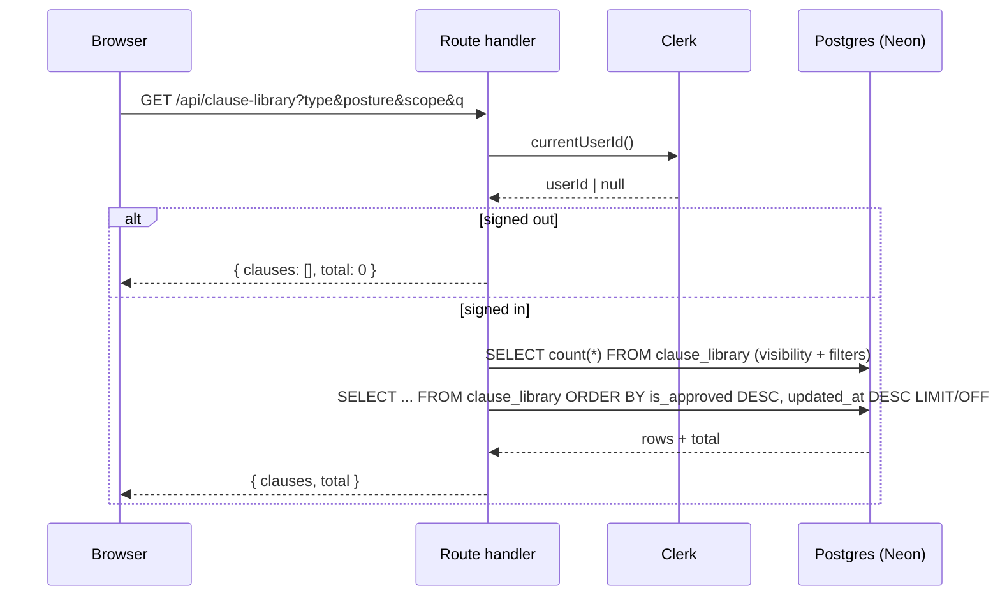
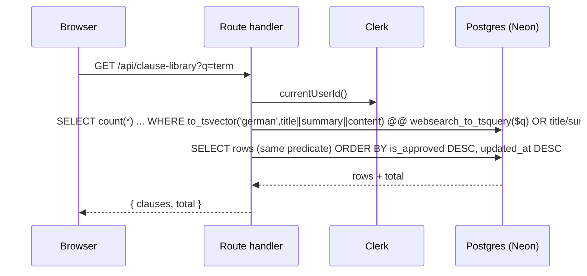
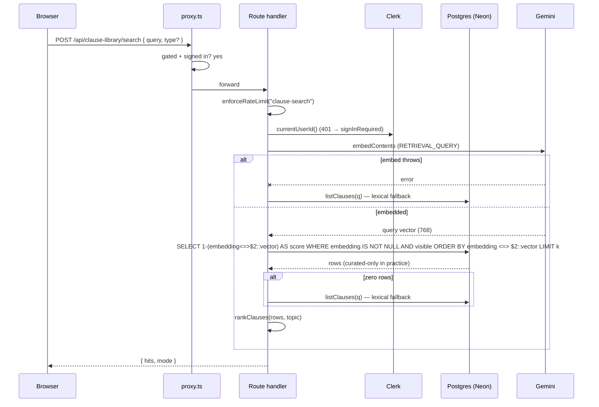
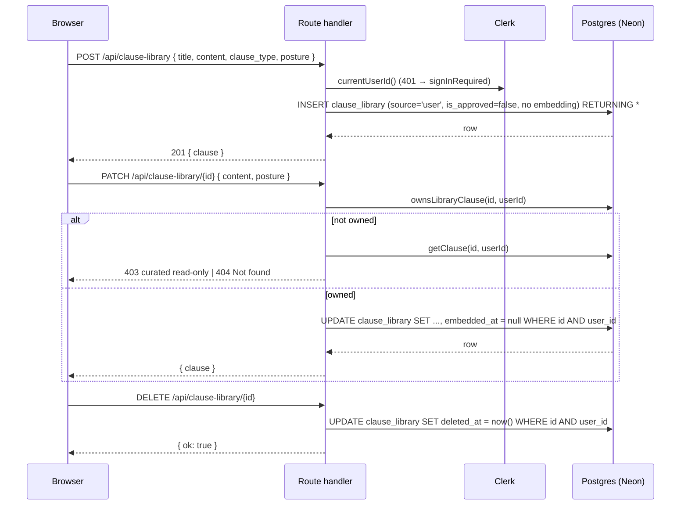
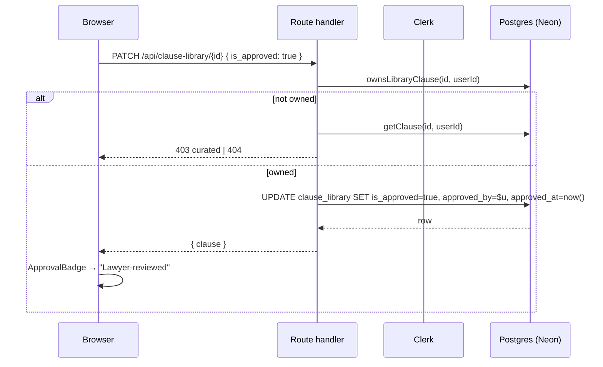

# D — Clause library

_Every path that reads or writes a `clause_library` row. Read [00-conventions](00-conventions.md) first; this file assumes the template._

Verified against `main` @ `bf4d660`.

**The library is _wording_.** A `clause_library` row is a piece of German contract text you can drop into a document, anchored to a statute (`reference`), filed under one topic key from the shared taxonomy (`src/lib/clause-taxonomy.ts`), carrying a negotiating `posture` (`preferred` / `fallback` / `walk_away`) and an RDG `is_approved` flag. It is **not** a playbook. A playbook ([F](f-playbooks.md)) holds _positions_ — "the deposit must not exceed three net cold rents" — as machine-checkable rules; the library holds the _wording_ that satisfies a position. The only coupling between the two is `playbook_rules.preferred_clause_id` (`db/schema.sql:453`, `on delete set null`): a rule may point at one library clause as its suggested redline. Nothing else joins them.

**Two visibility classes, everywhere.** A signed-in user sees their own rows (`cl.user_id = <clerk id>`) plus every system-curated row (`cl.user_id is null`); curated rows are read-only through the API. Every write re-checks ownership with `ownsLibraryClause` (`src/lib/auth.ts:41-48`). A signed-out caller gets an empty list, never a 401 — except the semantic-search route, which is compute-gated.

| id | Workflow |
|----|----------|
| [D1](#d1) | Browse + filter (topic / posture / scope) |
| [D2](#d2) | Lexical search (German FTS + ILIKE) |
| [D3](#d3) | Semantic search + lexical fallback |
| [D4](#d4) | Create / edit / soft-delete |
| [D5](#d5) | Lawyer-reviewed (RDG) toggle |
| [D6](#d6) | Curated seeding (operator) |

> One more write path lives outside this file: **"Save to library"** on the review screen (`POST /api/clause-library/from-suggestion` → `saveFromSuggestion` → `createClause(source:'imported')`) is documented as [C7](c2-review-findings.md). It reaches the same `createClause` insert as [D4](#d4), so an imported row is likewise never embedded.

---

## <a id="d1"></a>D1 — Browse + filter (topic / posture / scope)

**0 · TL;DR** — Opening `/clauses` fires one `GET /api/clause-library`; the handler returns the caller's own rows plus every curated row, filtered by the topic / posture `<Select>`s and the All / Curated / Mine tabs, ordered approved-first then most-recently-updated.

**1 · Entry point** — `/clauses` — `src/app/(workspace)/clauses/page.tsx`. The `load` callback (`:50-80`) builds the query string from four pieces of state: the topic `<Select>` (`:137-145`, options from `CLAUSE_TOPICS` via `topicLabel`), the posture `<Select>` (`:147-155`), the `All / Curated / Mine` `.seg` tabs (`:157-164`, `role="tablist"`, mapping to `scope=all|curated|mine`), and the search box (`:177-190`, [D2](#d2)). `useEffect` re-runs `load` on any change (`:82`). Handler: `src/app/api/clause-library/route.ts:10` (`GET`).

**2 · Preconditions** — Signed in to see anything. `GET /api/clause-library` is **not** compute-gated and **not** rate-limited; the handler calls `currentUserId()` itself (`route.ts:11`) and returns `{ clauses: [], total: 0 }` when there is no user (`:12`). The page short-circuits to a "Sign in to use the clause library" panel when Clerk reports signed-out (`page.tsx:105-119`), so the empty-list branch is only hit in a race.

**3 · Trace**
```
GET /api/clause-library · auth: currentUserId · limit: none
  req  ?type &posture &scope=all|mine|curated &q &tag &approved &limit &offset
  res  { clauses: LibraryClause[], total }   |   signed out → { clauses: [], total: 0 }
```
1. `route.ts:14-29` — parse the query string; `scope` is coerced to `"mine" | "curated"` or falls back to `"all"` (`:23`); `approved` accepts `"1"` or `"true"` (`:26`).
2. `route.ts:19-29` — `listClauses({ userId, type, posture, scope, q, tag, approvedOnly, limit, offset })` (`src/lib/clause-library.ts:62`).
3. `clause-library.ts:63` — base predicate `cl.deleted_at is null`.
4. `:71-74` — visibility: `scope="mine"` → `cl.user_id = $1`; `scope="curated"` → `cl.user_id is null`; else `(cl.user_id = $1 or cl.user_id is null)`.
5. `:76-79` — optional filters: `cl.clause_type = $n` **only if `isKnownTopic(type)`** (an unrecognised `type` is silently dropped), `cl.posture = $n`, `$n = any(cl.tags)`, `cl.is_approved`.
6. `:81-91` — the `q` branch ([D2](#d2)); absent here.
7. `:95-98` — `select count(*)::int as n from clause_library cl where <where>` for `total`.
8. `:100-109` — `select <COLUMNS> from clause_library cl where <where> order by cl.is_approved desc, cl.updated_at desc limit $n offset $n`. `limit` is clamped to `1..200` (default 50); `offset ≥ 0`. `COLUMNS` (`:39-45`) **never selects `embedding`** and computes `(user_id is null) as readonly`.
9. `route.ts:30` — `NextResponse.json(result)` (`result` is `{ clauses, total }`). The page sets `rows` / `total` and renders the table (`page.tsx:202-249`); each row's `readonly` drives the "Curated / Imported / Mine" source cell and, on click, a read-only `ClauseDialog`.

**4 · Database effects** — Read-only. `clause_library` — two `SELECT`s (`clause-library.ts:96`, `:102`) against the visibility predicate + filters. No transaction. See [H6](h6-database-schema.md#tables).

**7 · Failure modes**

| Trigger | Behaviour | User sees | Survives |
|---------|-----------|-----------|----------|
| Signed out (race past the panel) | `{ clauses: [], total: 0 }`, HTTP 200 | empty table | n/a |
| Unknown `type` value | `isKnownTopic` guard drops the filter (`clause-library.ts:76`) | results as if no topic filter | n/a |
| DB throw in `listClauses` | `catch` → `{ error: <raw DB message> }` 500 (`route.ts:31-33`) — [H3](h3-error-taxonomy.md) LEAK, no `console.error` | `rows` stays `[]` (page never checks `res.ok`, `page.tsx:73-76`) | n/a |
| `limit` / `offset` out of range | clamped, not rejected (`clause-library.ts:100-101`) | a bounded page | n/a |

**8 · Sequence diagram**



**9 · Observability notes**
> **What you can see today.** Nothing on success — no log line, no counter. A `listClauses` throw returns the raw DB message to the client and does **not** `console.error` (`route.ts:31-33`).
> **What you can't.** Library-browse volume. Which topic / posture / scope combinations users actually filter by. The empty-result rate (a signal that a user's own set is thin). Whether a 500 was a query bug or a transient DB blip.
>
> | # | Blind spot | Class | Cheapest fix |
> |---|-----------|-------|--------------|
> | D1-O1 | No browse/filter telemetry | NO-METRIC | `console.info("[clauses] list", { scope, type, posture, n, ms })` before returning — tier 0 |
> | D1-O2 | Raw DB error leaked, not logged | LEAK + NO-LOG | `errorResponse(err, "clause-library.list")` (`src/lib/errors.ts`) — tier 0 |
> | D1-O3 | Silently-dropped unknown `type` filter | NO-LOG | `console.warn` in `listClauses` when `type` fails `isKnownTopic` — tier 0 |

**10 · See also** — [D2](#d2) (the `q` branch), [D4](#d4) (the dialog this opens), [F](f-playbooks.md) (playbooks, the other half of the split), [H6](h6-database-schema.md#tables).

---

## <a id="d2"></a>D2 — Lexical search (German FTS + ILIKE)

**0 · TL;DR** — With the **Semantic** toggle off, submitting the search box adds `?q=<term>` to `GET /api/clause-library`; `listClauses` matches it two ways at once — a `german` full-text match on `title ∥ summary ∥ content`, OR a case-insensitive `ILIKE '%term%'` on the same three columns.

**1 · Entry point** — `/clauses`, the search `<form>` (`src/app/(workspace)/clauses/page.tsx:177-190`). `onSubmit` does `setQueryTerm(q)` (`:179`); the **Semantic** toggle (`:167-176`, `data-on={semantic}`) is `false`, so `load` takes the query-string branch (`:67-76`) not the POST branch. Handler: `src/app/api/clause-library/route.ts:10` → `listClauses` `q` branch (`src/lib/clause-library.ts:81-91`).

**2 · Preconditions** — Signed in (as [D1](#d1)). Not gated, not rate-limited.

**3 · Trace**
```
GET /api/clause-library?q=<term> · auth: currentUserId · limit: none
  req  ?q  (+ any of type, posture, scope, tag, approved)
  res  { clauses, total }
```
1. `route.ts:24` — `q: sp.get("q")`.
2. `clause-library.ts:81-91` — when `q.trim()` is non-empty, bind `term = q.trim()` and `like = "%" + q.trim() + "%"` and push one OR-group into the `where`:
   - `to_tsvector('german', coalesce(cl.title,'') || ' ' || coalesce(cl.summary,'') || ' ' || coalesce(cl.content,'')) @@ websearch_to_tsquery('german', $term)`
   - `or cl.title ilike $like`
   - `or cl.summary ilike $like`
   - `or cl.content ilike $like`
3. The visibility predicate, the topic / posture / tag / approved filters, `order by cl.is_approved desc, cl.updated_at desc`, and the count + page query are all exactly as [D1](#d1) — `q` is one more `and`-ed predicate, not a separate code path.
4. `route.ts:30` — `{ clauses, total }`.

**4 · Database effects** — Read-only. The FTS half is served by the GIN index `clause_library_fts_idx` (`db/schema.sql:249-251`), whose expression is the **same** `to_tsvector('german', coalesce(title,'') || ' ' || coalesce(summary,'') || ' ' || coalesce(content,''))` — so the index is usable. The three `ILIKE` disjuncts have **no** supporting index (`pg_trgm` is not loaded; the only `clause_library` indexes are `user_id`, the curated `doc_ref` unique, a partial `clause_type` btree, a `tags` GIN, the `embedding` HNSW, and this FTS GIN — `db/schema.sql:241-251`), so any `q` that the `tsquery` half doesn't satisfy falls back to a sequential scan. See [H6](h6-database-schema.md#tables).

**7 · Failure modes**

| Trigger | Behaviour | User sees | Survives |
|---------|-----------|-----------|----------|
| `q` is only stopwords | `websearch_to_tsquery('german', …)` yields an empty query → FTS half matches nothing; the `ILIKE` half still substring-matches | substring hits only | n/a |
| Accented query vs unaccented text | FTS `german` config handles stems; `ILIKE` is case- but **not** accent-insensitive → `"Kundigung"` misses `"Kündigung"` on the ILIKE half | possibly fewer hits than expected | n/a |
| Very long `q` | passed through verbatim; `%term%` scan cost grows | slow response | n/a |
| DB throw | raw-message 500 (LEAK), unlogged — as [D1](#d1) | empty table | n/a |

**8 · Sequence diagram**



**9 · Observability notes**
> **What you can see today.** Nothing. No log of the query text, the hit count, or which half of the OR matched.
> **What you can't.** What users search for and get zero results on. FTS-vs-ILIKE hit ratio (i.e. whether the `german` config is pulling its weight). Slow `%term%` scans as the library grows.
>
> | # | Blind spot | Class | Cheapest fix |
> |---|-----------|-------|--------------|
> | D2-O1 | Zero-result queries invisible | NO-METRIC | `console.info("[clauses] search", { qLen, n })` in the route — tier 0 |
> | D2-O2 | No signal that the unindexed `ILIKE` scan is the slow path | NO-METRIC | log query `ms` alongside `n` — tier 0 |
> | D2-O3 | FTS vs ILIKE contribution unknown | NO-METRIC | descriptive; a `SELECT` splitting the two predicates would answer it — tier 2 |

**10 · See also** — [D1](#d1) (the shared list path), [D3](#d3) (the semantic alternative, and the fallback that lands back here), [H6](h6-database-schema.md#tables).

---

## <a id="d3"></a>D3 — Semantic search + lexical fallback

**0 · TL;DR** — With the **Semantic** toggle on, the search box POSTs to `/api/clause-library/search`; the handler rate-limits, embeds the query with Gemini, cosine-ranks the visible clauses **that have an embedding**, re-ranks the top hits in JS, and returns them — but falls back silently to the [D2](#d2) lexical query whenever embedding fails or nothing is indexed.

> ⚠ **Semantic results are curated-only in practice.** `createClause` writes **no** `embedding` (`src/lib/clause-library.ts:141-146` — the insert column list stops at `source`), and nothing re-embeds a user row on create or edit. `searchClauses` filters `... and cl.embedding is not null` (`:275`). The only thing that ever populates a vector is `npm run seed:library -- --embed` ([D6](#d6)), and in normal operation that is run to seed the curated set. So a user's own clauses never appear in semantic results — they only surface when the query drops to the lexical fallback.

**1 · Entry point** — `/clauses`, the **Semantic** `.seg` toggle (`src/app/(workspace)/clauses/page.tsx:167-176`) then the search `<form>`. With `semantic === true` and a non-empty `queryTerm`, `load` takes the POST branch (`page.tsx:53-66`): `fetch("/api/clause-library/search", { method: "POST", body: { query, type } })`. Handler: `src/app/api/clause-library/search/route.ts:10`.

**2 · Preconditions** — Signed in. `/api/clause-library/search` **is** in [`GATED_COMPUTE_PATHS`](h1-auth-and-ownership.md#gate) (`src/proxy.ts:19`) — a signed-out POST 401s at the middleware. In the handler, `enforceRateLimit(req, "clause-search")` runs **first** (`route.ts:12-13`), then `signInRequired()` (`:15-16`). Rate tier `clause-search` = 60/h · 200/d, plus the global `compute` 200/h · 600/d ([H2](h2-rate-limiting.md#tiers)). Semantic hits also require the `embedding` column to be populated — otherwise every query is a lexical fallback.

**3 · Trace**
```
POST /api/clause-library/search · auth: proxy-gated · limit: clause-search 60/h · 200/d
  req  { query, type?, topK? }
  res  { hits: (LibraryClause & { score, rankScore })[], mode: "semantic" | "lexical" }
```
1. `route.ts:12-13` — `enforceRateLimit(req, "clause-search")`; a 429 returns here.
2. `:15-16` — `currentUserId()`; `signInRequired()` if absent.
3. `:18-20` — parse; a blank `query` short-circuits to `{ hits: [], mode: "lexical" }`.
4. `:22` — `searchClauses(userId, q, { type, topK })` (`src/lib/clause-library.ts:237`).
5. `clause-library.ts:242` — `topK` clamped to `1..50` (default 20). `:244` — blank query → `{ hits: [], mode: "lexical" }`.
6. `:254-260` — `const { embedOne } = await import("@/lib/rag/gemini"); queryVec = await embedOne(trimmed, "RETRIEVAL_QUERY")`. **Any throw here → `lexicalFallback()`** (`:258-259`) — the `catch` is empty.
7. `:262-281` — build the vector query:
   - `params = [userId, "[" + queryVec.join(",") + "]"]`; if `isKnownTopic(type)` add `type` as `$3` and `typeFilter = "and cl.clause_type = $3"` (`:264-268`); push `topK` last.
   - `select <COLUMNS>, 1 - (cl.embedding <=> $2::vector) as score from clause_library cl where cl.deleted_at is null and cl.embedding is not null and (cl.user_id = $1 or cl.user_id is null) <typeFilter> order by cl.embedding <=> $2::vector limit $n`.
8. `:283` — **zero rows → `lexicalFallback()`** (which runs `listClauses({ userId, q, type, limit: topK })`, [D2](#d2), and tags every hit `score: 0, rankScore: 0`, `mode: "lexical"`).
9. `:285-295` — `rankClauses(rows.map(...), queryTopic)` (`src/lib/library/rank.ts:40`): starts from pgvector's cosine `score`, then `+0.03` if `clause_type === queryTopic`, `−0.05` if `posture === "walk_away"`, `+0.005` if `is_approved`; sorts by `rankScore`, breaking ties by `is_approved` then raw `score`. Unapproved rows are **not** dropped, only demoted.
10. `:296-304` — re-join the ranked ids to the full rows, return `{ hits, mode: "semantic" }`.
11. `route.ts:26` — `NextResponse.json(result)`. A thrown error → `errorResponse(err, "clause-search")` (`:27-28`) — this route **does** log server-side and returns a generic message. The page sets `rows = data.hits ?? []` and shows the "Semantic index unavailable — showing a keyword match instead" hint when `mode === "lexical"` (`page.tsx:196-199`).

**4 · Database effects** — Read-only. One vector `SELECT` against `clause_library` filtered by `embedding is not null` + visibility (`clause-library.ts:271-281`), or — on fallback — the [D2](#d2) count + page `SELECT`s. The cosine ordering uses the HNSW index `clause_library_embedding_idx` (`db/schema.sql:247-248`). No transaction. See [H6](h6-database-schema.md#tables).

**5 · External calls** — Gemini embeddings: one `embedOne(query, "RETRIEVAL_QUERY")` per request (`clause-library.ts:257`). No `complete` / generation call. The embedding/cosine mechanics — model, dimension (768), L2-normalisation, the `<=>` operator — are in [H4](h4-rag-pipeline.md). A `QuotaExhaustedError` or any other throw from `embedOne` is swallowed into the lexical fallback (`:258`).

**7 · Failure modes**

| Trigger | Behaviour | User sees | Survives |
|---------|-----------|-----------|----------|
| Guest | 401 at middleware ([gated](h1-auth-and-ownership.md#gate)) | table stays empty (page never checks `res.ok`, `page.tsx:60-63`) | n/a |
| Rate-limited | 429 `clause-search` + a `rate_limit_blocks` row | empty table (no toast — `res.ok` unchecked) | n/a |
| `embedOne` throws (no key, quota, network) | empty `catch` → `lexicalFallback()` | keyword results + "Semantic index unavailable" hint | n/a |
| Nothing indexed (`embedding is null` for all visible rows) | vector query returns 0 rows → `lexicalFallback()` | same hint | n/a |
| User searching only their own (unembedded) clauses | vector query can't see them (`embedding is not null`); if curated rows match, they rank first; if not, 0 rows → lexical fallback surfaces the user rows | mixed, order not meaning-ranked | n/a |
| `type` not a known topic | `typeFilter` omitted (`clause-library.ts:265`); `rankClauses` gets `queryTopic = null` → no topic bonus | broader results | n/a |
| Unexpected throw in the route | `errorResponse(err, "clause-search")` 500, logged | generic error message | n/a |

**8 · Sequence diagram**



**9 · Observability notes**
> **What you can see today.** `errorResponse(err, "clause-search")` `console.error`s on an unexpected throw (`src/lib/errors.ts:26`), and a 429 writes a `rate_limit_blocks` row ([H2](h2-rate-limiting.md#tables)). Nothing else — the two fallback branches (`clause-library.ts:258`, `:283`) are silent, and a successful semantic search logs nothing.
> **What you can't.** How often "semantic" search silently degrades to lexical, and why (no key vs. nothing indexed vs. query matched nothing). Embedding-call latency and volume. Whether the JS re-rank changes the top result vs. raw cosine. That user clauses are structurally excluded from semantic hits.
>
> | # | Blind spot | Class | Cheapest fix |
> |---|-----------|-------|--------------|
> | D3-O1 | Silent semantic→lexical degradation (empty `catch`) | SILENT-CATCH | log `{ event:"clause_search_fallback", reason:"embed_error"\|"no_rows" }` at each fallback — tier 0 |
> | D3-O2 | Semantic-search success unlogged (mode, hits, ms) | NO-METRIC | `console.info("[clauses] semantic", { mode, hits, ms })` — tier 0 |
> | D3-O3 | User rows never semantically indexed — no signal | NO-METRIC | count rows with `embedding is null and user_id is not null`; expose in an admin check — tier 2 |
> | D3-O4 | Re-rank effect (pos change vs raw cosine) invisible | NO-METRIC | log when `rankClauses` reorders the #1 hit — tier 0 |

**10 · See also** — [D2](#d2) (the fallback target), [D6](#d6) (the only thing that populates `embedding`), [H4](h4-rag-pipeline.md) (embeddings + cosine), [H2](h2-rate-limiting.md#tiers) (`clause-search`).

---

## <a id="d4"></a>D4 — Create / edit / soft-delete

**0 · TL;DR** — `ClauseDialog` in create mode POSTs a user-owned row (`source='user'`, `is_approved=false`, no embedding); in edit mode it PATCHes the editable fields of a row the caller owns; the Delete button soft-deletes it. Curated rows are read-only — a write to one 403s.

**1 · Entry point** — `/clauses` — `src/components/clauses/clause-dialog.tsx`. "New clause" (`page.tsx:132`) opens it in create mode (`clause == null`); clicking a table row opens it on that row (`page.tsx:85`), read-only if `row.readonly`. `save()` (`clause-dialog.tsx:88-120`) → `POST /api/clause-library` or `PATCH /api/clause-library/{id}`; `remove()` (`:141-153`) → `DELETE /api/clause-library/{id}`. Handlers: `src/app/api/clause-library/route.ts:37` (`POST`), `src/app/api/clause-library/[id]/route.ts:27` (`PATCH`), `:63` (`DELETE`).

**2 · Preconditions** — Signed in — all three call `signInRequired()` when there is no `currentUserId()` (`route.ts:38-39`, `[id]/route.ts:29-30`, `:65-66`). Not compute-gated, not rate-limited. For `PATCH` / `DELETE` the caller must **own** the row: `ownsLibraryClause(id, userId)` (`src/lib/auth.ts:41-48` — true only when `user_id = $2`, i.e. never for a curated row). The dialog hides the editable fields and the Save/Delete buttons when `clause.readonly` (`clause-dialog.tsx:233`, `:245`, `:252`).

**3 · Trace**
```
POST /api/clause-library · auth: currentUserId · limit: none
  req  { title, content, clause_type, posture?, title_en?, content_en?,
         summary?, reference?, tags?, contract_types?, source? }
  res  201 { clause: LibraryClause }

PATCH /api/clause-library/{id} · auth: ownsLibraryClause · limit: none
  req  { any of: title, content, title_en, content_en, summary, clause_type,
         reference, posture, tags, contract_types, is_approved }
  res  { clause }   |   403 { error: "curated clauses are read-only" }   |   404

DELETE /api/clause-library/{id} · auth: ownsLibraryClause · limit: none
  res  { ok: true }   |   403   |   404
```

**Create**
1. `route.ts:38-39` — `signInRequired()` if no user.
2. `:48-65` — validate: `title`, `content`, `clause_type` all required and trimmed; `clause_type` must pass `isKnownTopic` else 400; `posture` defaults to `"preferred"`, must be one of `preferred|fallback|walk_away` else 400.
3. `:71-82` — `createClause(userId, { … , source: body.source === "imported" ? "imported" : "user" })` (`src/lib/clause-library.ts:140`):
   - `insert into clause_library (user_id, title, content, title_en, content_en, summary, clause_type, reference, posture, tags, contract_types, source) values ($1..$12) returning <COLUMNS>` (`:142-146`).
   - **Not written:** `embedding`, `embedded_at`, `is_approved` (DB default `false`), `approved_by/at`, `doc_ref` (null), `jurisdiction` (DB default `'DE'`).
4. `route.ts:84` — `201 { clause }`. The page prepends it to `rows` (`page.tsx:87-97`).

**Edit**
1. `[id]/route.ts:32` — `ownsLibraryClause(id, userId)`. On false, `getClause(id, userId)` (`:34`): if the row is visible and `readonly` → `403 { error: "curated clauses are read-only" }` (`CURATED_READONLY`, `:9`, `:35`); otherwise `404 { error: "Not found" }` (`:36`).
2. `:41-52` — parse body; a `clause_type` present but not a known topic → 400; a `posture` present but invalid → 400.
3. `:54` — `updateClause(id, userId, body)` (`clause-library.ts:178`):
   - iterate `body`; only keys in `EDITABLE` (`:166-170`) become `SET` fragments.
   - `is_approved` (`:192-201`) → `set is_approved = $n`; if truthy also `approved_by = $userId`, `approved_at = now()`; if falsy, both `approved_by` / `approved_at` → `null` (see [D5](#d5)).
   - **if `"content" in patch`** → append `embedded_at = null` (`:204`) so the next `seed:library --embed` pass re-vectorises it.
   - empty patch → return `getClause` unchanged (`:205`).
   - `update clause_library set <sets> where id = $n-1 and user_id = $n and deleted_at is null returning <COLUMNS>` (`:208-212`).
4. `[id]/route.ts:55-56` — `{ clause }`, or 404 if the update matched nothing.

**Soft-delete**
1. `[id]/route.ts:68-71` — same `ownsLibraryClause` → 403 / 404 gate.
2. `:75` — `softDeleteClause(id, userId)` (`clause-library.ts:217`): `update clause_library set deleted_at = now() where id = $1 and user_id = $2 and deleted_at is null returning id`.
3. `:76` — `{ ok: true }` regardless of whether a row matched. The page drops the row from `rows` and decrements `total` (`page.tsx:98-101`).

**4 · Database effects** — `clause_library`:
- **Create** — 1 `INSERT` (`clause-library.ts:142`). Single statement, no transaction.
- **Edit** — 1 dynamic `UPDATE` (`:209`); the `clause_library_updated_at` trigger (`db/schema.sql:253-255`) bumps `updated_at` on every update.
- **Delete** — 1 `UPDATE` setting `deleted_at` (`:219`); the row stays in the table, excluded everywhere by `deleted_at is null`.

Owner-check constraint `clause_library_owner_ck` (`db/schema.sql:237-239`) guarantees `(source = 'curated') = (user_id is null)` — a `source='user'` insert with a real `user_id` always satisfies it. See [H6](h6-database-schema.md#tables).

**7 · Failure modes**

| Trigger | Behaviour | User sees | Survives |
|---------|-----------|-----------|----------|
| PATCH / DELETE a curated row | `ownsLibraryClause` false → `getClause().readonly` → `403 { error: "curated clauses are read-only" }` | "curated clauses are read-only" | curated row untouched |
| PATCH / DELETE another user's or a missing row | `ownsLibraryClause` false → not `readonly` → `404 { error: "Not found" }` | "Not found" | untouched |
| Unknown `clause_type` on create or edit | 400 before the write (`route.ts:60`, `[id]/route.ts:48`) | the error string | nothing written |
| DB throw on any of the three | `catch` → `{ error: <raw DB message> }` 500 ([H3](h3-error-taxonomy.md) LEAK), no `console.error` (`route.ts:85-86`, `[id]/route.ts:57`, `:77`) | dialog shows the raw message | create: nothing; edit/delete: nothing |
| Edit `content`, but `seed:library --embed` is never re-run | `embedded_at` set to `null` (`clause-library.ts:204`); the row's stale `embedding` (if any) stays, and it simply won't be re-ranked freshly | search still works | stale `embedded_at = null` persists |
| Empty PATCH body | `updateClause` returns the row unchanged (`:205`) | no-op success | n/a |

**8 · Sequence diagram**



**9 · Observability notes**
> **What you can see today.** Nothing on success. All three routes return the raw DB message on a throw and none of them `console.error` (`route.ts:85-86`, `[id]/route.ts:57`, `:77`). The client surfaces the message in the dialog's error line.
> **What you can't.** Create / edit / delete volume. How many user clauses exist per user. How often a curated-write 403 fires (a UI bug signal — the dialog should never let it happen). The rate of `content` edits that leave `embedded_at = null` forever because `--embed` is never re-run.
>
> | # | Blind spot | Class | Cheapest fix |
> |---|-----------|-------|--------------|
> | D4-O1 | No write telemetry (create/edit/delete counts) | NO-METRIC | one `console.info` per verb with `{ id, userId }` — tier 0 |
> | D4-O2 | Raw DB error leaked + unlogged on all three routes | LEAK + NO-LOG | `errorResponse(err, "clause-library.write")` — tier 0 |
> | D4-O3 | Curated-write 403s not counted (UI-bug canary) | NO-METRIC | `console.warn("[clauses] curated write blocked", { id })` before the 403 — tier 0 |
> | D4-O4 | `embedded_at = null` backlog invisible | NO-METRIC | periodic count of stale user rows — tier 2 |

**10 · See also** — [D5](#d5) (the `is_approved` slice of `PATCH`), [D1](#d1) (where the new row shows up), [D6](#d6) (`--embed`, the missing half of a `content` edit), [H1](h1-auth-and-ownership.md#gate).

---

## <a id="d5"></a>D5 — Lawyer-reviewed (RDG) toggle

**0 · TL;DR** — Ticking "I have had this clause reviewed by a licensed lawyer" PATCHes `{ is_approved: true }`; `updateClause` stamps `approved_by = <clerk id>` and `approved_at = now()` and the pill flips from "Unreviewed" to "Lawyer-reviewed". It is a self-attestation, not a verified credential.

**1 · Entry point** — `src/components/clauses/clause-dialog.tsx`, the checkbox rendered only when `editing && !readOnly` (`:233-239`): `onChange` → `toggleApproved(e.target.checked)` (`:122-139`) → `PATCH /api/clause-library/{id}` with body `{ is_approved: next }`. The pill itself is `src/components/clauses/approval-badge.tsx` — `ShieldCheck` + "Lawyer-reviewed" (`pill-low`) when `approved`, `TriangleAlert` + "Unreviewed" (`pill-none`) otherwise, with a tooltip carrying the RDG wording ("AI-generated / user wording … Lexora gives no legal advice within the meaning of the RDG. Have a licensed lawyer check it before you rely on it."). The badge also renders in the list's Status column (`page.tsx` table) and in the dialog header. Handler: `src/app/api/clause-library/[id]/route.ts:27` (`PATCH`).

**2 · Preconditions** — Signed in, editing a row the caller **owns** and that is not `readonly`. A curated row can never be approved through the API — `ownsLibraryClause` returns false for `user_id is null`, so the PATCH 403s before `updateClause` runs.

**3 · Trace**
```
PATCH /api/clause-library/{id} · auth: ownsLibraryClause · limit: none
  req  { is_approved: true | false }
  res  { clause }   |   403 { error: "curated clauses are read-only" }   |   404
```
1. `[id]/route.ts:32-36` — `ownsLibraryClause` gate (403 curated / 404 otherwise), as [D4](#d4).
2. `:54` — `updateClause(id, userId, { is_approved })` (`src/lib/clause-library.ts:178`).
3. `clause-library.ts:192-201` — the `is_approved` branch:
   - `set is_approved = $n` (coerced `!!v`).
   - if truthy: also `approved_by = $userId`, `approved_at = now()`.
   - if falsy: `approved_by = null`, `approved_at = null`.
4. `:208-212` — `update clause_library set <sets> where id = $n-1 and user_id = $n and deleted_at is null returning <COLUMNS>`; the `clause_library_updated_at` trigger bumps `updated_at`.
5. `[id]/route.ts:55-56` — `{ clause }`. `toggleApproved` calls `onSaved(data.clause)` (`clause-dialog.tsx:133`), the page swaps the row in place, and the badge re-renders.

**4 · Database effects** — `clause_library`: one `UPDATE` touching `is_approved`, `approved_by`, `approved_at`, `updated_at`. No separate audit row — there is no `clause_approval_events` table ([H6](h6-database-schema.md#tables)). `approved_by` stores the Clerk user id of whoever ticked the box; nothing checks that they, or anyone, are a `Rechtsanwalt`. Un-ticking clears both stamp columns, erasing any trace that a prior approval happened.

**6 · End state** — The row's `is_approved` reflects the last toggle; `approved_by` / `approved_at` are set iff currently approved. Every seeded row ships `is_approved = false` — `scripts/seed-library.mjs` never sets the column (DB default), `scripts/seed-templates.mjs` sets it explicitly `false` (`:123`), and `createClause` / `createTemplate` never touch it. Only a human owner's PATCH ever flips it to `true`.

**7 · Failure modes**

| Trigger | Behaviour | User sees | Survives |
|---------|-----------|-----------|----------|
| Toggle on a curated row | 403 (checkbox isn't rendered for `readonly`, so only reachable by direct HTTP) | "curated clauses are read-only" | not approved |
| Toggle on a row you don't own | 404 | "Not found" | not approved |
| Approve → un-approve → re-approve | each write overwrites; `approved_at` becomes the latest `now()`; the first approval leaves no record | badge flips each time | only the current state |
| DB throw | raw-message 500 (LEAK), unlogged | dialog error line | prior state |

**8 · Sequence diagram**



**9 · Observability notes**
> **What you can see today.** `approved_by` / `approved_at` on the row — the only trace, and only for the current state. No log line on toggle. No `rate_limit_blocks` (route isn't limited).
> **What you can't.** Who approved a clause and when, historically. How many clauses in the library are approved vs. not (an RDG-exposure metric). Whether an approval was later revoked. That `approved_by` is an unverified self-claim.
>
> | # | Blind spot | Class | Cheapest fix |
> |---|-----------|-------|--------------|
> | D5-O1 | No approval history — revoke + re-approve leaves no trail | NO-METRIC | append-only `clause_approval_events (clause_id, actor, approved, at)` — tier 2 |
> | D5-O2 | Toggle not logged | NO-LOG | `console.info("[clauses] approval", { id, approved, actor })` in the route — tier 0 |
> | D5-O3 | Approved-share of the library uncounted | NO-METRIC | `select is_approved, count(*)` in an admin check — tier 2 |
> | D5-O4 | `approved_by` is an unverified attestation | descriptive | out of scope for observability; a credentials model is the real fix |

**10 · See also** — [D4](#d4) (the wider `PATCH` path), the templates' `is_approved` (`e-templates.md` — same mechanism on `contract_templates`), [H6](h6-database-schema.md#tables).

---

## <a id="d6"></a>D6 — Curated seeding (operator)

_Operator workflow — the compressed five-section form. No user entry point, no diagram, no failure table._

**1 · Entry point** — `npm run seed:library` → `node scripts/seed-library.mjs` (`scripts/seed-library.mjs:1-13`). Optional `-- --embed` sets `EMBED = process.argv.includes("--embed")` (`:13`) and runs the vector pass as well.

**2 · Preconditions** — `DATABASE_URL` in `lexora/.env.local`. `db/006_clause_library.sql` applied (it grows the columns, enums, and indexes; itself requires `db/005_rag_corpus.sql` for the `vector` type). `-- --embed` additionally needs `GEMINI_API_KEY`. The script talks to the DB through the unpooled RAG pool (`ragQuery` / `endRagPool` from `src/lib/rag/db.ts`). Per `MEMORY.md`, the prod Neon has **not** had `db/006` + this seed run yet.

**3 · Trace**
1. `scripts/seed-library.mjs:20` — `parseCuratedLibrary()` (`src/lib/library/parse-corpus.ts:162`) builds the row set from the RAG corpus (`src/lib/rag/corpus/*.md`), purely, with no network:
   - `parseModelClauses()` (`parse-corpus.ts:74`) — walks every corpus doc, takes its `## Musterformulierung` block, and extracts each `„…"` quoted variant (`extractQuotedVariants`). 21 docs carry a model clause (`DOC_TO_TOPIC`, `clause-taxonomy.ts` — docs `00`, `22`, `23` are in `DOCS_WITHOUT_MODEL_CLAUSE` and skipped); doc `18` (`zeitmietvertrag-575`) yields **two** variants, so 22 rows. `doc_ref` is the doc id, or `<id>#v2` for a second variant. `posture` is `"preferred"`, except `FALLBACK_DOCS` (`07-staffelmiete-557a`, `08-indexmiete-557b`) and any non-first variant → `"fallback"` (`parse-corpus.ts:35`, `:103`).
   - `parseTemplateClauses()` (`parse-corpus.ts:121`) — doc `22`'s `## § N …` sections → exactly **11** rows (`doc_ref = "22-vorlage#p1".."#p11"`, `posture = "preferred"`); the function hard-errors if it doesn't get 11.
   - `parseCuratedLibrary` concatenates the two (**33 rows**) and hard-errors on a duplicate `doc_ref`.
2. `seed-library.mjs:24-45` — per row: `insert into clause_library (user_id, title, content, summary, clause_type, reference, jurisdiction, tags, source, posture, doc_ref) values (null, …, 'DE', …, 'curated', …, …) on conflict (doc_ref) where source = 'curated' do update set title, content, summary, clause_type, reference, tags, posture, updated_at = now()` — `returning (xmax = 0) as was_insert` to count inserts vs updates. **No `embedding` / `is_approved` / `approved_*` in the upsert** — curated rows ship unreviewed with a null vector.
3. `:50-55` — orphan sweep: `delete from clause_library where source = 'curated' and not (doc_ref = any($keep)) returning doc_ref`. FKs that point here (`playbook_rules.preferred_clause_id`) are `on delete set null`, so a delete never blocks.
4. `--embed` → `embedRows()` (`:60-84`): select every non-deleted row where `embedding is null or embedded_at is null or embedded_at < updated_at` (`:63-69` — ⚠ **not** filtered to `source = 'curated'` / `user_id is null`), `embedTexts(rows.map(r => `${r.title} — ${r.content}`), "RETRIEVAL_DOCUMENT")` (`:72-75`), then per row `update clause_library set embedding = $1::vector, embedded_at = now() where id = $2`.

**4 · Database effects** — `clause_library` curated rows (`user_id is null`, `source = 'curated'`) inserted / updated / deleted; `embedding` + `embedded_at` written only under `--embed`. Idempotent via the `clause_library_curated_ref_idx` unique index (`db/schema.sql:242-243`). The `clause_library_updated_at` trigger fires on every upsert. **No transaction** — each row is its own statement, so a mid-run failure leaves a partial seed. Because `embedRows` doesn't scope by owner, an operator who runs `--embed` after users have created clauses will also vectorise those user rows as a side effect (which would then make them eligible for [D3](#d3) semantic hits — the one way user clauses ever get an embedding).

**9 · Observability notes**
> **What you can see today.** The script prints to stdout — `rows in corpus`, `inserted`, `updated`, `removed (orphan)`, `embedded`, `elapsed` (`seed-library.mjs:89-101`). Nothing is persisted about the run. `doc_ref` records provenance per row but not which corpus revision produced it.
> **What you can't.** When the seed last ran, against which corpus commit. Whether a run half-completed. That an `--embed` pass silently vectorised user rows. Drift between the corpus and the seeded rows between runs.
>
> | # | Blind spot | Class | Cheapest fix |
> |---|-----------|-------|--------------|
> | D6-O1 | No seed-run record (time, corpus SHA, counts) | NO-METRIC | write a `seed_runs` row at the end of the script — tier 2 |
> | D6-O2 | `embedRows` also vectorises user rows, unannounced | NO-LOG + SILENT-CATCH | add `and user_id is null` to the select (`seed-library.mjs:65-68`), and log the count — tier 1 |
> | D6-O3 | Partial seed on a mid-run throw is invisible | NO-LOG | wrap `upsertRows` in a transaction, or log progress every N rows — tier 1 |

**10 · See also** — [D3](#d3) (consumes `embedding`), [E6](e-templates.md#e6) (the template seed that must run **after** this one), [H4](h4-rag-pipeline.md) (`embedTexts`, `RETRIEVAL_DOCUMENT`), [H6](h6-database-schema.md#tables).
