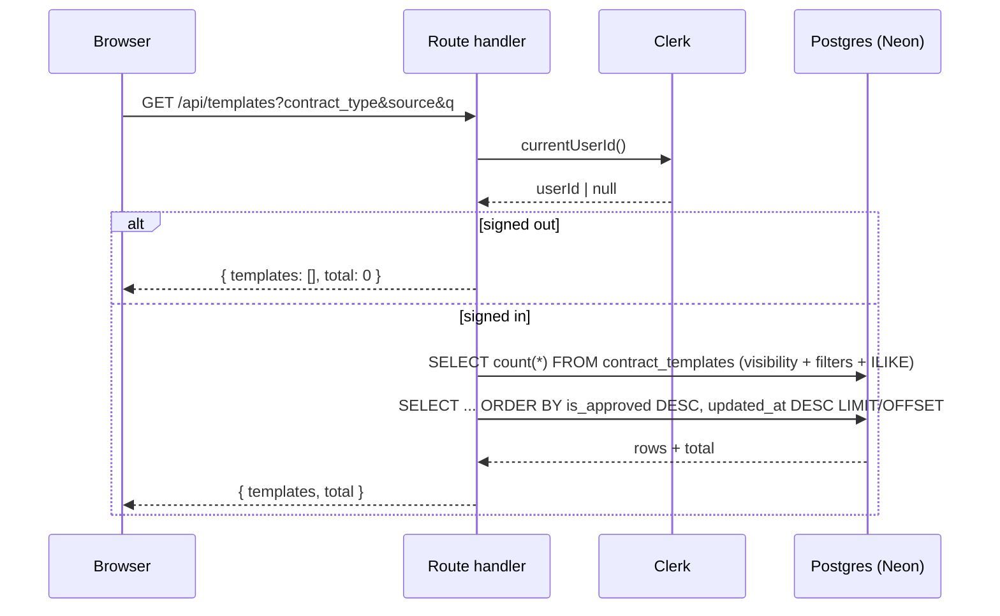
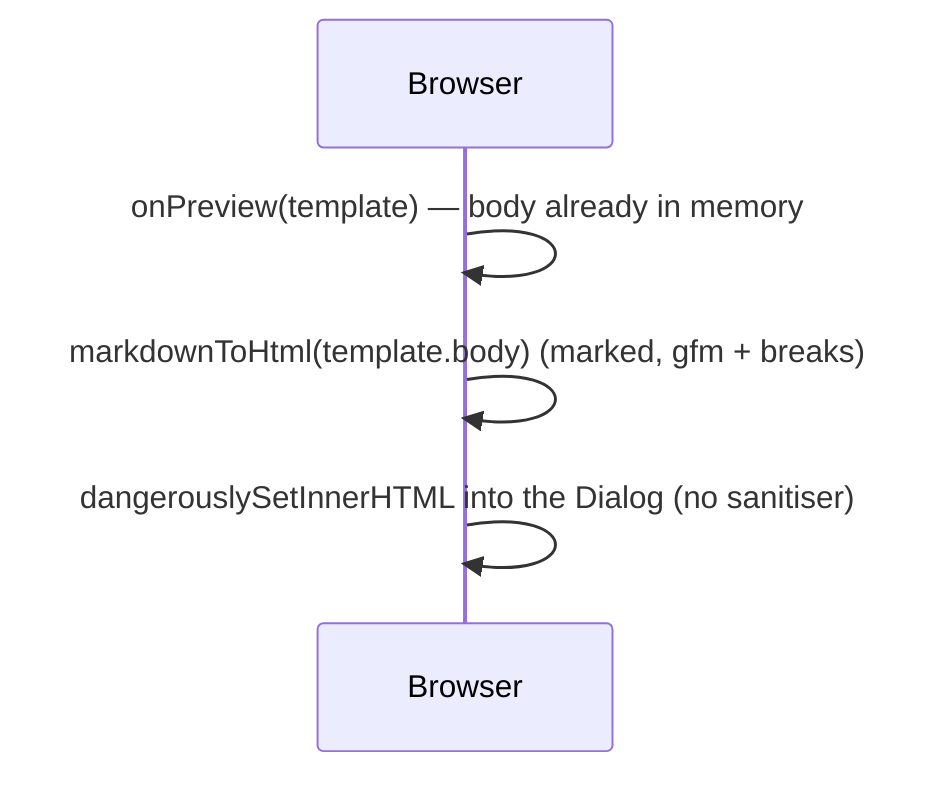
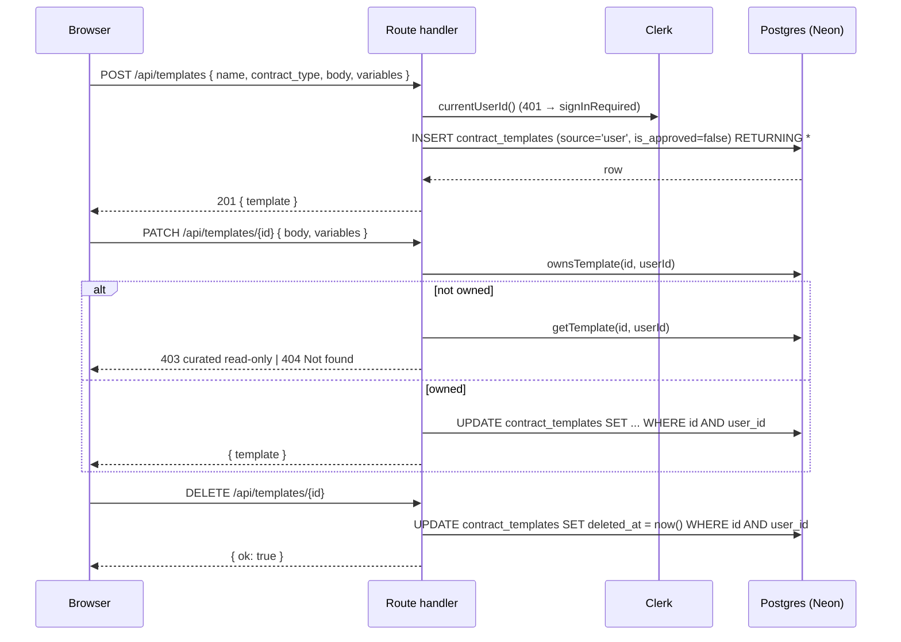
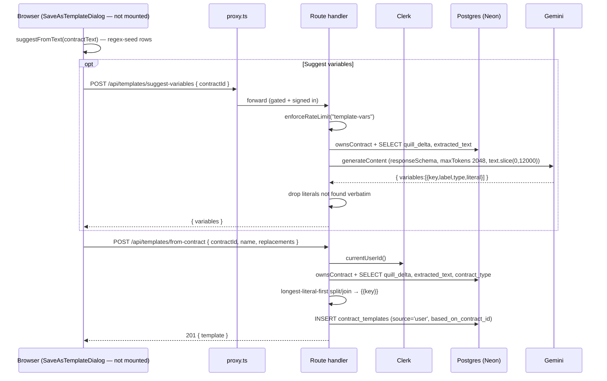

# E — Templates

_Every path that reads or writes a `contract_templates` row. Read [00-conventions](00-conventions.md) first; this file assumes the template._

Verified against `main` @ `bf4d660`.

**A template is a contract _skeleton_.** A `contract_templates` row is three parallel things:

- an authoritative `body` of German contract text carrying `{{placeholder}}` tokens;
- a structured `sections` index — one entry per §-clause: `{ key, heading, clause_type, clause_id, required }`, where `clause_id` points into the [clause library](d-clause-library.md);
- a `variables` list describing each placeholder: `{ key, label, type, required?, maps_to?, group?, expr?, options? }`, `type ∈ text | textarea | number | date | select | currency | derived`.

Templates feed generation. With **no** free-text key terms the create-contract modal renders the `body` deterministically — pure `{{key}}` substitution, no AI ([B9](b-getting-a-contract-in.md#b9)). With key terms it injects the rendered `body` into the LLM prompt as a _binding structure_ ([B8](b-getting-a-contract-in.md#b8)). The render engine itself (`src/lib/templates/render.ts` — `{{key}}` substitution, `{{section:key}}` line-pruning, the whitelist arithmetic evaluator for `derived` vars, `formatEur`) is documented in [B9](b-getting-a-contract-in.md#b9); this file is about **managing** templates, not rendering them.

**Two visibility classes** (same as the [clause library](d-clause-library.md)): a signed-in user sees their own rows (`t.user_id = <clerk id>`) plus every curated row (`t.user_id is null`); curated rows are read-only, re-checked with `ownsTemplate` (`src/lib/auth.ts:57-63`). Signed-out → empty list — except `/api/templates/suggest-variables`, which is compute-gated.

| id | Workflow |
|----|----------|
| [E1](#e1) | Gallery browse / filter / search |
| [E2](#e2) | Preview |
| [E3](#e3) | Use a template — the render-vs-generate decision |
| [E4](#e4) | Create / edit / delete a template |
| [E5](#e5) | ⚠ Save-as-template + AI suggest-variables (routes live, dialog unmounted) |
| [E6](#e6) | Curated seeding (operator) |

---

## <a id="e1"></a>E1 — Gallery browse / filter / search

**0 · TL;DR** — Opening `/templates` fires one `GET /api/templates`; the handler returns the caller's own rows plus every curated row, filtered by the contract-type `<Select>`, the All / Curated / Mine tabs, and an `ILIKE` search over name / name_en / description, ordered approved-first then most-recently-updated, rendered as a Card grid.

**1 · Entry point** — `/templates` — `src/app/(workspace)/templates/page.tsx`. `load` (`:36-49`) builds the query string from `contractType` (the `<Select>`, options from `CONTRACT_TYPES`, `:96-104`), the `All / Curated / Mine` `.seg` tabs (`:106-114`, mapping to `source=curated|user`), and the search box (`:117-131`). `useEffect` re-runs `load` on change (`:51`). Handler: `src/app/api/templates/route.ts:7` (`GET`).

**2 · Preconditions** — Signed in to see anything. `GET /api/templates` is not gated, not rate-limited; the handler calls `currentUserId()` and returns `{ templates: [], total: 0 }` when there is no user (`route.ts:9`). The page shows a "Sign in to use templates" panel when Clerk reports signed-out (`page.tsx:64-79`).

**3 · Trace**
```
GET /api/templates · auth: currentUserId · limit: none
  req  ?contract_type &source=curated|user &language &q &limit &offset
  res  { templates: ContractTemplate[], total }   |   signed out → { templates: [], total: 0 }
```
1. `route.ts:14-26` — parse; `source` coerced to `"curated" | "user"` or dropped.
2. `route.ts:19` — `listTemplates({ userId, contractType, source, language, q, limit, offset })` (`src/lib/contract-templates.ts:76`).
3. `contract-templates.ts:84-85` — visibility: `(t.user_id = $1 or t.user_id is null)`.
4. `:87-90` — optional `t.contract_type = $n`, `t.source = $n`, `t.language = $n`.
5. `:92-94` — `q` branch: `(t.name ilike $like or t.name_en ilike $like or t.description ilike $like)` with `$like = "%" + q.trim() + "%"`. There is **no** full-text index on `contract_templates` — this is a sequential `ILIKE` scan (`contract_templates` indexes are `user_id`, `contract_type`, `tags`, and the curated `doc_ref` unique — `db/schema.sql:308-314`).
6. `:96-99` — `select count(*)` for `total`.
7. `:102-109` — `select <COLUMNS> from contract_templates t where <where> order by t.is_approved desc, t.updated_at desc limit $n offset $n`. `limit` clamped `1..200` (default 100). `COLUMNS` (`:56-61`) computes `(user_id is null) as readonly`.
8. `route.ts:27` — `{ templates, total }`. The page renders `<TemplateCard>` per row (`page.tsx:137-152`): name, `contract_type` pill, `language` chip, `sections.length` §-clauses + `variables.length` vars, `<ApprovalBadge>`, and "Use" / "Preview" / "Edit" buttons ("Edit" only when `!readonly`).

**4 · Database effects** — Read-only. `contract_templates` — count + page `SELECT` (`contract-templates.ts:97`, `:104`). No transaction. See [H6](h6-database-schema.md#tables).

**7 · Failure modes**

| Trigger | Behaviour | User sees | Survives |
|---------|-----------|-----------|----------|
| Signed out (race past the panel) | `{ templates: [], total: 0 }` 200 | empty grid | n/a |
| DB throw in `listTemplates` | `catch` → `{ error: <raw DB message> }` 500 ([H3](h3-error-taxonomy.md) LEAK), no `console.error` (`route.ts:28`) | grid stays empty (page never checks `res.ok`, `page.tsx:43-46`) | n/a |
| `q` with accented chars vs unaccented name | `ILIKE` is case- but not accent-insensitive | fewer hits than expected | n/a |

**8 · Sequence diagram**



**9 · Observability notes**
> **What you can see today.** Nothing on success. A `listTemplates` throw returns the raw DB message and does not `console.error` (`route.ts:28`).
> **What you can't.** Gallery-browse volume. Which contract types / scopes users filter by. The zero-result rate. Whether the unindexed `ILIKE` scan is slow.
>
> | # | Blind spot | Class | Cheapest fix |
> |---|-----------|-------|--------------|
> | E1-O1 | No browse/filter telemetry | NO-METRIC | `console.info("[templates] list", { scope, contractType, n, ms })` — tier 0 |
> | E1-O2 | Raw DB error leaked, not logged | LEAK + NO-LOG | `errorResponse(err, "templates.list")` — tier 0 |
> | E1-O3 | `ILIKE` search cost unmeasured | NO-METRIC | log query `ms` — tier 0 |

**10 · See also** — [E2](#e2) (Preview, from the same card), [E3](#e3) (the "Use" button), [E4](#e4) (the "Edit" button), [H6](h6-database-schema.md#tables).

---

## <a id="e2"></a>E2 — Preview

**0 · TL;DR** — The "Preview" button on a template card opens a read-only Dialog that renders the template `body` through the Markdown pipeline; placeholders show verbatim as `{{like_this}}`. No network — the `body` is already in memory from [E1](#e1).

**1 · Entry point** — `src/components/templates/template-card.tsx` — the "Preview" button (`:57-59`) calls `onPreview(template)`; the page sets `preview` state (`templates/page.tsx:154`) and renders `<TemplatePreview template={preview} open={!!preview}>` (`src/components/templates/template-preview.tsx`).

**2 · Preconditions** — The template is already loaded ([E1](#e1)). No request, no auth check beyond having been able to list it.

**3 · Trace**
1. `template-preview.tsx:24-27` — `html = useMemo(() => markdownToHtml(template.body), [template])`.
2. `src/lib/markdown.ts:markdownToHtml` — `marked.parse(stripPageSeparators(s), { gfm: true, breaks: true, async: false })`. `stripPageSeparators` removes LLMWhisperer `<<<` markers (harmless here) and collapses 3+ blank lines. `{{placeholders}}` are ordinary text to `marked`, so they pass through literally.
3. `template-preview.tsx:39-42` — the HTML is written straight into the dialog body with `dangerouslySetInnerHTML` (no sanitiser — unlike the Quill clipboard path the comment in `markdown.ts` describes, this render bypasses Quill). The header shows `contract_type · LANG · N sections · M variables` and an `<ApprovalBadge>`.

**4 · Database effects** — None.

**7 · Failure modes**

| Trigger | Behaviour | User sees | Survives |
|---------|-----------|-----------|----------|
| `body` contains raw HTML / a `<script>` | `marked` passes HTML through; injected unsanitised into the dialog | rendered HTML — self-XSS only (a user's own template, or a trusted curated one; cross-user is impossible under the visibility rule) | n/a |
| `body` is empty | empty prose block | blank preview | n/a |
| Malformed Markdown | `marked` is lenient — best-effort render | slightly off formatting | n/a |

**8 · Sequence diagram**



**9 · Observability notes**
> **What you can see today.** Nothing — pure client render, no network.
> **What you can't.** How often templates are previewed (a discovery-funnel signal before "Use"). Whether a template `body` carries HTML that renders unexpectedly.
>
> | # | Blind spot | Class | Cheapest fix |
> |---|-----------|-------|--------------|
> | E2-O1 | No preview-open signal | NO-METRIC | `console.info("[templates] preview", { id })` in `onPreview` — tier 0 |
> | E2-O2 | `body` HTML injected without a sanitiser | LEAK | run `markdownToHtml` output through a sanitiser (or the Quill pipeline) before `dangerouslySetInnerHTML` — tier 1 |

**10 · See also** — [E1](#e1) (the host card), [B9](b-getting-a-contract-in.md#b9) (how `body` is actually rendered into a contract), [E4](#e4) (editing `body`).

---

## <a id="e3"></a>E3 — Use a template — the render-vs-generate decision

**0 · TL;DR** — In the create-contract modal, "From template" + a chosen template, then one branch: **empty** key-terms box → `useRender = true` → `POST /api/templates/{id}/render` (deterministic, no AI, [B9](b-getting-a-contract-in.md#b9)); **non-empty** key terms → `useRender = false` → `POST /api/generate` with `templateId` + `values` (the template as a binding structure, [B8](b-getting-a-contract-in.md#b8)). Both then save a bare `contracts` row and open `/review?…&mode=create`.

**1 · Entry point** — `src/components/create-contract-modal.tsx`. Step 1 is the `Blank / From template` `.seg` tab-list (`:197-212`, `role="tablist"`); "From template" sets `mode = "template"` and loads `/api/templates` into the `<Select>` (`:106-114`). The decision variable is **`useRender = mode === "template" && !keyTerms.trim()`** (`:124`). `submitLabel` reflects it (`:172-178`): `"Use template"` (render) / `"Generate with AI"` (template + key terms) / `"Generate Contract"` (blank). `handleSubmit` (`:131-170`) assembles `GenerateParams`; for template mode it copies `templateValues` and, for each variable whose `maps_to` is in `MODAL_BOUND` (`landlord`, `tenant`, `propertyAddress`, `baseRentEur`, `operatingCostsEur`, `depositEur` — `:33-35`), binds the value from the modal's own party / rent fields (`:144-158`). The downstream orchestration is the dashboard `onGenerate` handler (`src/app/(workspace)/dashboard/page.tsx:409-479`), which branches on `useRender && templateId` (`:416-421`).

**2 · Preconditions** — Signed in. `canSubmit` requires a name, an effective contract type, both parties, and — in template mode — a selected `templateId` (`create-contract-modal.tsx:122`). For a German lease template (`contract_type === "Lease Agreement"`), `leaseOk` also requires a property address and a finite `baseRentEur > 0` (`:120`). This section is a **pure client-side decision** — no network happens until a branch is chosen; the branch targets are traced in [B8](b-getting-a-contract-in.md#b8) / [B9](b-getting-a-contract-in.md#b9).

**3 · Trace**
1. `create-contract-modal.tsx:124` — compute `useRender`.
2. `:143-158` — build `values`: start from `templateValues` (the `<VariableFields>` form, `src/components/templates/variable-fields.tsx`, which groups vars by `group`, honours `type`, renders `derived` read-only with the live `computeDerived` value, and suppresses `maps_to`-bound keys via `hiddenKeys`), then overlay the six modal-bound fields.
3. `:160-169` — `onGenerate({ …, templateId, values, useRender })` (only when `mode === "template" && templateId`).
4. `dashboard/page.tsx:416-421` — **branch**:
   - `useRender && templateId` → `fetch("/api/templates/" + templateId + "/render", { method: "POST", body: { values, language } })` → `{ text, missing }` ([B9](b-getting-a-contract-in.md#b9)).
   - else → `fetch("/api/generate", { method: "POST", body: { contractType, party1, party2, language, keyTerms, propertyAddress, baseRentEur, operatingCostsEur, depositEur, templateId, values } })` → `{ text, … }` ([B8](b-getting-a-contract-in.md#b8) for the template-constrained path; [B6](b-getting-a-contract-in.md#b6) / [B7](b-getting-a-contract-in.md#b7) for the non-template paths).
5. `dashboard/page.tsx:427-430` — if the response carries a non-empty `missing[]`, a non-blocking `setSeedError` warning ("Template rendered with unfilled fields: … You can fix them in the editor.").
6. `:446-461` — `POST /api/contracts { name, contract_type, extracted_text: text, risk_level: "low", clauses: [] }` — bare row, no clauses, hardcoded `low`. ⚠ `templateId` is **not** forwarded into the save body, so `contracts.template_id` stays null (same gap as [B8](b-getting-a-contract-in.md#b8)).
7. `:470-473` — `router.push("/review?contractId=<id>&file=<name>&type=<type>&mode=create")`.

**4 · Database effects** — None in the decision itself. Downstream: the render route writes nothing ([B9](b-getting-a-contract-in.md#b9) §4); `/api/generate` writes nothing ([B8](b-getting-a-contract-in.md#b8) §4); then one bare `contracts` row from the save, zero `risk_clauses`.

**7 · Failure modes**

| Trigger | Behaviour | User sees | Survives |
|---------|-----------|-----------|----------|
| Template mode, no template chosen | `canSubmit` false (`:122`) | disabled submit button | n/a |
| Lease template, address / rent missing | `leaseOk` false (`:120`) → `canSubmit` false | disabled submit button | n/a |
| Key terms typed by mistake | `useRender` flips to `false` → an LLM call the user may not have expected (costs a `generate` rate-limit unit) | "Generate with AI" label instead of "Use template" | a drafted contract |
| `maps_to` var not in `MODAL_BOUND` | not auto-bound; must be filled in `<VariableFields>` or it renders as unfilled → `missing[]` | non-blocking "unfilled fields" warning | contract with literal `{{key}}` in it |
| Render / generate / save failure | handled downstream — see [B9](b-getting-a-contract-in.md#b9) / [B8](b-getting-a-contract-in.md#b8) / [B6](b-getting-a-contract-in.md#b6) §7 | toast, modal closes | nothing |

**8 · Decision diagram**

```mermaid
flowchart TD
  A[Create modal: Blank or From template] --> B{mode == template?}
  B -- no --> G[POST /api/generate — blank draft — see B6/B7]
  B -- yes --> C{keyTerms box empty?}
  C -- yes --> D[useRender = true]
  C -- no --> E[useRender = false]
  D --> F[POST /api/templates/:id/render — deterministic, no AI — see B9]
  E --> H[POST /api/generate with templateId + values — template as binding structure — see B8]
  G --> I[POST /api/contracts  extracted_text=text  clauses=[]]
  F --> I
  H --> I
  I --> J[/review?contractId&mode=create/]
```

**9 · Observability notes**
> **What you can see today.** Nothing about the choice. `onGenerate`'s `catch` logs `console.error("[generate]", err)` (`dashboard/page.tsx:475`) for any throw, render or generate alike — with no field saying which branch ran. A `missing[]` warning is shown, not logged.
> **What you can't.** How often users pick render vs. AI-generate from a template. How often a stray character in the key-terms box silently upgrades a free render into a paid LLM call. Which templates get used at all (and via which branch).
>
> | # | Blind spot | Class | Cheapest fix |
> |---|-----------|-------|--------------|
> | E3-O1 | Render-vs-generate branch ratio uncounted | NO-METRIC | `console.info("[create] branch", { useRender, templateId })` before the fetch — tier 0 |
> | E3-O2 | Key-terms box silently changing the branch (and the cost) | NO-LOG | in the modal, warn when `mode==="template"` and `keyTerms` is non-empty — tier 0 |
> | E3-O3 | `[generate]` error log doesn't say render or generate | THIN-LOG | include `{ branch }` in the `console.error` — tier 0 |

**10 · See also** — [B8](b-getting-a-contract-in.md#b8) (AI path, downstream), [B9](b-getting-a-contract-in.md#b9) (render path + the render engine), [E1](#e1) (the "Use" button pre-selects a template), [H2](h2-rate-limiting.md#tiers) (`generate` tier).

---

## <a id="e4"></a>E4 — Create / edit / delete a template

**0 · TL;DR** — `TemplateEditor` POSTs a user-owned template (`source='user'`, `is_approved=false`) or PATCHes the editable fields of one the caller owns; the editor never sends `sections`. Curated rows are read-only — a write to one 403s. Delete is a soft-delete.

**1 · Entry point** — `/templates` — `src/components/templates/template-editor.tsx`. "New template" (`templates/page.tsx:92`) opens it with `template == null`; the card's "Edit" button (only rendered when `!readonly`, `template-card.tsx:60-64`) opens it on that row. The body `<textarea>` has a row of `+ {{var}}` inserter buttons, one per declared variable (`template-editor.tsx:158-167`, `insertPlaceholder` `:56-67`); `sections` are shown **read-only** (`:177-188`); the variables editor supports `derived` with a per-row `expr` input (`:238-248`). `save()` (`:73-106`) → `POST /api/templates` or `PATCH /api/templates/{id}`. Handlers: `src/app/api/templates/route.ts:35` (`POST`), `src/app/api/templates/[id]/route.ts:25` (`PATCH`), `:57` (`DELETE`).

**2 · Preconditions** — Signed in — all three call `signInRequired()` when there is no user (`route.ts:37`, `[id]/route.ts:27`, `:59`). Not gated, not rate-limited. `PATCH` / `DELETE` require `ownsTemplate(id, userId)` (`src/lib/auth.ts:57-63` — false for a curated row).

**3 · Trace**
```
POST /api/templates · auth: currentUserId · limit: none
  req  { name, contract_type, body, language?, name_en?, description?,
         sections?, variables?, tags? }
  res  201 { template: ContractTemplate }

PATCH /api/templates/{id} · auth: ownsTemplate · limit: none
  req  { any of: name, name_en, description, contract_type, language,
         body, body_en, sections, variables, tags, is_approved }
  res  { template }   |   403 { error: "curated templates are read-only" }   |   404

DELETE /api/templates/{id} · auth: ownsTemplate · limit: none
  res  { ok: true }   |   403   |   404
```

**Create**
1. `route.ts:35-37` — `signInRequired()` if no user.
2. `:44-59` — validate: `name`, `contract_type`, non-blank `body` all required (400 otherwise); `language` defaults to `"de"`, must be `"de"` or `"en"` (400 otherwise).
3. `:68-78` — `createTemplate(userId, { name, contract_type, body, language, name_en, description, sections, variables, tags })` (`src/lib/contract-templates.ts:143`):
   - `insert into contract_templates (user_id, name, name_en, description, contract_type, language, body, body_en, sections, variables, tags, based_on_contract_id, source) values ($1..$8, $9::jsonb, $10::jsonb, $11, $12, 'user') returning <COLUMNS>` (`:145-166`).
   - `sections` / `variables` are `JSON.stringify`-ed and cast `::jsonb`; **`source` is the literal `'user'`**; `is_approved` is the DB default `false`; `based_on_contract_id` is null (only [E5](#e5) sets it).
   - ⚠ The editor's `save()` payload sends only `name`, `contract_type`, `description`, `language`, `body`, `tags`, `variables` (`template-editor.tsx:76-84`) — **no `sections`, no `name_en`, no `body_en`** — so a template made in the UI has an empty `sections` index.
4. `route.ts:79` — `201 { template }`; the page prepends it to the grid (`templates/page.tsx:53-63`).

**Edit**
1. `[id]/route.ts:29-34` — `ownsTemplate(id, userId)`. On false, `getTemplate(id, userId)`: visible + `readonly` → `403 { error: "curated templates are read-only" }` (`CURATED_READONLY`, `:7`); else `404`.
2. `:41-46` — parse; a `language` present but not `"de"`/`"en"` → 400.
3. `:49` — `updateTemplate(id, userId, body)` (`contract-templates.ts:180`): iterate `body`; only keys in `EDITABLE` (`:169-172` — includes `sections`, `variables`, `is_approved`) become `SET` fragments; `sections` / `variables` are re-serialised and cast `::jsonb` (`JSONB_COLS`, `:173`); `is_approved` truthy → also `approved_by = $userId`, `approved_at = now()`, falsy → both nulled; `update contract_templates set <sets> where id = $n-1 and user_id = $n and deleted_at is null returning <COLUMNS>` (`:214-217`). The `contract_templates_updated_at` trigger bumps `updated_at` (`db/schema.sql:316-318`).
4. `[id]/route.ts:50-52` — `{ template }`, or 404 if nothing matched.

**Soft-delete**
1. `[id]/route.ts:60-65` — same `ownsTemplate` → 403 / 404 gate.
2. `:67` — `softDeleteTemplate(id, userId)` (`contract-templates.ts:222`): `update contract_templates set deleted_at = now() where id = $1 and user_id = $2 and deleted_at is null returning id`.
3. `:68` — `{ ok: true }` regardless of match. `contracts.template_id` FK is `on delete set null` (`db/schema.sql:322-324`) — but this is a **soft** delete, so the row stays and the FK is never triggered.

**4 · Database effects** — `contract_templates`: 1 `INSERT` (`source='user'`, `is_approved=false`) / 1 dynamic `UPDATE` (+ `updated_at` trigger) / 1 soft-delete `UPDATE`. Each is a single statement, no transaction. Owner-check constraint `contract_templates_owner_ck` (`db/schema.sql:304-306`) enforces `(source = 'curated') = (user_id is null)`. See [H6](h6-database-schema.md#tables).

**7 · Failure modes**

| Trigger | Behaviour | User sees | Survives |
|---------|-----------|-----------|----------|
| PATCH / DELETE a curated row | `ownsTemplate` false → `getTemplate().readonly` → `403 { error: "curated templates are read-only" }` | that message | curated row untouched |
| PATCH / DELETE another user's or a missing row | `ownsTemplate` false → not `readonly` → `404` | "Not found" | untouched |
| Missing `name` / `contract_type` / `body` on create | 400 (`route.ts:47`) | error string in the editor | nothing |
| Invalid `language` | 400 (`route.ts:56`, `[id]/route.ts:43`) | error string | nothing |
| Edit a UI-created template's `sections` | impossible from the editor (never sent, and shown read-only); only a direct PATCH can (`sections` is in `EDITABLE`) | sections frozen at whatever create set (empty for UI-made) | n/a |
| DB throw on any route | `catch` → `{ error: <raw DB message> }` 500 ([H3](h3-error-taxonomy.md) LEAK), no `console.error` (`route.ts:79`, `[id]/route.ts:51`, `:69`) | raw message in the editor error line | depends |

**8 · Sequence diagram**



**9 · Observability notes**
> **What you can see today.** Nothing on success. All three routes return the raw DB message on a throw and none `console.error`.
> **What you can't.** Create / edit / delete volume. How many user templates exist. That UI-created templates always have an empty `sections` index (so their downstream `{{section:key}}` pruning is a no-op). Curated-write 403s (a UI-bug canary).
>
> | # | Blind spot | Class | Cheapest fix |
> |---|-----------|-------|--------------|
> | E4-O1 | No write telemetry | NO-METRIC | one `console.info` per verb with `{ id, userId }` — tier 0 |
> | E4-O2 | Raw DB error leaked + unlogged on all three routes | LEAK + NO-LOG | `errorResponse(err, "templates.write")` — tier 0 |
> | E4-O3 | UI-created templates silently have no `sections` | NO-LOG | have the editor send a derived `sections` (or warn) — tier 1 |
> | E4-O4 | Curated-write 403s not counted | NO-METRIC | `console.warn("[templates] curated write blocked", { id })` — tier 0 |

**10 · See also** — [E1](#e1) (where the new template appears), [E3](#e3) (using it), [E6](#e6) (the curated template it can't overwrite), the clause-library equivalents [D4](d-clause-library.md#d4) / [D5](d-clause-library.md#d5), [H1](h1-auth-and-ownership.md#gate).

---

## <a id="e5"></a>E5 — ⚠ Save-as-template + AI suggest-variables (routes live, dialog unmounted)

**0 · TL;DR** — A dialog that turns a contract into a reusable template — regex- and LLM-suggested `literal → {{key}}` replacements over the contract's flattened text, then `POST /api/templates/from-contract`. Both routes are live and correct, but **no component mounts `SaveAsTemplateDialog`**, so a user cannot start this flow from the app today — it is reachable only by direct HTTP.

**1 · Entry point** — ⚠ **There is no live UI entry point.** `src/components/templates/save-as-template-dialog.tsx:42` exports `SaveAsTemplateDialog`; `grep -rn "SaveAsTemplate" src` returns only that definition line — it is never imported or rendered anywhere. The `/templates` empty-state copy ("…or open a contract and choose "Save as template"", `templates/page.tsx:137`) points at a flow that has no trigger. The only ways to invoke this workflow are direct requests to:
- `POST /api/templates/from-contract` — `src/app/api/templates/from-contract/route.ts:14`
- `POST /api/templates/suggest-variables` — `src/app/api/templates/suggest-variables/route.ts:33`

The dialog described in §3 documents the **intended** UI, not a shipping one.

**2 · Preconditions** — Signed in for both.
- `from-contract`: `signInRequired()` (`route.ts:15-16`), then `ownsContract(contractId, userId)` → 404 if not (`:28-30`). **Not** compute-gated, **not** rate-limited — it makes no external call.
- `suggest-variables`: in [`GATED_COMPUTE_PATHS`](h1-auth-and-ownership.md#gate) (`src/proxy.ts:20`) — a guest POST 401s at the middleware. In the handler, `enforceRateLimit(req, "template-vars")` runs first (`route.ts:35-36`), then `signInRequired()` (`:38-39`), then `ownsContract` → 404 (`:47-49`). Rate tier `template-vars` = 15/h · 40/d, plus global `compute` 200/h · 600/d ([H2](h2-rate-limiting.md#tiers)).

**3 · Trace** — two independent routes.

### Route A — `POST /api/templates/suggest-variables`
```
POST /api/templates/suggest-variables · auth: proxy-gated · limit: template-vars 15/h · 40/d
  req  { contractId }
  res  { variables: [{ key, label, type, literal }] }
```
1. `route.ts:34-35` — `enforceRateLimit(req, "template-vars")`; a 429 returns here.
2. `:37-38` — `signInRequired()` if no user.
3. `:40-50` — parse `contractId` (400 `missing_contract` if absent, `:47`); `ownsContract` → 404 `not_found` (`:48-50`).
4. `:52-60` — `select quill_delta, extracted_text from contracts where id = $1 and user_id = $2 and deleted_at is null`; flatten to text: `(quill_delta ? deltaToText(quill_delta) : extracted_text ?? "").trim()` (`src/lib/delta-text.ts`); 400 `empty_contract` if blank (`:60`).
5. `:62-75` — German prompt: extract the spans that _vary between contracts_ (party names, addresses, EUR amounts, dates, deadlines, IBAN, areas, counts). Rules baked into the prompt: `literal` must be a verbatim, unique, minimal substring; `key` is camelCase; `type ∈ text | textarea | number | date | currency`; ≤ 20 entries. Input is `text.slice(0, 12000)` (`:74`).
6. `:77-81` — `askLLM({ prompt, maxTokens: 2048, responseSchema: RESPONSE_SCHEMA })`, where the schema requires each item to have `key`, `label`, `type`, `literal` (`:12-31`).
7. `:83-88` — `JSON.parse(raw)`; a parse failure → `AppError(502, "llm_parse")`.
8. `:90-101` — keep only entries whose `literal` occurs verbatim in the **full** contract text (`text.includes(v.literal)`, `:93`) — the handler **drops any `literal` not found verbatim**; sanitise `key` to `\w` (`:95`), default `type` to `text`, cap at 20 (`:101`).
9. `:103` — `{ variables }`. Any thrown error → `errorResponse(err, "template-vars")` (`:104-105`) — logs server-side, returns a generic message.

### Route B — `POST /api/templates/from-contract`
```
POST /api/templates/from-contract · auth: ownsContract · limit: none
  req  { contractId, name, replacements: [{ literal, key, label?, type? }] }
  res  201 { template: ContractTemplate }
```
1. `route.ts:14-15` — `signInRequired()` if no user. (Not gated, not rate-limited.)
2. `:24-28` — `contractId` + `name` both required (400 otherwise).
3. `:29-31` — `ownsContract(contractId, userId)` → 404.
4. `:33-43` — normalise `replacements`: keep entries with string `literal` + `key` (`:34`); `key` → `\w`-only (`:37`); `label` defaults to `key`; `type` must be in `{ text, textarea, number, date, select, currency }` else `text`; drop empty (`:41`); **sort longest `literal` first** (`:43`) so a short literal can't chew into a longer match.
5. `:46-58` — `select quill_delta, extracted_text, contract_type from contracts where id = $1 and user_id = $2 and deleted_at is null`; flatten as Route A; 400 if no text (`:56-58`).
6. `:60-62` — deterministic replace: for each replacement, `text = text.split(r.literal).join("{{" + r.key + "}}")` — every occurrence, no regex, no LLM.
7. `:64-71` — de-dupe variables by `key` (a literal may be entered twice); every var is `{ key, label, type, required: true }`.
8. `:73-81` — `createTemplate(userId, { name, contract_type: contract.contract_type || "Other", body: text, variables, sections: [], based_on_contract_id: contractId, description: "Created from a contract on <YYYY-MM-DD>." })`.
9. `:83` — `201 { template }`. A thrown error → `{ error: (err as Error).message }` 500 (`:84-86`) — raw message, [H3](h3-error-taxonomy.md) LEAK, no `console.error`.

### The (unmounted) dialog
`save-as-template-dialog.tsx` would drive both: `suggestFromText` (`:28-40`) regex-seeds rows from currency (`… EUR|€`), `dd.mm.yyyy`, `1. Januar 2024`-style, and `DE…` IBAN patterns (`:21-26`); the "Suggest variables" button → Route A, merging non-duplicate literals (`:88-116`, a 429 → an inline "AI suggestion limit reached" notice `:98-102`); a live `<pre>` preview applies the same longest-first `split`/`join` (`:71-77`); rows whose `literal` isn't found verbatim are flagged and excluded from the payload (`:79-85`, `:127-135` sends only `rows.filter(r => r.literal.trim() && r.key.trim())`); "Save template" → Route B, then `onSaved(template)`.

**4 · Database effects** — `suggest-variables`: read-only (`contracts` select). `from-contract`: 1 `contract_templates` `INSERT` via `createTemplate` (`source='user'`, `is_approved=false`, `based_on_contract_id = contractId`, `sections = []`); single statement, `contract_templates_updated_at` trigger. `contracts.template_id` is **not** touched. See [H6](h6-database-schema.md#tables).

**5 · External calls** — `suggest-variables` only: one `askLLM` call — `maxTokens 2048`, input `text.slice(0, 12000)`, structured output via `responseSchema`. Model pin: [H5](h5-llm-layer.md#pins); `maxTokens` context: [H5](h5-llm-layer.md#token-caps). `from-contract` makes **no** external call.

**6 · End state** — A new user-owned template: `body` is the contract text with the supplied literals swapped for `{{key}}`, `variables` all `required: true`, `sections` empty, `based_on_contract_id` set. It appears immediately in [E1](#e1) and is usable in [E3](#e3) / [B8](b-getting-a-contract-in.md#b8) / [B9](b-getting-a-contract-in.md#b9). No redirect (the dialog would just call `onSaved`).

**7 · Failure modes**

| Trigger | Behaviour | User sees | Survives |
|---------|-----------|-----------|----------|
| No live UI mounts `SaveAsTemplateDialog` | — | nothing — the flow cannot be started from the app | n/a |
| `suggest-variables`, guest | 401 at middleware ([gated](h1-auth-and-ownership.md#gate)) | — | nothing |
| `suggest-variables`, rate-limited | 429 `template-vars` + `rate_limit_blocks` row | (dialog) "AI suggestion limit reached…" | nothing |
| `suggest-variables`, model returns non-JSON | `AppError(502, "llm_parse")` | "unexpected result" | nothing |
| Model invents a `literal` not in the text | dropped at `suggest-variables/route.ts:93` | fewer variables than proposed | — |
| `from-contract`, not the contract owner | 404 | "Not found" | nothing |
| `from-contract`, contract has no text | 400 "no text to templatise" | that message | nothing |
| Two `replacements` with the same `key` | var de-duped (first wins), but **both literals are still replaced** in the body | one `{{key}}` spanning two source spans | template saved |
| Overlapping literals (one a substring of another) | longest-first sort (`from-contract/route.ts:43`) makes it deterministic; a partial overlap that isn't a clean substring can still double-replace | `{{a}}` nested inside `{{b}}` | template saved as-is |
| `from-contract` DB throw | raw `.message` 500 (LEAK), no `console.error` (`from-contract/route.ts:84-86`) | generic error | possibly nothing |

**8 · Sequence diagram**



**9 · Observability notes**
> **What you can see today.** `suggest-variables`: `errorResponse(err, "template-vars")` `console.error`s on an unexpected throw (`src/lib/errors.ts:26`), and a 429 writes a `rate_limit_blocks` row ([H2](h2-rate-limiting.md#tables)). `from-contract`: **nothing** — success and failure both silent, and the 500 branch returns the raw error without logging (`from-contract/route.ts:84-86`).
> **What you can't.** That `SaveAsTemplateDialog` is dead code (no build / lint signal). How many variables the model proposes vs. how many survive the verbatim-match filter. Whether `from-contract` produced a clean body or a double-replaced mess. How often anyone reaches this flow (zero from the UI, today).
>
> | # | Blind spot | Class | Cheapest fix |
> |---|-----------|-------|--------------|
> | E5-O1 | `SaveAsTemplateDialog` defined, never mounted — no signal | NO-METRIC | a smoke test / lint rule for unreferenced exported components; mount it or delete it — tier 1 |
> | E5-O2 | `from-contract` logs nothing and leaks the raw DB message | LEAK + NO-LOG | `errorResponse(err, "templates.from-contract")` + an info line `{ replacements, bodyChars }` — tier 0 |
> | E5-O3 | suggest-variables: proposed-vs-kept variable count invisible | NO-METRIC | log `{ proposed, kept }` after the `text.includes` filter — tier 0 |
> | E5-O4 | Double-replacement / overlapping-literal corruption is silent | NO-LOG | after the split/join loop, log any `{{key}}` that landed inside another token — tier 0 |

**10 · See also** — [E4](#e4) (the normal template editor), [E6](#e6), [B8](b-getting-a-contract-in.md#b8) / [B9](b-getting-a-contract-in.md#b9) (what a saved template feeds), [H2](h2-rate-limiting.md#tiers) (`template-vars`), [H5](h5-llm-layer.md).

---

## <a id="e6"></a>E6 — Curated seeding (operator)

_Operator workflow — the compressed five-section form. No user entry point, no diagram, no failure table._

**1 · Entry point** — `npm run seed:templates` → `node scripts/seed-templates.mjs` (`scripts/seed-templates.mjs:1-3`). No `--embed` variant — templates are not embedded.

**2 · Preconditions** — `DATABASE_URL` in `lexora/.env.local`. `db/007_contract_templates.sql` applied (it creates the `template_source` enum, the table, indexes, and the `contracts.template_id` column; itself requires `db/006`). **`npm run seed:library` must have run first** — `buildTemplate` resolves each `sections[].clause_id` from `clause_library` by `doc_ref = '22-vorlage#pN'` (`scripts/seed-templates.mjs:90-93`) and hard-errors if a lookup misses (`:94-99`). Talks to the DB via `ragQuery` / `endRagPool` (`src/lib/rag/db.ts`).

**3 · Trace**
1. `seed-templates.mjs:78` — `parseTemplateClauses()` (`src/lib/library/parse-corpus.ts:123`) → doc `22`'s 11 `## § N …` sections, cleaned text.
2. per section (`:82-110`): `topicForParagraph(para)` (`src/lib/clause-taxonomy.ts`) → the section `key` / `clause_type`; `select id from clause_library where doc_ref = '22-vorlage#p<n>' and source = 'curated' and deleted_at is null` (`:90-93`) → `sections[].clause_id`; hard-error if missing (`:94-99`).
3. `rewritePlaceholders(para, content)` (`:25-52`) — swap the corpus' `[Adresse, Etage, Lage]`, `[Datum]`, `[Summe]`, `[IBAN]`, `[max. drei Nettokaltmieten]`, … tokens for `{{propertyAddress}}`, `{{startDate}}`, `{{totalRentEur}}`, `{{iban}}`, `{{depositEur}}`, …; the two `[Betrag]` in § 3 are positional — first → `{{baseRentEur}}` (Nettokaltmiete), second → `{{operatingCostsEur}}` (`:38-42`); any leftover `[...]` → hard error (`:44-50`).
4. `:100-113` — `body` = `### <title>\n\n<text>` joined per section; `sections` = `[{ key, heading, clause_type, clause_id, required }]`, `required` true for §§ 1–3 (`REQUIRED_SECTIONS`, `:54`).
5. `VARIABLES` (`:56-74`) — **14** entries: 6 bound to modal fields via `maps_to` (`party1`→`landlord`, `party2`→`tenant`, `propertyAddress`, `baseRentEur`, `operatingCostsEur`, `depositEur`), 7 new (`startDate`, `rooms`, `areaSqm`, `iban`, `extras`, `keys`, `nebenraeume`), and 1 `derived` — `totalRentEur`, `expr: "baseRentEur + operatingCostsEur"`.
6. `upsert()` (`:116-152`) — `insert into contract_templates (user_id, name, name_en, description, contract_type, language, body, sections, variables, source, doc_ref, is_approved, tags) values (null, 'Standard-Wohnraummietvertrag (Deutschland)', 'Standard residential lease (Germany)', <de description>, 'Lease Agreement', 'de', <body>, $6::jsonb, $7::jsonb, 'curated', '22-vorlage', false, ARRAY['vorlage','wohnraummietvertrag','muster','lease']) on conflict (doc_ref) where source = 'curated' do update set name, name_en, description, contract_type, body, sections, variables, tags, updated_at = now()` — `returning (xmax = 0) as was_insert`.

**4 · Database effects** — Exactly one curated `contract_templates` row: `user_id is null`, `source = 'curated'`, `doc_ref = '22-vorlage'`, `contract_type = 'Lease Agreement'`, `language = 'de'`, `is_approved = false`, **11 sections**, **14 variables**. Idempotent via the `contract_templates_curated_ref_idx` unique index (`db/schema.sql:308-309`); the `contract_templates_updated_at` trigger fires on the upsert. `sections[].clause_id` values are `clause_library` ids stored inside JSON — there is no FK on them, so if a later `seed:library` deletes-and-reinserts a curated §-clause (its orphan sweep, [D6](d-clause-library.md#d6)), the `clause_id` here goes stale silently. No transaction.

**9 · Observability notes**
> **What you can see today.** The script prints to stdout — `template`, `doc_ref`, `contract_type`, `inserted`/`updated`, `sections`, `body … chars`, `elapsed` (`seed-templates.mjs:157-165`). The one well-instrumented failure is the missing-clause hard-error (`:94-99`), which names exactly which `doc_ref` is absent and tells the operator to run `seed:library` first. Nothing is persisted about the run.
> **What you can't.** When the template was last seeded, against which corpus revision. Whether a `sections[].clause_id` has gone stale since a library re-seed. That the curated template ships `is_approved = false` with no operator step that reviews it.
>
> | # | Blind spot | Class | Cheapest fix |
> |---|-----------|-------|--------------|
> | E6-O1 | No seed-run record (time, corpus SHA) | NO-METRIC | write a `seed_runs` row — tier 2 (shared with [D6-O1](d-clause-library.md#d6)) |
> | E6-O2 | `sections[].clause_id` can dangle after a library re-seed, unnoticed | NO-LOG | after the upsert, re-select each `clause_id` and warn on a miss — tier 1 |
> | E6-O3 | Curated template ships unreviewed with no review gate | descriptive | matches [D5](d-clause-library.md#d5) — a credentials / review model is the real fix |

**10 · See also** — [D6](d-clause-library.md#d6) (`seed:library`, which must run first), [E3](#e3) / [B8](b-getting-a-contract-in.md#b8) / [B9](b-getting-a-contract-in.md#b9) (what this template feeds), [E1](#e1) (where it shows up), [H6](h6-database-schema.md#tables).
