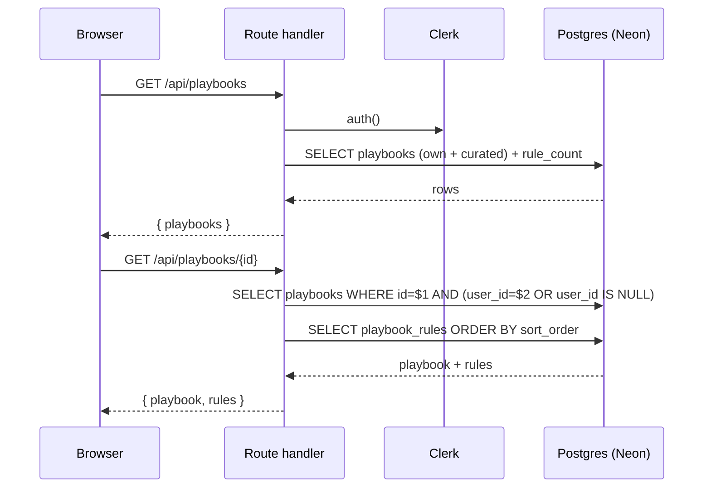
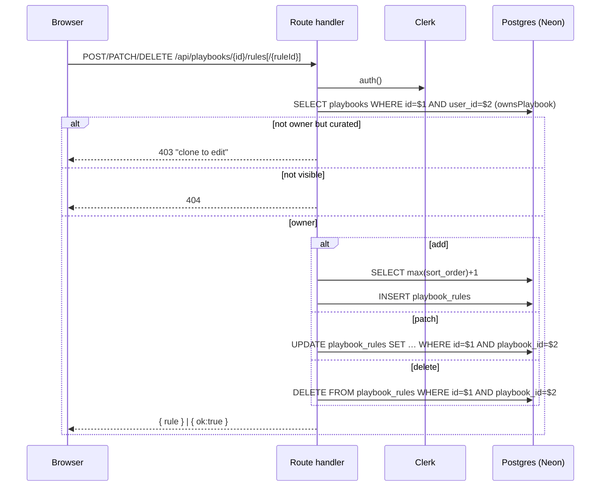
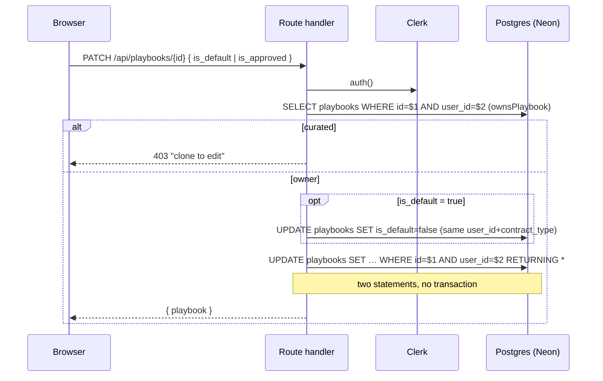
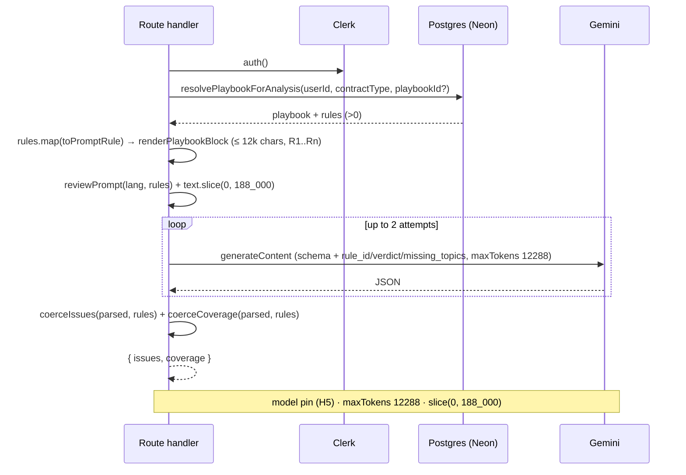

# F — Playbooks

_Encoding review **positions** and grading an analysis against them. Read [00-conventions](00-conventions.md) first; this file assumes the template._

Verified against `main` @ `bf4d660`.

**What a playbook is.** A named set of review positions — one `playbook_rules` row per clause topic, each with `acceptable` / `fallback` / `unacceptable` prose plus `rationale`, `reference` (a German norm), `severity`, `is_required`, and an optional `preferred_clause_id`. It is the structured, editable form of what `src/lib/analysis.ts` `reviewPrompt()` otherwise hardcodes. Contrast the **clause library** ([H6](h6-database-schema.md#tables)): that is *wording* (a parts bin); a playbook is *acceptance criteria* (an inspection spec). The only coupling between them is `playbook_rules.preferred_clause_id → clause_library.id`.

**Two ⚠ facts that shape every workflow below.**

1. **A curated playbook can never be the resolved analysis default.** `resolvePlaybookForAnalysis` (`src/lib/playbooks.ts:147-163`) requires `user_id = $1`; the seed writes `user_id = null, is_default = false`. Out of the box **no playbook applies to any analysis** until a user **clones** one ([F2](#f2)) *and* **sets it default** ([F4](#f4)) — or passes an explicit `playbookId`.
2. **The upload path's `contract_type` never matches.** Uploads carry a lowercase code (`lease`); `resolvePlaybookForAnalysis` matches `contract_type = $2` against the display name (`"Lease Agreement"`). So a workspace-default playbook never fires for an uploaded contract — only the review-screen re-analyse path ([C14](c3-review-ai-and-output.md)), which sends both an explicit `playbookId` and the stored `contract_type`, reaches the playbook branch.

**No Gemini lives in `/api/playbooks/*`.** None of those routes is in [`GATED_COMPUTE_PATHS`](h1-auth-and-ownership.md#gate) and none calls `enforceRateLimit` — they are plain owner-checked CRUD. The LLM only enters at [F5](#f5), inside `/api/analyse` and `/api/contracts/[id]/reanalyse`.

| id | Workflow |
|----|----------|
| [F1](#f1) | Browse + select + view rules |
| [F2](#f2) | Clone a curated playbook to edit |
| [F3](#f3) | Rule editor — add / patch / delete a rule |
| [F4](#f4) | Set default / mark approved (RDG) |
| [F5](#f5) | How a playbook reaches the model |
| [F6](#f6) | Curated seeding |

---

## <a id="f1"></a>F1 — Browse + select + view rules

**0 · TL;DR** — `/playbooks` is a master/detail screen: a left rail of `Card`s (own + system-curated), a right pane showing the selected playbook's rules ordered by `sort_order`. Two GETs, no writes.

**1 · Entry point** — `/playbooks`, `PlaybooksPage` (`src/app/(workspace)/playbooks/page.tsx:14`). `loadList()` runs on mount once signed in (`:28-43`); selecting a card sets `selectedId`, and a second effect calls `loadDetail(id)` (`:45-58`).

**2 · Preconditions** — Signed in. `isLoaded && !isSignedIn` renders a "Sign in to use playbooks" card and nothing fetches (`:124-140`). `GET /api/playbooks` also returns `{ playbooks: [] }` for a guest regardless (`src/app/api/playbooks/route.ts:9`).

**3 · Trace**
```
GET /api/playbooks  ·  auth: currentUserId  ·  limit: none
  req  (query) ?contract_type=<display name>        [the page sends none]
  res  { playbooks: [{ …, source, is_default, is_approved, readonly, rule_count }] }
       signed-out → { playbooks: [] }
```
1. `playbooks/page.tsx:31` — `fetch("/api/playbooks")`. Handler `src/app/api/playbooks/route.ts:7`: `currentUserId()`; null → `{ playbooks: [] }` (`:9`).
2. `listPlaybooks(userId, contract_type?)` (`src/lib/playbooks.ts:72-92`) — `where p.deleted_at is null and (p.user_id = $1 or p.user_id is null)`, optional `and (p.contract_type = $2 or p.contract_type = '')`, `order by p.is_default desc, p.source asc, p.updated_at desc`, plus a correlated `count(*) as rule_count`. `readonly` is the computed column `(user_id is null)` (`:59`).
3. `PlaybookList` (`src/components/playbooks/playbook-list.tsx`) renders one `Card` per row: name; a `Star` when `is_default` (`:34-38`); `<ApprovalBadge approved={is_approved}/>`; a `Curated`/`Mine` pill from `source` (`:42-44`); the `contract_type` or `Any type` pill (`:45-49`); `rule_count` (`:50-52`). `page.tsx:35` auto-selects `list[0]`.
4. On select → `loadDetail(id)` (`:45-54`):
```
GET /api/playbooks/{id}  ·  auth: currentUserId (visibility: own or curated)  ·  limit: none
  res  { playbook, rules: [PlaybookRuleRow] }        rules ordered by sort_order
       401 { error:"sign_in_required" }  |  404 { error:"Not found" }
```
   Handler `src/app/api/playbooks/[id]/route.ts:15` — `signInRequired()` if signed-out (`:18`); `getPlaybookWithRules(id, userId)` (`playbooks.ts:116-123`) = `getPlaybook` (visibility `p.user_id = $2 or p.user_id is null`, `:95-102`) + `getRules` (`order by sort_order asc, created_at asc`, `:104-111`); `null` → 404.
5. `RuleTable` (`src/components/playbooks/rule-table.tsx`) renders each rule as a row tagged `R{i+1}` **by array position, not `sort_order`** (`:73-77`): Topic, `severity` pill, `Req.` (`is_required ? "yes" : "—"`), `acceptable` and `unacceptable` (both `line-clamp-2`), `reference`. When `detail.playbook.readonly` the "Add rule" button and all edit affordances are withheld (`:44-48`).

**4 · Database effects** — None. Tables read: `playbooks`, `playbook_rules` — see [H6](h6-database-schema.md#tables).

**7 · Failure modes**

| Trigger | Behaviour | User sees | Survives |
|---------|-----------|-----------|----------|
| Guest | `useUser` gate; `GET` also returns `[]` | "Sign in to use playbooks" card | n/a |
| `GET /api/playbooks` 500 | `loadList` still `setLoading(false)`; `playbooks` stays `[]` | empty rail, no error text | n/a |
| `GET /api/playbooks/{id}` non-ok | `loadDetail` skips `setDetail` (`page.tsx:50`) | right pane stuck on the spinner | n/a |
| Playbook id not visible (other user's) | 404 | spinner persists | n/a |

**8 · Sequence diagram**



**9 · Observability notes**
> **What you can see today.** Nothing. Both handlers' `catch` blocks return `{ error: (err as Error).message }` with **no `console`** (`route.ts:17-19`, `[id]/route.ts:24-26`) — a DB error reaches the client raw ([H3](h3-error-taxonomy.md)) and is never logged.
> **What you can't.** How many playbooks a user has, how often the screen is opened, curated-vs-own view split, detail-fetch failure rate.
>
> | # | Blind spot | Class | Cheapest fix |
> |---|-----------|-------|--------------|
> | F1-O1 | No signal that anyone browses playbooks | NO-METRIC | `console.info("[playbooks] list", { count })` in the handler — tier 0 |
> | F1-O2 | DB errors leaked, not logged | LEAK + NO-LOG | `errorResponse(err, "playbooks.list")` — tier 0 |

**10 · See also** — [F2](#f2) (the "Clone to edit" action lives on this screen), [F5](#f5) (what the rules are for), [H6](h6-database-schema.md#tables).

---

## <a id="f2"></a>F2 — Clone a curated playbook to edit

**0 · TL;DR** — Curated playbooks are read-only. The **"Clone to edit"** button deep-copies a visible playbook (own *or* curated) plus every rule into a fresh `source='user'` playbook owned by the caller — `doc_ref` cleared, `is_default=false`, `is_approved=false`. This is the **only** way to get an editable copy of the curated positions.

**1 · Entry point** — `src/app/(workspace)/playbooks/page.tsx` — the `readOnly` branch renders `<Button onClick={clone}>Clone to edit</Button>` (`:191-195`); `clone()` (`:81-94`). The page header also carries a **"New playbook"** button → `createBlank()` (`:96-109`) → `window.prompt` → `POST /api/playbooks` (a blank user-owned playbook via `createPlaybook`, `playbooks.ts:209`); ⚠ that path also produces an editable playbook, so clone is not *literally* the only route to one — but it is the only way to inherit the curated rules.

**2 · Preconditions** — Signed in. The source must be **visible** to the caller — `clonePlaybook` calls `getPlaybookWithRules(id, userId)` first, which allows own or curated (`playbooks.ts:380`). Not `ownsPlaybook`-gated (you clone what you cannot edit).

**3 · Trace**
```
POST /api/playbooks/{id}/clone  ·  auth: currentUserId  ·  limit: none
  req  (empty body)
  res  201 { playbook, rules: [PlaybookRuleRow] }  |  404 { error:"Not found" }
```
1. Handler `src/app/api/playbooks/[id]/clone/route.ts:10` — `currentUserId()` / `signInRequired()`.
2. `clonePlaybook(id, userId)` (`playbooks.ts:379-413`):
   - `getPlaybookWithRules(id, userId)` — `null` (not visible) → 404.
   - `insert into playbooks (user_id, name, description, contract_type, language, source) values ($me, '<name> (Kopie)', …, 'user')` (`:383-394`). `doc_ref` is **not** in the column list → defaults `null`; `is_default` / `is_approved` default `false`; `approved_by` / `approved_at` `null`.
   - for each source rule → `insertRule(newId, {…})` copying `clause_type`, `topic`, `acceptable`, `fallback`, `unacceptable`, `rationale`, `reference`, `preferred_clause_id`, `severity`, `is_required`, **and `sort_order`** verbatim (`:397-411`).
3. `page.tsx:87-90` — on 201, `await loadList()` then `setSelectedId(data.playbook.id)`: the rail refreshes and the new clone is selected, now with the full edit UI.

**4 · Database effects** — 1 `playbooks` insert (`playbooks.ts:384`), then **N separate `playbook_rules` inserts**, one `insertRule` call per source rule (`:397-411`). ⚠ **No transaction** — a failure partway leaves a playbook with a truncated rule set. (Contrast [F6](#f6), whose seed wraps everything in `begin`/`commit`.) `set_updated_at()` triggers fire per row (`db/008_playbooks.sql:73-76, 103-106`).

**6 · End state** — A new user-owned playbook + a full rule copy; `is_default=false`, `is_approved=false`, `doc_ref=null`; selected in the UI. The source is untouched.

**7 · Failure modes**

| Trigger | Behaviour | User sees | Survives |
|---------|-----------|-----------|----------|
| Guest | `signInRequired()` 401 | button does nothing visible (`res.ok` false) | nothing |
| Source not visible | 404 | button spins then settles, no change | nothing |
| Rule-copy loop throws mid-way | `catch` → 500 `{ error: raw }` | error swallowed (no `res.ok`) | **a partial clone: playbook row + some rules** |
| Clone succeeds | 201 | new "… (Kopie)" appears selected | the clone |

**8 · Sequence diagram**

```mermaid
sequenceDiagram
  participant B as Browser
  participant API as Route handler
  participant CK as Clerk
  participant PG as Postgres (Neon)
  B->>API: POST /api/playbooks/{id}/clone
  API->>CK: auth()
  API->>PG: SELECT playbooks + rules (visibility: own | curated)
  PG-->>API: source (or null → 404)
  API->>PG: INSERT playbooks (source='user', doc_ref=null, is_default=false)
  loop each source rule
    API->>PG: INSERT playbook_rules (copy, incl. sort_order)
  end
  Note over API,PG: N+1 statements, no transaction
  API-->>B: 201 { playbook, rules }
  B->>B: loadList(); select the clone
```

**9 · Observability notes**
> **What you can see today.** Nothing. The `catch` returns the raw error to the client, unlogged (`clone/route.ts:19-21`).
> **What you can't.** Clone volume (the key adoption signal — a playbook is inert until cloned). Which curated playbook is cloned. Partial-clone incidents.
>
> | # | Blind spot | Class | Cheapest fix |
> |---|-----------|-------|--------------|
> | F2-O1 | Clone rate — the adoption funnel's first real step — uncounted | NO-METRIC | `console.info("[playbooks] clone", { from: id, rules: src.rules.length })` — tier 0 |
> | F2-O2 | Non-transactional copy can leave a partial clone silently | NO-LOG | wrap the inserts in a txn; log rollback — tier 1 |

**10 · See also** — [F3](#f3) (edit the clone), [F4](#f4) (make it default so it applies), [F5](#f5), [F6](#f6) (the curated source), [H1](h1-auth-and-ownership.md#gate) (curated = read-only).

---

## <a id="f3"></a>F3 — Rule editor — add / patch / delete a rule

**0 · TL;DR** — On an **owned** playbook, the `RuleDrawer` is a full-field editor: pick a taxonomy topic + severity, write the three positions + rationale + reference, optionally attach a preferred library clause. Add → `POST …/rules`; save an existing rule → `PATCH …/rules/{ruleId}`; delete → **hard** `DELETE …/rules/{ruleId}`.

**1 · Entry point** — `src/components/playbooks/rule-table.tsx` — "Add rule" (`:44-48`) or a row click (`:74`) → `playbooks/page.tsx` opens `<RuleDrawer>` (`:225-236`, `:243-253`). `src/components/playbooks/rule-drawer.tsx` — `save()` (`:79-112`), `remove()` (`:114-127`).

**2 · Preconditions** — Signed in **and** `ownsPlaybook(id, userId)` (`src/lib/auth.ts`, `select id from playbooks where id=$1 and user_id=$2 and deleted_at is null`). A curated playbook renders with `readOnly` true, so the drawer footer (Save / Delete / Add) never appears (`rule-drawer.tsx:239`); and every write handler independently returns `403 { error:"curated playbooks are read-only — clone to edit" }` for a curated row, `404` otherwise (`rules/route.ts:15-21`, `rules/[ruleId]/route.ts:7-18`).

**3 · Trace**
```
POST /api/playbooks/{id}/rules  ·  auth: ownsPlaybook  ·  limit: none
  req  { clause_type, topic?, acceptable, fallback?, unacceptable,
         rationale?, reference?, preferred_clause_id?, severity?, is_required? }
  res  201 { rule }
       400 unknown clause_type | missing acceptable/unacceptable  ·  403 curated  ·  404
```
```
PATCH /api/playbooks/{id}/rules/{ruleId}  ·  auth: ownsPlaybook  ·  limit: none
  req  (any subset of the editable columns)
  res  { rule }  ·  403  ·  404
```
```
DELETE /api/playbooks/{id}/rules/{ruleId}  ·  auth: ownsPlaybook  ·  limit: none
  res  { ok: true }  ·  403  ·  404          — hard delete, no soft-delete column on rules
```
1. **Add** — handler `src/app/api/playbooks/[id]/rules/route.ts:10`. Owner check (`:15`), then validates `clause_type` via `isKnownTopic` → `400` if unknown (`:32`), and requires non-empty `acceptable` + `unacceptable` (`:35`). `addRule(id, input)` (`playbooks.ts:250-256`) — `select coalesce(max(sort_order) + 1, 0)` for the new `sort_order`, then `insertRule` with `cleanRule` (`:189-206`: unknown `clause_type` → `"sonstiges"`, unknown `severity` → `"medium"`, trims all text, empty `fallback`/`rationale`/`reference` → `null`).
2. **Patch** — handler `src/app/api/playbooks/[id]/rules/[ruleId]/route.ts:21`; shared `guard(id)` (`:7-18`) does the owner/curated/404 branch. `updateRule(ruleId, playbookId, patch)` (`playbooks.ts:264-300`) — builds `SET` only for keys in `RULE_EDITABLE` (`:258-261`); silently **skips** an unknown `clause_type` or a bad `severity` (`:277-278`); `fallback`/`rationale`/`reference` that arrive as blank strings are written `null` (`:281-284`); an empty effective patch returns the row unchanged (`:287-292`). `where id = $N-1 and playbook_id = $N`.
3. **Delete** — `deleteRule(ruleId, playbookId)` (`playbooks.ts:302-308`) — `delete from playbook_rules where id=$1 and playbook_id=$2 returning id`. Hard. `preferred_clause_id` FKs elsewhere are unaffected; findings that referenced this rule keep their `playbook_rule_id` only until their own `on delete set null` fires (`db/008_playbooks.sql:111`).
4. **The drawer** (`rule-drawer.tsx`) — Topic `<Select>` over `CLAUSE_TOPICS` (`src/lib/clause-taxonomy.ts`), Severity `<Select>` over `SEVERITIES`, a free-text **Label** (= `topic`, defaults to `topicLabel(clause_type)`), a **Required** checkbox, four textareas (`acceptable` / `fallback` / `unacceptable` / `rationale`), a **Reference** input, and `PreferredClausePicker`. ⚠ The drawer **never sends `sort_order`** (`:83-94`) — rule order is fixed at insert time and there is no reorder UI.
5. **`PreferredClausePicker`** (`src/components/playbooks/preferred-clause-picker.tsx`) — a Dialog listing `GET /api/clause-library?type=<clause_type>&limit=50` (`:59-73`); choosing a row calls `onChange(c.id)`, stored as `preferred_clause_id`. The current value's label is resolved via `GET /api/clause-library/{id}` (`:44-57`).
```
GET /api/clause-library?type=<topic>&limit=50  ·  auth: currentUserId  ·  limit: none
  res  { clauses: [{ id, title, summary, reference, … }], total }   signed-out → { clauses: [], total: 0 }
```

**4 · Database effects** — `playbook_rules` insert / update / delete (`playbooks.ts:235`, `:295`, `:304`). `playbook_rules_updated_at` trigger bumps `updated_at` on patch (`db/008_playbooks.sql:103-106`). `preferred_clause_id` → `clause_library(id) on delete set null` (`db/008_playbooks.sql:91`). Each call is a single statement — no transaction needed, none used.

**7 · Failure modes**

| Trigger | Behaviour | User sees | Survives |
|---------|-----------|-----------|----------|
| Curated playbook | 403 `"clone to edit"` | drawer error line (`rule-drawer.tsx:104`) | nothing |
| Non-owner, non-curated | 404 | drawer error line | nothing |
| Add with unknown `clause_type` | 400 (handler); if it slipped past, `cleanRule` → `"sonstiges"` | error line | nothing |
| Add missing `acceptable`/`unacceptable` | 400 | error line | nothing |
| Patch with only non-editable keys | 200, row returned unchanged | drawer closes, nothing moved | prior state |
| Delete | hard `DELETE`; no confirm dialog in the drawer beyond the button | rule vanishes from the table | nothing — unrecoverable |

**8 · Sequence diagram**



**9 · Observability notes**
> **What you can see today.** Nothing. Every write handler's `catch` returns the raw message, unlogged (`rules/route.ts:56-58`, `rules/[ruleId]/route.ts:37-39, 52-54`).
> **What you can't.** How often rules are edited, which topics get customised, delete rate, the "patch was a no-op" case, the silently-skipped invalid field.
>
> | # | Blind spot | Class | Cheapest fix |
> |---|-----------|-------|--------------|
> | F3-O1 | Rule edits/deletes uncounted | NO-METRIC | `console.info("[playbooks] rule", { op, playbookId, clause_type })` — tier 0 |
> | F3-O2 | `updateRule` silently drops an invalid `clause_type` / `severity` | SILENT-CATCH | `console.warn` when a key is skipped — tier 0 |
> | F3-O3 | Hard rule delete leaves no trace | NO-LOG | log `{ event:"rule_deleted", ruleId }` — tier 0 |

**10 · See also** — [F1](#f1) (the table these rows fill), [F2](#f2) (must clone first), [F5](#f5) (how a rule becomes prompt text), [H6](h6-database-schema.md#tables) (`clause_library`).

---

## <a id="f4"></a>F4 — Set default / mark approved (RDG)

**0 · TL;DR** — On an owned playbook, one toggle sets `is_default` (clearing any prior default for the same `(user_id, contract_type)`), another sets `is_approved` and stamps `approved_by` / `approved_at` — the RDG record that "a licensed lawyer reviewed the positions". Both go through one `PATCH /api/playbooks/{id}`.

**1 · Entry point** — `src/app/(workspace)/playbooks/page.tsx` — the non-`readOnly` branch: `Make default` / `Default` (`:198-206`) and `Mark lawyer-reviewed` / `Mark unreviewed` (`:207-214`), both calling `patchPlaybook(patch)` (`:62-79`).

**2 · Preconditions** — Signed in and `ownsPlaybook`. A curated row shows only "Clone to edit" (`:191-195`) and the handler returns `403 "clone to edit"` for it (`[id]/route.ts:35-39`).

**3 · Trace**
```
PATCH /api/playbooks/{id}  ·  auth: ownsPlaybook  ·  limit: none
  req  { is_default?: boolean, is_approved?: boolean, name?: string, description?: string|null }
  res  { playbook }
       403 { error:"curated playbooks are read-only — clone to edit" }  ·  404
```
1. Handler `src/app/api/playbooks/[id]/route.ts:30` — `ownsPlaybook` (`:35`); on miss, `getPlaybook` → `readonly` → 403 (`:37`), else 404.
2. `updatePlaybook(id, userId, body)` (`src/lib/playbooks.ts:317-362`):
   - keys filtered to `PB_EDITABLE = { name, description, is_default, is_approved }` (`:310`).
   - `is_approved: true` → also `approved_by = $userId` and `approved_at = now()` (`:334-337`); `is_approved: false` → `approved_by = null, approved_at = null` (`:338`). (`is_approved` ships `false` — RDG; `db/008_playbooks.sql:42`.)
   - `is_default: true` → **before** the row's own update, a separate statement clears siblings: `update playbooks p set is_default = false from playbooks me where me.id = $1 and p.user_id = me.user_id and coalesce(p.contract_type,'') = coalesce(me.contract_type,'') and p.id <> me.id and p.is_default and p.deleted_at is null` (`:344-353`).
   - then `update playbooks set … where id = $N-1 and user_id = $N and deleted_at is null returning …` (`:356-361`).
3. `page.tsx:72-75` — on ok, `setDetail` with the returned playbook and `loadList()` to re-sort the rail (`is_default desc`).

**4 · Database effects** — `playbooks` — one `UPDATE`, or **two** when `is_default` is being turned on (clear-siblings then set-self). ⚠ **No transaction** between them: a crash in the gap leaves *zero* defaults (harmless — [F5](#f5) simply finds none), never two. The partial unique index **`playbooks_default_idx`** (`db/schema.sql:429-430`: `on playbooks (user_id, contract_type) where is_default and deleted_at is null`) is the backstop — a second default for the same key would be rejected. Curated rows (`user_id` NULL) are outside that index; the seed guards its own default instead.

**6 · End state** — On the owned row: `is_default` and/or `is_approved` (+ `approved_by` / `approved_at`) flipped; at most one default per `(user_id, contract_type)`.

**7 · Failure modes**

| Trigger | Behaviour | User sees | Survives |
|---------|-----------|-----------|----------|
| Curated playbook | 403 `"clone to edit"` | toggle not shown; direct call rejected | nothing |
| `is_default:true`, clear-siblings ok, self-update then fails | `catch` → 500 raw | toggle appears not to take | **the previous default is now cleared — no default at all** |
| `is_approved` toggled off | `approved_by` / `approved_at` wiped | badge flips to unreviewed | the wipe |
| ⚠ curated marked default some other way | — | — | still never resolves — `resolvePlaybookForAnalysis` needs `user_id = $1` ([F5](#f5)) |

**8 · Sequence diagram**



**9 · Observability notes**
> **What you can see today.** Nothing. `catch` returns the raw message unlogged (`[id]/route.ts:52-54`). No record that a lawyer-review flag changed beyond the `approved_by` / `approved_at` columns themselves.
> **What you can't.** How often a default is set/changed. Whether the clear-siblings step ever half-completes. `is_approved` toggle history (only the current stamp exists — no audit trail).
>
> | # | Blind spot | Class | Cheapest fix |
> |---|-----------|-------|--------------|
> | F4-O1 | Default changes uncounted — the moment a playbook starts affecting analysis | NO-METRIC | `console.info("[playbooks] default", { id, contract_type })` — tier 0 |
> | F4-O2 | RDG approval flips have no audit trail (last-write-wins on 2 columns) | NO-LOG | append-only `playbook_approvals` rows — tier 2 |
> | F4-O3 | Clear-siblings + set-self not atomic → transient "no default" invisible | NO-LOG | wrap in a txn; log — tier 1 |

**10 · See also** — [F5](#f5) (why default matters and why curated can't be one), [F2](#f2), [H1](h1-auth-and-ownership.md#gate).

---

## <a id="f5"></a>F5 — How a playbook reaches the model

**0 · TL;DR** — When `/api/analyse` ([B4](b-getting-a-contract-in.md#b4)) or `/api/contracts/[id]/reanalyse` ([C14](c3-review-ai-and-output.md)) resolves a playbook with rules, it calls `analyseContractWithPlaybook`: `reviewPrompt` gets a `PRÜFMASSSTAB — PLAYBOOK` block (`R1..Rn`), the "how many issues" line flips to one-per-breached-rule, the response schema's per-issue `rule_id`/`verdict` and top-level `missing_topics` are consumed, `coerceIssues` drops unknown rule ids, and `coerceCoverage` returns one row per rule. Findings' `reference`/`playbook_rule_id`/`verdict` and `contracts.playbook_id` persist; **`coverage` does not**.

**1 · Entry point** — Not user-triggered. Invoked inside `POST /api/analyse` (`src/app/api/analyse/route.ts`, branch at `:34`) and `POST /api/contracts/[id]/reanalyse` (`src/app/api/contracts/[id]/reanalyse/route.ts`). Both: `resolvePlaybookForAnalysis(userId, contractType ?? "", playbookId ?? null)` → if `pb && pb.rules.length > 0`, call `analyseContractWithPlaybook(text, { language, rules: pb.rules.map(toPromptRule) })`.

**2 · Preconditions** — `resolvePlaybookForAnalysis` (`src/lib/playbooks.ts:147-163`) returns non-null with `rules.length > 0`. Two paths:
- **explicit `id`** (the request's `playbookId`) → `getPlaybookWithRules(id, userId)` — own or curated both allowed (`:152`).
- **no `id`** → `select id from playbooks where user_id = $1 and is_default and deleted_at is null and (contract_type = $2 or contract_type = '') order by (contract_type = $2) desc limit 1` (`:154-160`) — an exact-type default beats an "any type" (`''`) default.

⚠ The `user_id = $1` clause (`:156`) means a **curated playbook can never be the default** — only an explicit `playbookId` reaches a curated one. ⚠ For the **upload** path, `contractType` is a lowercase code (`lease`); it is compared to `contract_type` which holds the display name (`"Lease Agreement"`), so the default query never matches (see [B4 §7](b-getting-a-contract-in.md#b4)). The review re-analyse path sends the stored `contract_type` **and** an explicit `playbookId` when the user picks one in the Playbook tab (`src/app/review/page.tsx:786`), which is what actually reaches this branch.

**3 · Trace**
1. `resolvePlaybookForAnalysis` → `{ playbook, rules }` (rules ordered by `sort_order`).
2. `rules.map(toPromptRule)` (`playbooks.ts:126-139`) — DB rows → plain `PlaybookRule` objects: keeps `id`, `clause_type`, `topic`, `acceptable`, `unacceptable`, `severity`, `is_required`; `null` `fallback`/`rationale`/`reference` become `undefined`.
3. `analyseContractWithPlaybook(text, { language, rules })` (`src/lib/analysis.ts:366-405`):
   - `reviewPrompt(lang, rules)` (`:120-145`):
     - builds `renderPlaybookBlock(rules)` (`:58-93`) and splices it in with a leading `\n\n` **between** the standard "Rules:" list and the `\n\nDocument:\n` marker (`:126`, `:141`) — locked by `tests/playbook-prompt.test.mjs`.
     - the block: header `PRÜFMASSSTAB — PLAYBOOK` + `Grade every clause against these positions. Where a clause is worse than 'unacceptable', flag it with the rule's severity and cite rule_id.`, then one `[R{i+1}]` entry per rule in **input order** — `topic — severity: <s> — required: yes|no`, `    acceptable: …`, optional `    fallback: …`, `    unacceptable: …`, optional `    rationale: …`.
     - `maxChars = 12_000` (`:58`): while the assembled block exceeds it, drop the **highest-index** rule and append `\n\n… (playbook truncated: <n> of <total> rules shown)` (`:83-91`).
     - the trailing count line switches from `- Return 5-8 issues, most severe first` to `- Return one issue per breached rule, most severe first; do not invent findings for rules that are met. Also still flag any clause that violates mandatory German law even if no rule covers it.` (`:123-125`). ⚠ The `Identify 5-8 clauses …` sentence in the persona paragraph (`:130`) is **not** touched.
   - `prompt + text.slice(0, MAX_CHARS - MAX_RULE_CHARS)` = `text.slice(0, 188_000)` (`:374`; `MAX_CHARS = 200_000` `:304`, `MAX_RULE_CHARS = 12_000` `:306` — the block borrows its budget from the document slice so the total is unchanged).
   - `askLLM({ maxTokens: 12288, prompt, responseSchema: RESPONSE_SCHEMA })` (`:379-383`). ⚠ `RESPONSE_SCHEMA` (`:148-184`) **always** carries optional per-issue `rule_id` + `verdict` (`enum meets|fallback|redline`) and a top-level `missing_topics[]` — they aren't added dynamically; they're just inert on the no-playbook path.
   - its **own 2-attempt loop** (`:376-398`): retry only on a transport throw or unparseable JSON. Unlike `analyseContract`, an **empty `issues` array is a valid result** (no rule breached). Each `askLLM` still carries [H5](h5-llm-layer.md)'s own retries.
   - `coerceIssues(parsed, rules)` (`:210-246`) — `resolveRuleId` (`:103-108`) maps each `rule_id` (a real id, or an `"R3"` tag via `ruleIdForTag` `:96-100`) back to a rule id; a `rule_id` outside the supplied set is **dropped**; `verdict` kept only if `meets`/`fallback`/`redline`.
   - `coerceCoverage(parsed, rules)` (`:254-288`) — one `CoverageRow` per rule: the **worst** verdict among matching findings (`rank redline>fallback>meets`); else `missing` if the model listed it in `missing_topics`; else `missing` if `is_required`; else `meets`.
4. Returns `{ issues, coverage }`; the calling route wraps `{ clauses, coverage, playbook: { id, name, is_approved } }`.

**4 · Database effects** — **None inside `analysis.ts`.** The calling route persists: per finding, `risk_clauses.reference` / `playbook_rule_id` / `verdict` (`reanalyse/route.ts` bulk insert; [B5](b-getting-a-contract-in.md#b5) save); `contracts.playbook_id` (`reanalyse/route.ts` `update contracts set … playbook_id = $2`). ⚠ **`coverage` is never stored** — there is **no coverage table** ([H6](h6-database-schema.md#tables)). The review screen holds it in memory (`review/page.tsx:166`); on reload the Playbook tab is empty until the next re-analyse.

**5 · External calls** — Gemini via `askLLM` — model pin per [H5](h5-llm-layer.md#pins), `maxTokens 12288` ([H5](h5-llm-layer.md#token-caps)), input `text.slice(0, 188_000)` ([H5](h5-llm-layer.md#max-chars)), structured output. The playbook block itself costs nothing extra — it is drawn from the document's char budget.

**6 · End state** — Caller has `{ issues, coverage, playbook }`. Persisted: per-clause playbook fields + `contracts.playbook_id`. Not persisted: `coverage`, the resolved rule set, the truncation decision.

**7 · Failure modes**

| Trigger | Behaviour | User sees | Survives |
|---------|-----------|-----------|----------|
| Both attempts unparseable | `AppError(422, "analysis_failed")` (`analysis.ts:400-404`) | "didn't produce a usable result" | nothing |
| Transport throw on attempt 2 | rethrown → 500 in the route | generic message | nothing |
| Rule block > 12 000 chars | highest-`sort_order` rules dropped; `… (playbook truncated …)` note in-prompt only | a normal result against fewer rules | the dropped rules were never graded; nothing records it |
| Model invents a `rule_id` | dropped by `coerceIssues` | that finding still shows, minus its rule link | — |
| No-playbook regression | `reviewPrompt("de")` / `("en")` / `("de", [])` byte-identical to `tests/fixtures/review-prompt-{de,en}.txt` | — | locked by `tests/playbook-prompt.test.mjs` |

**8 · Sequence diagram**



**9 · Observability notes**
> **What you can see today.** Nothing playbook-specific. No log of which playbook resolved, how it resolved (explicit vs default), rule count, redline/fallback/missing tallies, or truncation.
> **What you can't.** Whether a playbook was applied to a given analysis (only inferable from the persisted `contracts.playbook_id`, and only on the save/re-analyse paths). Coverage outcomes over time (nothing stores them). How often the 12 000-char block truncates. How often the model returns an unusable rule id.
>
> | # | Blind spot | Class | Cheapest fix |
> |---|-----------|-------|--------------|
> | F5-O1 | Playbook resolution result unlogged | NO-LOG | `console.info("[analyse] playbook", { id, rules, from: playbookId ? "explicit" : "default" })` — tier 0 |
> | F5-O2 | Coverage computed then discarded — no history | NO-METRIC | a `contract_playbook_coverage` table written alongside `risk_clauses` — tier 2 |
> | F5-O3 | Rule-block truncation silent (in-prompt note only) | NO-LOG | log in `renderPlaybookBlock` when `shown < rules.length` — tier 0 |
> | F5-O4 | Invented / dropped `rule_id`s uncounted | NO-METRIC | count drops in `coerceIssues` — tier 0 |

**10 · See also** — [B4](b-getting-a-contract-in.md#b4) (the `/api/analyse` branch), [C14](c3-review-ai-and-output.md) / [C15](c3-review-ai-and-output.md) (re-analyse + the Playbook tab that consumes `coverage`), [H5](h5-llm-layer.md#token-caps), [H6](h6-database-schema.md#tables), `tests/playbook-prompt.test.mjs`.

---

## <a id="f6"></a>F6 — Curated seeding

**0 · TL;DR** — `npm run seed:playbooks` upserts the one system-curated playbook — **"Deutscher Wohnraummietvertrag — Standardpositionen"** (`doc_ref = 'de-wohnraum-standard'`, `contract_type = 'Lease Agreement'`, 15 hand-authored rules) — and does a delete-then-insert of its rules, all in one transaction. It ships `is_default = false`, `is_approved = false`, and — per [F5](#f5) — **can never become an analysis default**.

**1 · Command** — `npm run seed:playbooks` → `node scripts/seed-playbooks.mjs` (`package.json:15`). Also runs last in `npm run seed:all` (`:16`), after `seed:library` and `seed:templates`.

**2 · Preconditions**
- `DATABASE_URL` in `lexora/.env.local` — the script connects through `ragPool()` from `src/lib/rag/db.ts` (`seed-playbooks.mjs:22`).
- `db/008_playbooks.sql` applied (tables, enums, `playbooks_curated_ref_idx` for the upsert).
- **`npm run seed:library` first.** `resolvePreferredClauseIds` (`:346-361`) looks up every rule's `preferred_doc_ref` in `clause_library where source = 'curated' and doc_ref = any($1)` and **throws**, listing the missing refs, if any curated library row is absent.

**3 · What it does** — `run()` (`:363-430`), inside `begin` … `commit` (`:366`, `:414`; `rollback` on any error, `:425`):
1. `resolvePreferredClauseIds(client)` → `Map<doc_ref, clause_library.id>` (`:368`).
2. Upsert the playbook: `insert into playbooks (user_id, name, description, contract_type, language, source, doc_ref, is_default, is_approved) values (null, …, 'curated', 'de-wohnraum-standard', false, false) on conflict (doc_ref) where source = 'curated' do update set name, description, contract_type, language, updated_at = now()` (`:370-383`). `returning id, (xmax = 0) as was_insert`.
3. `delete from playbook_rules where playbook_id = $1` (`:388`) — wipe the old rule set.
4. Loop the 15 `RULES` (`:36-344`): `insert into playbook_rules (playbook_id, clause_type, topic, acceptable, fallback, unacceptable, rationale, reference, preferred_clause_id, severity, is_required, sort_order)` with `sort_order = i` and `preferred_clause_id = byRef.get(r.preferred_doc_ref)` (or `null`) (`:390-412`). 5 of the 15 rules are `is_required = true`.
5. `commit`; print a summary (`:416-423`).

**4 · Database effects** — 1 `playbooks` row (insert **or** update), 15 `playbook_rules` rows (full delete + insert) — atomic in one transaction. Reads `clause_library`. Idempotent: re-running updates the playbook in place and rebuilds its rules cleanly.

**5 · Notes / ⚠**
- The curated playbook **cannot be the analysis default** — `resolvePlaybookForAnalysis` requires `user_id = $1` and the `PATCH` route rejects curated rows ([F4](#f4), [F5](#f5)). It becomes usable only after a user **clones** it ([F2](#f2)).
- `is_approved = false` always ships — RDG: only a human toggles "lawyer-reviewed".
- No `NODE_ENV` guard (harmless — it only writes a curated row). No observability beyond the `console.log` summary (`:416-423`); the `rollback` path swallows its own error (`.catch(() => {})`, `:425`).

**10 · See also** — [F2](#f2) (the only way to make it usable), [F5](#f5) (why it can't default), [H6](h6-database-schema.md#tables), [B7](b-getting-a-contract-in.md#b7) (the RAG corpus the rules were derived from).
