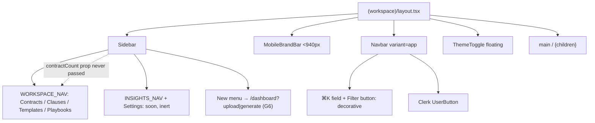
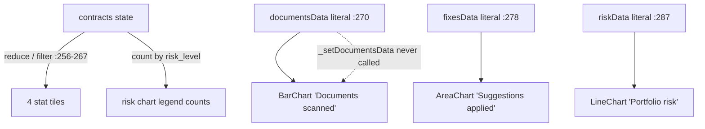
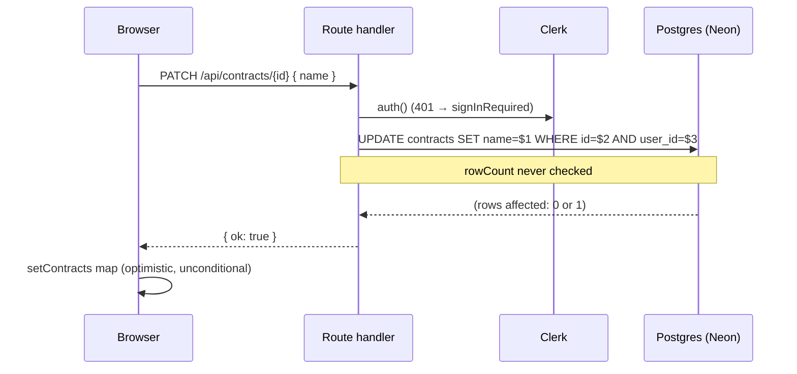
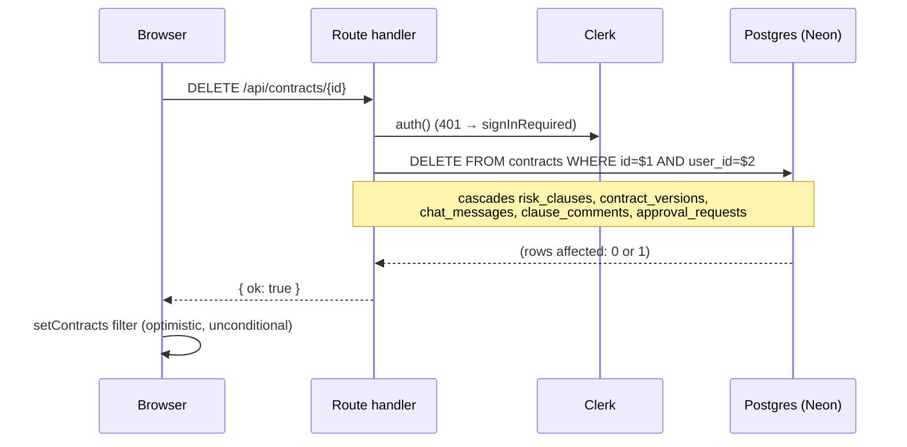
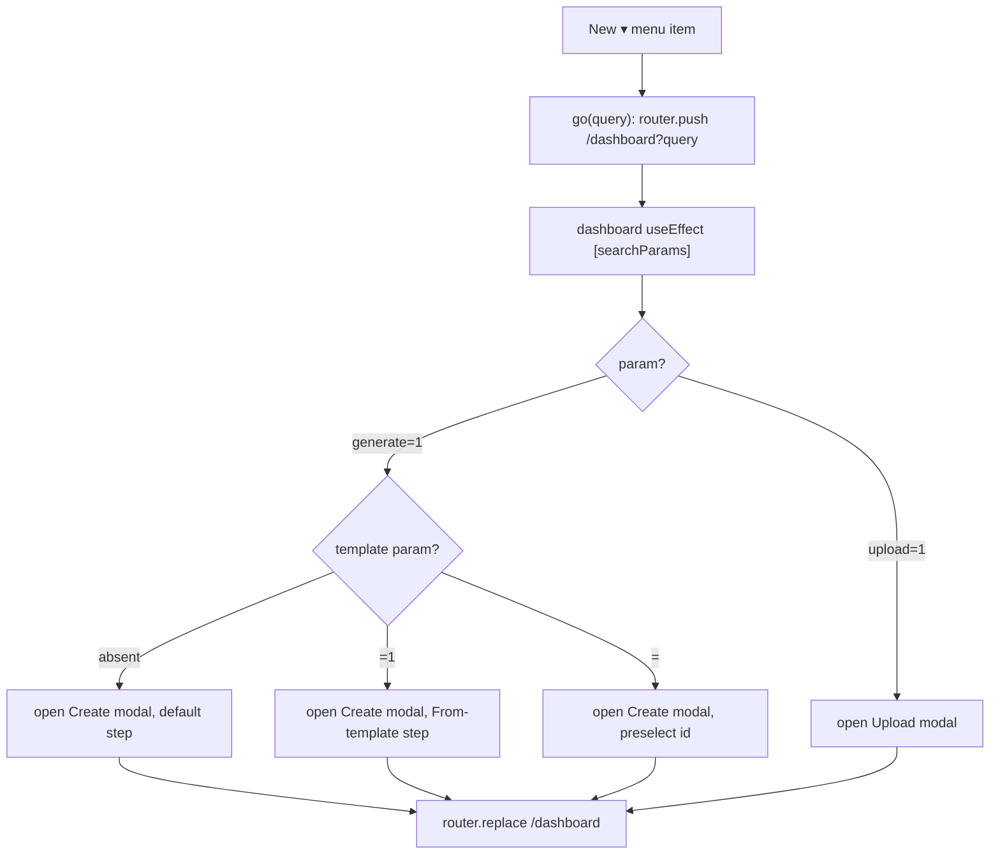

# G — Dashboard & workspace shell

_The `(workspace)` route group, its layout frame, and everything the `/dashboard` (Contracts) screen does. Read [00-conventions](00-conventions.md) first; this file assumes the template._

Verified against `main` @ `bf4d660`.

**The route group.** `src/app/(workspace)/layout.tsx` wraps `/dashboard`, `/clauses`, `/templates`, and `/playbooks` in one frame: a 252px `Sidebar`, a compact `MobileBrandBar` below 940px, a 52px app `Navbar`, and a floating `ThemeToggle`. ⚠ `/review` and `/analysis` live at the app root — **outside** this group — so they get no sidebar and no top bar. This file covers the shell (G1) and the Contracts screen it hosts (G2–G6). `/clauses`, `/templates`, `/playbooks` are their own chapters ([E — Templates](e-templates.md), [F — Playbooks](f-playbooks.md)).

| id | Workflow |
|----|----------|
| [G1](#g1) | Workspace shell — sidebar + top bar |
| [G2](#g2) | Contract list + client-side filter |
| [G3](#g3) | Stat tiles + charts |
| [G4](#g4) | Rename a contract |
| [G5](#g5) | Delete a contract (hard delete, no confirm) |
| [G6](#g6) | New-menu deep-links |

---

## <a id="g1"></a>G1 — Workspace shell — sidebar + top bar

**0 · TL;DR** — `layout.tsx` composes `<Sidebar/>` + `<MobileBrandBar/>` + `<Navbar variant="app"/>` + `<ThemeToggle floating/>` around `{children}`. Almost entirely presentational; several affordances are decorative.

**1 · Entry point** — `src/app/(workspace)/layout.tsx:11` — `<div class="flex min-h-screen">` → `<Sidebar/>`, then `<div class="flex flex-col">` holding `<MobileBrandBar/>`, `<Navbar variant="app"/>`, `<main>{children}</main>`, then `<ThemeToggle floating/>` as a sibling.

**2 · Preconditions** — None for the frame itself. Each child page runs its own auth (`/dashboard` shows a guest banner; `/playbooks` and `/clauses` gate to a sign-in card).

**3 · Trace** — All client, no network from the shell.
1. **`Sidebar`** (`src/components/sidebar.tsx:117`) — rendered by the layout with **no props**.
   - Workspace switcher (`:153-160`): brand mark + name (`user.publicMetadata.workspace` else `"My workspace"`) + a `ChevronDown`. ⚠ **Display-only** — no `onClick`, no menu.
   - `New ▾` button + dropdown (`:163-227`) → [G6](#g6).
   - `WORKSPACE_NAV` (`:31-36`): **Contracts** `/dashboard`, **Clause library** `/clauses`, **Templates** `/templates`, **Playbooks** `/playbooks` — all live `<Link>`s; active row when `pathname === item.href` (`:232`).
   - `INSIGHTS_NAV` (`:38-41`): **Risk dashboard** `/risk`, **Activity** `/activity` — both `soon: true` → rendered as `cursor-not-allowed` non-link `<div>`s with a "Soon" chip (`:71-80`).
   - **Settings** `/settings` — `soon: true`, same treatment (`:244-252`).
   - Bottom user card (`:253-272`): `user.imageUrl` / `user.fullName` / primary email — ⚠ **display-only**, not Clerk's `<UserButton/>` (that one is in the top bar, `navbar.tsx:36`).
   - ⚠ `Sidebar({ contractCount })` maps `contractCount` onto the Contracts row's `count` badge (`:146-148`), but the layout never passes it → the badge is always absent.
2. **`MobileBrandBar`** (`sidebar.tsx:104-115`) — visible `<940px`: brand mark + workspace name + a `<kbd>⌘K</kbd>` (⚠ decorative). Layout passes no `workspace` prop → `"My workspace"`.
3. **`Navbar variant="app"`** (`src/components/navbar.tsx:75-94`):
   - breadcrumb: `FileText` icon + `crumb` (default `"Contracts"`) + `crumbSub` (default `"/ All"`) — ⚠ **static props**, the layout passes none and no page overrides them, so every workspace screen shows "Contracts / All".
   - ⚠ a `<div>` styled as a search field: `Search` icon + text "Search contracts & clauses" + `<kbd>⌘K</kbd>` (`:84-88`) — **not an `<input>`, no handler, no command palette**.
   - ⚠ a Filter `<Button variant="outline" size="icon" aria-label="Filter">` (`:89-91`) — **no `onClick`**.
   - `<AuthControls bare={false}/>` → Clerk `<UserButton/>` when signed in (`:28-38`); a reserved `size-8` box while Clerk loads (`:26`).
4. **`ThemeToggle floating`** — fixed bottom-right, outside `<main>`.

**4 · Database effects** — None.

**7 · Failure modes**

| Trigger | Behaviour | User sees | Survives |
|---------|-----------|-----------|----------|
| Clerk still loading | `AuthControls` returns an empty `size-8` box | brief blank where the avatar goes; no reflow | n/a |
| Click ⌘K field / Filter button | nothing bound | no response | n/a |
| Click a "Soon" item | `cursor-not-allowed`, `aria-disabled`, no navigation | inert row | n/a |
| Click the workspace switcher | nothing bound | no menu opens | n/a |

**8 · Sequence diagram** — pure client composition, no process boundary.



**9 · Observability notes**
> **What you can see today.** Nothing — the shell emits no logs.
> **What you can't.** Nav usage by section. How often users click the dead ⌘K / Filter / switcher affordances (a UX signal that they look live). "Soon" item click-through (latent demand).
>
> | # | Blind spot | Class | Cheapest fix |
> |---|-----------|-------|--------------|
> | G1-O1 | No nav-usage signal | NO-METRIC | `console.info("[nav]", { href })` in `NavRow` — tier 0 |
> | G1-O2 | Dead affordances (⌘K, Filter, switcher) look interactive; clicks unrecorded | NO-METRIC | log clicks, or (better) hide/disable them — tier 0/1 |

**10 · See also** — [G6](#g6) (the New menu), [G2](#g2)–[G5](#g5) (the screen inside `<main>`), [F1](f-playbooks.md#f1) / [E — Templates](e-templates.md) (sibling group pages).

---

## <a id="g2"></a>G2 — Contract list + client-side filter

**0 · TL;DR** — On mount the dashboard `GET`s the user's contracts once; the All / In review / Signed segmented control is a pure client `.filter()` over that state — no refetch.

**1 · Entry point** — `src/app/(workspace)/dashboard/page.tsx` — `DashboardContent` (`:213`); `loadContracts()` (`:220-228`) in `useEffect(…, [])` (`:230`). Handler: `src/app/api/contracts/route.ts:6`.

**2 · Preconditions** — None to view. Signed-out → `{ contracts: [] }` and a guest banner (`page.tsx:353-363`).

**3 · Trace**
```
GET /api/contracts  ·  auth: currentUserId  ·  limit: none
  res  { contracts: [{ id, name, contract_type, risk_level, total_issues,
                       issues_fixed, issues_dismissed, created_at }] }
       signed-out → { contracts: [] }
```
1. `page.tsx:222` — `fetch("/api/contracts")`. Handler `route.ts:7`: `currentUserId()`; null → `{ contracts: [] }` (`:8`).
2. `select id, name, contract_type, risk_level, total_issues, issues_fixed, issues_dismissed, created_at from contracts where user_id = $1 and deleted_at is null order by created_at desc` (`route.ts:11-17`).
3. `page.tsx:223-226` — only on `res.ok`: `setContracts(contracts ?? [])`. `setLoading(false)` regardless.
4. **Filter** — `FILTERS = ["All", "In review", "Signed"]` (`:77`), rendered as a `.seg` `role="tablist"` (`:572-585`). `visible = contracts.filter(c => filter === "All" ? true : filter === "Signed" ? isResolved(c) : !isResolved(c))` (`:343-345`). ⚠ **No fetch, no API** — a client array filter. `isResolved(c)` (`:70-75`): `c.total_issues > 0 && c.issues_fixed + (c.issues_dismissed ?? 0) >= c.total_issues`.
5. Row click → `router.push('/review?file=<name>&type=<contract_type>&contractId=<id>')` (`:624-629`), unless a rename input is open on that row (`:625`).

**4 · Database effects** — Read-only.

**6 · End state** — `contracts` in state; the table renders `visible`; the header line and stat tiles ([G3](#g3)) derive from the full `contracts` array, not `visible`.

**7 · Failure modes**

| Trigger | Behaviour | User sees | Survives |
|---------|-----------|-----------|----------|
| Guest | 200 `{ contracts: [] }` | empty table + guest banner | n/a |
| `GET /api/contracts` non-ok | `setContracts` skipped; `loading` still cleared | previous list (or the empty-state row) | n/a |
| DB error | `route.ts:20` returns `{ error: raw }` 500 ([H3](h3-error-taxonomy.md) LEAK) | empty table, no message | n/a |
| `total_issues = 0` (every generated contract) | `isResolved` false → shows under **In review**, never **Signed** | a just-created draft sits in "In review" with `0/0` issues | n/a |

**8 · Sequence diagram**

```mermaid
sequenceDiagram
  participant B as Browser
  participant API as Route handler
  participant CK as Clerk
  participant PG as Postgres (Neon)
  B->>API: GET /api/contracts
  API->>CK: auth()
  API->>PG: SELECT ... FROM contracts WHERE user_id=$1 AND deleted_at IS NULL ORDER BY created_at DESC
  PG-->>API: rows
  API-->>B: { contracts }
  B->>B: setContracts; client .filter() All | In review | Signed
```

**9 · Observability notes**
> **What you can see today.** Nothing on the happy path. A DB error returns raw and unlogged (`route.ts:19-21`).
> **What you can't.** List load latency / failure rate. How often each filter tab is used. List size distribution.
>
> | # | Blind spot | Class | Cheapest fix |
> |---|-----------|-------|--------------|
> | G2-O1 | Contract-list load never logged (ok or fail) | NO-LOG | `console.info("[contracts] list", { n, ms })` in the handler — tier 0 |
> | G2-O2 | Raw DB error leaked, not logged | LEAK + NO-LOG | `errorResponse(err, "contracts.list")` — tier 0 |

**10 · See also** — [G3](#g3) (tiles/charts over the same state), [B5](b-getting-a-contract-in.md#b5) (what a row's counters mean), [C1](c1-review-document.md) (the row click destination).

---

## <a id="g3"></a>G3 — Stat tiles + charts

**0 · TL;DR** — The 4 stat tiles are computed from the loaded contracts. ⚠ The 3 chart series below them (`documentsData` / `fixesData` / `riskData`) are **literal hardcoded arrays** and never recomputed — the dashboard's charts show six months of history that does not exist.

**1 · Entry point** — `src/app/(workspace)/dashboard/page.tsx` render body. Derived values `:256-267`; chart state `:270-294`; rendering `:485-564`.

**2 · Preconditions** — Contracts loaded ([G2](#g2)). Pure client — no network, no DB write.

**3 · Trace**
1. **Tiles** — `:256-262`, rendered `:485-490`:
   - `totalDocuments = contracts.length` → tile **"Documents"**.
   - `highRiskCount = contracts.filter(c => c.risk_level === "high" && !isResolved(c)).length` → tile **"Flagged, high"** (`tone="risk"`).
   - `totalFixes = contracts.reduce((s, c) => s + c.issues_fixed, 0)` → tile **"Suggestions applied"**.
   - `openIssues = contracts.reduce((s, c) => s + Math.max(0, c.total_issues - c.issues_fixed - (c.issues_dismissed ?? 0)), 0)` → tile **"Open issues"**.
2. `currentRisk = { high, medium, low }` counts by `risk_level` (`:263-267`) — feeds **only the legend counts** on the portfolio chart (`:539-542`: `High (${currentRisk.high})` …), not the plotted lines.
3. ⚠ **Chart series** — `documentsData` (`:270-276`), `fixesData` (`:278-285`), `riskData` (`:287-294`): constant arrays for `Oct`…`Mar`, held via `useState`. The setters `_setDocumentsData` / `_setFixesData` / `_setRiskData` **are never called**. Rendered through `ChartContainer` (`src/components/ui/chart.tsx`, a Recharts wrapper) as a `BarChart` "Documents scanned" (`:494-505`), an `AreaChart` "Suggestions applied" (`:507-531`), and a `LineChart` "Portfolio risk — last 6 months" (`:535-564`).

**4 · Database effects** — None. **5 · External calls** — None.

**6 · End state** — Tiles reflect the real contract set; the three chart panels reflect fixed fiction; only the risk chart's parenthetical legend counts are real.

**7 · Failure modes** — Nothing breaks. The exposure is interpretive: this is the workflow where the set-wide "visibility" theme bites hardest — a user reads a trend that was authored once as placeholder data, and nothing on screen marks it apart from the honest tiles beside it.

**8 · Sequence diagram**



**9 · Observability notes**
> **What you can see today.** Nothing. No real time-series is computed anywhere, so there is nothing to emit.
> **What you can't.** Actual documents-per-month, fixes-per-month, or risk-mix-over-time — the quantities the charts pretend to show.
>
> | # | Blind spot | Class | Cheapest fix |
> |---|-----------|-------|--------------|
> | G3-O1 | The three trend series are placeholder constants presented as data | NO-METRIC | derive them from `contracts` (`created_at`, counters) or a `daily_contract_stats` rollup — tier 2; until then, label them clearly — tier 0 |

**10 · See also** — [G2](#g2) (the state these read), [B5](b-getting-a-contract-in.md#b5) (`total_issues` / `issues_fixed` semantics).

---

## <a id="g4"></a>G4 — Rename a contract

**0 · TL;DR** — The pencil button opens an inline input; Enter or "Save" fires `PATCH /api/contracts/{id} { name }` and optimistically updates local state. The handler's only ownership check is the SQL `WHERE`, and it never inspects `rowCount`.

**1 · Entry point** — `src/app/(workspace)/dashboard/page.tsx` — `Pencil` icon button (`:672-674`) → `startEdit(contract)` (`:323-326`); inline `<input>` (`:633-640`) with `onKeyDown` Enter → `saveEdit(id)` (`:328-336`), or the "Save" button (`:668-670`).

**2 · Preconditions** — Signed in (`PATCH` calls `signInRequired()` when there is no user, `[id]/route.ts:44`). Ownership is enforced **only** by the SQL `WHERE` — no `ownsContract()` pre-check; see [H1](h1-auth-and-ownership.md#the-sql-only-guard).

**3 · Trace**
```
PATCH /api/contracts/{id}  ·  auth: currentUserId (ownership: SQL WHERE only)  ·  limit: none
  req  { name }                    (handler also accepts quill_delta, issues_fixed)
  res  { ok: true }                (returned even when 0 rows matched)
```
1. `page.tsx:329-333` — `fetch(PATCH, { name: editName })`.
2. Handler `src/app/api/contracts/[id]/route.ts:41` — `currentUserId()` / `signInRequired()`.
3. `add()` builder (`:52-61`) — appends `name = $N` only for the keys present; if nothing is set, returns `{ ok: true }` immediately (`:63`).
4. `update contracts set name = $1 where id = $2 and user_id = $3` (`:68-72`). ⚠ **`rowCount` is not checked** — a wrong `id` or another user's `id` still yields `200 { ok: true }` with nothing changed.
5. `page.tsx:334-335` — optimistic `setContracts(prev => prev.map(c => c.id === id ? { ...c, name: editName } : c))` and `setEditingId(null)` — run unconditionally (no `res.ok` check in `saveEdit`).

**4 · Database effects** — `contracts.name` (`[id]/route.ts:69`), single statement, no transaction. No `updated_at` touch (not in the `SET` list; `contracts` has no update trigger).

**6 · End state** — Row renamed in the DB (if owned) and in the UI (always, until the next `loadContracts()`).

**7 · Failure modes**

| Trigger | Behaviour | User sees | Survives |
|---------|-----------|-----------|----------|
| Network / 500 | optimistic state already applied | new name shown | **DB unchanged**; reverts on reload |
| Non-owner `id` | `200 { ok: true }`, 0 rows | new name shown | DB unchanged; reverts on reload |
| Empty `editName` | sent as `name = ""`; `""` is truthy-checked only in `updatePlaybook`, not here → blank name persists | contract shows blank name | the blank name |
| Guest | `401 { error:"sign_in_required" }` | optimistic name still shown (no `res.ok` guard) | DB unchanged |

**8 · Sequence diagram**



**9 · Observability notes**
> **What you can see today.** Nothing. The `catch` returns the raw message unlogged (`[id]/route.ts:74-76`); a clean run logs nothing.
> **What you can't.** Whether a rename actually hit a row. Rename volume. Failed-but-optimistically-applied renames (UI/DB divergence until reload).
>
> | # | Blind spot | Class | Cheapest fix |
> |---|-----------|-------|--------------|
> | G4-O1 | `rowCount = 0` (non-owner / bad id) indistinguishable from success | SILENT-CATCH | check `rowCount`, `404` when 0, log it — tier 0/1 |
> | G4-O2 | Optimistic update on a failed request never reconciled | NO-TRACE-CORRELATION | gate `setContracts` on `res.ok`; toast on failure — tier 0 |

**10 · See also** — [H1](h1-auth-and-ownership.md#the-sql-only-guard), [G5](#g5) (same handler file, same posture), [G2](#g2).

---

## <a id="g5"></a>G5 — Delete a contract (hard delete, no confirm)

**0 · TL;DR** — The trash button calls `DELETE /api/contracts/{id}` with **no confirmation dialog** and optimistically drops the row from state. The handler runs a hard `DELETE` that cascades to every dependent table. `contracts.deleted_at` exists but is never set.

**1 · Entry point** — `src/app/(workspace)/dashboard/page.tsx` — `Trash2` icon button (`:676-684`) → `deleteContract(id)` (`:338-341`). No dialog, no `window.confirm`.

**2 · Preconditions** — Signed in (`signInRequired()` when no user). Ownership via SQL `WHERE` only, as [G4](#g4).

**3 · Trace**
```
DELETE /api/contracts/{id}  ·  auth: currentUserId (ownership: SQL WHERE only)  ·  limit: none
  res  { ok: true }          (returned even when 0 rows matched)
```
1. `page.tsx:339` — `fetch(`/api/contracts/${id}`, { method: "DELETE" })`, then (line `:340`) `setContracts(prev => prev.filter(c => c.id !== id))` — **after** the `await`, with **no `res.ok` check**.
2. Handler `src/app/api/contracts/[id]/route.ts:80` — `currentUserId()` / `signInRequired()`.
3. `delete from contracts where id = $1 and user_id = $2` (`:86-89`). **Hard delete.** ⚠ `contracts.deleted_at` (`db/schema.sql`) is never written by any route — the list queries filter `deleted_at is null` defensively, but nothing soft-deletes.
4. FK cascades from `contracts (id)` (`db/schema.sql`):
   - `risk_clauses` (`:118`) → and from there `clause_refinements` (`:149`) and `clause_comments` (`:332`);
   - `contract_versions` (`:164`);
   - `chat_messages` (`:181`);
   - `approval_requests` (`:346`).
   `contracts.playbook_id` / `template_id` are outbound FKs (`on delete set null` in the other direction) — the referenced playbook/template is untouched.

**4 · Database effects** — 1 `contracts` row + all cascaded children, **permanently**. The `DELETE` + cascade is a single atomic statement; the handler wraps nothing extra.

**6 · End state** — Contract and every dependent row gone; the UI row gone.

**7 · Failure modes**

| Trigger | Behaviour | User sees | Survives |
|---------|-----------|-----------|----------|
| Network / 500 | optimistic `setContracts` filter still runs | row disappears from the table | ⚠ **the row (and its children) remain in the DB**; they reappear on the next `loadContracts()` / reload |
| Non-owner `id` | `200 { ok: true }`, 0 rows deleted | row disappears from *this* client's table | DB unchanged; row returns on reload |
| Guest | `401 { error:"sign_in_required" }` | row still disappears (no `res.ok` guard) | DB unchanged |
| Successful delete | 200 | row gone | nothing — no undo, no confirm |

**8 · Sequence diagram**



**9 · Observability notes**
> **What you can see today.** Nothing. `catch` returns the raw message unlogged (`[id]/route.ts:91-93`).
> **What you can't.** What was deleted, by whom, how many child rows cascaded. Whether a `DELETE` matched a row at all. Failed deletes that the UI already hid.
>
> | # | Blind spot | Class | Cheapest fix |
> |---|-----------|-------|--------------|
> | G5-O1 | Hard delete + cascade leaves no record; a mis-fire is unrecoverable and untraceable | NO-LOG | `console.info("[contracts] delete", { id, userId })` before the statement — tier 0; switch to `deleted_at` soft delete — tier 1 |
> | G5-O2 | Optimistic removal on a failed request → UI shows gone, DB has it | SILENT-CATCH | gate `setContracts` on `res.ok` — tier 0 |
> | G5-O3 | No confirm on a destructive, cascading, prod-live action | (design) | a confirm dialog — tier 0 |

**10 · See also** — [B10](b-getting-a-contract-in.md#b10) (the seed button — same no-confirm posture), [H1](h1-auth-and-ownership.md#the-sql-only-guard), [H6](h6-database-schema.md#tables) (cascade map).

---

## <a id="g6"></a>G6 — New-menu deep-links

**0 · TL;DR** — The sidebar's `New ▾` items don't open modals directly — they `router.push` to `/dashboard?upload=1` / `?generate=1` / `?generate=1&template=1`, and a `useEffect` on the dashboard reads the params, opens the matching modal, and `router.replace`s back to a clean `/dashboard`.

**1 · Entry point** — `src/components/sidebar.tsx` — the `New ▾` dropdown items (`:182-224`): **Upload contract** → `go("upload=1")`, **Generate with AI** → `go("generate=1")`, **New from template** → `go("generate=1&template=1")`. `go(query)` (`:141-144`): `setMenuOpen(false)` then `router.push(`/dashboard?${query}`)`.

**2 · Preconditions** — None; navigation only.

**3 · Trace** — Pure client.
1. `router.push('/dashboard?<query>')`.
2. `src/app/(workspace)/dashboard/page.tsx` — `useEffect(…, [searchParams, router])` (`:308-318`):
   - `searchParams.get("generate") === "1"` → read `searchParams.get("template")`; `setTplStart({ from: t != null, id: t && t !== "1" ? t : undefined })`; `setCreateOpen(true)`; `router.replace("/dashboard")`.
   - else `searchParams.get("upload") === "1"` → `setModalOpen(true)`; `router.replace("/dashboard")`.
3. `CreateContractModal` receives `startFromTemplate={tplStart.from}` and `initialTemplateId={tplStart.id}` (`:407-408`):
   - `?generate=1` alone → modal opens on its default step.
   - `?generate=1&template=1` → `t === "1"` → `from: true, id: undefined` → opens the **"From template"** step, nothing preselected.
   - `?generate=1&template=<id>` → `from: true, id: <id>` → "From template" step with that template preselected.
4. ⚠ Only `generate` and `upload` are handled, and `template` is read **only inside** the `generate === "1"` branch — a bare `?template=…` does nothing. `router.replace("/dashboard")` strips the params so a back-nav or refresh won't re-open the modal.

**4 · Database effects** — None. The modal's own submit path is [B1](b-getting-a-contract-in.md#b1) (upload) / [B6](b-getting-a-contract-in.md#b6)–[B9](b-getting-a-contract-in.md#b9) (generate/render).

**6 · End state** — The matching modal open; URL back to `/dashboard`.

**7 · Failure modes**

| Trigger | Behaviour | User sees | Survives |
|---------|-----------|-----------|----------|
| `?template=5` without `generate=1` | branch not entered | plain dashboard, no modal | n/a |
| Deep-link hit while already on `/dashboard` | `searchParams` change re-runs the effect | modal opens, params cleared | n/a |
| `router.replace` before the modal state commits | React batches both; modal still opens | modal open on a clean URL | n/a |
| `?generate=1` during an in-flight generation | `setCreateOpen(true)` again | modal re-shown over the running request | n/a |

**8 · Sequence diagram**



**9 · Observability notes**
> **What you can see today.** Nothing.
> **What you can't.** Which New action users pick, and how often. Deep-link hits that fall through (e.g. bare `?template=`).
>
> | # | Blind spot | Class | Cheapest fix |
> |---|-----------|-------|--------------|
> | G6-O1 | New-menu choice uncounted | NO-METRIC | `console.info("[new]", { query })` in `go()` — tier 0 |

**10 · See also** — [B1](b-getting-a-contract-in.md#b1) (upload modal), [B6](b-getting-a-contract-in.md#b6)/[B8](b-getting-a-contract-in.md#b8)/[B9](b-getting-a-contract-in.md#b9) (generate & render), [E3](e-templates.md) (render-vs-generate in the modal), [G1](#g1) (the menu's host).
