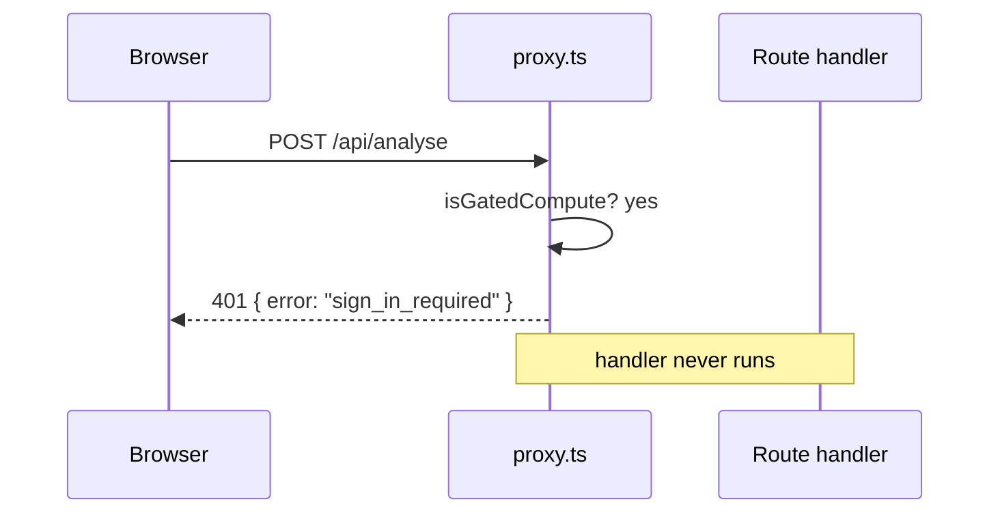
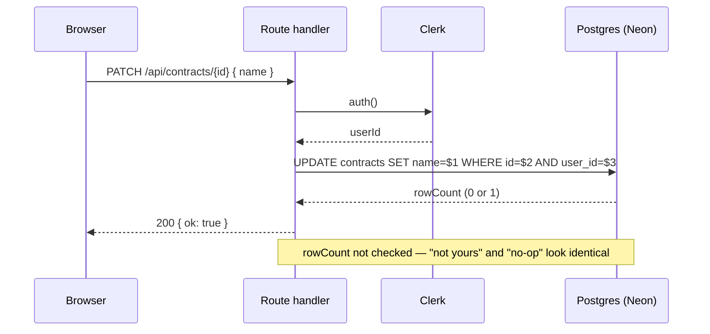

# H1 — Auth & ownership

_Every route's **§2 Preconditions** references this chapter. There are three enforcement layers; a given route uses one, two, or all three._

Verified against `main` @ `bf4d660`.

---

## The identity system

Clerk. `src/app/layout.tsx:54` wraps the app in `<ClerkProvider>`. There is **no local users table** — `user_id` columns hold the raw Clerk id (`user_2ab…`) as `text`. Post-sign-in destination is `/welcome` (`.env.local`: `NEXT_PUBLIC_CLERK_SIGN_IN_FALLBACK_REDIRECT_URL`), which server-checks `auth()` and links on to `/dashboard`.

Two ways the UI triggers sign-in:
- **Modal** — `<SignInButton mode="modal">` (`src/components/navbar.tsx:43`, `dashboard/page.tsx:359`, `analysis/page.tsx`). Stays on the page; on success the surrounding `useUser()` re-renders.
- **Hosted page** — `/sign-in/[[...sign-in]]` and `/sign-up/[[...sign-up]]` render Clerk's `<SignIn>` / `<SignUp>` (`src/app/sign-in/[[...sign-in]]/page.tsx:11`).

---

## <a id="gate"></a>Layer 1 — the compute gate (`src/proxy.ts`)

`clerkMiddleware` (`src/proxy.ts:32`). A **`POST`** to any of these paths from a signed-out session gets a **`401 { error: "sign_in_required" }` JSON** — never a redirect, because these are API calls (`src/proxy.ts:33-38`).

```
GATED_COMPUTE_PATHS  (src/proxy.ts:12-21)
  /api/analyse
  /api/generate
  /api/extract
  /api/refine
  /api/chat
  /api/contract-edit
  /api/clause-library/search           ← embeds the query (Gemini)
  /api/templates/suggest-variables     ← askLLM

GATED_COMPUTE_PATTERN  (src/proxy.ts:24)
  /^\/api\/contracts\/[^/]+\/reanalyse$/
```

Only `POST` is gated (`src/proxy.ts:28`). `GET`/`PATCH`/`DELETE` on these paths pass through untouched and rely on Layer 2/3.

**The matcher** (`src/proxy.ts:41-47`) runs the middleware on everything except `_next` and a list of static file extensions, plus `/(api|trpc)(.*)` and `/__clerk/`.

⚠ `tests/auth-gate.test.mjs` `COMPUTE_POSTS` (`:64-72`) is missing `/api/clause-library/search` and `/api/templates/suggest-variables` — the two newest gated routes are unverified by that test.

⚠ **Dead guest path.** `src/app/analysis/page.tsx` still contains the pre-gate "analyse as a guest, save after sign-in" logic (`pendingSave` `:89`, the flush effect `:120-126`, the "won't be saved" banner `:364-380`). Since `/api/extract` and `/api/analyse` now 401 for guests, a signed-out visitor dies at step 1 with `"Text extraction failed"` and never reaches that banner. The dashboard guest banner (`dashboard/page.tsx:353-363`) makes the same stale promise.

---

## Layer 2 — session check in the handler

Non-gated routes (and the `GET`/`PATCH`/`DELETE` verbs on gated paths) check the session themselves via `src/lib/auth.ts`:

```ts
currentUserId(): Promise<string | null>   // auth().userId
signInRequired(): NextResponse            // 401 { error: "sign_in_required" }
```

Three response conventions for "no user":

| Route kind | Signed-out response | Example |
|------------|---------------------|---------|
| **List GET** | `200` with an empty array | `GET /api/contracts` → `{ contracts: [] }` (`route.ts:7-8`); same for `/api/clause-library`, `/api/templates`, `/api/playbooks` |
| **Write / detail** | `signInRequired()` → `401` | `POST /api/contracts`, all `/api/contracts/[id]/*` |
| **Compute POST** | never reached — `proxy.ts` 401s first | — |

---

## Layer 3 — resource ownership

For anything addressed by id, the handler proves the caller owns it. `src/lib/auth.ts`:

| Helper | Line | Checks |
|--------|------|--------|
| `ownsContract(id, userId)` | `:16` | `contracts` row with `id`, `user_id`, `deleted_at is null` |
| `ownsClause(clauseId, userId)` | `:25` | `risk_clauses` joined to its `contracts` row owned by `userId` |
| `ownsLibraryClause(id, userId)` | `:41` | `clause_library` row `id` + `user_id = $2` + not deleted — **returns false for curated rows** (`user_id is null`), so writes to curated wording are rejected |
| `ownsTemplate(id, userId)` | `:55` | same shape for `contract_templates` |
| `ownsPlaybook(id, userId)` | `:69` | same shape for `playbooks` |

**A failed ownership check returns `404 "Not found"`, not `403`** (e.g. `src/app/api/contracts/[id]/route.ts:12-13`) — the app doesn't reveal that a resource exists but belongs to someone else.

### The SQL-only guard

Some handlers skip the `owns*` helper and fold ownership into the mutating statement: `PATCH /api/contracts/[id]` runs `update contracts set … where id = $N and user_id = $N+1` (`route.ts:70-72`). This is a weaker guarantee — a mismatched id/user simply updates zero rows and still returns `{ ok: true }` (`:73`). Callers can't distinguish "not yours" from "no-op".

### Curated content

`clause_library`, `contract_templates`, `playbooks` all carry the check constraint `(source = 'curated') = (user_id is null)` ([H6](h6-database-schema.md)). Curated rows are visible to everyone (`… where user_id = $1 or user_id is null` in the list queries) and immutable through the API — `PATCH`/`DELETE` on a curated row return `403` (`src/app/api/clause-library/[id]/route.ts:19-24`) with the message "clone to edit" (playbooks) or the equivalent. The way to modify curated content is `POST /api/playbooks/[id]/clone` (F2), which deep-copies it as `source='user'`.

---

## Diagram — a gated compute POST, signed out



## Diagram — an owned resource, signed in



---

## Observability notes

**What you can see today.** A `401` in the access log for a gated guest POST (no body logged). Nothing distinguishes an ownership `404` from a genuine missing row.

**What you can't.** How often guests hit the gate (and on which route). Whether a `404` was "not found" or "not yours". Any signal when the SQL-only guard silently updates zero rows.

**Gaps.**

| # | Blind spot | Class | Cheapest fix |
|---|-----------|-------|--------------|
| H1-O1 | Gate rejections uncounted per route | NO-METRIC | `console.info("[gate] reject", { path })` in `src/proxy.ts:36` — tier 0 |
| H1-O2 | Ownership 404 vs real 404 indistinguishable | THIN-LOG | log `{ event: "owns_fail", helper, id, userId }` in each `owns*` false branch — tier 0 |
| H1-O3 | SQL-only guard no-ops are invisible | NO-LOG | check `rowCount` after the `PATCH`/`DELETE` and log when 0 — tier 0 |

---

## See also

- [H2 — Rate limiting](h2-rate-limiting.md) — the second precondition on every compute route.
- [H6 — Database schema](h6-database-schema.md#tables) — `user_id` semantics, the curated-row check constraints.
- [A8](a-identity-and-entry.md) — the gate as a user-visible workflow.
