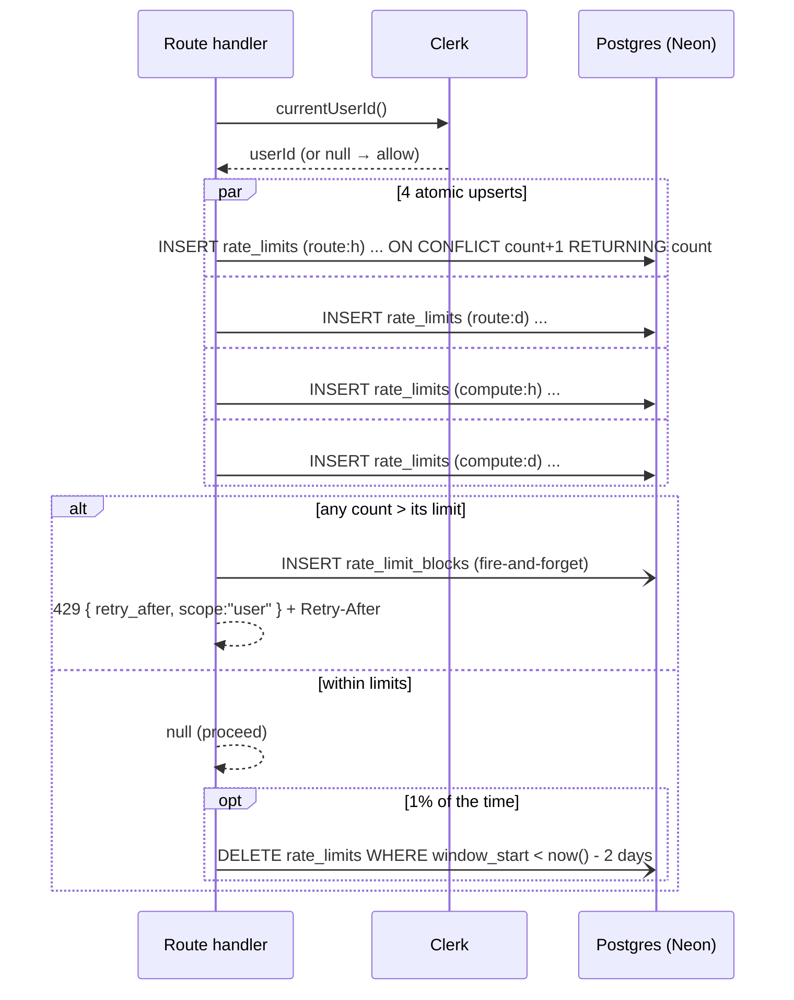

# H2 — Rate limiting

_The second precondition on every compute route. Workflow files link to [#tiers](#tiers) rather than restating the numbers._

Verified against `main` @ `bf4d660`. Files: `src/lib/rate-limit.ts` (I/O + orchestration), `src/lib/rate-limit-core.ts` (pure math, unit-tested).

---

## How it's called

Every compute route's handler calls this as its **first statement**:

```ts
const limited = await enforceRateLimit(req, "analyse");
if (limited) return limited;   // a 429 NextResponse, or null to proceed
```

`enforceRateLimit(req, route)` (`src/lib/rate-limit.ts:62`):

1. Resolves `currentUserId()`. **No user → returns `null` (allow).** (`:68-74`) The compute gate ([H1](h1-auth-and-ownership.md#gate)) guarantees a signed-in user upstream, so this only happens outside a request scope, e.g. some tests.
2. Builds two keys: `"<route>:u:<userId>"` and the global `"compute:u:<userId>"` (`:77-79`).
3. Fires **4 parallel upserts** — route×hour, route×day, global×hour, global×day (`:84-89`), each an atomic `insert … on conflict (bucket_key, window_start) do update set count = count + 1 returning count` (`bump()`, `:39-49`).
4. `decide()` each pair against its limits.
5. If blocked: inserts one `rate_limit_blocks` row (fire-and-forget, `.catch(() => {})`, `:101-104`), returns `429 { error: "rate_limited", retry_after, scope: "user" }` with a `Retry-After` header (`:106-109`).
6. **1 % of allowed requests** also run `delete from rate_limits where window_start < now() - interval '2 days'` (`:117-119`).

**Fails open.** Any throw inside the `try` (DB down, etc.) is caught and logs `"[rate-limit] check failed, allowing request"` and returns `null` (`:111-114`). A limiter outage never blocks analysis.

---

## <a id="tiers"></a>The tiers

`LIMITS` (`src/lib/rate-limit.ts:25-37`) — the single source of truth. Per Clerk user; windows are **fixed UTC** (top of the hour, midnight UTC), not sliding.

| Route key | Hour | Day | Used by |
|-----------|-----:|----:|---------|
| `extract` | 15 | 40 | `POST /api/extract` |
| `analyse` | 20 | 60 | `POST /api/analyse` |
| `generate` | 15 | 40 | `POST /api/generate` |
| `refine` | 40 | 150 | `POST /api/refine` |
| `contract-edit` | 40 | 150 | `POST /api/contract-edit` |
| `chat` | 60 | 200 | `POST /api/chat` |
| `reanalyse` | 20 | 60 | `POST /api/contracts/[id]/reanalyse` |
| `clause-search` | 60 | 200 | `POST /api/clause-library/search` |
| `template-vars` | 15 | 40 | `POST /api/templates/suggest-variables` |
| **`compute`** (global) | **200** | **600** | every route above — one runaway loop can't blow the whole budget |

`decide()` (`src/lib/rate-limit-core.ts:37-46`): the **(limit+1)-th** call in a window is the first blocked, so exactly `limit` succeed. Day is checked before hour. `retryAfter` = seconds to the end of the offending window (`secondsToWindowEnd`, `:19-30`), minimum 1.

---

## <a id="tables"></a>Storage

| Table | Shape | Lifetime |
|-------|-------|----------|
| `rate_limits` | `(bucket_key, window_start)` pk, `count int`. `bucket_key` is `"<route>:u:<userId>:<h|d>"` after `bump()` appends the window tag (`:46`). | 1 % chance per allowed request of pruning rows older than 2 days. |
| `rate_limit_blocks` | `id` (identity), `route`, `scope`, `bucket_key`, `created_at`. Insert-only, written **only on a block**. | Never pruned. The one KPI surface: `rate_limit_blocks ÷ total compute requests`. ⚠ `scope` is always `'user'` now (`:103`); the `'guest'` branches in the client error handlers are dead code. |

---

## Client handling

Each caller inspects `res.status === 429` and reads `retry_after` / `scope` to build a message:

- `src/app/analysis/page.tsx:60-71` (`assertOk`) — throws `"You've hit the … usage limit … try again in about N minutes"`.
- `src/app/review/page.tsx` (`rateLimitNote`, ~`:227`) — transient toast via `setComputeError`.
- `src/app/(workspace)/dashboard/page.tsx:432-440` — inline error under the Generate modal.

All three still branch on `scope === "guest"` for a different message — unreachable, see above.

---

## Diagram



---

## Observability notes

**What you can see today.** `rate_limit_blocks` rows (route + timestamp + bucket key), when the block-log insert itself succeeds — it's `.catch(() => {})`, so a failed insert is invisible (`src/lib/rate-limit.ts:104`). One `console.error` line on a fail-open (`:112`).

**What you can't.** How close any user is to a limit before they hit it (the `count` in `rate_limits` is never read outside `enforceRateLimit`). How often the limiter fails open (one un-tagged `console.error`, no metric). The total compute-request denominator the KPI needs — nothing counts allowed requests.

**Gaps.**

| # | Blind spot | Class | Cheapest fix |
|---|-----------|-------|--------------|
| H2-O1 | No count of allowed compute calls → KPI has no denominator | NO-METRIC | `console.info("[compute] ok", { route })` before the `return null` in `enforceRateLimit` — tier 0; or a `compute_calls` table — tier 2 |
| H2-O2 | Fail-open events not counted | THIN-LOG | add `{ event: "rate_limit_fail_open", route }` to the catch — tier 0 |
| H2-O3 | Block-log insert failures swallowed | SILENT-CATCH | replace `.catch(() => {})` with `.catch(e => console.error("[rate-limit] block-log insert failed", e))` — tier 0 |
| H2-O4 | No "approaching limit" signal | NO-METRIC | `decide()` could return a `remaining` field; log when `remaining < 3` — tier 1 |

---

## See also

- [H1 — Auth & ownership](h1-auth-and-ownership.md#gate) — the gate that runs before this.
- [H5 — LLM layer](h5-llm-layer.md) — what these limits are protecting (Gemini free-tier quota).
- [H6 — Database schema](h6-database-schema.md#tables) — `rate_limits` / `rate_limit_blocks`.
