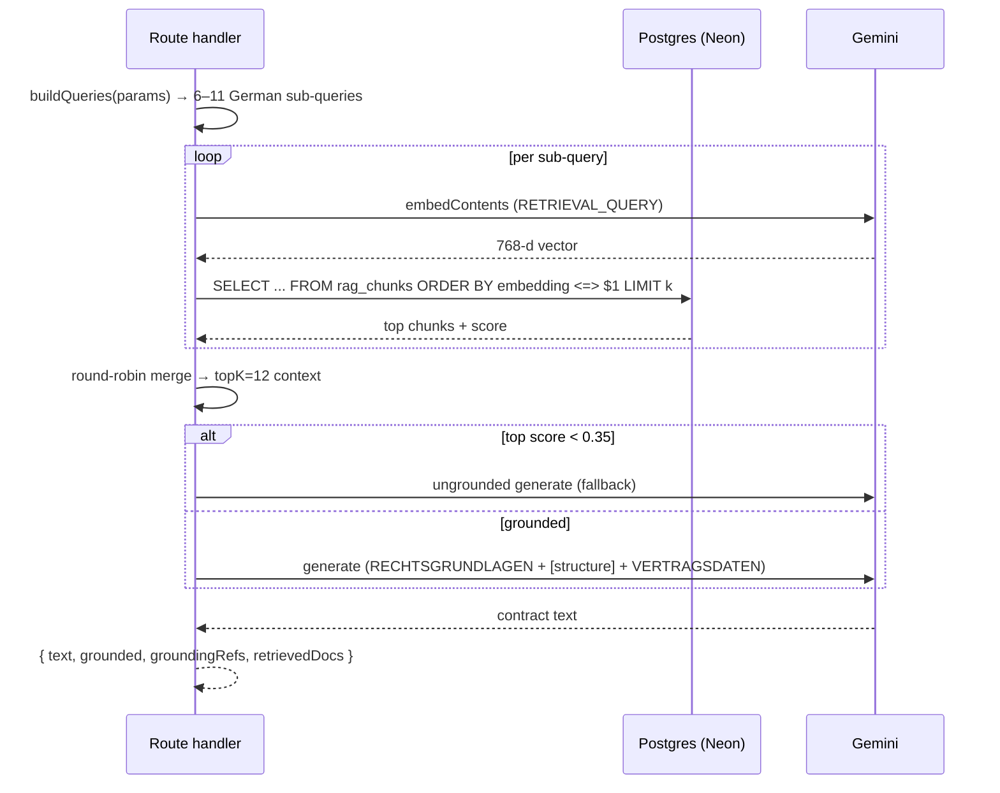

# H4 — The RAG pipeline

_Grounds German residential-lease generation ([B7](b-getting-a-contract-in.md)) and clause-library semantic search ([D3](d-clause-library.md)). The corpus internals (`chunk.ts`, `corpus.ts`, `ingest.ts`) live here rather than as workflows — they only run from `npm run rag:ingest`._

Verified against `main` @ `bf4d660`. Directory: `src/lib/rag/`.

---

## The shape

```
corpus/*.md  →  chunk  →  embed (Gemini, 768-d)  →  pgvector (rag_chunks)
                                                          │
                     retrieve (cosine ORDER BY)  ◄────────┘
                              │
                     generate (grounded Wohnraummietvertrag)
```

`src/lib/rag/index.ts` is the public surface.

---

## The corpus

24 curated markdown files in `src/lib/rag/corpus/` — German tenancy law, one topic per file (`03-kaution-551.md`, `10-schoenheitsreparaturen.md`, …), each with YAML frontmatter (`title`, `source`, `tags`) and, for 21 of them, a `## Musterformulierung` model-clause block. `22-standard-wohnraummietvertrag-vorlage.md` is a full §1–§11 annotated lease; `23-mietvertrag-checkliste.md` is a checklist.

`loadCorpus()` (`src/lib/rag/corpus.ts:44`) parses frontmatter + body into `{ id, title, source, tags, body }`, sorted by filename (the numeric prefix orders them).

**This corpus is also the seed source for the [clause library](d-clause-library.md#d6) and [playbooks](f-playbooks.md#f6)** — `src/lib/library/parse-corpus.ts` re-parses the `Musterformulierung` blocks.

---

## Indexing (`npm run rag:ingest` → `buildIndex()`)

`src/lib/rag/ingest.ts:31`:

1. `loadCorpus()` → 24 docs.
2. `chunkCorpus(docs)` (`src/lib/rag/chunk.ts`) — cut on `##`/`###` headings, then **greedily pack** consecutive sections up to `TARGET = 900` chars (`HARD = 1300` max, `OVERLAP = 160`). Fewer, denser chunks retrieve better and stay under the embedding request quota. A single over-long section splits on blank lines with overlap. Result: ~69 chunks.
3. `embedTexts(chunks.map(embedText), "RETRIEVAL_DOCUMENT")` (`src/lib/rag/gemini.ts:106`) — batches of 20 with a 1.5 s pause (free-tier ~100 req/min). Returns L2-normalised 768-d vectors.
4. `saveIndex(index)` (`src/lib/rag/store.ts:78`) — **one transaction**: `delete from rag_chunks`, bulk `insert`, upsert the `rag_index_meta` provenance row (`model`, `dim`, `corpus_hash`, counts). All-or-nothing.

`corpus_hash` (sha256 of `id\nbody` per doc, first 16 hex — `ingest.ts:22`) lets CI detect a corpus that changed without a re-ingest.

**Prerequisite:** `db/005_rag_corpus.sql` (creates `extension vector`, `rag_chunks`, `rag_index_meta`). Production status per `MEMORY.md`: this + the ingest were pending on prod Neon as of the RAG merge — verify before relying on the lease path live.

---

## Retrieval

`retrieve(query, { topK })` (`src/lib/rag/retrieve.ts:13`):
1. `assertIndexFresh(await indexMeta())` — throws if the store is empty or was built with a different `model`/`dim` than the code expects (`src/lib/rag/store.ts`).
2. `embedOne(query, "RETRIEVAL_QUERY")`.
3. `queryIndex(vec, k)` — `select …, 1 - (embedding <=> $1::vector) as score from rag_chunks order by embedding <=> $1::vector limit $2` (`src/lib/rag/store.ts:156-187`). At ~69 chunks the HNSW index is effectively exact.

`retrieveMany(queries, { topK = 12 })` (`retrieve.ts:30`) — runs several sub-queries and **merges round-robin**: everyone's #1 hit, then everyone's #2, …, deduping by chunk id until `topK` is filled. Guarantees every contract building block (Kaution, Betriebskosten, Kündigung, …) is represented instead of a few tight topics crowding the rest out.

`extractStatuteRefs(hits)` (`retrieve.ts:55`) pulls `§ 123 BGB`-style refs out of the retrieved text for the grounding citation list.

---

## Grounded generation ([B7](b-getting-a-contract-in.md))

`generateGermanRentalContract(params, opts)` (`src/lib/rag/generate.ts:97`):
1. `buildQueries(params)` (`:24`) — 6 fixed German sub-queries (Kaution, Betriebskosten, Schönheitsreparaturen, …) plus conditional ones triggered by `keyTerms` (Mieterhöhung, Mietpreisbremse, Tierhaltung, Untervermietung, Befristung).
2. `retrieveMany(queries, { topK: params.topK ?? 12 })`.
3. Build the prompt: `RECHTSGRUNDLAGEN` (the retrieved chunks) first, then — when a template is supplied ([B8](b-getting-a-contract-in.md)) — a `VERBINDLICHE VERTRAGSSTRUKTUR` block, then `VERTRAGSDATEN` (landlord, tenant, address, rent, …).
4. `complete({ system: composeSystem(language), prompt, maxTokens: 8192 })` — `SYSTEM` is a Fachanwalt persona with strict rules (cite only the supplied `RECHTSGRUNDLAGEN`, respect mandatory limits, §1–§11 structure, no `[PLACEHOLDER]`s). `composeSystem("en")` appends an output-language instruction that keeps German statutory citations verbatim.
5. Returns `{ contract, groundingRefs, context }`.

The route (`src/app/api/generate/route.ts`) checks `context[0].score >= MIN_GROUNDING_SCORE` (0.35) and falls back to the ungrounded path rather than cite thin air. `QuotaExhaustedError` from the RAG client is remapped to `AppError(503, "llm_busy")`.

The app injects its own `complete` (backed by [`askLLM`](h5-llm-layer.md)) so RAG generation shares the `AppError` taxonomy and retry policy.

---

## Semantic search reuse ([D3](d-clause-library.md))

`searchClauses()` (`src/lib/clause-library.ts:237`) reuses `embedOne(query, "RETRIEVAL_QUERY")` and the same cosine `ORDER BY` shape against `clause_library.embedding` (not `rag_chunks`), then re-ranks in JS (`src/lib/library/rank.ts`). Falls back to lexical search if the embed call fails or nothing is indexed.

---

## Diagram — grounded lease generation



---

## Observability notes

**What you can see today.** Nothing on the retrieval path — no log of what was retrieved, at what score, or whether the grounding-score fallback fired. `rag:ingest` prints a report to the CLI console (doc/chunk counts, hash, elapsed). `assertIndexFresh` throws a descriptive `Error` if the store is stale.

**What you can't.** Retrieval quality in production (score distribution, which queries retrieve thin). How often generation falls back to ungrounded. Whether the prod index is even loaded (no health endpoint; `rag_index_meta` is only read by `assertIndexFresh` at query time). Embedding-call volume from `clause-library/search`.

**Gaps.**

| # | Blind spot | Class | Cheapest fix |
|---|-----------|-------|--------------|
| H4-O1 | Grounding-score fallback firing is invisible | NO-LOG | `console.info("[rag] ungrounded_fallback", { topScore })` in the route — tier 0 |
| H4-O2 | No retrieval-quality signal | NO-METRIC | log `{ event:"retrieve", queries, topScore, docIds }` per generation — tier 1 |
| H4-O3 | No prod index health check | NO-METRIC | a `/api/rag/health` returning `indexMeta()` — tier 1 |
| H4-O4 | `assertIndexFresh` throw not distinguished from other 500s | THIN-LOG | catch it in the route, log `{ event:"rag_index_stale" }` — tier 0 |

---

## See also

- [H5 — LLM layer](h5-llm-layer.md) — the RAG client's model pins and retry policy.
- [H6 — Database schema](h6-database-schema.md) — `rag_chunks`, `rag_index_meta`.
- [B7](b-getting-a-contract-in.md) / [B8](b-getting-a-contract-in.md) — grounded and template-constrained lease generation.
- [D3](d-clause-library.md) / [D6](d-clause-library.md) — semantic search and the corpus-derived seed.
- [F5](f-playbooks.md) — how a playbook's rules reach the model (a different injection, same `analysis.ts`).
