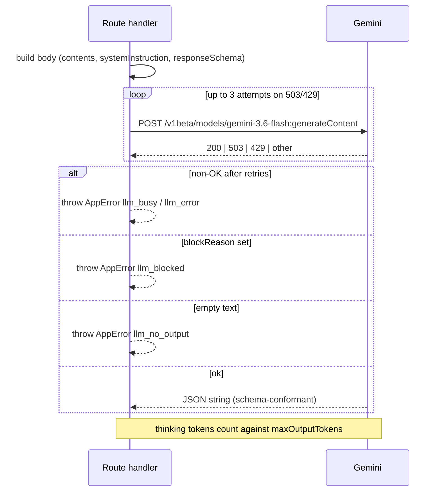

# H5 — LLM layer

_Every workflow's **§5 External calls** links to the tables here rather than restating model names and caps._

Verified against `main` @ `bf4d660`. The code says "Claude" in many comments; it is **Gemini** everywhere.

---

## Two clients

| Client | File | Used by | Why separate |
|--------|------|---------|--------------|
| **`askLLM`** | `src/lib/llm.ts` | every compute route (`analyse`, `generate` non-lease, `refine`, `chat`, `contract-edit`, `templates/suggest-variables`) | The app-facing adapter. Imports `@/lib/errors`, throws `AppError`. |
| **RAG client** | `src/lib/rag/gemini.ts` | the RAG pipeline (`generate` lease path, `rag:ingest`, `clause-library/search`, `seed-library --embed`) | Dependency-free — no `@/` alias, no `next/server` — so `node scripts/*.mjs` can import the `.ts` directly. Throws plain `Error` / `QuotaExhaustedError`. |

Both hit `https://generativelanguage.googleapis.com/v1beta/models/<model>:<method>`.

---

## <a id="pins"></a>Model pins

| Constant | Value | Notes | Cite |
|----------|-------|-------|------|
| `FLASH` (default for `askLLM`) | `gemini-3.6-flash` | Pinned on purpose — `gemini-flash-latest` frequently 503s "high demand". | `src/lib/llm.ts:11` |
| `PRO` | `gemini-pro-latest` | **Unused.** 429s with "limit: 0" on the free tier — only switch analysis to it on a paid key. | `src/lib/llm.ts:14` |
| `GEN_MODEL` (RAG client) | `gemini-3.6-flash` | Same pin, independent constant. | `src/lib/rag/gemini.ts:18` |
| `EMBED_MODEL` | `gemini-embedding-001` | | `src/lib/rag/gemini.ts:14` |
| `EMBED_DIM` | `768` | Native 3072-d, requested at 768 (`outputDimensionality`); **not pre-normalised**, so the client L2-normalises (`gemini.ts:94`) and cosine == dot product downstream. | `src/lib/rag/gemini.ts:15` |
| `thinkingConfig.thinkingLevel` | `"low"` | Gemini 3.x always "thinks" (~70–200 tokens) and it **counts against `maxOutputTokens`** — callers budget for it. `thinkingBudget: 0` is rejected on 3.x. | `src/lib/llm.ts:60-64` |

---

## <a id="token-caps"></a>`maxTokens` per call site

| Call site | maxTokens | Cite |
|-----------|----------:|------|
| analyse, no playbook | 8192 | `src/lib/analysis.ts` (`analyseContract`) |
| analyse, with playbook | 12288 | `src/lib/analysis.ts` (`analyseContractWithPlaybook` — bumped only when rules present) |
| generate, non-lease | 8192 | `src/app/api/generate/route.ts` |
| generate, RAG lease | 8192 | `src/lib/rag/generate.ts` |
| refine | 2048 | `src/app/api/refine/route.ts:41` |
| chat | 2048 | `src/app/api/chat/route.ts:29` |
| contract-edit | 8192 | `src/app/api/contract-edit/route.ts:37` |
| templates/suggest-variables | 2048 | `src/app/api/templates/suggest-variables/route.ts` |

---

## <a id="max-chars"></a>Input truncation caps

The document is `slice()`d before it goes into the prompt. These are silent — the user gets no signal that their contract was cut.

| Route | Cap | Cite |
|-------|-----|------|
| analyse | `text.slice(0, 200_000)`; **188 000** with a playbook (12 000 reserved for the rule block) | `src/lib/analysis.ts` (`MAX_CHARS`, `MAX_RULE_CHARS`) |
| chat | `contractText.slice(0, 20000)` | `src/app/api/chat/route.ts:23` |
| refine | `contractText.slice(0, 8000)` | `src/app/api/refine/route.ts:37` |
| templates/suggest-variables | `text.slice(0, 12000)` | `src/app/api/templates/suggest-variables/route.ts` |
| **contract-edit** | **none** — the entire `currentDocument` is inlined into the system prompt | `src/app/api/contract-edit/route.ts:31` ⚠ |
| playbook rule block | 12 000 chars; over-budget → drop highest `sort_order` first + append a truncation note | `src/lib/analysis.ts` (`renderPlaybookBlock`) |

---

## Structured output

`askLLM({ responseSchema })` sets `responseMimeType: "application/json"` + `responseSchema` (`src/lib/llm.ts:66-68`). Gemini then returns a JSON string with no prose, no ``` fences. Used by:
- `analyseContract` — `RESPONSE_SCHEMA` (`src/lib/analysis.ts`), an `{ issues: [...] }` object plus, with a playbook, per-issue `rule_id`/`verdict` and top-level `missing_topics`.
- `templates/suggest-variables` — `{ variables: [{ key, label, type, literal }] }`.

`extractJson()` (`src/lib/analysis.ts`) still salvages fenced / chattered responses defensively; `coerceIssues()` drops malformed entries.

---

## Retry policy

| Client | Attempts | Backoff | On |
|--------|---------:|---------|----|
| `askLLM` | 3 | `attempt × 2000 ms` | 503 or 429 (`src/lib/llm.ts:81-85`) |
| RAG `postJson` | 5 | honours Google's `retryDelay` from the 429 body, else exponential, cap 65 s | 429; raises `QuotaExhaustedError` when exhausted (`src/lib/rag/gemini.ts:20-21, 33-41`) |

`analyseContract` wraps `askLLM` in its **own** 2-attempt loop on top (retry when the parsed result is empty), so a failing analyse can call Gemini up to 6 times.

---

## Errors out

`askLLM` throws `AppError` (see [H3](h3-error-taxonomy.md)): `llm_config` 500, `llm_busy` 503, `llm_error` 502, `llm_blocked` 422, `llm_no_output` 502. Each is preceded by a `console.error("[llm] …")` with the Gemini status and body (`src/lib/llm.ts:90, 101, 106, 113`) — server-side only, no request context.

---

## Diagram — `askLLM` with structured output



---

## Observability notes

**What you can see today.** `console.error("[llm] Gemini <status>: <body>")` on any non-OK response (`src/lib/llm.ts:90`); `"[llm] Gemini blocked the prompt: <reason>"` (`:106`); `"[llm] Gemini returned no text (finishReason: …)"` (`:113`). The RAG client logs backoff waits. **No success logging, no token accounting, no latency.**

**What you can't.** Total Gemini spend (tokens in/out) — nothing reads `usageMetadata` from the response. Per-route latency. How often the retry loop actually fires vs. succeeds first try. Which prompt/route is closest to its `maxTokens` ceiling (a truncated JSON that `coerceIssues` silently drops looks identical to a model that found nothing). The `analyseContract` double-retry means a "failed" analysis is 6 Gemini calls with no trace of that.

**Gaps.**

| # | Blind spot | Class | Cheapest fix |
|---|-----------|-------|--------------|
| H5-O1 | No token / cost accounting | NO-METRIC | read `data.usageMetadata` in `askLLM`, write a `compute_calls` row (route, model, prompt_tokens, output_tokens, ms, ok) — tier 2; **highest value** |
| H5-O2 | No latency per LLM call | NO-METRIC | wrap the `fetch` in `performance.now()` and log `ms` — tier 0 |
| H5-O3 | Retry loop firing is invisible on `askLLM` | NO-LOG | `console.info("[llm] retry", { attempt, status })` in the loop — tier 0 |
| H5-O4 | Truncated-JSON drops look like "nothing found" | NO-LOG | log `{ event:"coerce_drop", kept, dropped }` in `coerceIssues` — tier 0 |
| H5-O5 | `analyseContract`'s 2×3 call fan-out untraceable | NO-TRACE-CORRELATION | thread an `opId` through both loops — tier 1 |

---

## See also

- [H4 — RAG pipeline](h4-rag-pipeline.md) — the other consumer of the RAG client (embeddings + grounded generation).
- [H2 — Rate limiting](h2-rate-limiting.md) — the app-side quota these caps protect.
- [H3 — Error taxonomy](h3-error-taxonomy.md) — where `AppError` lands.
- [B3](b-getting-a-contract-in.md) / [B7](b-getting-a-contract-in.md) — the two analysis / generation call sites in full.
